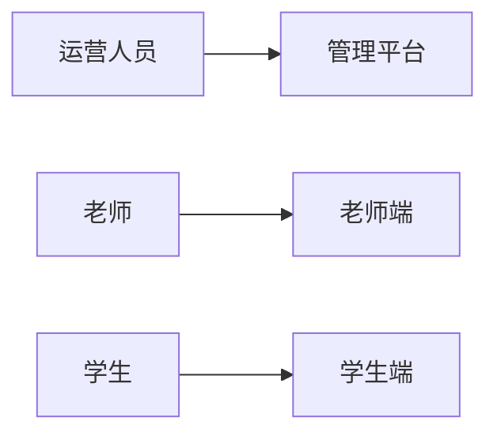
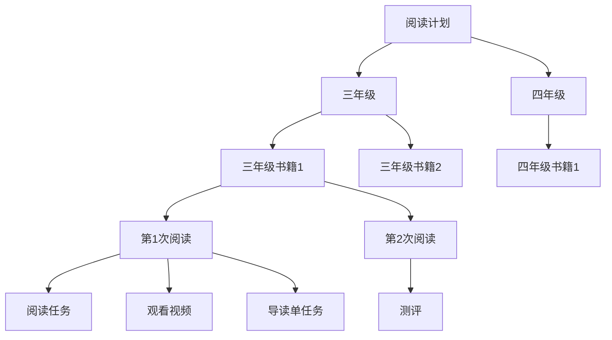
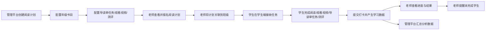
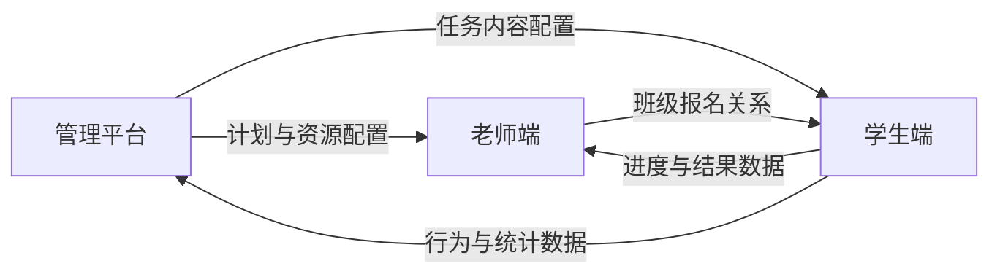

# AI伴读项目全景说明

## 1. 文档定位

本文档用于帮助产品、开发、测试在进入详细 PRD 前，先快速理解 AI 伴读项目的整体业务、参与角色、三端职责和端间关系

本文档回答以下问题：

- 这个项目是做什么的
- 有哪些系统角色参与
- 每个角色分别使用哪个端
- 各端分别承担什么职责
- 三个端之间如何形成业务闭环

---

## 2. 项目简介

AI伴读项目是一个面向校园阅读场景的数字化阅读平台，围绕“平台配置内容、老师组织班级、学生完成任务、系统沉淀数据”的主链路展开，支撑学校开展整本书阅读活动

项目由三个端组成：

- 管理平台：供运营人员使用的 Web 管理后台，负责平台配置与运营管理
- 老师端：供老师使用的微信小程序，负责班级组织与过程跟进
- 学生端：供学生使用的微信小程序，负责阅读任务执行与结果提交

项目核心链路是：管理平台配置阅读计划，老师端组织班级参与，学生端完成阅读任务并产生数据，数据再回流到老师端和管理平台，形成完整闭环

---

## 3. 建设目标

### 3.1 业务目标

- 建立统一的校园阅读活动运营平台
- 将阅读计划、书籍资源、导读内容和测评内容标准化管理
- 形成从活动配置到执行反馈的数据闭环

### 3.2 管理目标

- 降低老师组织阅读活动和跟进学生进度的成本
- 提升学生阅读任务的完成率和参与度
- 支撑平台持续沉淀学校、班级、学生维度的数据

### 3.3 协作目标

- 让产品、开发、测试对三端职责边界保持一致理解
- 让详细 PRD 的阅读顺序和上下游关系更清晰

---

## 4. 角色与端说明

### 4.1 角色说明

| 角色 | 使用端 | 核心职责 |
| ---- | ---- | ---- |
| 运营人员 | 管理平台 | 创建阅读计划、配置年级书目、配置导读单任务/观看视频/测评、查看整体运营数据 |
| 老师 | 老师端 | 创建班级、为班级报名计划、查看学生进度与测评结果、提醒未完成学生 |
| 学生 | 学生端 | 查看任务、完成阅读任务、观看视频、完成导读单任务和测评、提交打卡、查看个人成长结果 |

> 说明：家长不是系统独立角色，不单独配置账号、权限和功能，主要在线下协助学生完成阅读任务

### 4.2 角色与端对应图

---

## 5. 核心业务流程

### 5.1 阅读计划配置层级图

说明：

- 一个阅读计划下，可以按不同年级配置不同书目，学生只看到自己所在年级对应的书目
- 每本书可以拆分为多次阅读任务，每次阅读可配置阅读任务、观看视频、导读单任务等内容
- 测评通常配置在某本书的最后一次阅读中，作为该次阅读任务的一部分呈现
- 虽然测评出现在最后一次阅读中，但测评的能力检验对象是整本书

导读单说明：

- 导读单任务是针对某次阅读配套的实体纸张练习作业任务
- 导读单任务和阅读任务是两个独立任务，但通常围绕同一次阅读同时配置
- 学生在线下完成导读单后，通过拍照上传的方式进行打卡
- 学生完成拍照上传并提交后，即视为完成导读单任务，也即完成一次打卡

阅读任务说明：

- 阅读任务通常表现为“阅读 XX-XX 页”这类要求
- 阅读任务属于线下阅读行为，系统不会直接监控学生是否真的完成了阅读
- 学生在学生端点击“完成”或同类操作后，即视为完成阅读任务
- 系统记录的是学生的完成操作，不记录真实阅读过程本身

### 5.2 主流程说明

AI伴读项目的核心不是单一端内操作，而是三个端围绕同一套阅读计划进行协同。整体流程可以概括为：平台配置计划与资源，老师为班级报名，学生完成任务并产出数据，老师端和管理平台再基于这些数据进行查看、跟进和分析

### 5.3 核心业务流程图

### 5.4 核心业务对象说明

| 对象 | 说明 |
| ---- | ---- |
| 阅读计划 | 由管理平台创建和发布的活动载体，是整个业务的顶层对象 |
| 年级书目 | 阅读计划下按年级拆分的书籍配置，不同年级配置不同书目 |
| 书籍 | 某个年级下参与阅读计划的具体书籍 |
| 阅读次数 | 一本书拆分出的多次阅读安排，用于组织阶段性任务 |
| 阅读任务 | 通常表现为“阅读 XX-XX 页”，属于线下阅读，系统只记录学生点击完成 |
| 观看视频 | 某次阅读中的视频类任务，学生在线完成观看 |
| 导读单任务 | 针对某次阅读配套的实体纸张练习作业任务，学生线下完成后拍照上传并提交 |
| 测评 | 通常出现在最后一次阅读中，但能力检验对象是整本书 |
| 班级报名 | 老师为班级报名某个阅读计划后，该班级学生才会参与该计划 |
| 打卡 | 学生完成导读单任务后，通过拍照上传并提交产生的业务记录 |

补充说明：

- 学生最终参与的不是抽象的阅读计划配置，而是自己所在年级下对应书籍的具体任务
- 阅读任务、导读单任务、观看视频、测评是不同类型的任务，不应混同
- 打卡和导读单任务直接关联，不是所有任务完成后都会产生打卡记录

---

## 6. 端间关系说明

### 6.1 端间关系图

### 6.2 关系说明

| 关系 | 说明 |
| ---- | ---- |
| 管理平台 -> 老师端 | 管理平台是内容和规则的上游，老师端只能消费平台已发布的阅读计划 |
| 管理平台 -> 学生端 | 学生看到的任务内容本质来源于管理平台的计划和资源配置 |
| 老师端 -> 学生端 | 学生是否参与某个阅读计划，取决于老师是否为所在班级完成报名 |
| 学生端 -> 老师端 | 老师查看的进度、完成情况、测评结果，都来自学生端实际产生的数据 |
| 学生端 -> 管理平台 | 管理平台通过学生执行数据进行运营分析、学校分析和计划优化 |

---

## 7. 各端核心功能概览

### 7.1 管理平台

| 模块 | 核心功能 |
| ---- | ---- |
| 阅读计划管理 | 创建计划、查看计划详情、按年级配置书目、发布与撤回计划 |
| 书籍资源管理 | 管理书籍、上传资源、配置导读单、观看视频、测评内容 |
| 用户管理 | 学校管理、班级管理、小程序用户管理 |
| 激励与消息 | 配置积分规则、等级体系、证书、消息内容 |
| 数据分析 | 查看平台、学校、年级、学生、测评、阅读任务等数据 |

### 7.2 老师端

| 模块 | 核心功能 |
| ---- | ---- |
| 班级管理 | 创建班级、维护学生名单、邀请学生加入班级 |
| 阅读计划管理 | 查看可报名计划、计划详情、为班级报名阅读计划 |
| 进度跟进 | 查看学生阅读进度、打卡情况、计划完成情况 |
| 测评与结果 | 查看学生测评成绩、书籍测评统计、数据报告 |
| 教学辅助 | 提醒未完成学生、接收消息通知、查看资讯和个人信息 |

### 7.3 学生端

| 模块 | 核心功能 |
| ---- | ---- |
| 任务承接 | 查看首页任务、加入班级、查看书架和阅读计划 |
| AI伴读 | 查看 AI 导语、观看视频、使用听书能力 |
| 阅读执行 | 阅读书籍、完成导读单、提交阅读打卡 |
| 测评成长 | 完成测评、查看结果、查看奖状、等级、积分和能力图谱 |
| 个人与互动 | 查看消息、反馈问题、查看班级广场和排行榜 |

---

## 8. 关键业务规则与边界

### 8.1 关键业务规则

1. 阅读计划只能由管理平台创建和发布，老师端不支持自定义创建
2. 一个阅读计划下按年级配置不同书目，不同年级学生看到的任务内容可以不同
3. 学生是否能看到某个计划，前提是老师已为所在班级报名
4. 学生端的阅读、观看视频、导读单任务、测评等任务内容均来源于平台配置，学生只看到自己所在年级对应的书目和任务
5. 打卡是学生完成导读单任务后，通过拍照上传并提交产生的业务记录

### 8.2 边界说明

- 本文档只描述项目整体结构和业务关系，不替代三端详细 PRD
- 页面级交互、字段定义、异常处理、验收标准以各端 PRD 为准
- 家长不作为本期系统独立角色，不在角色权限、功能范围中单独展开

---

## 9. 建议阅读顺序

对于首次接触项目的成员，建议按以下顺序阅读：

1. 本文档，先理解整体业务和三端关系
2. 管理平台 PRD，理解内容配置源头和上游规则
3. 老师端 PRD，理解老师如何组织班级参与和跟进
4. 学生端 PRD，理解学生任务执行路径和数据产生方式

---

## 10. 相关文档索引

| 文档 | 路径 | 说明 |
| ---- | ---- | ---- |
| 管理平台 PRD | `校校读吧管理平台PRD_V1.0.md` | 管理平台详细需求 |
| 老师端 PRD | `校校读吧老师端PRD_V1.0.md` | 老师端详细需求 |
| 学生端 PRD | `校校读吧学生端PRD_V1.0.md` | 学生端详细需求 |
| AI 功能梳理 | `AI功能应用梳理.md` | 三端 AI 能力口径补充说明 |
| 消息发送规则 | `消息发送规则.md` | 消息触达与发送规则补充说明 |
