# 校校读吧学生端 产品需求文档（PRD）

## 1. 文档信息

| 项目     | 内容            |
| -------- | --------------- |
| 产品名称 | 校校读吧-学生端 |
| 文档版本 | V1.1            |
| 文档状态 | 初稿            |
| 创建日期 | 2026-02-05      |
| 最后更新 | 2026-03-05      |
| 文档作者 | 产品团队        |

### 1.1 版本历史

| 版本 | 日期       | 修改人   | 修改内容                                                                                                                 |
| ---- | ---------- | -------- | ------------------------------------------------------------------------------------------------------------------------ |
| V1.0 | 2026-02-05 | 产品团队 | 初始版本，完成全部功能需求定义                                                                                           |
| V1.1 | 2026-03-05 | 产品团队 | 原型优化：测评结果统计项调整、AI导语页新增听书入口、阅读书籍页新增听书播放器、我的奖状返回逻辑优化、打卡记录日期格式完善 |

---

## 2. 产品概述

### 2.1 产品背景

随着小学语文教育对整本书阅读的重视程度不断提升，学校和家长对学生阅读能力培养的需求日益增长。传统的阅读教学存在以下痛点：

1. **阅读过程难以追踪**：教师无法了解学生的实际阅读情况
2. **阅读效果难以评估**：缺乏科学的阅读理解能力测评手段
3. **阅读兴趣难以激发**：学生缺乏阅读动力和成就感
4. **家校沟通不畅**：家长难以参与和了解孩子的阅读进度

校校读吧学生端旨在为小学生提供一个集阅读打卡、测评练习、成长激励于一体的移动端应用，配合老师端形成完整的整本书阅读教学闭环

### 2.2 产品定位

**校校读吧学生端**是一款面向小学生的整本书阅读学习助手，通过游戏化的激励机制和AI辅助功能，帮助学生养成良好的阅读习惯，提升阅读理解能力

### 2.3 产品目标

| 目标类型 | 具体目标                                     | 衡量指标                               |
| -------- | -------------------------------------------- | -------------------------------------- |
| 用户目标 | 帮助学生养成每日阅读习惯，提升阅读理解能力   | 日均打卡率≥60%，测评平均分提升10%     |
| 业务目标 | 提高学生端日活跃率，增强用户粘性             | DAU/MAU≥30%，次日留存率≥45%          |
| 体验目标 | 打造简洁有趣的阅读学习体验，激发学生阅读兴趣 | 用户满意度≥4.5分，功能使用完成率≥80% |

### 2.4 目标用户

**主要用户**：小学在校学生（1-6年级）

**用户特征**：

- 年龄范围：6-12岁
- 使用场景：课后阅读、假期阅读计划
- 设备偏好：家长手机或平板为主
- 使用时段：放学后、周末、寒暑假
- 使用特点：低年级需家长协助操作，高年级可独立使用

### 2.5 项目范围

**本期包含：**

- 微信授权登录与用户身份绑定
- 加入班级（通过老师分享链接加入）
- 首页信息展示（阅读日历、今日任务、打卡入口、消息通知）
- AI导读功能（AI导语页、AI导读视频、听书入口）
- 阅读打卡功能（图片上传、心得填写、AI点评）
- 阅读书籍（电子书阅读器、听书播放器）
- 书籍测评功能（答题、成绩查看、奖状）
- 书架管理（书籍列表、书籍详情）
- 个人中心（我的阅读、积分明细、等级勋章、我的奖状、阅读能力图谱）
- 个人信息管理与账号安全
- 消息中心与资讯浏览
- 班级广场与班级排行榜
- 用户反馈（提交反馈、反馈记录）

**本期不包含：**

- 积分商城兑换功能 - 原因：需对接商品供应链，V2.0迭代

---

## 3. 用户分析

### 3.1 用户画像

#### 画像一：小学低年级学生（1-2年级）

| 属性 | 描述                                                   |
| ---- | ------------------------------------------------------ |
| 年龄 | 6-8岁                                                  |
| 特点 | 注意力集中时间短，喜欢色彩丰富的界面，需要家长协助操作 |
| 需求 | 简单的打卡流程，丰富的视觉奖励，大字体易读界面         |
| 痛点 | 文字输入困难，识字量有限，需要即时反馈和鼓励           |

#### 画像二：小学中年级学生（3-4年级）

| 属性 | 描述                                                     |
| ---- | -------------------------------------------------------- |
| 年龄 | 8-10岁                                                   |
| 特点 | 具备基本的自主操作能力，开始关注同伴评价，有一定竞争意识 |
| 需求 | 班级排行榜，成就勋章系统，简单的社交互动功能             |
| 痛点 | 阅读任务与娱乐时间冲突，需要游戏化激励保持动力           |

#### 画像三：小学高年级学生（5-6年级）

| 属性 | 描述                                             |
| ---- | ------------------------------------------------ |
| 年龄 | 10-12岁                                          |
| 特点 | 可独立完成操作，注重个人成长数据，有较强的荣誉感 |
| 需求 | 阅读能力分析，测评成绩追踪，奖状分享功能         |
| 痛点 | 学业压力增加，需要高效完成阅读任务               |

### 3.2 用户场景

| 场景     | 描述                               | 核心功能                 |
| -------- | ---------------------------------- | ------------------------ |
| 日常打卡 | 学生完成当日阅读任务后进行打卡记录 | 阅读打卡、导读单拍照上传 |
| 阅读测评 | 完成一本书或章节后进行理解能力测试 | 测评答题、成绩查看       |
| 查看进度 | 了解自己的阅读完成情况和班级排名   | 我的阅读、班级排行榜     |
| 获取激励 | 通过完成任务获得积分、勋章等奖励   | 积分系统、等级勋章、奖状 |
| 班级互动 | 查看同学的阅读动态，进行点赞互动   | 班级广场、打卡动态       |

### 3.3 用户旅程

**4.4 功能流程图**

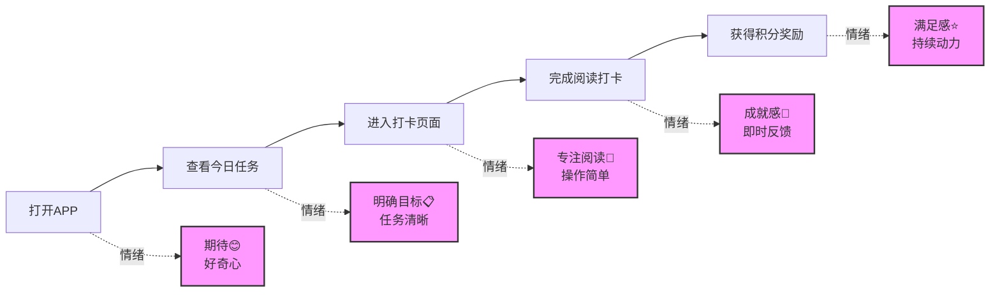

**关键触点与优化方向：**

| 阶段     | 用户行为         | 情绪状态 | 潜在痛点               | 优化方向                 |
| -------- | ---------------- | -------- | ---------------------- | ------------------------ |
| 启动阶段 | 打开APP          | 期待     | 加载慢、界面复杂       | 快速启动、简洁首页       |
| 任务确认 | 查看今日阅读任务 | 明确     | 任务不清晰、找不到入口 | 突出任务卡片、一键直达   |
| 阅读打卡 | 填写打卡内容     | 专注     | 输入繁琐、不知道写什么 | 提供模板、支持语音输入   |
| 获得反馈 | 查看打卡结果     | 成就     | 反馈单调、缺乏惊喜     | 丰富动效、随机奖励       |
| 持续激励 | 查看积分和排名   | 满足     | 进步不明显、缺乏目标   | 成长曲线、阶段性目标提醒 |

---

## 4. 功能架构

### 4.1 功能架构图

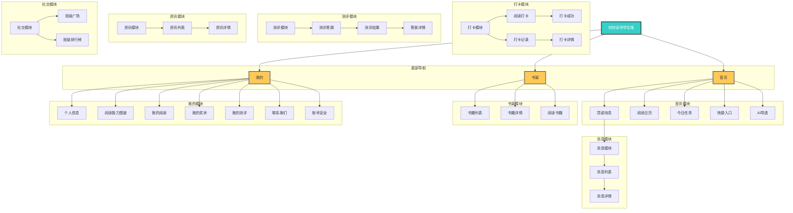

### 4.2 功能结构树

由于功能结构树层级较深，这里保留原始文本格式以便查看完整层级关系

```
校校读吧学生端
│
├── 【登录流程】（非Tab页面）
│   ├── 微信授权登录页
│   └── 手机号验证码登录页
│       ├── 输入手机号
│       └── 输入验证码
│
├── 【加入班级】（独立业务，非Tab页面）
│   ├── 老师分享链接入口
│   └── 班级信息确认页
│       ├── 显示班级名称
│       ├── 显示老师信息
│       └── 确认加入按钮（加入成功后跳转首页）
│
├── 【首页Tab】
│   ├── 顶部信息栏
│   │   ├── 应用标题
│   │   └── 消息入口（→消息列表）
│   │       ├── 消息列表页
│   │       │   ├── 未读/已读状态
│   │       │   └── 全部已读操作
│   │       └── 消息详情页
│   ├── 阅读日历
│   │   ├── 周视图（默认）
│   │   └── 月视图（展开切换）
│   ├── 今日任务卡片
│   │   ├── 书籍名称和计划名称
│   │   ├── 任务列表（含完成状态）
│   │   └── 去完成按钮（→AI导语页）
│   │       ├── AI导语页
│   │       │   ├── AI虚拟形象
│   │       │   ├── 导语气泡（含听书入口，点击跳转阅读书籍页）
│   │       │   ├── 书籍信息栏
│   │       │   └── 任务清单（跳过/操作按钮）
│   │       ├── 阅读打卡流程
│   │       │   ├── 阅读打卡页
│   │       │   │   ├── 图片上传（导读单+阅读书籍图片）
│   │       │   │   └── 心得输入
│   │       │   └── 打卡成功页
│   │       │       ├── 奖励展示
│   │       │       ├── AI点评
│   │       │       └── 参考答案
│   │       └── AI导读视频
│   │           ├── 横屏视频播放
│   │           ├── 进度条测试题
│   │           └── 完成奖励
│   └── 快捷入口
│       ├── 资讯（→资讯列表）
│       ├── 广场（→班级广场）
│       ├── 排行榜（→班级排行榜）
│       └── 奖状（→我的奖状）
│
├── 【书架Tab】
│   ├── 状态筛选（全部/阅读中/已阅读/未阅读）
│   └── 书籍卡片列表
│       └── 书籍详情页
│           ├── 列表Tab（关卡/单元任务列表）
│           └── 资源Tab（导读视频、导读单）
│
├── 【阅读书籍】（从AI导语页或书籍详情进入）
│   ├── 章节列表
│   ├── 进度更新
│   └── 听书播放器（播放/暂停、倍速、重置、收起）
│
├── 【测评模块】
│   ├── 测评列表（待完成/已完成/已过期）
│   ├── 测评答题页
│   │   ├── 题目展示
│   │   ├── 答题进度
│   │   └── 提交答卷
│   ├── 测评结果页
│   │   ├── 分数展示
│   │   ├── 答题统计
│   │   └── 奖状生成
│   └── 测评详情页
│       ├── 答案查看
│       └── 答案解析
│
└── 【我的Tab】
    ├── 个人信息区
    │   ├── 头像（→个人信息编辑页）
    │   │   ├── 头像上传
    │   │   ├── 姓名编辑
    │   │   ├── 学校选择
    │   │   ├── 班级选择
    │   │   └── 手机号绑定
    │   ├── 昵称、等级
    │   ├── 当前积分
    │   └── 设置入口（→账号安全页）
    │       ├── 账号安全等级
    │       └── 绑定手机号
    ├── 阅读能力图谱卡片（→阅读能力图谱页）
    │   ├── 雷达图缩略
    │   ├── 综合能力分
    │   └── 能力标签
    ├── 功能入口列表
    │   ├── 我的阅读（→我的阅读页）
    │   │   ├── 阅读统计
    │   │   └── 成就展示
    │   ├── 我的奖状（→我的奖状页）
    │   │   ├── 奖状列表
    │   │   ├── 奖状详情
    │   │   └── 下载奖状
    │   ├── 我的测评（→测评列表页）
    │   │   ├── 待完成/已完成/已过期列表
    │   │   └── 测评详情
    │   └── 联系我们（弹窗）
    │       └── 企业微信二维码
    └── 退出登录
```

**简化版Mermaid流程图（主要模块）：**

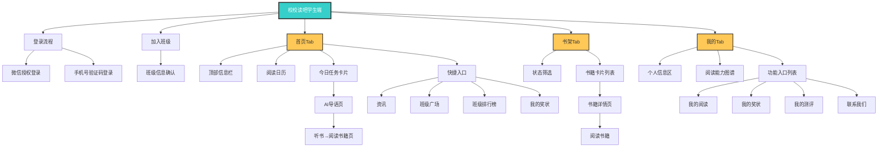

### 4.3 功能清单

**优先级说明：**

- P0：必须有，核心功能，产品上线的基础保障
- P1：应该有，重要功能，提升用户体验和产品价值
- P2：可以有，增强功能，锦上添花的特性
- P3：暂缓，后续迭代考虑

#### 4.3.1 登录

| 编号 | 功能         | 优先级 | 状态   | 说明                      |
| ---- | ------------ | ------ | ------ | ------------------------- |
| F001 | 微信登录     | P0     | 待开发 | 通过微信OAuth授权快速登录 |
| F002 | 手机号码登录 | P0     | 待开发 | 通过手机号+短信验证码登录 |

#### 4.3.2 加入班级

| 编号 | 功能     | 优先级 | 状态   | 说明                                                         |
| ---- | -------- | ------ | ------ | ------------------------------------------------------------ |
| F003 | 加入班级 | P0     | 待开发 | 学生点击老师分享的链接加入班级，加入后可查看该班级的阅读计划 |

#### 4.3.3 首页

| 编号 | 功能       | 优先级 | 状态   | 说明                                                           |
| ---- | ---------- | ------ | ------ | -------------------------------------------------------------- |
| F004 | 顶部信息栏 | P0     | 待开发 | 展示应用标题、消息入口（铃铛图标+未读角标）                    |
| F005 | 今日任务   | P0     | 待开发 | 阅读日历+任务卡片，展示具体任务列表和完成状态                  |
| F006 | 快捷入口   | P1     | 待开发 | 资讯、广场、排行榜、奖状四个快捷跳转入口                       |
| F009 | AI导语     | P1     | 待开发 | AI生成的书籍导读，含任务清单、听书入口、导读视频入口、跳过操作 |
| F037 | AI导读视频 | P1     | 待开发 | 横屏视频播放，进度条节点弹出测试题，答对继续，完成获积分       |

#### 4.3.4 打卡

| 编号 | 功能     | 优先级 | 状态   | 说明                                                                  |
| ---- | -------- | ------ | ------ | --------------------------------------------------------------------- |
| F010 | 阅读打卡 | P0     | 待开发 | 展示今日任务，图片上传（导读单+阅读书籍，最多9张）、心得输入          |
| F011 | 打卡成功 | P0     | 待开发 | 成功动画、奖励展示、AI点评、参考答案                                  |
| F012 | 打卡记录 | P1     | 待开发 | 统计栏（打卡总数、获得点赞、收到评价）、列表视图，支持按计划/书籍筛选 |
| F013 | 打卡详情 | P1     | 待开发 | 查看打卡完整内容                                                      |

#### 4.3.5 测评

| 编号 | 功能     | 优先级 | 状态   | 说明                                       |
| ---- | -------- | ------ | ------ | ------------------------------------------ |
| F014 | 测评列表 | P0     | 待开发 | 待完成/已完成/已过期列表切换               |
| F015 | 测评答题 | P0     | 待开发 | 题目展示、单选作答、答题进度、提交答卷     |
| F016 | 测评结果 | P0     | 待开发 | 分数展示、答题统计、奖状生成、题目正误一览 |
| F017 | 测评详情 | P1     | 待开发 | 查看正确答案和答案解析                     |

#### 4.3.6 书架

| 编号 | 功能     | 优先级 | 状态   | 说明                                                                 |
| ---- | -------- | ------ | ------ | -------------------------------------------------------------------- |
| F018 | 书架主页 | P0     | 待开发 | 状态筛选（全部/阅读中/已阅读/未阅读），书籍卡片展示                  |
| F019 | 书籍详情 | P0     | 待开发 | 基本信息、阅读进度、列表Tab（关卡任务）、资源Tab（导读视频、导读单） |
| F020 | 阅读书籍 | P1     | 待开发 | 章节列表、进度更新、听书播放器                                       |

#### 4.3.7 个人中心

| 编号 | 功能         | 优先级 | 状态   | 说明                                               |
| ---- | ------------ | ------ | ------ | -------------------------------------------------- |
| F021 | 个人主页     | P0     | 待开发 | 基本信息（头像、昵称、等级）、积分展示、功能入口   |
| F022 | 个人信息编辑 | P1     | 待开发 | 头像上传、姓名编辑、学校选择、班级选择、手机号绑定 |
| F023 | 账号安全     | P1     | 待开发 | 安全等级、绑定手机号、退出登录                     |
| F024 | 我的阅读     | P0     | 待开发 | 阅读统计、成就展示                                 |
| F025 | 等级勋章     | P1     | 待开发 | 等级展示、勋章墙、勋章详情                         |
| F026 | 我的奖状     | P1     | 待开发 | 奖状统计、奖状列表、奖状详情、下载奖状             |
| F027 | 积分明细     | P1     | 待开发 | 当前积分、积分记录、积分规则                       |
| F028 | 阅读图谱     | P2     | 待开发 | 能力雷达图、能力详情、提升建议、成长趋势           |
| F029 | 班级广场     | P1     | 待开发 | 动态流、筛选功能、点赞互动                         |
| F030 | 班级排行榜   | P1     | 待开发 | 前三名展示、排名列表、我的排名                     |
| F031 | 用户反馈     | P1     | 待开发 | 反馈类型选择、问题描述、图片上传、提交反馈         |
| F032 | 反馈记录     | P2     | 待开发 | 反馈列表、状态筛选、查看回复                       |

#### 4.3.8 消息

| 编号 | 功能     | 优先级 | 状态   | 说明                                      |
| ---- | -------- | ------ | ------ | ----------------------------------------- |
| F033 | 消息列表 | P1     | 待开发 | 消息分类（系统/活动）、未读标记、全部已读 |
| F034 | 消息详情 | P1     | 待开发 | 消息内容详情查看                          |

#### 4.3.9 资讯

| 编号 | 功能     | 优先级 | 状态   | 说明                                     |
| ---- | -------- | ------ | ------ | ---------------------------------------- |
| F035 | 资讯列表 | P2     | 待开发 | 资讯卡片（标题、摘要、时间）             |
| F036 | 资讯详情 | P2     | 待开发 | 微信文章风格，支持点赞、在看、收藏、分享 |

### 4.4 功能流程图

#### 4.4.1 用户登录流程

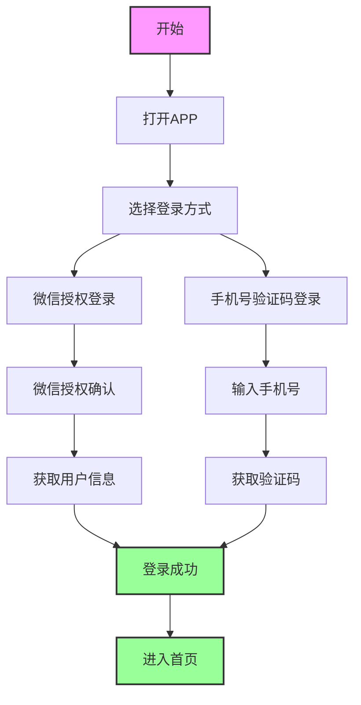

#### 4.4.2 加入班级流程

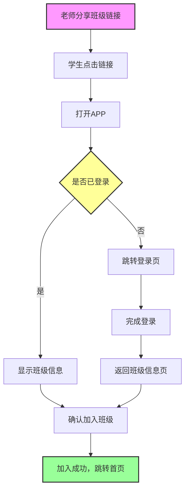

#### 4.4.3 阅读打卡流程

```mermaid
graph TD
    Start[首页] --> ClickTask[点击"去完成"]
    ClickTask --> AIGuide[AI导语页]

    AIGuide --> ListenBook[去听书→阅读书籍页<br/>自动开启播放器]
    AIGuide --> DoCheckin[去打卡→打卡页面]
    AIGuide --> DoExam[去测评→测评答题]
    AIGuide --> DoVideo[去观看→AI导读视频]

    DoCheckin --> UploadImages[上传导读单、阅读书籍图片<br/>必填]
    UploadImages --> InputThoughts[输入阅读心得<br/>可选]
    InputThoughts --> Submit[提交打卡]
    Submit --> SuccessPage[打卡成功页]

    SuccessPage --> ViewAI[查看AI点评]
    SuccessPage --> ViewAnswer[查看参考答案]
    SuccessPage --> BackHome[返回首页]

    style Start fill:#f9f,stroke:#333,stroke-width:2px
    style AIGuide fill:#ff9,stroke:#333,stroke-width:2px
    style SuccessPage fill:#9f9,stroke:#333,stroke-width:2px
    style UploadImages fill:#ff9,stroke:#333,stroke-width:2px
```

#### 4.4.4 测评答题流程

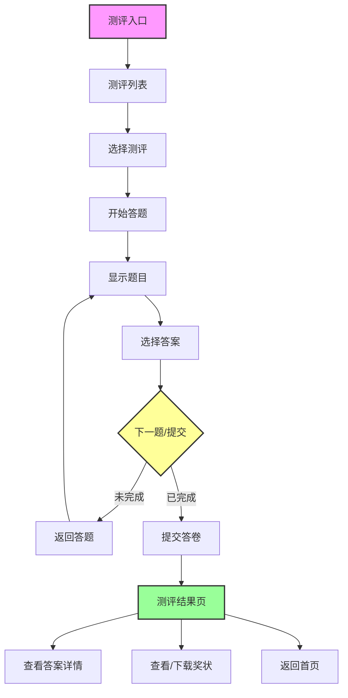

### 4.5 业务模型

#### 4.5.1 角色关系模型

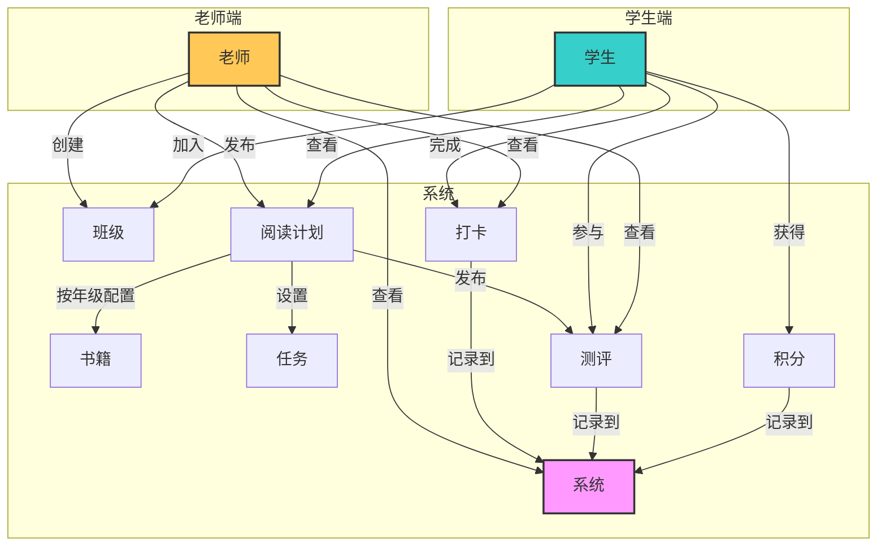

**核心关系：**

| 关系类型  | 说明                                                       |
| --------- | ---------------------------------------------------------- |
| 老师-班级 | 一个老师可创建多个班级，一对多                             |
| 学生-班级 | 一个学生只能加入一个班级，一对一                           |
| 班级-计划 | 一个班级可有多个阅读计划，一对多                           |
| 计划-书籍 | 一个计划按年级配置不同书目，学生看到所在年级对应的书籍列表 |
| 学生-打卡 | 一个学生每天每本书只能打卡一次，一对一                     |
| 学生-测评 | 一个学生每个测评只能提交一次，一对一                       |
| 学生-积分 | 完成任务获得积分，累计计算                                 |

#### 4.5.2 核心业务流程

**加入班级业务流程**

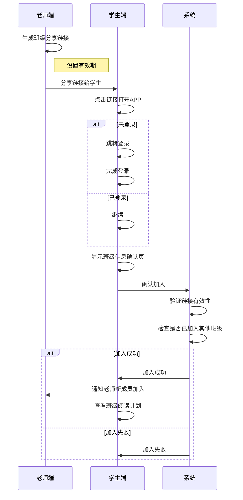

**阅读打卡业务流程**

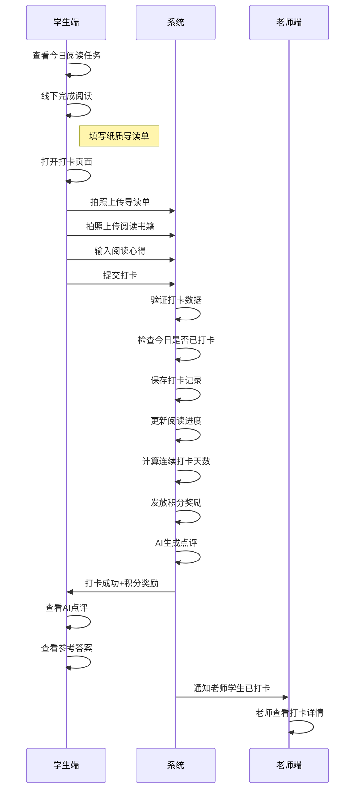

**测评答题业务流程**

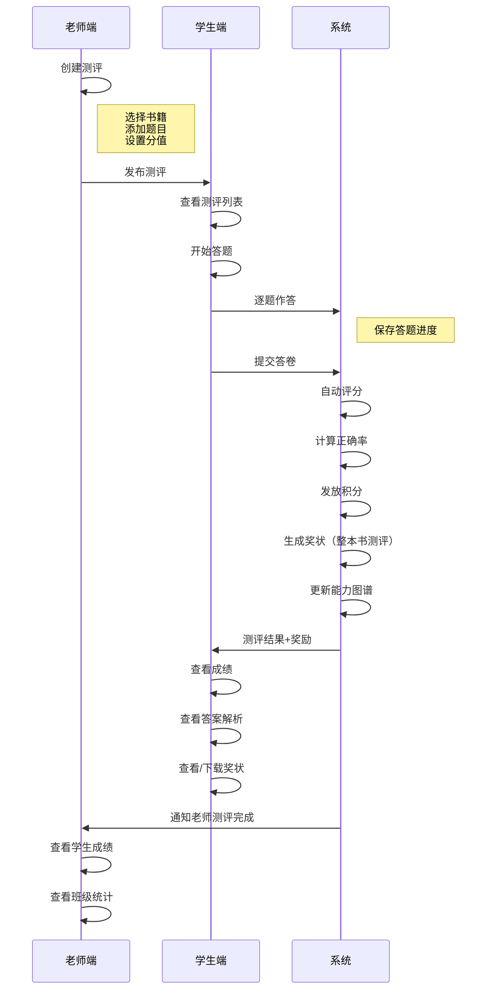

#### 4.5.3 数据流转关系

**打卡数据流转**

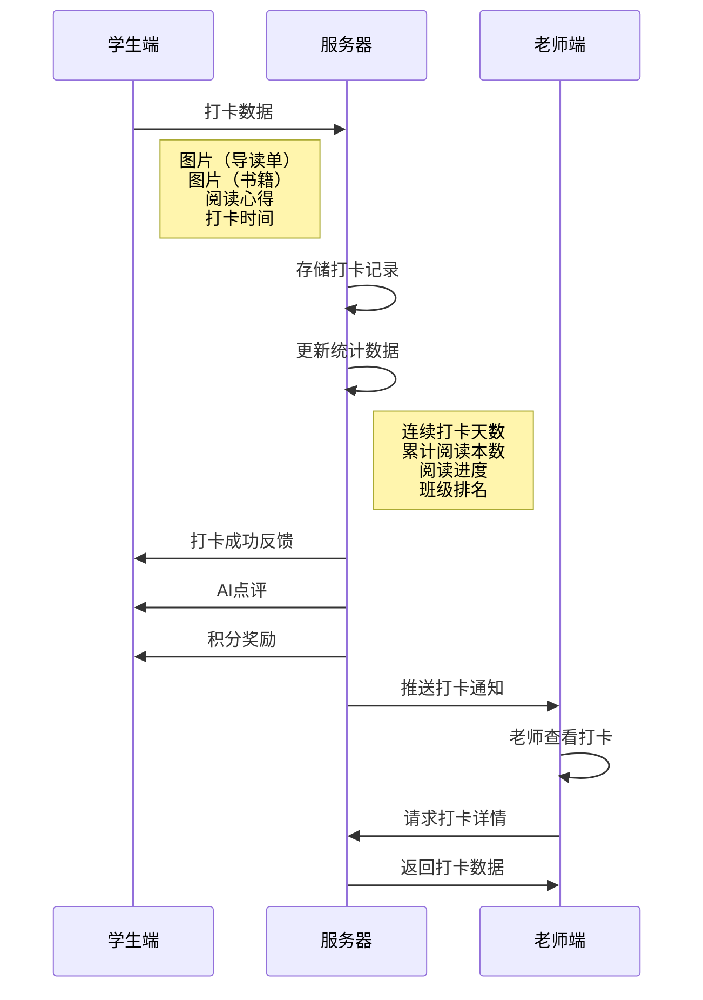

**测评数据流转**

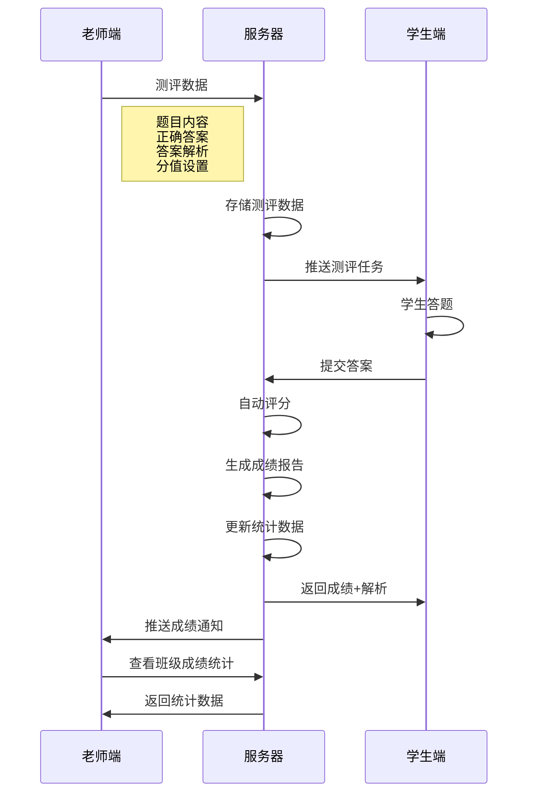

**积分数据流转**

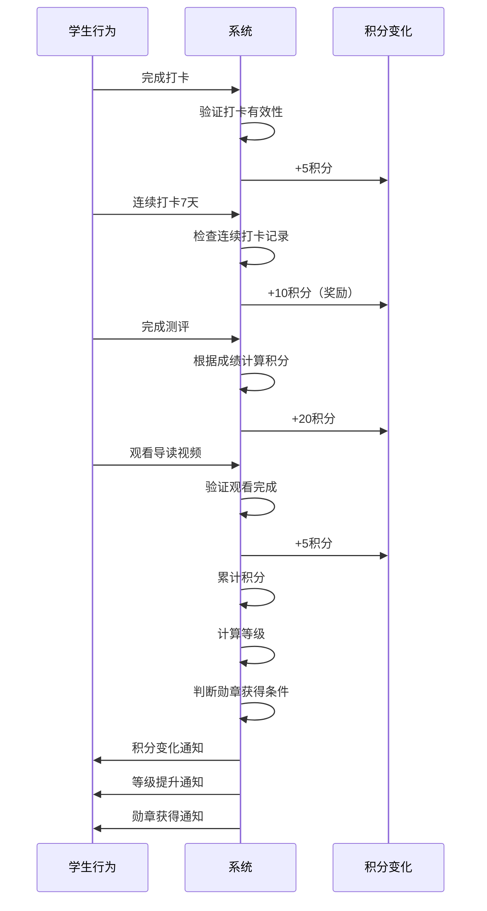

#### 4.5.4 状态流转图

**书籍阅读状态**

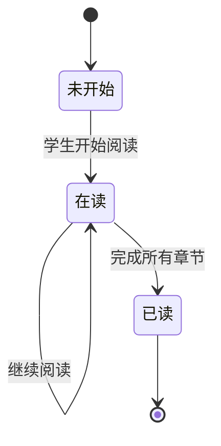

**测评状态**

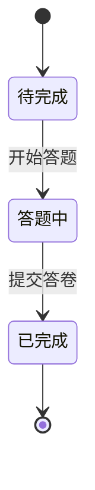

**打卡状态（每日重置）**

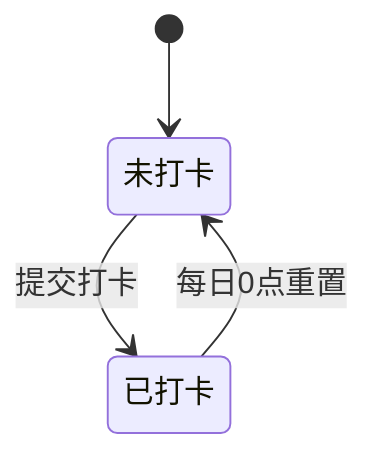

**班级成员状态**

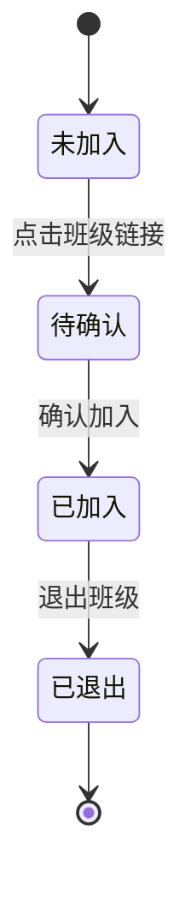

---

## 5. 功能详情

### 5.1 登录模块

#### 5.1.1 F001 微信授权登录

**线框图**

```
┌─────────────────────────────────────┐
│            登录页面                  │
├─────────────────────────────────────┤
│                                     │
│           ┌───────┐                 │
│           │  📚   │                 │
│           │ Logo  │                 │
│           └───────┘                 │
│                                     │
│          校校读吧                    │
│           学生端                     │
│                                     │
│  ┌─────────────────────────────┐    │
│  │ [微信登录]  │ [手机号登录]  │    │
│  └─────────────────────────────┘    │
│                                     │
│  ┌─────────────────────────────┐    │
│  │                             │    │
│  │      ┌─────────────┐        │    │
│  │      │   微信图标   │        │    │
│  │      └─────────────┘        │    │
│  │                             │    │
│  │      微信快捷登录            │    │
│  │  授权后即可快速登录          │    │
│  │                             │    │
│  │  ┌─────────────────────┐    │    │
│  │  │   微信一键登录       │    │    │
│  │  └─────────────────────┘    │    │
│  │                             │    │
│  └─────────────────────────────┘    │
│                                     │

│  登录即表示同意 用户协议 和 隐私政策  │
│                                     │
└─────────────────────────────────────┘
```

**功能说明：**
用户通过微信OAuth授权快速登录应用，无需注册账号

**数据来源：**
用户信息从微信授权接口获取，账号数据从管理后台获取

**业务规则：**

1. 必须勾选用户协议才能登录
2. 登录状态保持7天有效
3. 首次登录需要微信授权获取用户信息（头像、昵称），授权成功后自动创建账号

**界面要素：**

| 元素         | 类型           | 说明                                                                               |
| ------------ | -------------- | ---------------------------------------------------------------------------------- |
| 应用Logo     | Image（图片）  | 校校读吧品牌标识                                                                   |
| 应用名称     | Text（文本）   | "校校读吧"及"学生端"标识                                                           |
| 登录方式Tab  | Tab（标签页）  | 包含"微信登录"和"手机号登录"两个选项，默认选中"微信登录"，点击切换显示对应登录表单 |
| 微信一键登录 | Button（按钮） | 绿色主按钮样式，点击调起微信授权弹窗，授权成功后跳转首页                           |
| 用户协议     | Link（链接）   | 点击跳转用户协议详情页（H5页面）                                                   |
| 隐私政策     | Link（链接）   | 点击跳转隐私政策详情页（H5页面）                                                   |

**验收标准：**

1. 微信授权流程完整可用，授权成功后正确跳转首页
2. 未勾选协议时点击登录有提示
3. 各异常场景提示符合预期

**异常处理：**

| 异常场景     | 处理方式  | 提示文案                         |
| ------------ | --------- | -------------------------------- |
| 用户拒绝授权 | 弹窗提示  | 需要微信授权才能登录，请重新授权 |
| 网络异常     | Toast提示 | 网络连接失败，请检查网络后重试   |
| 微信版本过低 | 弹窗提示  | 请升级微信版本后重试             |
| 服务器异常   | Toast提示 | 服务繁忙，请稍后重试             |
| 未勾选协议   | Toast提示 | 请先阅读并同意用户协议和隐私政策 |

---

#### 5.1.2 F002 手机号验证码登录

**线框图**

```
┌─────────────────────────────────────┐
│            登录页面                  │
├─────────────────────────────────────┤
│                                     │
│           ┌───────┐                 │
│           │  📚   │                 │
│           │ Logo  │                 │
│           └───────┘                 │
│                                     │
│          校校读吧                    │
│           学生端                     │
│                                     │
│  ┌─────────────────────────────┐    │
│  │ [微信登录]  │ [手机号登录]  │    │
│  └─────────────────────────────┘    │
│                                     │
│  ┌─────────────────────────────┐    │
│  │                             │    │
│  │  ┌───────────────────────┐  │    │
│  │  │ 📱 请输入手机号        │  │    │
│  │  └───────────────────────┘  │    │
│  │                             │    │
│  │  ┌───────────────┬───────┐  │    │
│  │  │ 🔒 请输入验证码│获取码 │  │    │
│  │  └───────────────┴───────┘  │    │
│  │                             │    │
│  │  ┌───────────────────────┐  │    │
│  │  │        登  录         │  │    │
│  │  └───────────────────────┘  │    │
│  │                             │    │
│  └─────────────────────────────┘    │
│                                     │

│  登录即表示同意 用户协议 和 隐私政策  │
│                                     │
└─────────────────────────────────────┘
```

**功能说明：**
用户通过手机号和短信验证码登录应用

**数据来源：**
账号数据从管理后台获取，验证码通过短信服务发送

**业务规则：**

1. 必须勾选用户协议才能登录
2. 手机号格式校验（11位数字，1开头）
3. 验证码有效期5分钟
4. 同一手机号60秒内只能获取一次验证码
5. 验证码错误3次后需等待5分钟
6. 登录状态保持7天有效

**界面要素：**

| 元素         | 类型            | 说明                                                                                                            |
| ------------ | --------------- | --------------------------------------------------------------------------------------------------------------- |
| 手机号输入框 | Input（输入框） | 带手机图标，placeholder"请输入手机号"，仅允许输入数字，最多11位，实时校验格式，不符合时输入框标红并显示错误提示 |
| 验证码输入框 | Input（输入框） | 带锁图标，placeholder"请输入验证码"，仅允许输入数字，最多6位                                                    |
| 获取验证码   | Button（按钮）  | 默认文案"获取验证码"，手机号格式正确时可点击，点击后发送验证码并进入60秒倒计时，文案变为"Xs后重试"，按钮置灰    |
| 登录         | Button（按钮）  | 主按钮样式，手机号11位且验证码6位时可点击，否则置灰禁用，点击后校验验证码，成功则跳转首页                       |
| 用户协议     | Link（链接）    | 点击跳转用户协议详情页（H5页面）                                                                                |
| 隐私政策     | Link（链接）    | 点击跳转隐私政策详情页（H5页面）                                                                                |

**验收标准：**

1. 手机号和验证码格式校验正确
2. 验证码发送和倒计时逻辑正常
3. 登录成功后正确跳转首页

**异常处理：**

| 异常场景       | 处理方式   | 提示文案                          |
| -------------- | ---------- | --------------------------------- |
| 手机号格式错误 | 输入框标红 | 请输入正确的11位手机号            |
| 验证码格式错误 | 输入框标红 | 请输入6位验证码                   |
| 验证码错误     | 输入框标红 | 验证码错误，请重新输入            |
| 验证码已过期   | 弹窗提示   | 验证码已过期，请重新获取          |
| 发送频率超限   | Toast提示  | 发送过于频繁，请稍后再试          |
| 错误次数超限   | 弹窗提示   | 验证码错误次数过多，请5分钟后重试 |
| 未勾选协议     | Toast提示  | 请先阅读并同意用户协议和隐私政策  |

---

### 5.2 加入班级模块

#### 5.2.1 F003 加入班级

**线框图**

```
┌─────────────────────────────────────┐
│          加入班级确认页              │
├─────────────────────────────────────┤
│  ←                                  │
├─────────────────────────────────────┤
│                                     │
│           ┌───────────┐             │
│           │   班级    │             │
│           │   图标    │             │
│           └───────────┘             │
│                                     │
│         三年级一班                   │
│                                     │
│  ┌─────────────────────────────┐    │
│  │                             │    │
│  │  学校：阳光小学              │    │
│  │                             │    │
│  │  老师：张老师                │    │
│  │                             │    │
│  │  当前计划：寒假阅读计划       │    │
│  │                             │    │
│  └─────────────────────────────┘    │
│                                     │
│  ┌─────────────────────────────┐    │
│  │        确认加入              │    │
│  └─────────────────────────────┘    │
│                                     │
│  ┌─────────────────────────────┐    │
│  │          取消               │    │
│  └─────────────────────────────┘    │
│                                     │
└─────────────────────────────────────┘
```

**功能说明：**

学生通过点击老师分享的班级链接加入班级，加入后可查看该班级报名的阅读计划。加入班级是独立业务，与登录流程无关

**数据来源：**

班级信息从老师端分享链接中获取，班级详情从管理后台获取

**业务规则：**

1. 一个学生只能加入一个班级
2. 已加入班级的学生点击其他班级链接时，提示"您已加入其他班级，如需更换请先退出当前班级"
3. 加入班级后可查看该班级的所有阅读计划
4. 班级链接由老师端生成，包含班级唯一标识
5. 链接可设置有效期（由老师端控制）

**交互逻辑：**

1. 老师在老师端生成班级分享链接
2. 老师将链接分享给学生（微信、QQ等）
3. 学生点击链接打开APP
4. 若未登录，先跳转登录页完成登录
5. 显示班级信息确认页
6. 学生确认班级信息后点击"确认加入"
7. 加入成功，可查看该班级的阅读计划

**界面要素：**

| 元素     | 类型           | 说明                                                                                                                 |
| -------- | -------------- | -------------------------------------------------------------------------------------------------------------------- |
| 班级名称 | Text（文本）   | 显示待加入的班级名称                                                                                                 |
| 老师信息 | Text（文本）   | 显示班级老师的姓名                                                                                                   |
| 学校信息 | Text（文本）   | 显示班级所属学校                                                                                                     |
| 阅读计划 | Text（文本）   | 显示该班级当前的阅读计划                                                                                             |
| 确认加入 | Button（按钮） | 主按钮样式，点击确认加入班级                                                                                         |
| 取消     | Button（按钮） | 次要按钮样式，点击取消返回                                                                                           |
| 温馨提示 | Card（卡片）   | 黄色背景提示区域，展示加入班级的注意事项：加入后可参与班级阅读任务、每个学生只能加入一个班级、如有问题请联系班级老师 |

**验收标准：**

1. 点击班级链接能正确显示班级信息确认页
2. 确认加入后成功加入班级并可查看阅读计划
3. 各异常场景提示符合预期

**异常处理：**

| 异常场景       | 处理方式  | 提示文案                                   |
| -------------- | --------- | ------------------------------------------ |
| 链接已失效     | 弹窗提示  | 该链接已失效，请联系老师重新分享           |
| 已加入其他班级 | 弹窗提示  | 您已加入其他班级，如需更换请先退出当前班级 |
| 班级不存在     | 弹窗提示  | 班级不存在，请确认链接是否正确             |
| 网络异常       | Toast提示 | 网络连接失败，请检查网络后重试             |

### 5.3 首页模块

**页面线框图**

```
┌─────────────────────────────────────┐
│  校校读吧-学生端                🔔  │
│                                (3) │
├─────────────────────────────────────┤
│  本周阅读日历                [展开] │
│  一  二  三  四  五  六  日         │
│  ★  ★  ★  ☆  📖  ─  ─           │
│ (绿)(绿)(绿)(红)(黄)(灰)(灰)       │
├─────────────────────────────────────┤
│  今日任务                           │
│  ┌─────────────────────────────┐    │
│  │ 《三体》    2026年寒假阅读计划│    │
│  │                             │    │
│  │ ✅ 1. 阅读第15-30页         │    │
│  │ ✅ 2. 完成导读单二          │    │
│  │ ○  3. 完成AI测评            │    │
│  │ ○  4. 观看AI导读视频        │    │
│  │                             │    │
│  │  ┌─────────────────────┐    │    │
│  │  │      去完成 →        │    │    │
│  │  └─────────────────────┘    │    │
│  └─────────────────────────────┘    │
├─────────────────────────────────────┤
│  ┌────┐  ┌────┐  ┌────┐  ┌────┐   │
│  │资讯│  │广场│  │排行│  │奖状│   │
│  │ 📰 │  │ 🧭 │  │ 🏆 │  │ 🎖️ │   │
│  └────┘  └────┘  └────┘  └────┘   │
├─────────────────────────────────────┤
│  [首页]      [书架]      [我的]     │
└─────────────────────────────────────┘
```

#### 5.3.1 F004 顶部信息栏

**功能说明：**

展示应用标题和消息入口

**数据来源：**

未读消息数量实时同步

**业务规则：**

1. 有未读消息时消息图标右上角显示未读数量角标
2. 点击铃铛图标进入消息中心

**界面要素：**

| 元素     | 类型         | 说明                                                   |
| -------- | ------------ | ------------------------------------------------------ |
| 应用标题 | Text（文本） | 显示"校校读吧-学生端"                                  |
| 消息图标 | Icon（图标） | 铃铛图标，右上角显示未读消息数量角标，点击进入消息中心 |

**验收标准：**

1. 标题正确显示
2. 消息图标点击跳转消息中心
3. 未读消息角标数量正确

**异常处理：**

| 异常场景 | 处理方式     | 提示文案 |
| -------- | ------------ | -------- |
| 网络异常 | 显示缓存数据 | -        |

#### 5.3.2 F005 今日任务卡片

**功能说明：**
展示阅读日历和当前阅读计划的今日任务清单，日历直观呈现每日任务完成情况，任务卡片内列出具体任务项及完成状态，引导用户进入AI导语页完成任务

**数据来源：**
任务数据和日历状态从管理后台获取，打卡状态实时同步

**业务规则：**

1. 阅读日历默认显示周视图（当前周），点击"展开"切换为月视图
2. 日历每日状态图标：已完成（绿色实心星）、过期未完成（红色空心星）、待完成（黄色书本）、无任务（灰色横线）
3. 月视图支持前后月份切换
4. 每日0点（北京时间）重置打卡状态
5. 同一天只能打卡一次
6. 显示最近参与的阅读计划，若有多个进行中的计划显示最近加入的一个
7. 任务卡片内直接展示当日所有任务项，已完成任务显示勾选状态并半透明
8. 点击"去完成"按钮跳转到F009 AI导语页

**界面要素：**

| 元素          | 类型             | 说明                                                          |
| ------------- | ---------------- | ------------------------------------------------------------- |
| 阅读日历      | Calendar（日历） | 周视图/月视图可切换，每日显示任务完成状态图标                 |
| 展开/收起按钮 | Button（按钮）   | 切换日历的周视图和月视图                                      |
| 书籍名称      | Text（文本）     | 当前阅读书籍名称                                              |
| 计划名称      | Text（文本）     | 当前参与的阅读计划名称                                        |
| 任务列表      | List（列表）     | 展示当日所有任务项，含序号、任务名称、完成状态（勾选/未完成） |
| 去完成        | Button（按钮）   | 跳转到F009 AI导语页，查看并完成今日任务清单                   |

**验收标准：**

1. 阅读日历周视图/月视图切换正常，状态图标正确
2. 任务卡片正确展示当前阅读计划和书籍信息
3. 打卡状态每日0点正确重置
4. "去完成"按钮正确跳转到AI导语页

**异常处理：**

| 异常场景       | 处理方式     | 提示文案                       |
| -------------- | ------------ | ------------------------------ |
| 未加入阅读计划 | 显示空状态   | 暂无阅读任务，按钮"查看计划"   |
| 接口请求失败   | Toast提示    | 加载失败，请重试               |
| 计划已结束     | 显示结束状态 | 计划已结束，按钮变为"查看记录" |
| 今日无任务     | 显示空状态   | 今日无阅读任务，休息一下吧     |

#### 5.3.3 F006 快捷入口

**功能说明：**

提供首页常用功能的快捷跳转入口

**数据来源：**

资讯和广场入口支持未读红点提示，状态从后端获取

**业务规则：**

1. 资讯入口有新资讯时显示未读红点
2. 广场入口有新动态时显示未读红点
3. 点击后红点消失

**界面要素：**

| 元素       | 类型          | 说明                                         |
| ---------- | ------------- | -------------------------------------------- |
| 资讯入口   | Entry（入口） | 新闻图标，点击跳转资讯列表页，支持未读红点   |
| 广场入口   | Entry（入口） | 指南针图标，点击跳转班级广场页，支持未读红点 |
| 排行榜入口 | Entry（入口） | 排行图标，点击跳转班级排行榜页               |
| 奖状入口   | Entry（入口） | 奖章图标，点击跳转我的奖状页                 |

**验收标准：**

1. 各入口点击跳转正确
2. 未读红点状态正确显示和消除

**异常处理：**

| 异常场景 | 处理方式     | 提示文案 |
| -------- | ------------ | -------- |
| 网络异常 | 隐藏未读红点 | -        |

#### 5.3.4 F009 AI导语页

**线框图**

```
┌─────────────────────────────────────┐
│  ←  AI导读                           │
├─────────────────────────────────────┤
│                                     │
│           ┌─────────┐               │
│           │  AI     │               │
│           │ 虚拟形象│               │
│           └─────────┘               │
│                                     │
│  ┌─────────────────────────────┐    │
│  │ 💬 小读说：今天共有4个任务   │    │
│  │ 加油完成吧！                │    │
│  │                             │    │
│  │ 🎧 《三体》15-30页  [去听书]│    │
│  └─────────────────────────────┘    │
│                                     │
│  ┌─────────────────────────────┐    │
│  │ ✅ 1. 阅读第15-30页  已完成 │    │
│  ├─────────────────────────────┤    │
│  │ ✅ 2. 完成导读单二   已完成 │    │
│  │         查看打卡详情 →      │    │
│  ├─────────────────────────────┤    │
│  │ ○ 3. 完成AI测评             │    │
│  │      [跳过]    [去测评]     │    │
│  ├─────────────────────────────┤    │
│  │ ○ 4. 观看AI导读视频         │    │
│  │      [跳过]    [去观看]     │    │
│  └─────────────────────────────┘    │
│                                     │
└─────────────────────────────────────┘
```

**功能说明：**

展示当日阅读任务清单，引导学生按顺序完成各项任务。从首页今日任务卡片的"去完成"按钮进入

**数据来源：**

任务列表和完成状态从后端获取，AI导语内容由AI根据书籍信息生成

**业务规则：**

1. 任务列表按配置顺序展示，包含阅读、导读单、测评、视频等任务类型
2. 已完成任务显示勾选状态和半透明样式
3. 已完成的导读单/打卡任务支持"查看打卡详情"跳转
4. 待完成任务提供"跳过"和对应操作按钮（去测评/去观看等）
5. 跳过操作不影响任务状态，学生可随时返回完成
6. 导语气泡内嵌听书入口模块，显示当前阅读页码范围，点击"去听书"跳转阅读书籍页并自动开启听书播放器

**界面要素：**

| 元素         | 类型               | 说明                                                                   |
| ------------ | ------------------ | ---------------------------------------------------------------------- |
| 导航栏       | Navigation（导航） | 返回按钮、标题"AI导读"                                                 |
| AI虚拟形象   | Image（图片）      | 紫色渐变圆形头像，带弹跳动画效果                                       |
| 导语气泡     | Text（文本）       | AI生成的任务引导文字，内嵌听书入口模块（耳机图标+书籍页码+去听书按钮） |
| 任务列表     | List（列表）       | 白色卡片容器，展示当日所有任务项                                       |
| 已完成任务项 | List Item          | 绿色勾选图标+任务名称，半透明灰色样式，导读单类任务显示"查看打卡详情"  |
| 待完成任务项 | List Item          | 空心圆图标+任务名称，右侧显示"跳过"按钮和操作按钮                      |
| 操作按钮     | Button（按钮）     | 不同任务类型使用不同颜色（测评粉色、视频紫色），点击跳转对应页面       |

**验收标准：**

1. 任务列表正确展示已完成和待完成状态
2. 跳过按钮可正常点击，不改变任务状态
3. 操作按钮正确跳转到对应功能页面
4. 已完成任务的"查看打卡详情"可正常跳转
5. 听书入口点击后正确跳转阅读书籍页并自动开启播放器

**异常处理：**

| 异常场景     | 处理方式     | 提示文案                       |
| ------------ | ------------ | ------------------------------ |
| 任务列表为空 | 显示空状态   | 今日暂无任务                   |
| 导语生成失败 | 显示默认导语 | -                              |
| 网络异常     | Toast提示    | 网络连接失败，请检查网络后重试 |

#### 5.3.7 F037 AI导读视频

**线框图**

```
┌──────────────────────────────────────────────┐
│ ←  《三体》AI导读视频                         │
│                                              │
│                                              │
│              （横屏视频画面）                  │
│                                              │
│                                              │
│  ●──────●─────────●──────────○───────────── │
│  测试题1  测试题2   测试题3                   │
│  03:28 / 10:15              ▶ 播放/暂停      │
└──────────────────────────────────────────────┘

--- 测试题弹窗 ---
┌─────────────────────────────┐
│ 三体世界的恒星系统由几颗     │
│ 恒星组成？                   │
│                             │
│  (A) 1颗                    │
│  (B) 2颗                    │
│  (C) 3颗                    │
│  (D) 4颗                    │
└─────────────────────────────┘

--- 完成弹窗 ---
┌─────────────────────────────┐
│     🎉 观看完成！            │
│     获得 +15 积分            │
│                             │
│  观看时长 10:15  测试题 3/3  │
│                             │
│     [返回任务列表]           │
└─────────────────────────────┘
```

**功能说明：**

横屏播放AI导读视频，视频进度条上设有测试题节点，播放到节点时自动暂停并弹出测试题，学生答对后继续播放。从F009 AI导语页的"去观看"按钮进入

**数据来源：**

视频资源和测试题由管理后台配置

**业务规则：**

1. 视频强制横屏播放，进度条不可拖动，必须完整观看
2. 进度条上标记测试题节点位置（红色圆点），播放到节点时自动暂停并弹出测试题
3. 测试题为单选题，答对后自动关闭弹窗继续播放（800ms延迟），答错时选项变红并抖动，可重新选择
4. 不提供跳过测试题的选项，必须答对才能继续
5. 全部观看完成后弹出完成弹窗，显示获得积分、观看时长、测试题完成数
6. 点击返回按钮时弹出退出确认弹窗，退出后不保存播放进度，下次需从头观看

**界面要素：**

| 元素         | 类型             | 说明                                                               |
| ------------ | ---------------- | ------------------------------------------------------------------ |
| 返回按钮     | Button（按钮）   | 点击弹出退出确认弹窗                                               |
| 视频标题     | Text（文本）     | 显示书名+AI导读视频                                                |
| 视频播放区   | Player（播放器） | 横屏全屏播放，不支持拖动进度条                                     |
| 进度条       | Slider（滑块）   | 显示播放进度，测试题节点用红色圆点标记                             |
| 播放/暂停    | Button（按钮）   | 切换播放状态                                                       |
| 时间显示     | Text（文本）     | 格式"当前时间 / 总时长"                                            |
| 测试题弹窗   | Modal（弹窗）    | 居中弹窗，显示题目和4个单选选项，答对变绿自动关闭，答错变红抖动    |
| 完成弹窗     | Modal（弹窗）    | 居中弹窗，显示积分奖励、观看时长、测试题完成数，"返回任务列表"按钮 |
| 退出确认弹窗 | Modal（弹窗）    | 黄色警告图标，提示退出不保存进度，"继续观看"和"退出"双按钮         |

**验收标准：**

1. 视频横屏播放，进度条不可拖动
2. 测试题在正确节点弹出，答对继续答错可重试
3. 完成后积分正确发放
4. 退出确认弹窗正常弹出，退出后下次从头播放

**异常处理：**

| 异常场景     | 处理方式       | 提示文案                       |
| ------------ | -------------- | ------------------------------ |
| 视频加载失败 | 显示重试按钮   | 视频加载失败，点击重试         |
| 网络中断     | 暂停播放并提示 | 网络连接失败，请检查网络后重试 |
| 测试题为空   | 跳过节点继续   | -                              |

### 5.4 打卡模块

#### 5.4.1 F010 阅读打卡页

**线框图**

```
┌─────────────────────────────────────┐
│  ←  每日打卡                         │
├─────────────────────────────────────┤
│                                     │
│  ┌─────────────────────────────┐    │
│  │ 📖 今日阅读任务              │    │
│  │ 阅读《三体》第15-30页        │    │
│  │ 完成导读单二                 │    │
│  │ ⏰ 今日剩余时间：18小时32分   │    │
│  └─────────────────────────────┘    │
│                                     │
│  ┌─────────────────────────────┐    │
│  │                             │    │
│  │      📷                      │    │
│  │                             │    │
│  │  上传导读单、阅读书籍图片    │    │
│  │  支持JPG、PNG格式           │    │
│  │  最多9张，每张最大5MB        │    │
│  │                             │    │
│  └─────────────────────────────┘    │
│                                     │
│  ┌───┐ ┌───┐ ┌───┐                 │
│  │图1│ │图2│ │ + │                 │
│  └───┘ └───┘ └───┘                 │
│  [ 继续添加 ]                       │
│                                     │
│  ┌─────────────────────────────┐    │
│  │ 写下你的阅读心得与收获...    │    │
│  │                             │    │
│  │                             │    │
│  └─────────────────────────────┘    │
│                          0 / 500    │
│                                     │
│  ┌─────────────────────────────┐    │
│  │ 💡 打卡可获得积分奖励        │    │
│  │    完成打卡+5积分            │    │
│  └─────────────────────────────┘    │
│                                     │
│  ┌─────────────────────────────┐    │
│  │        提交打卡              │    │
│  └─────────────────────────────┘    │
│                                     │
│ ┌────┐  ┌────┐  ┌────┐             │
│ │首页│  │书架│  │我的│             │
│ └────┘  └────┘  └────┘             │
└─────────────────────────────────────┘
```

**功能说明：**

学生完成每日阅读任务后，通过此页面上传导读单图片和阅读书籍照片进行打卡

**数据来源：**

任务信息从管理后台获取，打卡数据提交至服务器

**业务规则：**

1. 必须上传至少1张图片才能提交打卡
2. 图片最多9张，单张不超过5MB
3. 支持JPG、PNG格式
4. 阅读心得限制500字以内
5. 每日只能提交一次打卡
6. 打卡时间记录为提交时间
7. 完成打卡可获得5积分奖励

**界面要素：**

| 元素       | 类型               | 说明                                     |
| ---------- | ------------------ | ---------------------------------------- |
| 导航栏     | Navigation（导航） | 返回按钮、页面标题"每日打卡"             |
| 任务信息卡 | Card（卡片）       | 今日阅读任务内容、剩余时间               |
| 图片上传区 | Upload（上传组件） | 上传导读单、阅读书籍图片，支持拍照和相册 |
| 图片预览   | List（列表）       | 已上传图片缩略图，支持删除和继续添加     |
| 阅读心得   | Input（输入框）    | 多行文本输入框，限制500字                |
| 积分提示   | Text（文本）       | 显示打卡可获得的积分奖励                 |
| 提交打卡   | Button（按钮）     | 主按钮，点击提交打卡                     |
| 底部导航   | Navigation（导航） | 首页、书架、我的三个Tab                  |

**验收标准：**

1. 图片上传功能正常
2. 打卡提交成功后正确跳转
3. 积分正确发放

**异常处理：**

| 异常场景         | 处理方式  | 提示文案                       |
| ---------------- | --------- | ------------------------------ |
| 未上传图片       | 弹窗提示  | 请至少上传1张图片              |
| 图片超过大小限制 | Toast提示 | 图片大小不能超过5MB            |
| 图片格式不支持   | Toast提示 | 仅支持JPG、PNG格式             |
| 今日已打卡       | 弹窗提示  | 今日已完成打卡，明天再来吧     |
| 网络异常         | Toast提示 | 网络连接失败，请检查网络后重试 |

#### 5.4.2 F011 打卡成功页

**线框图**

```
┌─────────────────────────────────────┐
│                                     │
│  ┌─────────────────────────────┐    │
│  │     🏆                       │    │
│  │   太棒了，打卡成功！         │    │
│  │                             │    │
│  │   +5积分     连续打卡15天    │    │
│  └─────────────────────────────┘    │
│                                     │
│  ┌─────────────────────────────┐    │
│  │  🤖 小读点评                 │    │
│  │                             │    │
│  │  你对小王子的理解很深刻！    │    │
│  │  特别是关于玫瑰花的描述，    │    │
│  │  说明你认真阅读了这个章节。  │    │
│  │  继续加油哦！               │    │
│  └─────────────────────────────┘    │
│                                     │
│  ┌─────────────────────────────┐    │
│  │  📖 导读单参考答案           │    │
│  │                             │    │
│  │  ┌───────────────────┐     │    │
│  │  │                   │     │    │
│  │  │   导读单参考答案   │     │    │
│  │  │     （图片）       │     │    │
│  │  │                   │     │    │
│  │  └───────────────────┘     │    │
│  │    🔍 点击图片可放大查看    │    │
│  └─────────────────────────────┘    │
│                                     │
│  ┌─────────────────────────────┐    │
│  │        返回首页              │    │
│  └─────────────────────────────┘    │
│                                     │
└─────────────────────────────────────┘
```

**功能说明：**

打卡提交成功后的结果展示页，包含奖励和AI点评

**数据来源：**

积分数据从服务器获取，AI点评由AI根据打卡内容生成

**业务规则：**

1. 每次打卡固定获得5积分
2. 连续打卡有额外积分奖励
3. AI点评基于用户提交的打卡内容生成

**界面要素：**

| 元素       | 类型           | 说明                                           |
| ---------- | -------------- | ---------------------------------------------- |
| 成功横幅   | Card（卡片）   | 金色渐变背景，奖杯图标，"太棒了，打卡成功！"   |
| 奖励展示   | Text（文本）   | 获得积分数、连续打卡天数                       |
| AI点评卡片 | Card（卡片）   | "小读点评"，AI生成的打卡内容点评               |
| 参考答案   | Card（卡片）   | 导读单参考答案图片，点击弹出图片查看器放大查看 |
| 返回首页   | Button（按钮） | 主按钮，点击返回首页                           |

**验收标准：**

1. 打卡成功动画正常播放
2. 积分和连续打卡天数正确显示
3. AI点评内容正确加载

**异常处理：**

| 异常场景         | 处理方式     | 提示文案           |
| ---------------- | ------------ | ------------------ |
| AI点评加载失败   | 显示默认点评 | 继续加油哦！       |
| 参考答案加载失败 | 显示重试按钮 | 加载失败，点击重试 |
| 网络异常         | 显示缓存数据 | -                  |

#### 5.4.3 F012 打卡记录

**线框图**

```
┌─────────────────────────────────────┐
│  ←  我的打卡记录                     │
├─────────────────────────────────────┤
│  [全部阅读计划 ▼] [全部书籍 ▼]      │
├─────────────────────────────────────┤
│  ┌─────────────────────────────┐    │
│  │   28          156        42  │    │
│  │ 打卡总数    获得点赞  收到评价│    │
│  └─────────────────────────────┘    │
│                                     │
│  ┌─────────────────────────────┐    │
│  │ [2026春季阅读计划]           │    │
│  │ 📖 《三体》·第8次阅读        │    │
│  │ 今天读完了《三体》第三部...   │    │
│  │ 🖼️ 🖼️ 🖼️                     │    │
│  │ ─────────────────────────── │    │
│  │ 👍 32    💬 8                │    │
│  └─────────────────────────────┘    │
│                                     │
│  ┌─────────────────────────────┐    │
│  │ [2025暑假阅读计划]           │    │
│  │ 📖 《红楼梦》·第5次阅读      │    │
│  │ 刘姥姥进大观园这一段...       │    │
│  │ 🖼️                           │    │
│  │ ─────────────────────────── │    │
│  │ 👍 18    💬 5                │    │
│  └─────────────────────────────┘    │
│                                     │
└─────────────────────────────────────┘
```

**功能说明：**

查看历史打卡记录，顶部展示打卡统计数据，支持按阅读计划和书籍筛选

**数据来源：**

打卡记录从服务器获取，按时间倒序排列

**业务规则：**

1. 顶部统计栏展示打卡总数、获得点赞数、收到评价数三项汇总数据
2. 支持按阅读计划和书籍两个维度筛选，两个筛选器可组合使用
3. 记录列表按时间倒序排列，每条记录显示阅读计划标签、书籍名称、阅读次数、心得摘要（最多3行）、图片缩略图
4. 每条记录底部显示点赞数和评论数
5. 点击记录卡片跳转到打卡详情页

**界面要素：**

| 元素     | 类型                 | 说明                                                                                     |
| -------- | -------------------- | ---------------------------------------------------------------------------------------- |
| 统计栏   | Card（卡片）         | 横向展示打卡总数、获得点赞、收到评价三项数据，数值使用主题色大字体                       |
| 筛选器   | Select（下拉选择器） | 两个并排的下拉选择器，分别按阅读计划和书籍筛选                                           |
| 打卡卡片 | Card（卡片）         | 包含阅读计划标签、书籍名称、心得摘要（最多3行截断）、图片缩略图（最多3张），点击进入详情 |
| 互动数据 | Text（文本）         | 卡片底部显示点赞数和评论数图标及数字                                                     |

**验收标准：**

1. 统计栏数据正确显示
2. 筛选功能正常，两个筛选器可组合使用
3. 点击打卡卡片能跳转详情页
4. 记录列表按时间倒序正确排列

**异常处理：**

| 异常场景     | 处理方式     | 提示文案                       |
| ------------ | ------------ | ------------------------------ |
| 无打卡记录   | 显示空状态   | 暂无打卡记录，快去打卡吧       |
| 数据加载失败 | 显示重试按钮 | 加载失败，点击重试             |
| 网络异常     | Toast提示    | 网络连接失败，请检查网络后重试 |

#### 5.4.4 F013 打卡详情

**线框图**

```
┌─────────────────────────────────────┐
│  ←  打卡详情                         │
├─────────────────────────────────────┤
│  ┌─────────────────────────────┐    │
│  │ 👤 张小明  初一(3)班         │    │
│  └─────────────────────────────┘    │
│  （查看同学打卡时显示学生信息）      │
│                                     │
│  ┌─────────────────────────────┐    │
│  │ 阅读《小王子》第5-6章        │    │
│  │ 完成导读单二                  │    │
│  │ 打卡时间：2026-01-30 15:30   │    │
│  │ 状态：按时完成                │    │
│  ├─────────────────────────────┤    │
│  │ 📷 打卡图片                   │    │
│  │ ┌──────┐ ┌──────┐ ┌──────┐  │    │
│  │ │ 图片 │ │ 图片 │ │ 图片 │  │    │
│  │ └──────┘ └──────┘ └──────┘  │    │
│  │                              │    │
│  │ 💭 打卡感想                   │    │
│  │ 今天读了小王子离开星球的...   │    │
│  └─────────────────────────────┘    │
│                                     │
│  ┌─────────────────────────────┐    │
│  │ 👍 已点赞    32人点赞 >      │    │
│  ├─────────────────────────────┤    │
│  │ 评论 (8条)                   │    │
│  │                              │    │
│  │ 👤李老师 [老师]              │    │
│  │   阅读很认真，继续保持！      │    │
│  │                              │    │
│  │ 👤王小明 [同学]              │    │
│  │   写得真好，向你学习！        │    │
│  └─────────────────────────────┘    │
│                                     │
│  ┌─────────────────────────────┐    │
│  │ [写评论...]          [发送]  │    │
│  └─────────────────────────────┘    │
└─────────────────────────────────────┘
```

**功能说明：**

查看单次打卡的完整内容，支持查看自己和班级同学的打卡记录；提供点赞和评论互动功能

**数据来源：**

打卡详情从服务器获取

**业务规则：**

1. 显示打卡的完整信息，包括任务标签、打卡时间、完成状态、图片和感想
2. 图片支持放大查看，支持左右滑动切换
3. 可查看自己和班级同学的打卡记录，查看同学打卡时顶部显示学生信息区（头像、姓名、班级）
4. 点赞功能：点击切换点赞/取消点赞状态，实时更新点赞数
5. 点赞列表：点击点赞人数可弹出底部弹窗查看完整点赞列表，显示头像、姓名、角色标签（老师/同学）和点赞时间
6. 评论功能：底部固定评论输入栏，输入内容后发送按钮激活；评论列表显示评论者头像、姓名、角色标签（老师/同学）、评论内容和时间
7. 支持回车键快捷发送评论

**界面要素：**

| 元素         | 类型            | 说明                                                                |
| ------------ | --------------- | ------------------------------------------------------------------- |
| 学生信息区   | Card（卡片）    | 查看同学打卡时显示，包含头像、姓名、班级信息；查看自己的打卡时隐藏  |
| 任务标签     | Tag（标签）     | 显示阅读任务和导读单任务，不同类型使用不同颜色区分                  |
| 打卡时间     | Text（文本）    | 打卡提交的具体时间                                                  |
| 完成状态     | Text（文本）    | 显示"按时完成"或"补卡"等状态，不同状态使用不同颜色                  |
| 打卡图片     | Grid（网格）    | 3列网格展示用户上传的图片，点击可放大预览                           |
| 打卡感想     | Text（文本）    | 用户填写的阅读心得内容                                              |
| 点赞按钮     | Button（按钮）  | 显示点赞/已点赞状态，点击切换；已点赞时按钮高亮                     |
| 点赞人数     | Text（文本）    | 显示点赞用户名称摘要和总数，点击弹出点赞列表弹窗                    |
| 点赞列表弹窗 | Modal（弹窗）   | 底部弹出式弹窗，列表展示所有点赞用户的头像、姓名、角色标签和时间    |
| 评论列表     | List（列表）    | 展示所有评论，每条包含头像、姓名、角色标签（老师/同学）、内容和时间 |
| 评论输入栏   | Input（输入框） | 底部固定定位，包含文本输入框和发送按钮                              |

**验收标准：**

1. 打卡详情正确显示所有信息
2. 图片放大预览功能正常，支持左右切换
3. 查看同学打卡时正确显示学生信息区
4. 点赞/取消点赞操作正常，点赞数实时更新
5. 点赞列表弹窗正确展示所有点赞用户
6. 评论发送成功后列表实时更新，输入框清空
7. 发送按钮在输入框为空时禁用

**异常处理：**

| 异常场景     | 处理方式       | 提示文案                       |
| ------------ | -------------- | ------------------------------ |
| 记录不存在   | 弹窗提示并返回 | 该记录不存在                   |
| 图片加载失败 | 显示默认占位图 | -                              |
| 点赞失败     | Toast提示      | 操作失败，请稍后重试           |
| 评论发送失败 | Toast提示      | 评论发送失败，请稍后重试       |
| 评论内容为空 | 发送按钮禁用   | -                              |
| 网络异常     | Toast提示      | 网络连接失败，请检查网络后重试 |

### 5.5 测评模块

#### 5.5.1 F014 测评列表

**线框图**

```
┌─────────────────────────────────────┐
│  ←  阅读测评                         │
├─────────────────────────────────────┤
│                                     │
│  [待完成]  [已完成]  [已过期]        │
│                                     │
│  ┌─────────────────────────────┐    │
│  │ ┌───────┐                   │    │
│  │ │ 书籍  │  《小王子》        │    │
│  │ │ 封面  │  章节测评          │    │
│  │ └───────┘  共10题           │    │
│  │                             │    │
│  │  ┌─────────────────────┐   │    │
│  │  │     开始测评         │   │    │
│  │  └─────────────────────┘   │    │
│  └─────────────────────────────┘    │
│                                     │
│  ┌─────────────────────────────┐    │
│  │ ┌───────┐                   │    │
│  │ │ 书籍  │  《夏洛的网》      │    │
│  │ │ 封面  │  整本书测评        │    │
│  │ └───────┘  共15题           │    │
│  │                             │    │
│  │  ┌─────────────────────┐   │    │
│  │  │     开始测评         │   │    │
│  │  └─────────────────────┘   │    │
│  └─────────────────────────────┘    │
│                                     │
└─────────────────────────────────────┘
```

**功能说明：**

展示学生需要完成的测评任务列表

**数据来源：**

测评列表从管理后台获取，由老师端发布

**业务规则：**

1. 测评由老师端发布
2. 每个测评只能提交一次
3. 测评有截止时间限制
4. "已过期"标签页展示超过截止时间且未完成的测评，已过期测评不可再作答

**界面要素：**

| 元素     | 类型           | 说明                                                       |
| -------- | -------------- | ---------------------------------------------------------- |
| 标签切换 | Tab（标签页）  | "待完成"/"已完成"/"已过期"三个标签页切换                   |
| 测评卡片 | Card（卡片）   | 书籍名称、测评类型、题目数量、状态，点击进入答题页或结果页 |
| 成绩标签 | Tag（标签）    | 已完成测评显示分数                                         |
| 开始测评 | Button（按钮） | 点击进入答题页                                             |

**验收标准：**

1. 测评列表正确显示
2. 待完成、已完成、已过期三个标签页切换正常
3. 点击测评卡片能正确跳转

**异常处理：**

| 异常场景   | 处理方式     | 提示文案                       |
| ---------- | ------------ | ------------------------------ |
| 无测评任务 | 显示空状态   | 暂无测评任务                   |
| 测评已过期 | 显示过期标签 | 已过期                         |
| 网络异常   | Toast提示    | 网络连接失败，请检查网络后重试 |

#### 5.5.2 F015 测评答题

**线框图**

```
┌─────────────────────────────────────┐
│  ←  《小王子》测评           答题卡  │
├─────────────────────────────────────┤
│                                     │
│  ████████░░░░░░░░░░  30%  3/10     │
│                                     │
│  ┌─────────────────────────────┐    │
│  │                             │    │
│  │  第3题（单选）              │    │
│  │                             │    │
│  │  小王子在地球上遇到的第一   │    │
│  │  个生物是什么？             │    │
│  │                             │    │
│  └─────────────────────────────┘    │
│                                     │
│  ┌─────────────────────────────┐    │
│  │  ○  A. 狐狸                 │    │
│  └─────────────────────────────┘    │
│  ┌─────────────────────────────┐    │
│  │  ●  B. 蛇                   │    │
│  └─────────────────────────────┘    │
│  ┌─────────────────────────────┐    │
│  │  ○  C. 玫瑰花               │    │
│  └─────────────────────────────┘    │
│  ┌─────────────────────────────┐    │
│  │  ○  D. 飞行员               │    │
│  └─────────────────────────────┘    │
│                                     │
│  ┌──────┐ ┌──────┐ ┌──────┐        │
│  │上一题│ │ 跳过 │ │下一题│        │
│  └──────┘ └──────┘ └──────┘        │
│                                     │
└─────────────────────────────────────┘
```

**功能说明：**

学生进行测评答题的核心页面

**数据来源：**

题目数据从管理后台获取，答案提交至服务器

**业务规则：**

1. 答题过程中可以修改答案
2. 提交后不可修改
3. 支持单选题
4. 每题分值由老师端设置
5. 进度条同时显示百分比和题号（如"30% 3/10"）
6. 跳过按钮：点击跳过当前题目进入下一题，跳过的题目不作答，可通过答题卡返回补答
7. 底部按钮组合根据当前题号动态变化：非最后一题显示"上一题+跳过+下一题"，最后一题显示"上一题+提交测评"（隐藏跳过和下一题按钮）

**界面要素：**

| 元素     | 类型               | 说明                                |
| -------- | ------------------ | ----------------------------------- |
| 进度条   | Progress（进度条） | 显示答题进度百分比和当前题号/总题数 |
| 题目内容 | Text（文本）       | 题目文字描述                        |
| 选项列表 | Radio（单选）      | A/B/C/D选项，支持单选               |
| 上一题   | Button（按钮）     | 切换到上一题                        |
| 跳过     | Button（按钮）     | 跳过当前题目，进入下一题            |
| 下一题   | Button（按钮）     | 切换到下一题                        |
| 提交答卷 | Button（按钮）     | 最后一题显示，点击提交答卷          |
| 答题卡   | Entry（入口）      | 可查看所有题目作答状态              |

**验收标准：**

1. 答题流程顺畅
2. 答案选择和修改正常
3. 提交后正确跳转结果页

**异常处理：**

| 异常场景     | 处理方式       | 提示文案                               |
| ------------ | -------------- | -------------------------------------- |
| 有未作答题目 | 弹窗提示       | 还有X题未作答，确定提交吗？            |
| 提交失败     | Toast提示      | 提交失败，请重试                       |
| 网络异常     | 弹窗提示       | 网络异常，答案已保存，请检查网络后重试 |
| 测评已过期   | 弹窗提示并返回 | 测评已过期，无法提交                   |

#### 5.5.3 F016 测评结果

**线框图**

```
┌─────────────────────────────────────┐
│  ←  测评结果                         │
├─────────────────────────────────────┤
│                                     │
│  ┌─────────────────────────────┐    │
│  │         ┌─────┐             │    │
│  │         │ 85  │             │    │
│  │         │ 分  │             │    │
│  │         └─────┘             │    │
│  │           😊                │    │
│  │      太棒了！继续加油！      │    │
│  └─────────────────────────────┘    │
│                                     │
│  ┌────────┐ ┌────────┐ ┌────────┐ ┌────────┐│
│  │班级均分│ │ 用时   │ │ 积分   │ │班级排名││
│  │ 78     │ │ 12分   │ │ +20    │ │ 第3    ││
│  └────────┘ └────────┘ └────────┘ └────────┘│
│                                     │
│  ┌─────────────────────────────┐    │
│  │  🏆 恭喜获得奖状！           │    │
│  │  《小王子》阅读小达人        │    │
│  │           查看奖状 >        │    │
│  └─────────────────────────────┘    │
│                                     │
│  答题详情                            │
│  ┌───┐┌───┐┌───┐┌───┐┌───┐         │
│  │ ✓ ││ ✓ ││ ✗ ││ ✓ ││ ✓ │         │
│  └───┘└───┘└───┘└───┘└───┘         │
│  ┌───┐┌───┐┌───┐┌───┐┌───┐         │
│  │ ✓ ││ ✗ ││ ✓ ││ ✓ ││ ✓ │         │
│  └───┘└───┘└───┘└───┘└───┘         │
│                                     │
│  ┌────────────┐ ┌────────────┐      │
│  │  返回首页   │ │  查看答案   │      │
│  └────────────┘ └────────────┘      │
│                                     │
└─────────────────────────────────────┘
```

**功能说明：**

测评提交后的成绩展示页面

**数据来源：**

成绩数据从服务器获取，奖状由系统自动生成

**业务规则：**

1. 分数 = 正确题数 × 每题分值
2. 完成测评获得对应积分奖励
3. 完成整本书测评自动生成阅读奖状

**界面要素：**

| 元素     | 类型           | 说明                                              |
| -------- | -------------- | ------------------------------------------------- |
| 成绩卡片 | Card（卡片）   | 分数圆环、表情反馈、鼓励文案                      |
| 统计数据 | Entry（入口）  | 班级均分、用时、获得积分、班级排名（4列网格展示） |
| 奖状卡片 | Card（卡片）   | 完成阅读获得的奖状，可查看和分享                  |
| 答题详情 | List（列表）   | 5列网格展示每题正误状态，点击可查看该题详情       |
| 返回首页 | Button（按钮） | 点击返回首页                                      |
| 查看答案 | Button（按钮） | 点击进入测评详情页                                |

**验收标准：**

1. 成绩正确显示
2. 奖状生成正确
3. 答题详情展示正确

**异常处理：**

| 异常场景     | 处理方式     | 提示文案                       |
| ------------ | ------------ | ------------------------------ |
| 成绩加载失败 | 显示重试按钮 | 加载失败，点击重试             |
| 奖状生成失败 | 隐藏奖状卡片 | -                              |
| 网络异常     | Toast提示    | 网络连接失败，请检查网络后重试 |

#### 5.5.4 F017 测评详情

**线框图**

```
┌─────────────────────────────────────┐
│  ←  测评详情                         │
├─────────────────────────────────────┤
│  《三体》测评详情                    │
│  ⏱️ 2026-01-04 14:30  📝 20道题     │
├─────────────────────────────────────┤
│                                     │
│  ┌─────────────────────────────┐    │
│  │ ⭐ 综合评价          [收起] │    │
│  │                             │    │
│  │ 你在本次测评中表现良好...   │    │
│  │                             │    │
│  │ 阅读能力分析                │    │
│  │    ┌─────────────────┐     │    │
│  │    │   雷达图          │     │    │
│  │    │  信息提取 推理判断 │     │    │
│  │    │  主题理解 人物分析 │     │    │
│  │    │    批判性思维      │     │    │
│  │    └─────────────────┘     │    │
│  │                             │    │
│  │ 阅读建议                    │    │
│  │ ① 加强深度思考...           │    │
│  │ ② 注意细节记忆...           │    │
│  │ ③ 拓展阅读视野...           │    │
│  └─────────────────────────────┘    │
│                                     │
│  📋 答题详情                         │
│                                     │
│  ┌─────────────────────────────┐    │
│  │ ① 《三体》的作者是谁  ✓正确 │    │
│  │                             │    │
│  │  ✓ A. 刘慈欣（正确答案）    │    │
│  │    B. 王晋康                │    │
│  │    C. 韩松                  │    │
│  │    D. 何夕                  │    │
│  │                             │    │
│  │  💡 解析：刘慈欣是中国...    │    │
│  └─────────────────────────────┘    │
│                                     │
│  ┌─────────────────────────────┐    │
│  │ ③ 三体世界有几颗太阳  ✗错误 │    │
│  │                             │    │
│  │  ✗ B. 两颗（你的答案）      │    │
│  │  ✓ C. 三颗（正确答案）      │    │
│  │    A. 一颗                  │    │
│  │    D. 四颗                  │    │
│  │                             │    │
│  │  💡 解析：三体世界位于...    │    │
│  └─────────────────────────────┘    │
│                                     │
│  ┌─────────────────────────────┐    │
│  │          [回到首页]          │    │
│  └─────────────────────────────┘    │
└─────────────────────────────────────┘
```

**功能说明：**

查看测评每道题的正确答案和解析，并展示AI生成的综合评价、阅读能力雷达图和阅读建议

**数据来源：**

题目和解析数据从管理后台获取，AI综合评价由AI服务生成

**业务规则：**

1. 只有提交测评后才能查看答案和AI综合评价
2. 显示用户答案和正确答案对比，正确标绿、错误标红
3. 每题都有答案解析
4. AI综合评价卡片支持收起/展开操作，默认展开
5. 阅读能力雷达图展示5个维度：信息提取能力、推理判断能力、主题理解能力、人物分析能力、批判性思维
6. AI根据答题情况生成个性化阅读建议

**界面要素：**

| 元素           | 类型           | 说明                                                                       |
| -------------- | -------------- | -------------------------------------------------------------------------- |
| 测评头部       | Card（卡片）   | 显示测评标题、答题时间、题目数量                                           |
| AI综合评价卡片 | Card（卡片）   | 可折叠卡片，包含综合评价文字、阅读能力雷达图和阅读建议，支持收起/展开      |
| 阅读能力雷达图 | Chart（图表）  | 5维雷达图，展示信息提取、推理判断、主题理解、人物分析、批判性思维5项能力值 |
| 阅读建议       | List（列表）   | 编号列表，展示AI生成的个性化阅读改进建议                                   |
| 题目卡片       | Card（卡片）   | 每道题的详情，包含题号、题目内容、正误标记、选项列表和解析                 |
| 选项列表       | Option（选项） | 正确答案绿色高亮，错误答案红色高亮                                         |
| 答案解析       | Card（卡片）   | 黄色左边框样式，展示题目解析说明                                           |
| 回到首页       | Button（按钮） | 底部固定按钮，点击返回首页                                                 |

**验收标准：**

1. 答案和解析正确显示
2. AI综合评价内容正确加载
3. 阅读能力雷达图正确渲染5个维度数据
4. 综合评价卡片收起/展开功能正常
5. 正误标记清晰，颜色区分明确

**异常处理：**

| 异常场景       | 处理方式     | 提示文案                       |
| -------------- | ------------ | ------------------------------ |
| 解析加载失败   | 显示默认文案 | 暂无解析                       |
| AI评价加载失败 | 隐藏评价卡片 | -                              |
| 雷达图渲染失败 | 显示文字数据 | -                              |
| 网络异常       | Toast提示    | 网络连接失败，请检查网络后重试 |

### 5.6 书架模块

#### 5.6.1 F018 书架主页

**线框图**

```
┌─────────────────────────────────────┐
│  我的书架                            │
├─────────────────────────────────────┤
│                                     │
│  [全部(3)] [阅读中(1)] [已阅读(1)] [未阅读(1)]│
│                                     │
│  ┌────────┐ ┌────────┐ ┌────────┐  │
│  │  封面  │ │  封面  │ │  封面  │  │
│  │        │ │        │ │        │  │
│  │ [阅读中]│ │ [已阅读]│ │ [未阅读]│  │
│  ├────────┤ ├────────┤ ├────────┤  │
│  │ 三体   │ │百年孤独│ │平凡的  │  │
│  │刘慈欣著│ │马尔克斯│ │世界    │  │
│  └────────┘ └────────┘ └────────┘  │
│                                     │
├─────────────────────────────────────┤
│  [首页]      [书架]      [我的]     │
└─────────────────────────────────────┘
```

**功能说明：**

以3列网格布局展示学生参与的阅读计划中对应年级的书籍

**数据来源：**

书籍数据从管理后台获取，阅读状态根据打卡记录自动计算

**业务规则：**

1. 书籍来源于老师报名的阅读计划，学生只看到自己所在年级对应的书目
2. 阅读状态：未阅读、阅读中、已阅读
3. 状态筛选Tab显示各状态对应的书籍数量（如"全部(3)"）
4. 阅读状态标签覆盖在封面左下角，不同状态使用不同颜色（阅读中黄色、已阅读绿色、未阅读灰色）

**界面要素：**

| 元素     | 类型               | 说明                                                           |
| -------- | ------------------ | -------------------------------------------------------------- |
| 导航栏   | Navigation（导航） | 页面标题"我的书架"                                             |
| 状态筛选 | Tab（标签页）      | "全部"/"阅读中"/"已阅读"/"未阅读"标签切换，各标签显示对应数量  |
| 书籍网格 | Grid（网格）       | 3列网格布局展示书籍卡片                                        |
| 书籍卡片 | Card（卡片）       | 封面图、封面上叠加阅读状态标签、书名、作者，点击进入书籍详情页 |
| 空状态   | Empty（空状态）    | 无书籍时显示引导文案                                           |

**验收标准：**

1. 书籍列表正确显示
2. 筛选功能正常
3. 阅读进度正确计算

**异常处理：**

| 异常场景     | 处理方式     | 提示文案                       |
| ------------ | ------------ | ------------------------------ |
| 无书籍       | 显示空状态   | 暂无书籍，快去参加阅读计划吧   |
| 封面加载失败 | 显示默认封面 | -                              |
| 网络异常     | Toast提示    | 网络连接失败，请检查网络后重试 |

#### 5.6.2 F019 书籍详情

**线框图（列表Tab）**

```
┌─────────────────────────────────────┐
│  ←  书籍详情                         │
├─────────────────────────────────────┤
│  ┌──────┐  三体           [简介]    │
│  │ 封面 │  刘慈欣 著                │
│  └──────┘  人民文学出版社 48万字     │
│                                     │
│  ┌──────────┐ ┌──────────┐          │
│  │已阅读次数│ │ 已完成   │          │
│  │  8/10    │ │  35%     │          │
│  └──────────┘ └──────────┘          │
├─────────────────────────────────────┤
│  ┌──────────┐┌──────────┐           │
│  │  [列表]  ││   资源   │           │
│  └──────────┘└──────────┘           │
│                                     │
│  ┌─────────────────────────────┐    │
│  │ 🎮 第一单元     2个任务  ▼  │    │
│  ├─────────────────────────────┤    │
│  │ ① 观看导读视频：背景介绍 ✓ │    │
│  │ ② 阅读第1-50页           ✓ │    │
│  └─────────────────────────────┘    │
│                                     │
│  ┌─────────────────────────────┐    │
│  │ 🎮 第二单元     3个任务  ▶  │    │
│  └─────────────────────────────┘    │
│                                     │
│  ┌─────────────────────────────┐    │
│  │ 🎮 第三单元     2个任务  ▶  │    │
│  └─────────────────────────────┘    │
│                                     │
│  ┌─────────────────────────────┐    │
│  │  [去测评]     [继续阅读]    │    │
│  └─────────────────────────────┘    │
└─────────────────────────────────────┘
```

**线框图（资源Tab）**

```
┌─────────────────────────────────────┐
│  ←  书籍详情                         │
├─────────────────────────────────────┤
│  ┌──────┐  三体           [简介]    │
│  │ 封面 │  刘慈欣 著                │
│  └──────┘  人民文学出版社 48万字     │
│                                     │
│  ┌──────────┐ ┌──────────┐          │
│  │已阅读次数│ │ 已完成   │          │
│  │  8/10    │ │  35%     │          │
│  └──────────┘ └──────────┘          │
├─────────────────────────────────────┤
│  ┌──────────┐┌──────────┐           │
│  │   列表   ││  [资源]  │           │
│  └──────────┘└──────────┘           │
│                                     │
│  导读视频                            │
│  ┌─────────────────────────────┐    │
│  │ 🔒 导读视频：三体背景介绍   │    │
│  │ 阅读日期未到，暂时无法播放  │    │
│  └─────────────────────────────┘    │
│                                     │
│  导读单                              │
│  ┌──────┐ ┌──────┐ ┌──────┐        │
│  │🔒    │ │🔒    │ │🔒    │        │
│  │导读单│ │导读单│ │导读单│        │
│  │  1   │ │  2   │ │  3   │        │
│  └──────┘ └──────┘ └──────┘        │
│  阅读日期未到，暂时无法查看         │
│                                     │
│  ┌─────────────────────────────┐    │
│  │  [去测评]     [继续阅读]    │    │
│  └─────────────────────────────┘    │
└─────────────────────────────────────┘
```

**功能说明：**

展示书籍的详细信息，采用"列表"和"资源"双Tab结构；列表Tab按单元-任务层级展示阅读进度，资源Tab集中展示导读视频和导读单资源

**数据来源：**

书籍信息和单元任务结构从管理后台获取，阅读进度根据打卡记录计算，资源锁定状态由阅读计划日期控制

**业务规则：**

1. 书籍头部展示封面、书名、作者、出版社、字数、分类标签，以及阅读次数和完成百分比统计
2. 点击"简介"链接弹出内容简介弹窗
3. 列表Tab：按单元（关卡）组织任务，每个单元可展开/收起，展示该单元下的任务列表
4. 每个任务显示序号、任务名称、任务类型（视频/阅读/练习）和完成状态（已完成显示绿色勾选图标）
5. 资源Tab：集中展示所有导读视频和导读单资源
6. 资源锁定机制：阅读日期未到的资源显示锁定状态（灰色遮罩+锁图标），点击提示"阅读日期未到"
7. 导读视频以卡片形式展示，包含封面、播放按钮、时长、标题和描述
8. 导读单以3列网格展示，包含封面缩略图和名称
9. 底部操作栏：根据阅读状态显示"开始阅读"/"继续阅读"按钮，已完成阅读时显示"去测评"按钮

**界面要素：**

| 元素         | 类型           | 说明                                                         |
| ------------ | -------------- | ------------------------------------------------------------ |
| 书籍头部     | Card（卡片）   | 渐变背景，包含封面、书名、作者、出版社、字数、分类标签       |
| 简介入口     | Link（链接）   | 点击弹出内容简介弹窗                                         |
| 阅读统计     | Card（卡片）   | 2列网格展示已阅读次数和完成百分比                            |
| Tab切换      | Tab（标签页）  | "列表"/"资源"两个标签页切换                                  |
| 单元卡片     | Card（卡片）   | 可展开/收起的单元（关卡）卡片，显示单元名称和任务数量        |
| 任务列表     | List（列表）   | 单元内的任务列表，每项显示序号、名称、类型图标和完成状态     |
| 导读视频卡片 | Card（卡片）   | 视频封面、播放按钮、时长标签、标题和描述；锁定时显示锁定遮罩 |
| 导读单网格   | Grid（网格）   | 3列网格展示导读单缩略图和名称；锁定时显示锁定遮罩            |
| 锁定提示     | Text（文本）   | 资源锁定时显示的提示文字                                     |
| 内容简介弹窗 | Modal（弹窗）  | 居中弹窗展示书籍完整简介，支持滚动查看                       |
| 操作按钮     | Button（按钮） | 底部固定栏，"去测评"次要按钮+"继续阅读"主按钮                |

**验收标准：**

1. 书籍信息和阅读统计正确显示
2. 列表/资源Tab切换正常
3. 单元展开/收起功能正常，任务完成状态正确标记
4. 锁定资源点击时正确提示，已解锁资源可正常访问
5. 内容简介弹窗正常弹出和关闭
6. 底部操作按钮状态正确

**异常处理：**

| 异常场景     | 处理方式       | 提示文案                       |
| ------------ | -------------- | ------------------------------ |
| 书籍不存在   | 弹窗提示并返回 | 书籍不存在                     |
| 封面加载失败 | 显示默认封面   | -                              |
| 资源未解锁   | Toast提示      | 阅读日期未到，暂时无法访问     |
| 网络异常     | Toast提示      | 网络连接失败，请检查网络后重试 |

#### 5.6.3 F020 阅读书籍

**线框图**

```
┌─────────────────────────────────────┐
│  ←  《三体》15-30页            🎧   │
├─────────────────────────────────────┤
│                                     │
│              三体                    │
│        第一部分：地球往事            │
│                                     │
│    文化大革命如火如荼进行的同时，   │
│  军方探寻外星文明的绝秘计划"红岸   │
│  工程"取得了突破性进展...           │
│                                     │
│    四光年外，"三体文明"正苦苦挣    │
│  扎——三颗无规则运行的太阳主导下    │
│  的百余次毁灭与重生逼迫他们逃离    │
│  母星...                            │
│                                     │
│  （点击阅读区域可切换顶部/底部栏）  │
│                                     │
├─────────────────────────────────────┤
│  第 35 / 120 页        [←]  [→]    │
└─────────────────────────────────────┘

【目录面板（底部弹出）】
┌─────────────────────────────────────┐
│  目录                        [关闭] │
├─────────────────────────────────────┤
│  ① 第1章 小王子的星球    [当前]     │
│  ② 第2章 遇见飞行员                │
│  ③ 第3章 B612小行星                │
│  ...                                │
└─────────────────────────────────────┘

【设置面板（底部弹出）】
┌─────────────────────────────────────┐
│  设置                        [关闭] │
├─────────────────────────────────────┤
│  字体大小                           │
│  [A-]  ──────●──────  [A+]         │
│                                     │
│  阅读主题                           │
│  ┌──────┐ ┌──────┐ ┌──────┐        │
│  │ 默认 │ │ 夜间 │ │ 护眼 │        │
│  └──────┘ └──────┘ └──────┘        │
└─────────────────────────────────────┘
```

**功能说明：**

沉浸式书籍阅读页面，展示书籍正文内容，支持翻页浏览、字体设置、主题切换、目录跳转和听书功能

**数据来源：**

书籍正文内容从资源服务器获取，阅读进度实时同步，听书音频从资源服务器获取

**业务规则：**

1. 阅读区域展示书籍正文内容，支持两端对齐和首行缩进排版
2. 点击阅读区域可切换顶部导航栏和底部控制栏的显示/隐藏
3. 底部控制栏显示当前页码/总页数，提供上一页/下一页翻页按钮
4. 目录面板：底部弹出式面板，展示章节列表，当前章节高亮标记，点击可跳转
5. 设置面板：支持字体大小调节（滑块控制）和阅读主题切换（默认/夜间/护眼三种主题）
6. 听书功能：顶部导航栏耳机图标，点击展开底部听书播放器
7. 从AI导读页"去听书"跳转时，自动展开听书播放器并开始播放
8. 收起播放器后音频继续播放，不中断
9. 播放器支持播放/暂停、倍速切换（1.0x/1.5x/2.0x）、重置功能
10. 阅读进度自动同步到书架

**界面要素：**

| 元素       | 类型             | 说明                                                                 |
| ---------- | ---------------- | -------------------------------------------------------------------- |
| 顶部导航栏 | Header（头部）   | 返回按钮、章节标题、听书按钮；点击阅读区域可隐藏/显示                |
| 阅读区域   | Text（文本）     | 书籍正文内容，支持字体大小和主题设置，两端对齐首行缩进               |
| 底部控制栏 | Footer（底部）   | 当前页码/总页数、上一页/下一页按钮；点击阅读区域可隐藏/显示          |
| 目录面板   | Panel（面板）    | 底部弹出式章节目录，当前章节高亮，点击跳转                           |
| 设置面板   | Panel（面板）    | 底部弹出式设置面板，包含字体大小滑块和阅读主题选择（默认/夜间/护眼） |
| 听书按钮   | Button（按钮）   | 顶部导航栏耳机图标，点击展开/收起底部播放器                          |
| 听书播放器 | Player（播放器） | 底部浮层，含进度条+时间、播放/暂停、倍速切换、重置、收起按钮         |

**验收标准：**

1. 书籍正文内容正确显示，排版美观
2. 翻页功能正常，页码正确更新
3. 点击阅读区域正确切换顶部/底部栏显示状态
4. 目录面板正确展示章节列表，跳转功能正常
5. 字体大小调节和主题切换即时生效
6. 听书播放器展开/收起正常，收起后不中断播放
7. 阅读进度正确同步

**异常处理：**

| 异常场景     | 处理方式     | 提示文案                       |
| ------------ | ------------ | ------------------------------ |
| 内容加载失败 | 显示重试按钮 | 加载失败，点击重试             |
| 进度同步失败 | Toast提示    | 进度同步失败，请重试           |
| 音频加载失败 | Toast提示    | 音频加载失败，请稍后重试       |
| 网络异常     | Toast提示    | 网络连接失败，请检查网络后重试 |

### 5.7 个人中心模块

#### 5.7.1 F021 个人主页

**线框图**

```
┌─────────────────────────────────────┐
│  个人中心                       ⚙️   │
├─────────────────────────────────────┤
│                                     │
│  ┌─────────────────────────────┐    │
│  │  ┌────┐                     │    │
│  │  │头像│  小明  ⭐钻石达人    │    │
│  │  │Lv.5│                     │    │
│  │  └────┘                     │    │
│  │  阳光小学 · 三年级一班       │    │
│  │                    💰 520   │    │
│  └─────────────────────────────┘    │
│                                     │
│  ┌─────────────────────────────┐    │
│  │  📊 阅读能力图谱    查看详情>│    │
│  │  ┌──────┐  85 综合能力分    │    │
│  │  │雷达图│  超过78%的同学    │    │
│  │  └──────┘  理解力强 记忆力佳│    │
│  └─────────────────────────────┘    │
│                                     │
│  ┌─────────────────────────────┐    │
│  │  📚  我的阅读  15本|打卡15次 > │    │
│  └─────────────────────────────┘    │
│  ┌─────────────────────────────┐    │
│  │  🏆  我的奖状        3张  >  │    │
│  └─────────────────────────────┘    │
│  ┌─────────────────────────────┐    │
│  │  📝  我的测评        5次  >  │    │
│  └─────────────────────────────┘    │
│  ┌─────────────────────────────┐    │
│  │  🎧  联系我们            >  │    │
│  └─────────────────────────────┘    │
│                                     │
│  ┌─────────────────────────────┐    │
│  │         退出登录             │    │
│  └─────────────────────────────┘    │
│                                     │
├─────────────────────────────────────┤
│  [首页]      [书架]      [我的]     │
└─────────────────────────────────────┘
```

**功能说明：**

展示用户个人信息、阅读能力图谱预览和各功能入口

**数据来源：**

用户信息从服务器获取，积分和等级实时同步，能力图谱数据从后端获取

**业务规则：**

1. 头像默认使用微信授权头像，头像下方显示等级徽章
2. 等级根据积分自动计算
3. 未加入班级时显示"未加入班级"
4. 阅读能力图谱以卡片形式展示在菜单上方，含雷达图缩略、综合能力分、能力标签
5. 联系我们点击弹出企业微信二维码弹窗
6. 退出登录在页面底部独立展示

**界面要素：**

| 元素         | 类型           | 说明                                                           |
| ------------ | -------------- | -------------------------------------------------------------- |
| 头像区域     | Image（图片）  | 用户头像、昵称、称号标签、等级徽章，点击进入个人信息编辑页     |
| 学校班级     | Text（文本）   | 所属学校和班级名称                                             |
| 积分展示     | Text（文本）   | 当前积分数量，点击进入积分明细页                               |
| 设置入口     | Icon（图标）   | 右上角齿轮图标，进入账号安全页                                 |
| 能力图谱卡片 | Card（卡片）   | 雷达图缩略、综合能力分、排名百分比、能力标签，点击进入图谱详情 |
| 功能菜单     | List（列表）   | 我的阅读、我的奖状、我的测评、联系我们，每项右侧显示数据摘要   |
| 退出登录     | Button（按钮） | 红色文字按钮，点击退出登录                                     |

**菜单项：**

| 菜单     | 功能               | 右侧数据摘要    | 跳转页面       |
| -------- | ------------------ | --------------- | -------------- |
| 我的阅读 | 查看阅读统计       | "X本\| 打卡X次" | F024-我的阅读  |
| 我的奖状 | 查看奖状           | "X张"           | F026-我的奖状  |
| 我的测评 | 查看测评记录       | "X次"           | F014-测评列表  |
| 联系我们 | 弹出企业微信二维码 | -               | 弹窗（非跳转） |

**验收标准：**

1. 用户信息正确显示
2. 各功能入口跳转正确
3. 积分和等级实时更新
4. 能力图谱卡片数据正确
5. 联系我们弹窗正常弹出和关闭

**异常处理：**

| 异常场景     | 处理方式     | 提示文案                       |
| ------------ | ------------ | ------------------------------ |
| 头像加载失败 | 显示默认头像 | -                              |
| 数据加载失败 | 显示缓存数据 | -                              |
| 网络异常     | Toast提示    | 网络连接失败，请检查网络后重试 |

#### 5.7.2 F022 个人信息编辑

**线框图**

```
┌─────────────────────────────────────┐
│  ←  个人信息                         │
├─────────────────────────────────────┤
│                                     │
│           ┌─────────┐               │
│           │         │               │
│           │  头像   │               │
│           │         │               │
│           └─────────┘               │
│           点击更换头像               │
│                                     │
│  ─────────────────────────────────  │
│                                     │
│  ┌─────────────────────────────┐    │
│  │  姓名          小明       > │    │
│  └─────────────────────────────┘    │
│  ┌─────────────────────────────┐    │
│  │  学校        阳光小学     > │    │
│  └─────────────────────────────┘    │
│  ┌─────────────────────────────┐    │
│  │  班级        三年级一班   > │    │
│  └─────────────────────────────┘    │
│  ┌─────────────────────────────┐    │
│  │  手机号      138****8888  > │    │
│  └─────────────────────────────┘    │
│                                     │
└─────────────────────────────────────┘
```

**功能说明：**

用户编辑和修改个人基本信息

**数据来源：**

用户信息从服务器获取，修改后同步至服务器

**业务规则：**

1. 姓名显示脱敏处理（如"小*"）
2. 学校和班级修改需要验证
3. 手机号绑定需要短信验证码

**界面要素：**

| 元素       | 类型          | 说明                        |
| ---------- | ------------- | --------------------------- |
| 头像上传   | Image（图片） | 点击更换头像，支持相册选择  |
| 姓名编辑   | Entry（入口） | 点击进入姓名编辑页          |
| 学校选择   | Entry（入口） | 点击进入学校选择页          |
| 班级选择   | Entry（入口） | 点击进入班级选择页          |
| 手机号绑定 | Entry（入口） | 显示绑定状态，点击绑定/更换 |

**验收标准：**

1. 信息编辑功能正常
2. 修改后自动保存
3. 脱敏显示正确

**异常处理：**

| 异常场景     | 处理方式  | 提示文案                       |
| ------------ | --------- | ------------------------------ |
| 头像上传失败 | Toast提示 | 头像上传失败，请重试           |
| 信息保存失败 | Toast提示 | 保存失败，请重试               |
| 网络异常     | Toast提示 | 网络连接失败，请检查网络后重试 |

#### 5.7.3 F023 账号安全

**线框图**

```
┌─────────────────────────────────────┐
│  ←  账号安全                         │
├─────────────────────────────────────┤
│                                     │
│  ┌─────────────────────────────┐    │
│  │  账号安全等级               │    │
│  │  ████████████░░░░  高       │    │
│  │  绑定手机号可提升安全等级   │    │
│  └─────────────────────────────┘    │
│                                     │
│  ─────────────────────────────────  │
│                                     │
│  ┌─────────────────────────────┐    │
│  │  绑定手机号    138****8888> │    │
│  └─────────────────────────────┘    │
│  ┌─────────────────────────────┐    │
│  │  用户反馈                 > │    │
│  └─────────────────────────────┘    │
│                                     │
└─────────────────────────────────────┘
```

**功能说明：**

账号安全管理，包含手机号绑定和用户反馈入口

**数据来源：**

账号安全信息从服务器获取

**业务规则：**

1. 绑定手机号可提高安全等级
2. 退出登录功能已移至个人中心页面（F021）

**界面要素：**

| 元素       | 类型               | 说明                     |
| ---------- | ------------------ | ------------------------ |
| 安全等级   | Progress（进度条） | 账号安全等级进度条和状态 |
| 绑定手机号 | Entry（入口）      | 手机号绑定状态和入口     |
| 用户反馈   | Entry（入口）      | 跳转用户反馈页入口       |
| 退出登录   | Button（按钮）     | 退出当前账号按钮         |

**验收标准：**

1. 安全等级正确显示
2. 手机号绑定和用户反馈入口跳转正确

**异常处理：**

| 异常场景 | 处理方式  | 提示文案                       |
| -------- | --------- | ------------------------------ |
| 网络异常 | Toast提示 | 网络连接失败，请检查网络后重试 |

#### 5.7.4 F024 我的阅读

**线框图**

```
┌─────────────────────────────────────┐
│  ←  我的阅读                         │
├─────────────────────────────────────┤
│                                     │
│  ┌─────────────────────────────┐    │
│  │  📚 累计阅读                 │    │
│  │                             │    │
│  │      8 本                   │    │
│  │                             │    │
│  │  超过班级 78% 的同学        │    │
│  └─────────────────────────────┘    │
│                                     │
│  ┌─────────────────────────────┐    │
│  │  打卡次数                   │    │
│  │      45 次              >  │    │
│  └─────────────────────────────┘    │
│                                     │
│  ┌─────────┐ ┌─────────┐            │
│  │阅读字数 │ │平均测评 │            │
│  │ 12.5万  │ │  85分   │            │
│  └─────────┘ └─────────┘            │
│                                     │
│  ─────────────────────────────────  │
│  我的成就                            │
│  ─────────────────────────────────  │
│                                     │
│  ┌─────────┐ ┌─────────┐ ┌─────────┐│
│  │累计获得 │ │我的奖状 │ │班级排名 ││
│  │点赞156次│ │ 6张   > │ │ 第3名 > ││
│  └─────────┘ └─────────┘ └─────────┘│
│  ┌─────────┐ ┌─────────┐ ┌─────────┐│
│  │累计积分 │ │完成测评 │ │观看视频 ││
│  │ 1280  > │ │ 12次  > │ │ 8个   > ││
│  └─────────┘ └─────────┘ └─────────┘│
│                                     │
└─────────────────────────────────────┘
```

**功能说明：**

汇总展示用户的阅读数据和成就

**数据来源：**

阅读数据从服务器获取，实时统计

**业务规则：**

1. 累计阅读统计已完成的书籍
2. 打卡次数统计所有打卡记录
3. 成就数据实时更新

**界面要素：**

| 元素       | 类型          | 说明                                                         |
| ---------- | ------------- | ------------------------------------------------------------ |
| 累计阅读卡 | Card（卡片）  | 累计阅读本数，超过班级百分比，点击跳转书架                   |
| 打卡次数   | Entry（入口） | 累计打卡次数，可跳转打卡记录                                 |
| 统计网格   | Entry（入口） | 阅读字数、平均测评分                                         |
| 成就网格   | List（列表）  | 累计获得点赞、奖状、排名、积分、测评、视频，带箭头可点击跳转 |

**验收标准：**

1. 阅读数据正确显示
2. 各入口跳转正确
3. 数据实时更新

**异常处理：**

| 异常场景     | 处理方式   | 提示文案                       |
| ------------ | ---------- | ------------------------------ |
| 数据加载失败 | 显示默认值 | -                              |
| 网络异常     | Toast提示  | 网络连接失败，请检查网络后重试 |

#### 5.7.5 F025 等级勋章

**线框图**

```
┌─────────────────────────────────────┐
│  ←  等级勋章                         │
├─────────────────────────────────────┤
│                                     │
│  ┌─────────────────────────────┐    │
│  │         ┌─────┐             │    │
│  │         │ Lv5 │             │    │
│  │         └─────┘             │    │
│  │       阅读小达人             │    │
│  │                             │    │
│  │  距离下一等级还需 220 积分   │    │
│  │  ████████████░░░░░░░░       │    │
│  └─────────────────────────────┘    │
│                                     │
│  ─────────────────────────────────  │
│  我的勋章（已获得 6/12）             │
│  ─────────────────────────────────  │
│                                     │
│  ┌───────┐ ┌───────┐ ┌───────┐     │
│  │  🌟   │ │  📚   │ │  🔥   │     │
│  │首次打卡│ │阅读5本│ │连续7天│     │
│  └───────┘ └───────┘ └───────┘     │
│  ┌───────┐ ┌───────┐ ┌───────┐     │
│  │  🏆   │ │  💯   │ │  ⭐   │     │
│  │首次满分│ │积分500│ │阅读之星│     │
│  └───────┘ └───────┘ └───────┘     │
│                                     │
│  ─────────────────────────────────  │
│  未获得勋章                          │
│  ─────────────────────────────────  │
│  ┌───────┐ ┌───────┐ ┌───────┐     │
│  │  🔒   │ │  🔒   │ │  🔒   │     │
│  │连续30天│ │阅读10本│ │积分1000│     │
│  └───────┘ └───────┘ └───────┘     │
│                                     │
└─────────────────────────────────────┘
```

**功能说明：**

展示用户等级和获得的勋章

**数据来源：**

等级和勋章数据从服务器获取

**业务规则：**

1. 等级根据积分自动计算
2. 勋章通过完成特定任务获得
3. 等级称号：阅读新手→阅读达人→阅读大师等

**界面要素：**

| 元素     | 类型               | 说明                       |
| -------- | ------------------ | -------------------------- |
| 等级卡片 | Card（卡片）       | 当前等级、等级图标、称号   |
| 升级进度 | Progress（进度条） | 距离下一等级的进度条       |
| 勋章墙   | List（列表）       | 已获得勋章的网格展示       |
| 勋章详情 | Modal（弹窗）      | 点击勋章显示获得条件和时间 |

**验收标准：**

1. 等级和勋章正确显示
2. 升级进度正确计算
3. 勋章详情弹窗正常

**异常处理：**

| 异常场景     | 处理方式     | 提示文案                       |
| ------------ | ------------ | ------------------------------ |
| 数据加载失败 | 显示重试按钮 | 加载失败，点击重试             |
| 网络异常     | Toast提示    | 网络连接失败，请检查网络后重试 |

#### 5.7.6 F026 我的奖状

**线框图**

```
┌─────────────────────────────────────┐
│  ←  我的奖状                         │
├─────────────────────────────────────┤
│                                     │
│  ┌─────────────────────────────┐    │
│  │  🏆 获得奖状                 │    │
│  │                             │    │
│  │      6 张                   │    │
│  │                             │    │
│  │  本月新增 2 张              │    │
│  └─────────────────────────────┘    │
│                                     │
│  ─────────────────────────────────  │
│  奖状列表                            │
│  ─────────────────────────────────  │
│                                     │
│  ┌───────────┐ ┌───────────┐        │
│  │  ┌─────┐  │ │  ┌─────┐  │        │
│  │  │奖状 │  │ │  │奖状 │  │        │
│  │  │缩略图│  │ │  │缩略图│  │        │
│  │  └─────┘  │ │  └─────┘  │        │
│  │ 小王子    │ │ 夏洛的网  │        │
│  │ 阅读达人  │ │ 阅读达人  │        │
│  └───────────┘ └───────────┘        │
│                                     │
│  ┌───────────┐ ┌───────────┐        │
│  │  ┌─────┐  │ │  ┌─────┐  │        │
│  │  │奖状 │  │ │  │奖状 │  │        │
│  │  │缩略图│  │ │  │缩略图│  │        │
│  │  └─────┘  │ │  └─────┘  │        │
│  │ 窗边的    │ │ 三体      │        │
│  │ 小豆豆    │ │ 阅读达人  │        │
│  └───────────┘ └───────────┘        │
│                                     │
└─────────────────────────────────────┘
```

**功能说明：**

展示用户获得的阅读奖状

**数据来源：**

奖状数据从服务器获取，完成整本书测评后自动生成

**业务规则：**

1. 完成整本书测评自动生成奖状
2. 奖状可下载保存
3. 返回按钮使用浏览器历史回退（history.back），支持从不同入口页进入后返回对应来源页

**界面要素：**

| 元素     | 类型           | 说明                         |
| -------- | -------------- | ---------------------------- |
| 统计卡片 | Card（卡片）   | 获得奖状总数、本月新增       |
| 奖状列表 | List（列表）   | 奖状缩略图网格，点击查看大图 |
| 奖状详情 | Modal（弹窗）  | 奖状大图、获得时间、书籍名   |
| 下载按钮 | Button（按钮） | 下载奖状到本地               |

**验收标准：**

1. 奖状列表正确显示
2. 奖状详情弹窗正常
3. 下载功能正常

**异常处理：**

| 异常场景 | 处理方式   | 提示文案                       |
| -------- | ---------- | ------------------------------ |
| 无奖状   | 显示空状态 | 暂无奖状，完成阅读测评即可获得 |
| 下载失败 | Toast提示  | 下载失败，请重试               |
| 网络异常 | Toast提示  | 网络连接失败，请检查网络后重试 |

#### 5.7.7 F027 积分明细

**线框图**

```
┌─────────────────────────────────────┐
│  ←  积分明细                         │
├─────────────────────────────────────┤
│                                     │
│  ┌─────────────────────────────┐    │
│  │  💰 当前积分                 │    │
│  │                             │    │
│  │      1280                   │    │
│  │                             │    │
│  │  积分规则 >                 │    │
│  └─────────────────────────────┘    │
│                                     │
│  ─────────────────────────────────  │
│  积分记录                            │
│  ─────────────────────────────────  │
│                                     │
│  ┌─────────────────────────────┐    │
│  │  阅读打卡           +10     │    │
│  │  《小王子》第5章             │    │
│  │  2026-01-30 15:30           │    │
│  └─────────────────────────────┘    │
│  ┌─────────────────────────────┐    │
│  │  完成测评           +20     │    │
│  │  《小王子》章节测评          │    │
│  │  2026-01-29 16:00           │    │
│  └─────────────────────────────┘    │
│  ┌─────────────────────────────┐    │
│  │  连续打卡奖励       +5      │    │
│  │  连续打卡15天               │    │
│  │  2026-01-28 10:00           │    │
│  └─────────────────────────────┘    │
│  ┌─────────────────────────────┐    │
│  │  观看导读视频       +5      │    │
│  │  《小王子》导读              │    │
│  │  2026-01-27 09:30           │    │
│  └─────────────────────────────┘    │
│                                     │
└─────────────────────────────────────┘
```

**功能说明：**

展示积分获取和消耗记录

**数据来源：**

积分数据从服务器获取，实时同步

**业务规则：**

1. 打卡获得5积分
2. 连续打卡额外奖励
3. 完成测评获得积分
4. 积分可用于兑换奖品（后续功能）

**界面要素：**

| 元素     | 类型          | 说明                     |
| -------- | ------------- | ------------------------ |
| 当前积分 | Card（卡片）  | 顶部显示当前积分总数     |
| 积分记录 | List（列表）  | 按时间倒序的积分变动列表 |
| 记录详情 | Card（卡片）  | 变动类型、积分数、时间   |
| 积分规则 | Entry（入口） | 积分获取规则说明入口     |

**验收标准：**

1. 积分总数正确显示
2. 积分记录正确显示
3. 积分规则页面正常

**异常处理：**

| 异常场景     | 处理方式     | 提示文案                       |
| ------------ | ------------ | ------------------------------ |
| 无积分记录   | 显示空状态   | 暂无积分记录                   |
| 数据加载失败 | 显示重试按钮 | 加载失败，点击重试             |
| 网络异常     | Toast提示    | 网络连接失败，请检查网络后重试 |

#### 5.7.8 F028 阅读能力图谱

**线框图**

```
┌─────────────────────────────────────┐
│  ←  阅读能力图谱                     │
├─────────────────────────────────────┤
│                                     │
│  ┌─────────────────────────────┐    │
│  │  综合阅读能力               │    │
│  │       85 分                 │    │
│  │  超过 78% 的同学            │    │
│  └─────────────────────────────┘    │
│                                     │
│  ┌─────────────────────────────┐    │
│  │       理解能力               │    │
│  │          ╱╲                 │    │
│  │    记忆 ╱  ╲ 分析           │    │
│  │        ╱    ╲               │    │
│  │       ╱  ●   ╲              │    │
│  │      ╱        ╲             │    │
│  │    创造 ──────── 表达       │    │
│  │          ╲  ╱               │    │
│  │           ╲╱                │    │
│  │         思辨                │    │
│  └─────────────────────────────┘    │
│                                     │
│  能力详情                            │
│  理解能力  ████████████░░  90       │
│  分析能力  ██████████░░░░  85       │
│  表达能力  ████████░░░░░░  80       │
│  思辨能力  ██████░░░░░░░░  75       │
│  创造能力  ████████░░░░░░  82       │
│  记忆能力  ██████████░░░░  88       │
│                                     │
│  ┌─────────────────────────────┐    │
│  │  💡 提升建议                 │    │
│  │  多思考多提问，写写读后感    │    │
│  └─────────────────────────────┘    │
│                                     │
└─────────────────────────────────────┘
```

**功能说明：**

通过雷达图展示学生的阅读能力分析

**数据来源：**

能力数据基于测评结果计算，提升建议由AI生成

**业务规则：**

1. 能力数据基于测评结果计算
2. 每次测评后更新能力图谱
3. 提升建议根据薄弱项生成

**界面要素：**

| 元素       | 类型               | 说明                               |
| ---------- | ------------------ | ---------------------------------- |
| 能力雷达图 | Chart（图表）      | 六维能力SVG雷达图                  |
| 能力维度   | Text（文本）       | 理解、分析、表达、思辨、创造、记忆 |
| 能力详情   | Progress（进度条） | 各维度分数和进度条                 |
| 提升建议   | Card（卡片）       | AI生成的能力提升建议               |
| 成长趋势   | Chart（图表）      | 能力变化的柱状图                   |

**验收标准：**

1. 雷达图正确显示
2. 能力数据正确计算
3. 提升建议正确生成

**异常处理：**

| 异常场景     | 处理方式     | 提示文案                       |
| ------------ | ------------ | ------------------------------ |
| 无测评数据   | 显示空状态   | 完成测评后即可查看能力图谱     |
| 数据加载失败 | 显示重试按钮 | 加载失败，点击重试             |
| 网络异常     | Toast提示    | 网络连接失败，请检查网络后重试 |

### 5.8 班级社交模块

#### 5.8.1 F029 班级广场

**线框图**

```
┌─────────────────────────────────────┐
│  ←  班级广场                         │
├─────────────────────────────────────┤
│                                     │
│  筛选：[全部计划 ▼] [今日 ▼]        │
│                                     │
│  ┌─────────────────────────────┐    │
│  │  ┌────┐                     │    │
│  │  │头像│  小红               │    │
│  │  └────┘  10分钟前           │    │
│  │                             │    │
│  │  今天读了《小王子》第5章，  │    │
│  │  小王子和狐狸的故事太感人了！│    │
│  │                             │    │
│  │  🖼️ 🖼️                       │    │
│  │                             │    │
│  │  ❤️ 12    💬 3               │    │
│  │                             │    │
│  │  💬 评论区                    │    │
│  │  李老师[老师]：写得真好！    │    │
│  │  小华[同学]：我也喜欢这章   │    │
│  └─────────────────────────────┘    │
│                                     │
│  ┌─────────────────────────────┐    │
│  │  ┌────┐                     │    │
│  │  │头像│  小华               │    │
│  │  └────┘  30分钟前           │    │
│  │                             │    │
│  │  完成了《夏洛的网》的测评，  │    │
│  │  得了95分！                 │    │
│  │                             │    │
│  │  ❤️ 8    💬 1                │    │
│  └─────────────────────────────┘    │
│                                     │
│  ┌─────────────────────────────┐    │
│  │ [写评论...]          [发送]  │    │
│  └─────────────────────────────┘    │
└─────────────────────────────────────┘
```

**功能说明：**

展示班级同学的打卡动态，支持点赞和评论互动

**数据来源：**

动态数据从服务器获取，只显示本班级同学的动态

**业务规则：**

1. 只显示本班级同学的动态
2. 动态按时间倒序排列
3. 支持按今日/本周/自定义时间筛选
4. 每条动态显示点赞数和评论数
5. 评论区展示在动态卡片内，显示评论者姓名、角色标签（老师/同学）和评论内容
6. 底部固定评论输入栏，选中某条动态后可输入评论并发送
7. 点击动态卡片可跳转到打卡详情页查看完整内容

**界面要素：**

| 元素       | 类型                 | 说明                                                                |
| ---------- | -------------------- | ------------------------------------------------------------------- |
| 筛选栏     | Select（下拉选择器） | 按阅读计划、书籍、时间范围筛选                                      |
| 动态卡片   | Card（卡片）         | 用户头像、昵称、打卡内容、图片，点击查看详情                        |
| 互动区     | Button（按钮）       | 点赞按钮+点赞数量、评论图标+评论数量                                |
| 评论列表   | List（列表）         | 动态卡片内展示评论，每条显示评论者姓名、角色标签（老师/同学）和内容 |
| 评论输入栏 | Input（输入框）      | 底部固定定位，包含文本输入框和发送按钮                              |
| 时间标签   | Text（文本）         | 打卡时间                                                            |

**验收标准：**

1. 动态列表正确显示
2. 筛选功能正常
3. 点赞功能正常
4. 评论发送成功后列表实时更新
5. 评论区正确显示角色标签

**异常处理：**

| 异常场景     | 处理方式   | 提示文案                       |
| ------------ | ---------- | ------------------------------ |
| 无动态       | 显示空状态 | 暂无同学动态                   |
| 未加入班级   | 显示提示   | 加入班级后即可查看同学动态     |
| 评论发送失败 | Toast提示  | 评论发送失败，请稍后重试       |
| 网络异常     | Toast提示  | 网络连接失败，请检查网络后重试 |

#### 5.8.2 F030 班级排行榜

**线框图**

```
┌─────────────────────────────────────┐
│  ←  班级排行榜                       │
├─────────────────────────────────────┤
│                                     │
│  ┌─────────────────────────────┐    │
│  │       🥈      🥇      🥉     │    │
│  │      ┌──┐   ┌──┐   ┌──┐    │    │
│  │      │头│   │头│   │头│    │    │
│  │      │像│   │像│   │像│    │    │
│  │      └──┘   └──┘   └──┘    │    │
│  │      小明    小红    小华    │    │
│  │      10本   12本    8本     │    │
│  └─────────────────────────────┘    │
│                                     │
│  ─────────────────────────────────  │
│                                     │
│  ┌─────────────────────────────┐    │
│  │  4  ┌──┐ 小李    7本    ↑2 │    │
│  │     └──┘                   │    │
│  └─────────────────────────────┘    │
│  ┌─────────────────────────────┐    │
│  │  5  ┌──┐ 小王    6本    ↓1 │    │
│  │     └──┘                   │    │
│  └─────────────────────────────┘    │
│  ┌─────────────────────────────┐    │
│  │  6  ┌──┐ 小张    5本    -  │    │
│  │     └──┘                   │    │
│  └─────────────────────────────┘    │
│                                     │
├─────────────────────────────────────┤
│  我的排名：第2名  阅读10本  ↑1      │
└─────────────────────────────────────┘
```

**功能说明：**

展示班级内学生的阅读排名

**数据来源：**

排名数据从服务器获取，每日更新

**业务规则：**

1. 排名每日更新
2. 同分数按时间先后排序
3. 显示与上次排名的变化

**界面要素：**

| 元素     | 类型         | 说明                           |
| -------- | ------------ | ------------------------------ |
| 前三名   | Card（卡片） | 奖台样式展示，头像、昵称、数据 |
| 排名列表 | List（列表） | 完整排名列表，显示排名变化     |
| 我的排名 | 固定栏 Fixed | 底部固定显示当前用户排名       |

**验收标准：**

1. 排名数据正确显示
2. 排名变化标识正确

**异常处理：**

| 异常场景     | 处理方式     | 提示文案                       |
| ------------ | ------------ | ------------------------------ |
| 未加入班级   | 显示提示     | 加入班级后即可查看排行榜       |
| 数据加载失败 | 显示重试按钮 | 加载失败，点击重试             |
| 网络异常     | Toast提示    | 网络连接失败，请检查网络后重试 |

### 5.9 消息通知模块

#### 5.9.1 F033 消息列表

**线框图**

```
┌─────────────────────────────────────┐
│  ←  消息中心              全部已读   │
├─────────────────────────────────────┤
│                                     │
│  ┌─────────────────────────────┐    │
│  │  ●  系统通知               │    │
│  │                             │    │
│  │  恭喜你获得"阅读之星"勋章！ │    │
│  │                             │    │
│  │  2026-01-30 10:00           │    │
│  └─────────────────────────────┘    │
│                                     │
│  ┌─────────────────────────────┐    │
│  │  ●  任务提醒               │    │
│  │                             │    │
│  │  今日阅读任务还未完成，     │    │
│  │  快去打卡吧！               │    │
│  │                             │    │
│  │  2026-01-30 09:00           │    │
│  └─────────────────────────────┘    │
│                                     │
│  ┌─────────────────────────────┐    │
│  │     活动通知               │    │
│  │                             │    │
│  │  寒假阅读计划正式启动，     │    │
│  │  快来参加吧！               │    │
│  │                             │    │
│  │  2026-01-20 10:00           │    │
│  └─────────────────────────────┘    │
│                                     │
└─────────────────────────────────────┘
```

**功能说明：**

展示系统推送的各类通知消息

**数据来源：**

消息数据从服务器获取，实时推送

**业务规则：**

1. 消息类型：系统通知、任务提醒、活动通知
2. 消息保留30天
3. 未读消息在首页显示红点

**界面要素：**

| 元素     | 类型            | 说明                                     |
| -------- | --------------- | ---------------------------------------- |
| 消息卡片 | Card（卡片）    | 标题、摘要、时间、已读状态，点击进入详情 |
| 未读标记 | Icon（图标）    | 未读消息显示蓝色圆点                     |
| 全部已读 | Button（按钮）  | 顶部"全部已读"按钮                       |
| 空状态   | Empty（空状态） | 无消息时显示空状态图                     |

**验收标准：**

1. 消息列表正确显示
2. 已读/未读状态正确
3. 全部已读功能正常

**异常处理：**

| 异常场景     | 处理方式     | 提示文案                       |
| ------------ | ------------ | ------------------------------ |
| 无消息       | 显示空状态   | 暂无消息                       |
| 数据加载失败 | 显示重试按钮 | 加载失败，点击重试             |
| 网络异常     | Toast提示    | 网络连接失败，请检查网络后重试 |

#### 5.9.2 F034 消息详情

**线框图**

```
┌─────────────────────────────────────┐
│  ←  消息详情                         │
├─────────────────────────────────────┤
│                                     │
│  ┌─────────────────────────────┐    │
│  │                             │    │
│  │  🎉 恭喜获得"阅读之星"勋章！ │    │
│  │                             │    │
│  └─────────────────────────────┘    │
│                                     │
│  发送时间：2026-01-30 10:00         │
│                                     │
│  ─────────────────────────────────  │
│                                     │
│  亲爱的小明同学：                    │
│                                     │
│  恭喜你在本周阅读活动中表现优异，    │
│  成功获得"阅读之星"勋章！            │
│                                     │
│  你已连续7天完成阅读打卡，累计阅读   │
│  时长达到10小时，展现了出色的阅读    │
│  毅力和学习热情。                    │
│                                     │
│  继续保持，期待你获得更多荣誉！      │
│                                     │
│  ─────────────────────────────────  │
│                                     │
│  ┌─────────────────────────────┐    │
│  │        查看我的勋章          │    │
│  └─────────────────────────────┘    │
│                                     │
└─────────────────────────────────────┘
```

**功能说明：**

展示单条消息的完整内容

**数据来源：**

消息详情从服务器获取

**业务规则：**

1. 进入详情页自动标记已读
2. 根据消息类型显示不同操作按钮
3. 支持跳转相关功能页面

**界面要素：**

| 元素     | 类型           | 说明                     |
| -------- | -------------- | ------------------------ |
| 消息标题 | Text（文本）   | 消息标题文字             |
| 发送时间 | Text（文本）   | 消息发送时间             |
| 消息正文 | Text（文本）   | 完整消息内容             |
| 相关操作 | Button（按钮） | 根据消息类型显示操作按钮 |

**验收标准：**

1. 消息详情正确显示
2. 自动标记已读
3. 操作按钮跳转正确

**异常处理：**

| 异常场景   | 处理方式       | 提示文案                       |
| ---------- | -------------- | ------------------------------ |
| 消息不存在 | 弹窗提示并返回 | 消息不存在                     |
| 网络异常   | Toast提示      | 网络连接失败，请检查网络后重试 |

### 5.10 用户反馈模块

#### 5.10.1 F031 提交反馈

**线框图**

```
┌─────────────────────────────────────┐
│  ←  提交反馈              [反馈记录] │
├─────────────────────────────────────┤
│                                     │
│  反馈类型                            │
│  ┌─────────┐ ┌─────────┐            │
│  │功能建议 │ │问题反馈 │            │
│  └─────────┘ └─────────┘            │
│  ┌─────────┐ ┌─────────┐            │
│  │使用疑问 │ │  其他   │            │
│  └─────────┘ └─────────┘            │
│                                     │
│  ─────────────────────────────────  │
│  问题描述 *                          │
│  ─────────────────────────────────  │
│  ┌─────────────────────────────┐    │
│  │ 请详细描述您遇到的问题或    │    │
│  │ 建议...                     │    │
│  │                             │    │
│  │                             │    │
│  │                             │    │
│  │                     0/500   │    │
│  └─────────────────────────────┘    │
│                                     │
│  ─────────────────────────────────  │
│  上传截图（选填，最多3张）           │
│  ─────────────────────────────────  │
│  ┌───┐ ┌───┐ ┌───┐                 │
│  │ + │ │   │ │   │                 │
│  └───┘ └───┘ └───┘                 │
│                                     │
│  ─────────────────────────────────  │
│  联系方式（选填）                    │
│  ─────────────────────────────────  │
│  ┌─────────────────────────────┐    │
│  │ 请输入手机号或邮箱          │    │
│  └─────────────────────────────┘    │
│                                     │
│  ┌─────────────────────────────┐    │
│  │        提交反馈              │    │
│  └─────────────────────────────┘    │
│                                     │
└─────────────────────────────────────┘
```

**功能说明：**

用户提交问题反馈和建议

**数据来源：**

反馈数据提交至服务器

**业务规则：**

1. 反馈类型支持4种：功能建议、问题反馈、使用疑问、其他
2. 问题描述为必填项
3. 图片单张不超过5MB
4. 提交后跳转反馈记录页
5. 导航栏右侧提供"反馈记录"入口，点击可查看历史反馈记录

**界面要素：**

| 元素     | 类型               | 说明                               |
| -------- | ------------------ | ---------------------------------- |
| 反馈类型 | 选择组件 Radio     | 功能建议/问题反馈/使用疑问/其他    |
| 问题描述 | Input（输入框）    | 多行文本输入，限制500字            |
| 图片上传 | Upload（上传组件） | 最多3张截图                        |
| 联系方式 | Input（输入框）    | 手机号或邮箱（选填）               |
| 提交反馈 | Button（按钮）     | 点击提交反馈                       |
| 反馈记录 | Entry（入口）      | 导航栏右侧入口，点击跳转反馈记录页 |

**验收标准：**

1. 反馈提交功能正常
2. 图片上传功能正常
3. 提交后正确跳转

**异常处理：**

| 异常场景         | 处理方式  | 提示文案                       |
| ---------------- | --------- | ------------------------------ |
| 未填写问题描述   | 弹窗提示  | 请填写问题描述                 |
| 图片超过大小限制 | Toast提示 | 图片大小不能超过5MB            |
| 提交失败         | Toast提示 | 提交失败，请重试               |
| 网络异常         | Toast提示 | 网络连接失败，请检查网络后重试 |

#### 5.10.2 F032 反馈记录

**线框图**

```
┌─────────────────────────────────────┐
│  ←  反馈记录                         │
├─────────────────────────────────────┤
│                                     │
│  [全部]  [待处理]  [已回复]          │
│                                     │
│  ┌─────────────────────────────┐    │
│  │  功能建议              已回复│    │
│  │                             │    │
│  │  希望增加语音打卡功能，     │    │
│  │  这样低年级学生更方便...    │    │
│  │                             │    │
│  │  2026-01-28 10:30           │    │
│  │  ─────────────────────────  │    │
│  │  📩 官方回复：              │    │
│  │  感谢您的建议！语音打卡功能 │    │
│  │  已在规划中，敬请期待~      │    │
│  └─────────────────────────────┘    │
│                                     │
│  ┌─────────────────────────────┐    │
│  │  问题反馈              待处理│    │
│  │                             │    │
│  │  打卡页面加载很慢，         │    │
│  │  有时候会卡住...            │    │
│  │                             │    │
│  │  2026-01-30 15:20           │    │
│  └─────────────────────────────┘    │
│                                     │
└─────────────────────────────────────┘
```

**功能说明：**

查看历史反馈和处理状态

**数据来源：**

反馈记录从服务器获取

**业务规则：**

1. 反馈按提交时间倒序排列
2. 已回复的反馈显示回复内容
3. 支持按状态筛选

**界面要素：**

| 元素     | 类型          | 说明                       |
| -------- | ------------- | -------------------------- |
| 状态筛选 | Tab（标签页） | 全部/待处理/已回复         |
| 反馈卡片 | Card（卡片）  | 反馈类型、摘要、时间、状态 |
| 回复内容 | Text（文本）  | 已回复的反馈显示回复内容   |

**验收标准：**

1. 反馈记录正确显示
2. 筛选功能正常
3. 回复内容正确显示

**异常处理：**

| 异常场景     | 处理方式     | 提示文案                       |
| ------------ | ------------ | ------------------------------ |
| 无反馈记录   | 显示空状态   | 暂无反馈记录                   |
| 数据加载失败 | 显示重试按钮 | 加载失败，点击重试             |
| 网络异常     | Toast提示    | 网络连接失败，请检查网络后重试 |

### 5.11 资讯模块

#### 5.11.1 F035 资讯列表

**线框图**

```
┌─────────────────────────────────────┐
│  ←  资讯中心                         │
├─────────────────────────────────────┤
│                                     │
│  ┌─────────────────────────────┐    │
│  │ ┌───────┐                   │    │
│  │ │ 缩略  │ 2026年寒假阅读计划 │    │
│  │ │  图   │ 正式启动！快来加入 │    │
│  │ │       │ 吧                 │    │
│  │ └───────┘ 2026-01-20        │    │
│  └─────────────────────────────┘    │
│                                     │
│  ┌─────────────────────────────┐    │
│  │ ┌───────┐                   │    │
│  │ │ 缩略  │ 如何培养孩子的阅读 │    │
│  │ │  图   │ 兴趣？这5个方法很  │    │
│  │ │       │ 有效               │    │
│  │ └───────┘ 2026-01-19        │    │
│  └─────────────────────────────┘    │
│                                     │
│  ┌─────────────────────────────┐    │
│  │ ┌───────┐                   │    │
│  │ │ 缩略  │ 本周好书推荐：     │    │
│  │ │  图   │ 《小王子》带你探索 │    │
│  │ │       │ 爱与责任           │    │
│  │ └───────┘ 2026-01-18        │    │
│  └─────────────────────────────┘    │
│                                     │
│  ┌─────────────────────────────┐    │
│  │ ┌───────┐                   │    │
│  │ │ 缩略  │ 恭喜！一年级(1)班  │    │
│  │ │  图   │ 张三同学获得"阅读  │    │
│  │ │       │ 之星"称号          │    │
│  │ └───────┘ 2026-01-17        │    │
│  └─────────────────────────────┘    │
│                                     │
│         ─ 加载更多 ─                │
│                                     │
└─────────────────────────────────────┘
```

**功能说明：**

展示阅读相关资讯和活动通知列表

**数据来源：**

资讯数据从管理后台获取，按发布时间倒序排列

**业务规则：**

1. 资讯按发布时间倒序排列
2. 支持下拉刷新和上拉加载
3. 点击资讯卡片跳转详情页

**界面要素：**

| 元素     | 类型          | 说明                                         |
| -------- | ------------- | -------------------------------------------- |
| 资讯卡片 | Card（卡片）  | 标题、摘要、发布时间、缩略图，点击跳转详情页 |
| 加载更多 | Entry（入口） | 底部"加载更多"入口                           |

**验收标准：**

1. 资讯列表正确显示
2. 下拉刷新和上拉加载正常
3. 点击跳转正确

**异常处理：**

| 异常场景     | 处理方式       | 提示文案                       |
| ------------ | -------------- | ------------------------------ |
| 无资讯       | 显示空状态     | 暂无资讯                       |
| 图片加载失败 | 显示默认占位图 | -                              |
| 网络异常     | Toast提示      | 网络连接失败，请检查网络后重试 |

#### 5.11.2 F036 资讯详情

**线框图**

```
┌─────────────────────────────────────┐
│  ←                            ···   │
├─────────────────────────────────────┤
│                                     │
│  2026年寒假阅读计划正式启动！       │
│  快来加入吧                         │
│                                     │
│  ┌──┐ 校校读吧           [关注]    │
│  │头│                              │
│  └──┘ 2026年01月20日 10:00         │
│                                     │
│  ┌─────────────────────────────┐    │
│  │                             │    │
│  │         封面图片             │    │
│  │                             │    │
│  └─────────────────────────────┘    │
│                                     │
│  亲爱的同学们：                      │
│                                     │
│  新学期新气象！校校读吧为大家精心    │
│  准备了2026年寒假阅读计划，涵盖经典  │
│  文学、科普知识、成长故事等多个领域  │
│  快来加入我们的阅读之旅吧！          │
│                                     │
│  ▌活动时间                          │
│  2026年1月20日 - 2026年2月28日      │
│                                     │
│  ▌参与方式                          │
│  • 打开校校读吧APP，进入"书架"页面  │
│  • 选择感兴趣的阅读计划加入          │
│  • 每天完成阅读任务，获得积分奖励    │
│  • 坚持打卡，赢取"阅读之星"称号     │
│                                     │
│  ─────────────────────────────────  │
│                                     │
│  修改于 2026年01月20日              │
│                                     │
│  ┌────────┐  ┌────────┐            │
│  │ 👍 86  │  │ ⭐ 在看 32│           │
│  └────────┘  └────────┘            │
│                                     │
│  ─────────────────────────────────  │
│  ┌─────────────────────────────┐    │
│  │ ┌──┐ 校校读吧      [关注]  │    │
│  │ │头│ 让阅读成为习惯        │    │
│  │ └──┘                       │    │
│  └─────────────────────────────┘    │
│                                     │
├─────────────────────────────────────┤
│ [说点什么...]  👍  ⭐  🔖  📤       │
└─────────────────────────────────────┘
```

**功能说明：**

展示资讯的完整内容，采用微信文章风格

**数据来源：**

资讯内容由运营后台发布

**业务规则：**

1. 资讯内容由运营后台发布
2. 点赞、在看数据实时更新
3. 收藏的资讯可在个人中心查看

**界面要素：**

| 元素       | 类型                  | 说明                               |
| ---------- | --------------------- | ---------------------------------- |
| 导航栏     | Navigation（导航）    | 返回按钮、更多操作                 |
| 文章标题   | Text（文本）          | 资讯标题                           |
| 来源信息   | Text（文本）          | 发布来源、发布时间                 |
| 文章正文   | RichText（富文本）    | 富文本内容，支持图文混排           |
| 互动区域   | ButtonGroup（按钮组） | 点赞、在看、收藏、分享按钮         |
| 底部操作栏 | Toolbar（工具栏）     | 评论输入框、点赞、在看、收藏、分享 |

**验收标准：**

1. 资讯内容正确显示
2. 互动功能正常
3. 分享功能正常

**异常处理：**

| 异常场景     | 处理方式       | 提示文案                       |
| ------------ | -------------- | ------------------------------ |
| 资讯不存在   | 弹窗提示并返回 | 资讯不存在                     |
| 图片加载失败 | 显示默认占位图 | -                              |
| 分享失败     | Toast提示      | 分享失败，请重试               |
| 网络异常     | Toast提示      | 网络连接失败，请检查网络后重试 |

---

## 6. 非功能需求

### 6.1 性能需求

| 指标     | 要求                   |
| -------- | ---------------------- |
| 页面加载 | 首屏加载时间 < 2秒     |
| 接口响应 | API响应时间 < 500ms    |
| 图片加载 | 图片懒加载，渐进式显示 |
| 离线支持 | 支持基本页面离线浏览   |
| 并发支持 | 支持≥1000用户同时在线 |

### 6.2 兼容性需求

| 平台    | 要求                      |
| ------- | ------------------------- |
| iOS     | 支持iOS 12.0及以上版本    |
| Android | 支持Android 6.0及以上版本 |
| 微信    | 支持微信7.0及以上版本     |
| 屏幕    | 适配主流手机屏幕尺寸      |

### 6.3 安全需求

| 类型     | 要求                  |
| -------- | --------------------- |
| 数据传输 | 全站HTTPS加密         |
| 用户认证 | 微信OAuth2.0授权      |
| 敏感数据 | 用户信息加密存储      |
| 接口安全 | Token验证，防重放攻击 |

### 6.4 用户体验需求

| 类型     | 要求                      |
| -------- | ------------------------- |
| 交互反馈 | 操作有明确的视觉/触觉反馈 |
| 加载状态 | 显示加载动画，避免白屏    |
| 错误提示 | 友好的错误提示文案        |
| 无障碍   | 支持基本的无障碍访问      |

---

## 7. 数据需求

### 7.1 用户数据

#### 7.1.1 基础信息

| 数据项   | 类型   | 必填 | 说明             | 来源     |
| -------- | ------ | ---- | ---------------- | -------- |
| 用户ID   | String | 是   | 系统唯一标识     | 系统生成 |
| 微信ID   | String | 是   | 微信授权获取     | 微信授权 |
| 头像     | String | 是   | 头像URL          | 微信授权 |
| 昵称     | String | 是   | 用户昵称         | 微信授权 |
| 姓名     | String | 否   | 真实姓名         | 用户填写 |
| 手机号   | String | 否   | 绑定手机号       | 用户绑定 |
| 学校     | String | 否   | 所属学校         | 用户选择 |
| 班级ID   | String | 否   | 所属班级         | 加入班级 |
| 注册时间 | Date   | 是   | 首次登录时间     | 系统记录 |
| 最后登录 | Date   | 是   | 最近一次登录时间 | 系统记录 |

#### 7.1.2 成长数据

| 数据项       | 类型    | 说明                 | 计算规则                 |
| ------------ | ------- | -------------------- | ------------------------ |
| 当前积分     | Integer | 累计积分总数         | 实时累加                 |
| 当前等级     | Integer | 用户等级             | 根据积分计算             |
| 等级称号     | String  | 等级对应称号         | 根据等级映射             |
| 连续打卡天数 | Integer | 连续打卡天数         | 断签后重置               |
| 累计打卡次数 | Integer | 历史打卡总次数       | 累加                     |
| 累计阅读本数 | Integer | 已完成阅读的书籍数量 | 书籍状态为"已读"时累加   |
| 累计阅读字数 | Integer | 已完成阅读的总字数   | 根据书籍字数累加         |
| 累计测评次数 | Integer | 已完成测评次数       | 测评状态为"已完成"时累加 |
| 平均测评分数 | Float   | 测评平均分           | 所有测评成绩的平均值     |
| 获得勋章数   | Integer | 已获得勋章数量       | 勋章获得时累加           |
| 获得奖状数   | Integer | 已获得奖状数量       | 完成整本书测评时生成     |

### 7.2 业务数据

#### 7.2.1 打卡数据

| 数据项   | 类型     | 必填 | 说明             | 存储要求   |
| -------- | -------- | ---- | ---------------- | ---------- |
| 打卡ID   | String   | 是   | 打卡记录唯一标识 | 系统生成   |
| 用户ID   | String   | 是   | 打卡学生         | 关联用户表 |
| 书籍ID   | String   | 是   | 打卡书籍         | 关联书籍表 |
| 计划ID   | String   | 是   | 所属阅读计划     | 关联计划表 |
| 打卡时间 | DateTime | 是   | 提交打卡时间     | 精确到秒   |
| 打卡图片 | Array    | 是   | 打卡照片URL列表  | 最多9张    |
| 阅读心得 | String   | 否   | 学生填写的心得   | 最多500字  |
| AI点评   | String   | 否   | AI生成的点评内容 | 系统生成   |
| 获得积分 | Integer  | 是   | 本次打卡获得积分 | 默认5分    |
| 是否连续 | Boolean  | 是   | 是否连续打卡     | 系统判断   |

#### 7.2.2 测评数据

| 数据项       | 类型     | 必填 | 说明             | 存储要求       |
| ------------ | -------- | ---- | ---------------- | -------------- |
| 测评ID       | String   | 是   | 测评唯一标识     | 系统生成       |
| 用户ID       | String   | 是   | 答题学生         | 关联用户表     |
| 书籍ID       | String   | 是   | 测评书籍         | 关联书籍表     |
| 题目列表     | Array    | 是   | 题目ID列表       | 关联题目表     |
| 学生答案     | Array    | 是   | 学生提交的答案   | JSON格式       |
| 正确答案     | Array    | 是   | 标准答案         | JSON格式       |
| 答题时间     | DateTime | 是   | 提交答卷时间     | 精确到秒       |
| 用时         | Integer  | 是   | 答题用时（秒）   | 系统计算       |
| 总题数       | Integer  | 是   | 题目总数         | 系统计算       |
| 正确题数     | Integer  | 是   | 答对题数         | 系统计算       |
| 得分         | Integer  | 是   | 测评得分         | 系统计算       |
| 获得积分     | Integer  | 是   | 本次测评获得积分 | 根据成绩计算   |
| 是否生成奖状 | Boolean  | 是   | 是否生成阅读奖状 | 整本书测评生成 |

#### 7.2.3 积分数据

| 数据项     | 类型     | 必填 | 说明             | 存储要求   |
| ---------- | -------- | ---- | ---------------- | ---------- |
| 记录ID     | String   | 是   | 积分记录唯一标识 | 系统生成   |
| 用户ID     | String   | 是   | 学生ID           | 关联用户表 |
| 变动类型   | String   | 是   | 积分变动类型     | 枚举值     |
| 变动积分   | Integer  | 是   | 积分变动数量     | 正数或负数 |
| 变动原因   | String   | 是   | 积分变动原因描述 | 文本       |
| 关联业务ID | String   | 否   | 关联的业务记录ID | 可为空     |
| 变动时间   | DateTime | 是   | 积分变动时间     | 精确到秒   |
| 变动后积分 | Integer  | 是   | 变动后的总积分   | 系统计算   |

> 注：积分变动类型枚举和具体积分规则待业务规则确定后补充

#### 7.2.4 书籍数据

| 数据项   | 类型    | 必填 | 说明              | 存储要求 |
| -------- | ------- | ---- | ----------------- | -------- |
| 书籍ID   | String  | 是   | 书籍唯一标识      | 系统生成 |
| 书名     | String  | 是   | 书籍名称          | 文本     |
| 作者     | String  | 是   | 作者名称          | 文本     |
| 封面     | String  | 是   | 封面图片URL       | 图片地址 |
| 简介     | String  | 是   | 内容简介          | 富文本   |
| 章节数   | Integer | 是   | 总章节数          | 数字     |
| 导读视频 | String  | 否   | 导读视频URL       | 视频地址 |
| 导读单   | Array   | 否   | 导读单图片URL列表 | 图片地址 |
| 听书音频 | String  | 否   | 听书音频URL       | 音频地址 |
| 阅读状态 | String  | 是   | 未开始/在读/已读  | 枚举值   |
| 阅读进度 | Integer | 是   | 已读章节数        | 0~章节数 |
| 开始时间 | Date    | 否   | 开始阅读时间      | 可为空   |
| 完成时间 | Date    | 否   | 完成阅读时间      | 可为空   |

#### 7.2.5 资讯数据

| 数据项   | 类型     | 必填 | 说明            | 存储要求 |
| -------- | -------- | ---- | --------------- | -------- |
| 资讯ID   | String   | 是   | 资讯唯一标识    | 系统生成 |
| 标题     | String   | 是   | 资讯标题        | 文本     |
| 摘要     | String   | 否   | 资讯摘要        | 文本     |
| 封面图   | String   | 否   | 封面图片URL     | 图片地址 |
| 正文内容 | String   | 是   | 资讯正文        | 富文本   |
| 来源名称 | String   | 否   | 公众号/来源名称 | 文本     |
| 来源头像 | String   | 否   | 来源头像URL     | 图片地址 |
| 发布时间 | DateTime | 是   | 资讯发布时间    | 精确到秒 |
| 点赞数   | Integer  | 是   | 点赞数量        | 默认0    |
| 在看数   | Integer  | 是   | 在看数量        | 默认0    |

#### 7.2.6 用户反馈数据

| 数据项   | 类型     | 必填 | 说明                            | 存储要求   |
| -------- | -------- | ---- | ------------------------------- | ---------- |
| 反馈ID   | String   | 是   | 反馈唯一标识                    | 系统生成   |
| 用户ID   | String   | 是   | 提交反馈的学生                  | 关联用户表 |
| 反馈类型 | String   | 是   | 功能建议/问题反馈/使用疑问/其他 | 枚举值     |
| 反馈内容 | String   | 是   | 反馈文本内容                    | 最多500字  |
| 反馈图片 | Array    | 否   | 反馈截图URL列表                 | 最多3张    |
| 联系方式 | String   | 否   | 用户联系方式                    | 文本       |
| 提交时间 | DateTime | 是   | 反馈提交时间                    | 精确到秒   |
| 处理状态 | String   | 是   | 处理中/已回复                   | 枚举值     |
| 回复内容 | String   | 否   | 官方回复内容                    | 文本       |
| 回复时间 | DateTime | 否   | 官方回复时间                    | 可为空     |

#### 7.2.7 互动数据（点赞/评论）

| 数据项     | 类型     | 必填 | 说明                 | 存储要求   |
| ---------- | -------- | ---- | -------------------- | ---------- |
| 互动ID     | String   | 是   | 互动记录唯一标识     | 系统生成   |
| 互动类型   | String   | 是   | 点赞/评论            | 枚举值     |
| 用户ID     | String   | 是   | 操作用户             | 关联用户表 |
| 目标ID     | String   | 是   | 被互动的打卡记录ID   | 关联打卡表 |
| 目标用户ID | String   | 是   | 被互动用户           | 关联用户表 |
| 评论内容   | String   | 否   | 评论文本（点赞为空） | 最多200字  |
| 互动时间   | DateTime | 是   | 互动发生时间         | 精确到秒   |

#### 7.2.8 AI导语数据

| 数据项   | 类型    | 必填 | 说明             | 存储要求   |
| -------- | ------- | ---- | ---------------- | ---------- |
| 导语ID   | String  | 是   | 导语唯一标识     | 系统生成   |
| 书籍ID   | String  | 是   | 关联书籍         | 关联书籍表 |
| 阅读次数 | Integer | 是   | 第几次阅读       | 数字       |
| 导语文本 | String  | 是   | AI生成的导语内容 | 富文本     |
| 任务列表 | Array   | 是   | 当次阅读的任务项 | JSON格式   |
| 页码范围 | String  | 否   | 本次阅读页码范围 | 文本       |
| 听书音频 | String  | 否   | 听书音频URL      | 音频地址   |

### 7.3 统计数据

#### 7.3.1 个人统计

| 统计项   | 计算周期 | 计算规则                 | 用途         |
| -------- | -------- | ------------------------ | ------------ |
| 日打卡率 | 每日     | 当日打卡人数/班级总人数  | 首页展示     |
| 周打卡率 | 每周     | 本周打卡天数/7           | 我的阅读     |
| 月打卡率 | 每月     | 本月打卡天数/本月天数    | 我的阅读     |
| 阅读时长 | 累计     | 根据打卡记录估算         | 我的阅读     |
| 打卡总数 | 累计     | 历史打卡总次数           | 打卡记录     |
| 获得点赞 | 累计     | 所有打卡获得的点赞总数   | 打卡记录     |
| 收到评价 | 累计     | 所有打卡收到的评论总数   | 打卡记录     |
| 班级排名 | 实时     | 根据累计阅读本数排序     | 班级排行榜   |
| 能力图谱 | 实时     | 根据测评结果计算六维能力 | 阅读能力图谱 |

#### 7.3.2 班级统计

| 统计项     | 计算周期 | 计算规则                     | 用途     |
| ---------- | -------- | ---------------------------- | -------- |
| 班级人数   | 实时     | 班级成员总数                 | 班级信息 |
| 打卡人数   | 每日     | 当日已打卡人数               | 班级统计 |
| 平均阅读量 | 实时     | 班级累计阅读本数/班级人数    | 班级统计 |
| 平均测评分 | 实时     | 班级测评总分/测评人次        | 班级统计 |
| 活跃度     | 每周     | 本周打卡人次/（班级人数×7） | 班级统计 |

---

## 8. 风险与依赖

### 8.1 外部依赖

| 依赖项     | 依赖方 | 依赖内容             | 风险等级 | 应对措施           |
| ---------- | ------ | -------------------- | -------- | ------------------ |
| 微信SDK    | 腾讯   | 微信登录、分享功能   | 高       | 备用手机号登录方式 |
| 云存储服务 | 阿里云 | 图片、音频、视频存储 | 中       | 多云备份策略       |
| CDN服务    | 阿里云 | 静态资源加速         | 低       | 多CDN厂商备选      |
| 短信服务   | 阿里云 | 验证码发送           | 中       | 多短信服务商备选   |
| AI服务     | 第三方 | AI点评、AI导语生成   | 低       | 降级为模板点评     |

### 8.2 风险评估

| 风险项       | 风险描述               | 可能性 | 影响程度 | 应对措施               |
| ------------ | ---------------------- | ------ | -------- | ---------------------- |
| 数据泄露     | 用户隐私数据泄露       | 低     | 高       | 数据加密+权限控制      |
| 内容违规     | 用户上传违规内容       | 低     | 中       | 内容审核+举报机制      |
| 微信登录失败 | 微信授权接口不可用     | 低     | 高       | 提供手机号登录备选方案 |
| 接口兼容性   | 版本升级导致接口不兼容 | 中     | 中       | 接口版本管理+灰度发布  |

> 注：服务器、数据库等基础设施的技术依赖和风险由技术团队在技术方案评审时单独评估

---

## 9. 排期规划

### 9.1 里程碑

| 阶段     | 内容             | 计划时间 | 完成时间 |
| -------- | ---------------- | -------- | -------- |
| 原型评审 | 原型设计评审通过 | 2月3日   | 2月3日   |
| 需求评审 | PRD评审通过      | 待定     |          |
| 设计完成 | UI/UX设计稿交付  | 待定     |          |
| 开发完成 | 功能开发完成     | 待定     |          |
| 测试完成 | 测试通过         | 待定     |          |
| 上线发布 | 正式上线         | 待定     |          |

### 9.2 资源需求

| 角色     | 人数 | 工作内容                 |
| -------- | ---- | ------------------------ |
| 产品     | 1人  | 需求分析、方案设计       |
| 前端开发 | 2人  | 小程序页面开发、交互实现 |
| 后端开发 | 2人  | 接口开发、数据处理       |
| 测试     | 1人  | 功能测试、兼容性测试     |
| 设计     | 1人  | UI设计、交互优化         |

---

## 10. 交互设计

### 10.1 页面流程图

```
                    ┌─────────────┐
                    │   登录页面   │
                    │  00-登录    │
                    └──────┬──────┘
                           │
                           ▼
┌──────────────────────────────────────────────────────────┐
│                      底部导航Tab                          │
├──────────────┬──────────────────┬────────────────────────┤
│     首页     │       书架       │          我的          │
│ 01-首页      │    07-书架       │    06-个人中心         │
└──────┬───────┴────────┬─────────┴───────────┬────────────┘
       │                │                     │
       ▼                ▼                     ▼
┌──────────────┐ ┌──────────────┐    ┌──────────────┐
│ 07-AI导语    │ │ 19-书籍详情  │    │ 17-我的阅读  │
│              │ │              │    │              │
└──────┬───────┘ └──────┬───────┘    └──────┬───────┘
       │                │                   │
       ▼                ▼                   ▼
┌──────────────┐ ┌──────────────┐    ┌──────────────┐
│ 02-打卡      │ │ 04-测评答题  │    │ 12-积分明细  │
│ 18-阅读书籍  │ │ 28-测评列表  │    │ 09-等级勋章  │
│ 07-1-导读视频│ │              │    │ 21-我的奖状  │
└──────────────┘ └──────────────┘    └──────────────┘
```

### 10.2 底部导航结构

| Tab  | 图标 | 页面        | 说明                         |
| ---- | ---- | ----------- | ---------------------------- |
| 首页 | home | 01-首页     | 阅读日历、今日任务、快捷入口 |
| 书架 | book | 07-书架     | 书籍列表、书籍详情           |
| 我的 | user | 06-个人中心 | 个人信息和设置               |

> 注：测评入口位于书籍详情页和AI导语页，积分明细入口位于个人中心

### 10.3 弹窗组件规范

| 类型      | 说明                                     | 样式特征                        |
| --------- | ---------------------------------------- | ------------------------------- |
| Modal弹窗 | 居中显示的对话框，用于确认操作、信息展示 | 居中显示，半透明遮罩，圆角卡片  |
| 底部弹窗  | 从底部滑出的面板，用于选择、筛选等操作   | 底部滑出，圆角顶部，可下滑关闭  |
| 全屏弹窗  | 覆盖整个屏幕，用于预览、播放等沉浸式场景 | 全屏覆盖，深色背景，手势关闭    |
| Toast提示 | 轻量级提示，短暂显示后自动消失           | 居中显示，2秒后消失，不阻断操作 |

##### P01 加入班级弹窗

**触发场景：** 学生首次登录或未加入任何班级时

**触发条件：**

- 学生首次登录成功后
- 系统检测到该学生未加入任何班级
- 或在个人中心点击"加入班级"按钮

**弹窗类型：** Modal弹窗

**界面要素：**

| 元素     | 类型   | 必填 | 说明                 |
| -------- | ------ | ---- | -------------------- |
| 弹窗标题 | 文本   | -    | "加入班级"           |
| 班级码   | 输入框 | 是   | 6位数字班级码        |
| 取消按钮 | 按钮   | -    | 关闭弹窗             |
| 确定按钮 | 按钮   | -    | 验证班级码并加入班级 |

**交互规则：**

1. 输入6位班级码后，确定按钮可点击
2. 点击确定后验证班级码有效性
3. 验证成功后自动加入班级，显示"加入成功"Toast提示
4. 加入成功后弹窗关闭，刷新首页数据

**异常处理：**

| 异常场景     | 处理方式  | 提示文案         |
| ------------ | --------- | ---------------- |
| 班级码不存在 | 弹窗提示  | 班级码不存在     |
| 班级码错误   | 弹窗提示  | 班级码格式错误   |
| 已加入该班级 | 弹窗提示  | 您已加入该班级   |
| 加入失败     | Toast提示 | 加入失败，请重试 |

---

##### P02 打卡提交弹窗

**触发场景：** 学生完成阅读后点击"提交打卡"按钮

**弹窗类型：** confirm确认框 + Toast提示

**界面要素：**

| 元素     | 类型 | 说明                   |
| -------- | ---- | ---------------------- |
| 提示标题 | 文本 | "确认提交"             |
| 提示内容 | 文本 | "确定提交今日打卡吗？" |
| 取消按钮 | 按钮 | 关闭弹窗               |
| 确定按钮 | 按钮 | 确认提交               |

**交互规则：**

1. 点击提交打卡按钮后先弹出confirm确认框
2. 点击确定后执行提交操作
3. 提交成功后显示Toast提示"打卡成功"，2秒后自动消失
4. Toast消失后自动返回书架页面
5. 点击取消按钮关闭弹窗，不执行提交

**异常处理：**

| 异常场景     | 处理方式  | 提示文案                       |
| ------------ | --------- | ------------------------------ |
| 提交失败     | Toast提示 | 提交失败，请重试               |
| 图片上传失败 | Toast提示 | 图片上传失败，请重试           |
| 网络异常     | Toast提示 | 网络连接失败，请检查网络后重试 |
| 今日已打卡   | Toast提示 | 今日已打卡，请明天再来         |

---

##### P03 导读单预览弹窗

**触发场景：** 学生在打卡页面点击导读单缩略图

**弹窗类型：** 全屏弹窗

**界面要素：**

| 元素       | 类型     | 说明                  |
| ---------- | -------- | --------------------- |
| 关闭按钮   | 图标按钮 | 右上角X图标，关闭弹窗 |
| 导读单图片 | 图片     | 居中显示，支持缩放    |
| 页码指示器 | 文本     | 多页时显示"1/3"格式   |

**交互规则：**

1. 支持双指缩放查看细节
2. 多页导读单支持左右滑动切换
3. 点击空白区域或关闭按钮退出预览

**异常处理：**

| 异常场景     | 处理方式            | 提示文案           |
| ------------ | ------------------- | ------------------ |
| 图片加载失败 | 显示占位图+重试按钮 | 加载失败，点击重试 |
| 图片不存在   | 显示占位图          | 导读单暂不可用     |
| 网络异常     | 显示占位图+重试按钮 | 网络异常，点击重试 |

---

##### P04 测评开始弹窗

**触发场景：** 学生在书籍详情页点击"开始测评"按钮

**弹窗类型：** Modal弹窗

**界面要素：**

| 元素     | 类型 | 说明                           |
| -------- | ---- | ------------------------------ |
| 弹窗标题 | 文本 | "开始测评"                     |
| 提示内容 | 文本 | "本次测评共X题，限时X分钟"     |
| 规则说明 | 文本 | "测评期间不可退出，请认真作答" |
| 取消按钮 | 按钮 | 关闭弹窗                       |
| 开始按钮 | 按钮 | 开始测评                       |

**交互规则：**

1. 点击开始按钮后进入测评答题页面
2. 测评期间不可返回，需完成所有题目
3. 点击取消按钮关闭弹窗

**异常处理：**

| 异常场景   | 处理方式  | 提示文案                       |
| ---------- | --------- | ------------------------------ |
| 测评未开放 | Toast提示 | 测评暂未开放                   |
| 已完成测评 | Toast提示 | 您已完成该测评                 |
| 网络异常   | Toast提示 | 网络连接失败，请检查网络后重试 |

---

##### P05 测评提交弹窗

**触发场景：** 学生完成所有题目后点击"提交"按钮

**弹窗类型：** confirm确认框

**界面要素：**

| 元素     | 类型 | 说明                           |
| -------- | ---- | ------------------------------ |
| 提示标题 | 文本 | "确认提交"                     |
| 提示内容 | 文本 | "提交后不可修改，确定提交吗？" |
| 取消按钮 | 按钮 | 关闭弹窗，继续答题             |
| 确定按钮 | 按钮 | 确认提交                       |

**交互规则：**

1. 点击确定后提交答案
2. 提交成功后跳转到成绩页面
3. 点击取消按钮关闭弹窗，继续答题

**异常处理：**

| 异常场景 | 处理方式  | 提示文案                       |
| -------- | --------- | ------------------------------ |
| 提交失败 | Toast提示 | 提交失败，请重试               |
| 网络异常 | Toast提示 | 网络连接失败，请检查网络后重试 |

---

##### P06 分享弹窗

**触发场景：** 学生在打卡记录、测评成绩等页面点击"分享"按钮

**弹窗类型：** 底部弹窗

**界面要素：**

| 元素     | 类型     | 说明                     |
| -------- | -------- | ------------------------ |
| 弹窗标题 | 文本     | "分享到"                 |
| 微信好友 | 图标按钮 | 微信图标，分享给好友     |
| 朋友圈   | 图标按钮 | 朋友圈图标，分享到朋友圈 |
| 取消按钮 | 按钮     | 底部取消按钮，关闭弹窗   |

**交互规则：**

1. 点击分享渠道后调起微信分享
2. 分享成功或取消后弹窗自动关闭
3. 点击遮罩层或取消按钮关闭弹窗

**异常处理：**

| 异常场景   | 处理方式  | 提示文案         |
| ---------- | --------- | ---------------- |
| 分享失败   | Toast提示 | 分享失败，请重试 |
| 微信未安装 | Toast提示 | 请先安装微信     |
| 分享取消   | 弹窗关闭  | 无提示           |

---

##### P07 退出班级确认弹窗

**触发场景：** 学生在班级信息页点击"退出班级"按钮

**弹窗类型：** confirm确认框

**界面要素：**

| 元素     | 类型 | 说明                                     |
| -------- | ---- | ---------------------------------------- |
| 提示标题 | 文本 | "退出班级"                               |
| 提示内容 | 文本 | "退出后将无法查看班级数据，确定退出吗？" |
| 取消按钮 | 按钮 | 关闭弹窗                                 |
| 确定按钮 | 按钮 | 确认退出                                 |

**交互规则：**

1. 点击确定后执行退出操作
2. 退出成功后显示Toast提示"已退出班级"
3. 自动返回个人中心页面
4. 点击取消按钮关闭弹窗

**异常处理：**

| 异常场景 | 处理方式  | 提示文案                       |
| -------- | --------- | ------------------------------ |
| 退出失败 | Toast提示 | 退出失败，请重试               |
| 网络异常 | Toast提示 | 网络连接失败，请检查网络后重试 |

---

## 11. 附录

### 11.1 术语表

| 术语/缩写 | 全称                          | 定义说明                                                               |
| --------- | ----------------------------- | ---------------------------------------------------------------------- |
| PRD       | Product Requirements Document | 产品需求文档                                                           |
| 阅读计划  | Reading Plan                  | 运营方在管理后台发布的阅读活动，按学期或假期组织，每个年级配置不同书目 |
| 书籍      | Book                          | 阅读计划中的单本书，包含N次阅读任务和一套测评题                        |
| 阅读次数  | Reading Session               | 每本书划分的阅读天数，学生每天完成一次阅读并打卡                       |
| 任务      | Task                          | 每次阅读包含的具体内容，如观看视频、阅读页数、完成导读单等             |
| 测评      | Assessment                    | 每本书配置的测评题，在最后一次阅读时开放，用于检验阅读效果             |
| 打卡      | Check-in                      | 学生完成当日阅读任务后的签到记录，每天只需打卡一次                     |
| 关卡      | Level/Stage                   | 书籍阅读进度的阶段划分，对应每次阅读                                   |
| 导读单    | Reading Guide                 | 配合阅读的学习材料，帮助学生理解书籍内容                               |
| 导读视频  | Guide Video                   | 配合阅读的视频资源，包括导读视频和分享视频                             |
| AI导语    | AI Guide                      | AI生成的书籍导读内容，包含导读视频、听书音频、阅读建议                 |
| 听书      | Audio Book                    | 书籍配套的音频朗读资源，在AI导语页和阅读书籍页均可播放                 |
| 阅读日历  | Reading Calendar              | 首页日历视图，展示每日任务完成状态，支持周视图和月视图切换             |
| 积分      | Points                        | 学生完成任务获得的奖励分值，可用于兑换奖励                             |
| 等级      | Level                         | 根据积分计算的用户等级，不同等级对应不同称号                           |
| 勋章      | Badge                         | 达成特定成就获得的荣誉标识                                             |
| 奖状      | Certificate                   | 完成测评后获得的电子奖状，可分享                                       |
| 班级码    | Class Code                    | 6位数字码，用于学生加入班级                                            |
| 班级广场  | Class Square                  | 班级内学生打卡动态展示区域，支持点赞评论                               |
| 管理后台  | Admin Backend                 | 运营人员使用的后台系统，用于创建阅读计划、配置资源等                   |
| 老师端    | Teacher App                   | 老师使用的微信小程序，用于班级管理和进度监控                           |
| 学生端    | Student App                   | 学生/家长使用的微信小程序，用于完成阅读任务和打卡                      |
| Toast     | -                             | 轻量级提示信息，短暂显示后自动消失                                     |
| Modal     | -                             | 覆盖在页面上的对话框组件                                               |
| Tab       | -                             | 标签页，用于切换不同内容区域                                           |

### 11.2 参考资料

- 界面原型文件：学生端目录下38个HTML页面
- 设计规范：375px宽度移动端适配
- 图标库：Font Awesome 6.4.0
- 接口文档：待后端团队输出API接口文档后补充链接

> 注：本PRD基于界面原型编写，接口字段定义和数据结构需在接口评审阶段与后端团队对齐确认

### 11.3 弹窗清单

| 编号 | 弹窗名称         | 弹窗类型            | 触发页面                     | 优先级 |
| ---- | ---------------- | ------------------- | ---------------------------- | ------ |
| P01  | 加入班级弹窗     | Modal弹窗           | 首次登录或个人中心           | P0     |
| P02  | 打卡提交弹窗     | confirm确认框+Toast | 02-打卡                      | P0     |
| P03  | 导读单预览弹窗   | 全屏弹窗            | 02-打卡、19-书籍详情         | P1     |
| P04  | 测评开始弹窗     | Modal弹窗           | 19-书籍详情                  | P0     |
| P05  | 测评提交弹窗     | confirm确认框       | 04-测评答题                  | P0     |
| P06  | 分享弹窗         | 底部弹窗            | 打卡记录、测评成绩等         | P1     |
| P07  | 退出班级确认弹窗 | confirm确认框       | 班级信息页                   | P0     |
| P08  | 图片预览弹窗     | 全屏弹窗            | 30-打卡详情、40-班级广场     | P1     |
| P09  | 点赞列表弹窗     | 底部弹窗            | 30-打卡详情、40-班级广场     | P1     |
| P10  | 微信授权失败弹窗 | Modal弹窗           | 00-登录                      | P0     |
| P11  | 微信版本过低弹窗 | Modal弹窗           | 00-登录                      | P1     |
| P12  | 账号异常弹窗     | Modal弹窗           | 00-登录                      | P0     |
| P13  | 退出登录确认弹窗 | Modal弹窗           | 06-个人中心、14-账号安全     | P0     |
| P14  | 联系我们弹窗     | Modal弹窗           | 06-个人中心                  | P1     |
| P15  | 反馈内容校验弹窗 | Modal弹窗           | 31-用户反馈                  | P1     |
| P16  | 网络异常弹窗     | Modal弹窗           | 全局                         | P0     |
| P17  | 登录过期弹窗     | Modal弹窗           | 全局                         | P0     |
| P18  | 版本更新弹窗     | Modal弹窗           | 全局                         | P2     |
| P19  | 数据不存在弹窗   | Modal弹窗           | 全局（书籍/测评/打卡等页面） | P0     |
| P20  | 今日已打卡弹窗   | Modal弹窗           | 02-打卡                      | P0     |
| P21  | 测评未开放弹窗   | Modal弹窗           | 19-书籍详情                  | P0     |

> 弹窗详细规范见 10.4 弹窗组件规范

### 11.4 埋点清单

为支撑运营数据分析，学生端需要进行数据埋点。以下为完整的埋点清单

#### 11.4.1 应用级埋点

| 埋点事件 | 事件名        | 触发时机          | 上报参数                                             |
| -------- | ------------- | ----------------- | ---------------------------------------------------- |
| 应用启动 | app_launch    | 小程序启动        | scene（场景值）, launch_time（启动时间）             |
| 应用退出 | app_hide      | 小程序切后台/关闭 | duration（本次使用时长，秒）                         |
| 登录成功 | login_success | 登录成功          | login_type（微信/手机号）, is_new_user（是否新用户） |

#### 11.4.2 页面级埋点

| 埋点事件 | 事件名     | 触发时机 | 上报参数                                                            |
| -------- | ---------- | -------- | ------------------------------------------------------------------- |
| 页面浏览 | page_view  | 进入页面 | page_path（页面路径）, page_name（页面名称）, from_page（来源页面） |
| 页面离开 | page_leave | 离开页面 | page_path（页面路径）, duration（停留时长，秒）                     |

**需埋点页面清单：**

| 序号 | 页面文件             | page_path         | page_name    |
| ---- | -------------------- | ----------------- | ------------ |
| 1    | 00-登录.html         | login             | 登录         |
| 2    | 01-首页.html         | index             | 首页         |
| 3    | 02-打卡.html         | checkin           | 阅读打卡     |
| 4    | 04-测评答题.html     | assessment        | 测评答题     |
| 5    | 05-测评结果.html     | assessment_result | 测评结果     |
| 6    | 06-个人中心.html     | profile           | 个人中心     |
| 7    | 07-AI导语.html       | ai_guide          | AI导语       |
| 8    | 07-书架.html         | bookshelf         | 书架         |
| 9    | 08-加入班级.html     | join_class        | 加入班级     |
| 10   | 09-打卡成功.html     | checkin_success   | 打卡成功     |
| 11   | 09-等级勋章.html     | badge             | 等级勋章     |
| 12   | 10-班级排行榜.html   | class_rank        | 班级排行榜   |
| 13   | 10-阅读能力图谱.html | reading_map       | 阅读能力图谱 |
| 14   | 12-积分明细.html     | points_detail     | 积分明细     |
| 15   | 13-个人信息编辑.html | profile_edit      | 个人信息编辑 |
| 16   | 14-消息通知.html     | message_list      | 消息列表     |
| 17   | 14-1-消息详情.html   | message_detail    | 消息详情     |
| 18   | 14-账号安全.html     | account_security  | 账号安全     |
| 19   | 17-我的阅读.html     | my_reading        | 我的阅读     |
| 20   | 18-阅读书籍.html     | read_book         | 阅读书籍     |
| 21   | 19-书籍详情.html     | book_detail       | 书籍详情     |
| 22   | 20-测评详情.html     | assessment_detail | 测评详情     |
| 23   | 21-我的奖状.html     | my_certificate    | 我的奖状     |
| 24   | 28-测评列表.html     | assessment_list   | 测评列表     |
| 25   | 29-我的打卡记录.html | checkin_history   | 打卡记录     |
| 26   | 30-打卡详情.html     | checkin_detail    | 打卡详情     |
| 27   | 31-用户反馈.html     | user_feedback     | 用户反馈     |
| 28   | 32-反馈记录.html     | feedback_list     | 反馈记录     |
| 29   | 40-班级广场.html     | class_square      | 班级广场     |
| 30   | 41-资讯列表.html     | news_list         | 资讯列表     |
| 31   | 42-资讯详情.html     | news_detail       | 资讯详情     |
| 32   | 07-1-AI导读视频.html | guide_video       | AI导读视频   |

> 注：个人信息编辑的子页面（13-1至13-5）作为弹窗或子流程，不单独埋点，统一归入 profile_edit

#### 11.4.3 功能操作埋点

**班级管理：**

| 埋点事件 | 事件名      | 触发时机     | 上报参数                                       |
| -------- | ----------- | ------------ | ---------------------------------------------- |
| 加入班级 | class_join  | 加入班级成功 | class_id, class_name, join_type（链接/班级码） |
| 退出班级 | class_leave | 退出班级成功 | class_id, class_name                           |

**阅读打卡：**

| 埋点事件     | 事件名              | 触发时机         | 上报参数                                                                       |
| ------------ | ------------------- | ---------------- | ------------------------------------------------------------------------------ |
| 开始打卡     | checkin_start       | 进入打卡页面     | book_id, book_name, level（第几次阅读）                                        |
| 提交打卡     | checkin_submit      | 提交打卡成功     | book_id, book_name, level, has_image（是否上传图片）, has_text（是否填写心得） |
| 查看打卡记录 | checkin_view_record | 进入打卡记录页面 | -                                                                              |
| 分享打卡     | checkin_share       | 分享打卡         | checkin_id, share_channel（微信好友/朋友圈）                                   |

**测评答题：**

| 埋点事件 | 事件名                 | 触发时机     | 上报参数                                                    |
| -------- | ---------------------- | ------------ | ----------------------------------------------------------- |
| 开始测评 | assessment_start       | 开始测评     | book_id, book_name, question_count（题目数量）              |
| 提交测评 | assessment_submit      | 提交测评成功 | book_id, book_name, score（得分）, duration（答题时长，秒） |
| 查看详情 | assessment_view_detail | 查看测评详情 | assessment_id, book_id                                      |
| 下载奖状 | certificate_download   | 下载奖状     | assessment_id, score                                        |

**社交互动：**

| 埋点事件 | 事件名         | 触发时机     | 上报参数                                               |
| -------- | -------------- | ------------ | ------------------------------------------------------ |
| 点赞     | like_click     | 点赞打卡动态 | checkin_id, target_user_id（被点赞用户ID）             |
| 评论     | comment_submit | 提交评论     | checkin_id, target_user_id, comment_length（评论字数） |
| 查看广场 | square_view    | 进入班级广场 | class_id                                               |

**个人中心：**

| 埋点事件     | 事件名           | 触发时机         | 上报参数                      |
| ------------ | ---------------- | ---------------- | ----------------------------- |
| 查看积分明细 | points_view      | 进入积分明细页面 | current_points（当前积分）    |
| 查看等级勋章 | badge_view       | 进入等级勋章页面 | current_level（当前等级）     |
| 查看我的奖状 | certificate_view | 进入我的奖状页面 | certificate_count（奖状数量） |
| 查看阅读图谱 | reading_map_view | 进入阅读图谱页面 | -                             |
| 编辑个人信息 | profile_edit     | 保存个人信息     | edit_fields（编辑的字段列表） |

**用户反馈：**

| 埋点事件 | 事件名          | 触发时机     | 上报参数                                             |
| -------- | --------------- | ------------ | ---------------------------------------------------- |
| 提交反馈 | feedback_submit | 提交反馈成功 | feedback_type（反馈类型）, has_image（是否上传图片） |
| 查看反馈 | feedback_view   | 查看反馈详情 | feedback_id                                          |

**AI导语：**

| 埋点事件     | 事件名           | 触发时机       | 上报参数           |
| ------------ | ---------------- | -------------- | ------------------ |
| 查看AI导语   | ai_guide_view    | 进入AI导语页面 | book_id, book_name |
| 播放导读视频 | guide_video_play | 播放导读视频   | book_id, video_id  |
| 播放听书音频 | audio_book_play  | 播放听书音频   | book_id, audio_id  |

#### 11.4.4 转化漏斗

**加入班级漏斗：**

| 漏斗步骤     | 对应埋点事件           |
| ------------ | ---------------------- |
| 点击班级链接 | app_launch (scene值)   |
| 查看班级信息 | page_view (join_class) |
| 确认加入     | class_join             |

**阅读打卡漏斗：**

| 漏斗步骤 | 对应埋点事件   |
| -------- | -------------- |
| 进入打卡 | checkin_start  |
| 提交打卡 | checkin_submit |
| 分享打卡 | checkin_share  |

**测评答题漏斗：**

| 漏斗步骤 | 对应埋点事件         |
| -------- | -------------------- |
| 开始测评 | assessment_start     |
| 提交测评 | assessment_submit    |
| 下载奖状 | certificate_download |

**社交互动漏斗：**

| 漏斗步骤     | 对应埋点事件                |
| ------------ | --------------------------- |
| 进入班级广场 | square_view                 |
| 查看打卡详情 | page_view (checkin_detail)  |
| 点赞/评论    | like_click / comment_submit |

#### 11.4.5 公共字段

每个埋点事件除特定参数外，还需上报以下公共字段：

| 字段         | 说明                       |
| ------------ | -------------------------- |
| student_id   | 学生ID                     |
| timestamp    | 事件发生时间戳             |
| device_info  | 设备信息（机型、系统版本） |
| app_version  | 小程序版本号               |
| network_type | 网络类型（wifi/4G/5G）     |

> 注：埋点数据用于产品优化和运营分析，不涉及用户隐私信息

---

*文档结束*
