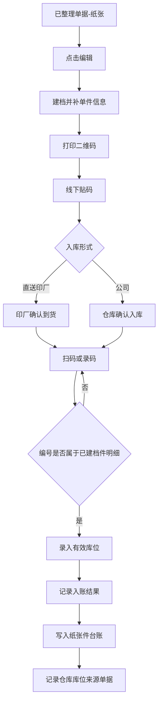
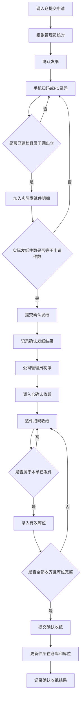

# ERP升级-生产管理V1.7.0（纸张管理扫码出入库）

## 1. 文档信息

| 项目     | 内容                                         |
| -------- | -------------------------------------------- |
| 文档名称 | ERP升级-生产管理V1.7.0（纸张管理扫码出入库） |
| 版本     | v1.1                                         |
| 作者     | ChatGPT                                      |
| 创建日期 | 2026-03-18                                   |
| 最后更新 | 2026-03-31                                   |
| 文档状态 | 修订中                                       |

---

## 2. 背景与目标

### 2.1 项目背景

当前 ERP 已支持随货同行单、提纸单、退纸单三类纸张业务流程，但仍主要管理到纸张品类/规格层级，缺少纸张件级管理、一物一码、扫码核对、库位记录和统一追踪能力。历史库存仍主要依赖线下贴码和 Excel 管理。

本次迭代在现有业务流程基础上，新增纸张件级管理、扫码出入库、库位记录、二维码生成打印和历史库存初始化能力。

本期主要用户包括公司仓管、调拨相关仓管、印厂退纸人员、公司纸张管理员及历史库存初始化人员。

### 2.2 本期目标

- 实现纸张件级管理，一件纸对应一个系统唯一编号。
- 在入库、发纸、退纸、收纸节点实现扫码核对和库位记录。
- 提供一物一码查询与轨迹追溯能力。
- 将历史库存初始化进系统，纳入后续统一管理。

### 2.3 本期范围

- 新增纸张件级档案能力，支持单据明细行与纸张件建立一对多关系。
- 随货同行单接入件级建档、扫码入库和库位落位能力。
- 提纸单接入件级发纸、件级收纸和库位落位能力。
- 退纸单接入件级退纸、件级收纸和库位落位能力。
- 提供纸张一物一码编码、二维码生成和打印能力。
- 复用现有仓库库位管理模块，在纸张件台账（即一物一码当前仓库、库位和来源等信息）中记录仓库与库位。
- 提供一物一码查询能力，查询对象为纸张件。
- 支持历史库存线下贴码、Excel 整理和后端初始化导入，本期不建设历史库存初始化前端页面。

### 2.4 产品原则

1. 不新增审批主线，按现有业务节点挂接实现。
2. 系统中所有纸张件级流转必须以唯一编号为核心，不允许同一编号对应多件纸。
3. 入库和收货结果必须记录明确仓库和库位。
4. 所有出入库核对环节以逐件扫码为主，手工输入二维码编号为扫码失败时的补充方式。
5. 提纸单、退纸单整单处理，不支持部分发货、部分收货、部分退货。
6. 纸张件侧以结果记录为主，用于查询与追溯。

### 2.5 需求优先级策略

- P0：件级基础模型、二维码独立能力、历史库存导入及提纸单相关能力。
- P1：退纸单相关能力。
- P2：随货同行单相关能力。
- 依赖关系：P1/P2 均依赖 P0 先完成件级编号、纸张件台账、结果记录字段、库位落账和二维码生成打印能力。

---

## 3. 功能概述

### 3.1 功能架构

ERP纸张管理扫码出入库迭代
├── 随货同行单
│   ├── 件级建档
│   ├── 二维码打印
│   ├── 扫码入库
│   └── 库位记录
├── 提纸单
│   ├── 扫码发纸
│   ├── 扫码收纸
│   └── 库位记录
├── 退纸单
│   ├── 扫码退纸
│   ├── 扫码收纸
│   └── 库位记录
├── 一物一码查询
│   ├── 编号查询
│   ├── 结果查看
│   └── 二维码打印
├── 历史库存初始化
│   ├── 线下贴码
│   ├── Excel整理
│   └── 后端导入
└── 通用规则
    ├── 一物一码编码
    └── 仓库库位

### 3.2 核心方案说明

#### 3.2.1 最小管理单元

- 卷筒纸：按“一卷”作为一件管理。
- 平板纸：按“一件”作为一件管理。
- 系统内统一抽象为“纸张件”。

#### 3.2.2 一物一码规则

- 编码格式：`年份 + 6位流水号`。
- 流水号按年份递增。
- 每个自然年从 `000001` 重新开始。
- 唯一编号在系统内全局唯一，同一年内不得重复。

#### 3.2.3 二维码标签规则

- 标签内容仅包含：二维码、唯一编号。
- 二维码识别结果与手工输入的唯一编号口径一致。
- 标签贴附时机：在入库前完成生成和打印，并贴于对应纸张实物。
- 同一件纸在不同入口打印时，均沿用原唯一编号。

#### 3.2.4 库位规则

- 库位模型为“仓库 + 库位”两级。
- 一件纸张在入库完成后必须落到明确库位。
- 调入收货、退纸收货等再次入库场景，均需重新确认库位。

#### 3.2.5 扫码规则

- 随货同行单在“编辑”环节完成件级建档和二维码打印；入库形式为“直送印厂”时，在“印厂确认到货”环节执行扫码或手工录码，入库形式为“公司”时，在“仓库确认入库”环节执行扫码或手工录码。扫码或录码的编号必须属于当前单据在“编辑”环节已建档的件明细编号。
- 提纸单在“确认发纸”节点执行扫码或手工录码，扫码或录码形成本次实际发纸件明细。
- 提纸单在“确认收纸”节点执行扫码或手工录码，扫码或录码的编号必须属于本单已发纸件明细。
- 退纸单在“确认退纸”节点执行扫码或手工录码，扫码或录码形成本次实际退纸件明细。
- 退纸单在“确认收纸”节点执行扫码或手工录码，扫码或录码的编号必须属于本单已退纸件明细。
- 扫码失败时支持手工输入唯一编号。
- 扫码或手工输入的唯一编号均需校验编号有效性。
- 不允许使用未建码纸张完成正式件级流转。

#### 3.2.6 异常处理规则

| 场景             | 处理规则                           | 预期结果                         |
| ---------------- | ---------------------------------- | -------------------------------- |
| 重复扫码同一码   | 同一作业单内再次扫描同一码必须拦截 | 提示重复扫码，不重复计数         |
| 扫到非本单据件   | 必须按当前单据件明细或业务范围校验 | 提示“非本单据件”，不得加入明细 |
| 手工录码不存在   | 校验唯一编号存在性                 | 提示编号不存在                   |
| 库位未填写即提交 | 入库/收纸类节点强校验              | 拦截提交                         |
| 作业提交失败     | 失败前写入不得视为最终结果         | 不得写入错误的正式结果记录       |

### 3.3 功能清单

#### 3.3.1 PC端功能清单

| 序号 | 编号   | 模块       | 功能名称       | 功能描述                                                                                                                                                                                                                       | 优先级 | 状态   |
| ---- | ------ | ---------- | -------------- | ------------------------------------------------------------------------------------------------------------------------------------------------------------------------------------------------------------------------------ | ------ | ------ |
| 1    | F001-0 | 随货同行单 | 件明细         | 随货同行单在PC端“编辑”“详情”“审核”“印厂确认到货”“仓库确认入库”页面按物料明细行展示件明细区；“编辑”页可按对应物料明细新增、编辑件明细、补充单件信息、打印二维码并提交审核，“详情”“审核”“印厂确认到货”“仓库确认入库”页面仅查看件明细 | P2     | 待开发 |
| 2    | F001-1 | 随货同行单 | 编辑单据       | 在“已整理单据(纸张)”列表点击“编辑”进入详情页，完成件级建档和单件信息维护                                                                                                                                                   | P2     | 待开发 |
| 3    | F001-2 | 随货同行单 | 调起二维码打印 | 在“编辑”页对已建档件明细调用打印能力完成二维码打印                                                                                                                                                                           | P2     | 待开发 |
| 4    | F001-3 | 随货同行单 | 列表批量打印   | 在“已整理单据(纸张)”列表支持按单张随货同行单内件明细批量打印，也支持勾选多张随货同行单合并批量打印，打印沿用原唯一编号                                                                                                       | P2     | 待开发 |
| 5    | F002-0 | 提纸单     | 件明细         | 提纸单件明细在“确认发纸”环节形成；PC端在“确认发纸”“初审”“确认收纸”“详情”页面按物料明细行展示件明细区，其中“确认发纸”环节可按对应物料明细新增、编辑件明细，“确认收纸”环节按已生成的件明细逐件核对，“初审”“详情”页面仅查看件明细。 | P0     | 待开发 |
| 6    | F002-1 | 提纸单     | 确认发纸       | 手机端扫码不可用时，PC端支持手工录入唯一编号；页面默认展示并维护实际出库件明细                                                                                                                                                 | P0     | 待开发 |
| 7    | F002-2 | 提纸单     | 确认收纸       | 手机端扫码不可用时，PC端支持按已生成的件明细手工录入唯一编号完成收纸核对；界面按单据级选择调入仓下默认库位并自动填充至件明细，支持逐件调整                                                                                   | P0     | 待开发 |
| 8    | F003-0 | 退纸单     | 件明细         | 退纸单件明细在“确认退纸”环节形成；PC端在“确认退纸”“确认收纸”“详情”页面按物料明细行展示件明细区，其中“确认退纸”环节可按对应物料明细新增、编辑件明细，“确认收纸”环节按已生成的件明细逐件核对，“详情”页面仅查看件明细。             | P1     | 待开发 |
| 9    | F003-1 | 退纸单     | 确认退纸       | 手机端扫码不可用时，PC端支持手工录入唯一编号；页面默认展示并维护实际退纸件明细                                                                                                                                                 | P1     | 待开发 |
| 10   | F003-2 | 退纸单     | 确认收纸       | 手机端扫码不可用时，PC端支持按已生成的件明细手工录入唯一编号完成收纸核对；界面按单据级选择公司收货仓下默认库位并自动填充至件明细，支持逐件调整                                                                               | P1     | 待开发 |
| 11   | F006-1 | 查询追溯   | 一物一码查询   | PC端提供独立查询页面，按唯一编号查询当前库存、库位、来源单据和轨迹                                                                                                                                                             | P0     | 待开发 |

#### 3.3.2 手机端功能清单

| 序号 | 编号   | 模块       | 功能名称 | 功能描述                                                                                                                                                                                                                                                                                                                                                                                                     | 优先级 | 状态   |
| ---- | ------ | ---------- | -------- | ------------------------------------------------------------------------------------------------------------------------------------------------------------------------------------------------------------------------------------------------------------------------------------------------------------------------------------------------------------------------------------------------------------ | ------ | ------ |
| 1    | F001-4 | 随货同行单 | 件明细   | 随货同行单手机端在“详情”“印厂确认到货”“仓库确认入库”详情页按物料明细行展示件明细区；“印厂确认到货”“仓库确认入库”环节按已生成的件明细逐件核对并确认结果，其他环节仅查看件明细 | P2     | 待开发 |
| 2    | F001-5 | 随货同行单 | 确认入库 | 入库形式为“直送印厂”时，在“印厂确认到货”节点逐件扫码或手工录码完成入库核对；入库形式为“公司”时，在“仓库确认入库”节点逐件扫码或手工录码完成入库核对                                                                                                                                                                                                                                                   | P2     | 待开发 |
| 3    | F001-6 | 随货同行单 | 选择库位 | 入库时界面支持按单据级选择当前入库仓下默认库位，并自动填充至本次确认的全部件明细；件明细支持单独调整库位。印厂视为仓库，直送印厂场景同样适用                                                                                                                                                | P2     | 待开发 |
| 4    | F002-3 | 提纸单     | 件明细   | 提纸单手机端在“确认发纸”“初审”“确认收纸”详情页按物料明细行展示件明细区；“确认发纸”环节可按对应物料明细新增、编辑件明细，“初审”环节查看件明细，“确认收纸”环节按已生成的件明细逐件核对并确认收纸结果                                                                                                                                                                                                                                             | P0     | 待开发 |
| 5    | F002-4 | 提纸单     | 确认发纸 | 确认发纸节点按物料明细行逐件扫码或手工录码，生成并维护本单件明细，完成发纸确认                                                                                                                                                                                                                                                                                                                               | P0     | 待开发 |
| 6    | F002-5 | 提纸单     | 确认收纸 | 确认收纸节点按已生成的件明细逐件扫码或手工录码完成收货核对；界面按单据级选择默认库位并自动填充至件明细，支持逐件调整，提交时按各件最终库位结果落账                                                                                                                                                                                                   | P0     | 待开发 |
| 7    | F002-6 | 提纸单     | 选择库位 | 收纸时界面支持按单据级选择调入仓下默认库位，并自动填充至本次确认的全部件明细；件明细支持单独调整库位                                                                                                                                                                                                                                                     | P0     | 待开发 |
| 8    | F003-3 | 退纸单     | 件明细   | 退纸单手机端在“确认退纸”“确认收纸”详情页按物料明细行展示件明细区；“确认退纸”环节可按对应物料明细新增、编辑件明细，“确认收纸”环节按已生成的件明细逐件核对并确认收纸结果                                                                                                                                                                                                                                             | P1     | 待开发 |
| 9    | F003-4 | 退纸单     | 确认退纸 | 印厂人员确认退纸节点按物料明细行逐件扫码或手工录码，生成并维护本单件明细，完成退纸确认                                                                                                                                                                                                                                                                                                                       | P1     | 待开发 |
| 10   | F003-5 | 退纸单     | 确认收纸 | 公司仓管确认收纸节点按已生成的件明细逐件扫码或手工录码完成收货核对；界面按单据级选择默认库位并自动填充至件明细，支持逐件调整，提交时按各件最终库位结果落账                                                                                                                                                                                           | P1     | 待开发 |
| 11   | F003-6 | 退纸单     | 选择库位 | 收纸时界面支持按单据级选择公司收货仓下默认库位，并自动填充至本次确认的全部件明细；件明细支持单独调整库位                                                                                                                                                                                                                                                 | P1     | 待开发 |

#### 3.3.3 通用系统能力

| 序号 | 编号   | 模块     | 功能名称   | 功能描述                                                     | 优先级 | 状态   |
| ---- | ------ | -------- | ---------- | ------------------------------------------------------------ | ------ | ------ |
| 1    | F005-1 | 基础能力 | 库位接入   | 单据节点调用现有仓库库位管理模块并返回当前仓库下可选有效库位 | P0     | 待开发 |
| 2    | F005-2 | 基础能力 | 库位校验   | 仅允许选择当前仓库下有效状态的库位                           | P0     | 待开发 |
| 3    | F007-3 | 初始化   | 初始化导入 | 后端按模板导入历史库存，纳入统一件级管理                     | P0     | 待开发 |

### 3.4 关键业务流程图

#### 3.4.1 随货同行单流程图



#### 3.4.2 提纸单流程图



---

## 4. 功能详情

本章按 PC端、手机端、通用系统能力和线下实施展开；前 3 类章节顺序与 3.3 功能清单保持一致。线下实施用于说明上线配套动作，不纳入 3.3 功能清单。

手机端定位为现场作业端，PC端定位为管理操作端；具体节点能力、页面行为和字段要求以本章为准。

### 4.1 PC端功能详情

#### 4.1.1 件明细（随货同行单-PC）

**对应功能清单**：F001-0

**业务规则**

1. 随货同行单件明细按物料明细行展示，不允许将不同物料的件明细混在同一列表中维护。
2. “编辑”“详情”“审核”“印厂确认到货”“仓库确认入库”页面均展示件明细区。
3. “编辑”页展示可维护的件明细区；“详情”“审核”“印厂确认到货”“仓库确认入库”页面仅查看件明细。
4. PC端不同物料的件明细采用同页按物料分组折叠展示。
5. 单物料场景默认展开该物料件明细；多物料场景默认展开首个物料分组，其余分组收起，用户点击分组标题切换查看。

**界面要素**

| 元素 | 类型 | 说明 |
| ---- | ---- | ---- |
| 物料件明细折叠组 | CollapseItem | 位于现有随货同行单详情页“纸张信息”区域内，紧跟物料汇总表之后展示；每条物料明细对应一个折叠组，标题展示物料名称和件数，点击后展开或收起当前物料件明细。 |
| 件明细表格 | Table | 位于对应物料件明细折叠组内；用于展示该物料下的全部件明细。统一展示唯一编号、入库数量、吨数、出厂编码、照片、当前库位等字段。 |

**验收标准**

1. 同一张随货同行单存在多个物料明细行时，页面按物料行顺序展示多个件明细折叠分组，无需切换页签。
2. 单物料时件明细默认展开；多物料时默认仅首个物料分组展开，其余分组收起。
3. 进入“详情”“审核”“印厂确认到货”“仓库确认入库”页面时，件明细仍可查看，但不显示编辑类按钮。

**异常处理**

| 异常场景 | 处理方式 | 提示文案 |
| -------- | -------- | -------- |
| 当前页面不允许编辑件明细 | Toast提示 | 当前页面仅支持查看件明细 |
| 物料明细下无件明细 | 页面提示 | 当前物料下暂无件明细 |
| 尝试跨物料维护件明细 | Toast提示 | 件明细需挂接到对应物料明细行 |

#### 4.1.2 编辑单据

**对应功能清单**：F001-1

**功能说明**

PC端“编辑单据”用于为随货同行单预先建立件级档案，为后续打印二维码、移动端入库扫码和追溯查询提供基础数据。

**业务规则**

1. 用户从“已整理单据(纸张)”列表点击“编辑”进入单据详情页。
2. 编辑对象为件明细，不是直接修改原料明细行结构；原料明细行与件明细之间为一对多关系。
3. “新增件明细”仅支持按当前物料明细逐行新增，不支持按件数批量生成空白行。
4. 新增空白件明细后默认带出所属单据号、所属物料明细、物料名称/规格等上游只读信息；入库数量、吨数、出厂编码、照片为空待录，唯一编号由系统生成并在生成二维码后回填。
5. 每条件明细至少包含唯一编号、入库数量、吨数、出厂编码、照片等字段，其中唯一编号由系统生成，其余字段由用户维护。
6. 吨数字段在卷筒纸场景用于识别和核对；入库数量用于记录单件纸张的业务数量。
7. 编辑页件明细仍按物料分组展示；单物料默认展开，多物料默认展开首个分组，其余分组收起。
8. 件明细表格中仅入库数量、吨数、出厂编码、照片可编辑；唯一编号、当前库位、入库结果字段在编辑页只读。
9. 页面底部“提交”按钮执行“保存并提交审核”，本期不单独提供“仅保存草稿”按钮。
10. 仅已完成件级建档的件明细可参与二维码打印、移动端确认入库和后续一物一码查询。

**界面要素**

| 元素 | 类型 | 说明 |
| ---- | ---- | ---- |
| 编辑入口 | Button | 位于“已整理单据(纸张)”列表行操作区；点击后进入当前随货同行单详情编辑页。 |
| 物料件明细分组区 | Collapse | 位于详情页“纸张信息”区域内，紧跟物料汇总表之后展示；每条物料明细对应一个折叠分组，编辑页在该分组内维护件明细。 |
| 件明细表格 | Table | 位于每个物料件明细分组内；所属物料、物料名称/规格为只读带出字段；入库数量、吨数、出厂编码、照片在当前页面可编辑，唯一编号、当前库位和入库结果字段只读。 |
| 新增件明细按钮 | Button | 位于对应物料件明细分组标题右侧；每点击一次仅在当前物料明细下新增一条空白件明细，不支持批量新增、不支持跨物料新增。 |
| 提交按钮 | Button | 位于详情页底部；按钮文案为“提交审核”。当全部物料的件明细必填字段完整且件明细数量与单据件数一致时可点击；点击后先保存当前编辑内容，再推进到现有审核节点。 |

**验收标准**

1. 用户可在任一物料明细行下新增多条件明细。
2. 保存后再次进入编辑页，已录入件明细可完整回显，且仍挂接在原物料明细下。
3. 未建立件明细的物料行不得参与二维码打印。
4. 点击“提交审核”后，系统保存当前编辑结果并提交审核，不保留未提交的独立草稿状态。
5. 提交审核后，件明细可在“详情”“审核”“印厂确认到货”“仓库确认入库”等页面查看。

**异常处理**

| 异常场景 | 处理方式 | 提示文案 |
| -------- | -------- | -------- |
| 必填件级字段为空 | 输入框标红+Toast提示 | 请完善件明细必填信息后再提交 |
| 件明细数量与单据件数不一致 | Toast提示 | 件明细数量与单据件数不一致 |
| 保存失败 | Toast提示 | 保存失败，请稍后重试 |

#### 4.1.3 打印二维码

**对应功能清单**：F001-2

**功能说明**

PC端在随货同行单编辑页提供二维码生成与打印能力，用于为新建档纸张生成唯一编号，或对已存在唯一编号的件明细补打标签。

**业务规则**

1. 支持按数量生成新码，并将新生成的唯一编号分配给待建档件明细。
2. 对已存在唯一编号的件明细支持按原唯一编号重复打印，不生成新编号。
3. 打印范围可按当前单据、当前物料明细或选中件明细执行。
4. 标签内容仅包含二维码图形和唯一编号文本，二维码内容为唯一编号本身。
5. 重复打印不得改变任何已记录的业务结果和件台账数据。

**界面要素**

| 元素 | 类型 | 说明 |
| ---- | ---- | ---- |
| 打印方式单选 | Radio | 支持选择“按数量生成新码”或“按原唯一编号打印”；切换后立即刷新界面联动项和打印预览。 |
| 生成数量输入框 | Input | 仅在“按数量生成新码”场景展示并必填；切换到“按原唯一编号打印”后立即隐藏，且其输入值不再参与本次打印计算。 |
| 打印范围选择器 | Select | 支持按当前单据、当前物料明细或勾选件明细确定打印范围；切换范围后同步刷新打印预览列表。选择“当前单据”时预览当前单据下全部满足条件的件；选择“当前物料明细”时仅预览当前物料下件；选择“勾选件明细”时仅预览当前勾选件。 |
| 打印预览列表 | Table | 展示待打印唯一编号、所属物料、打印份数；“按数量生成新码”时展示待分配的新编号队列，“按原唯一编号打印”时仅展示已有唯一编号的件明细。 |

**验收标准**

1. 选择“按数量生成新码”时，系统可生成对应数量的唯一编号并进入打印队列。
2. 切换到“按原唯一编号打印”时，生成数量输入框隐藏，预览列表仅保留已有唯一编号的件明细。
3. 选择“按原唯一编号打印”时，打印结果使用原唯一编号，不新增编号。
4. 已建档件明细可重复打印多次，查询结果中的唯一编号不变化。
5. 打印完成后，件明细仍保持原有业务状态和结果记录。

**异常处理**

| 异常场景 | 处理方式 | 提示文案 |
| -------- | -------- | -------- |
| 生成数量为空或非正整数 | Toast提示 | 请输入正确的生成数量 |
| 选中件明细未建档 | Toast提示 | 存在未完成建档的件明细，无法打印 |
| 打印服务异常 | Toast提示 | 打印失败，请检查打印设备后重试 |

#### 4.1.4 列表批量打印

**对应功能清单**：F001-3

**功能说明**

PC端列表页支持对单张或多张随货同行单下的已建档件明细执行批量打印，用于提升集中补码和集中打印效率。

**业务规则**

1. 列表页提供批量打印入口，支持单选或多选随货同行单。
2. 单选时打印当前单据下全部已建档件明细；多选时合并所选单据下全部已建档件明细统一打印。
3. 未建档或未生成唯一编号的件明细不进入打印范围。
4. 批量打印沿用原唯一编号，不生成新编号。

**界面要素**

| 元素 | 类型 | 说明 |
| ---- | ---- | ---- |
| 单据勾选框 | Checkbox | 位于列表每行左侧，支持单张或多张随货同行单选择；未勾选时不进入打印范围。 |
| 批量打印按钮 | Button | 位于列表顶部；默认置灰。至少勾选一张单据后才进入可操作态；若所选单据均无可打印件明细，则保持可点击并在点击后提示原因，不进入打印预览。 |
| 打印结果预览 | Dialog | 点击批量打印后展示本次进入打印范围的件明细数量、编号区间和排除项。 |

**验收标准**

1. 勾选单张单据时，仅打印该单据下已建档件明细。
2. 勾选多张单据时，可合并打印所有已建档件明细。
3. 未建档件明细不会被带入打印预览。

**异常处理**

| 异常场景 | 处理方式 | 提示文案 |
| -------- | -------- | -------- |
| 未勾选任何单据 | Toast提示 | 请先选择需要打印的单据 |
| 选中单据下无可打印件明细 | Toast提示 | 所选单据暂无可打印件明细 |

#### 4.1.5 件明细（提纸单-PC）

**对应功能清单**：F002-0

**业务规则**

1. 提纸单件明细在“确认发纸”环节形成。
2. “确认发纸”“初审”“确认收纸”“详情”页面均展示件明细区。
3. “确认发纸”环节可按对应物料明细新增、编辑件明细；可编辑字段为唯一编号、调拨数量等发纸所需字段。
4. “确认收纸”环节只允许按已生成件明细逐件核对；件行不得新增、删除，仅允许维护核对结果和最终库位。
5. “初审”“详情”页面仅查看件明细，全部字段只读。

**界面要素**

| 元素 | 类型 | 说明 |
| ---- | ---- | ---- |
| 物料明细卡片 | Card | 位于提纸单现有详情页各物料明细行下方，紧跟对应物料行展示；每条物料明细单独展示其下件明细，不跨物料合并。 |
| 件明细表格 | Table | 位于对应物料明细卡片内，展示唯一编号、调拨数量、当前仓库、当前库位、核对状态、最终库位等字段；“确认发纸”页仅唯一编号、调拨数量可编辑，“确认收纸”页仅核对状态、最终库位可编辑，“初审”“详情”页全部只读。 |
| 汇总提示区 | Text | 位于件明细表格上方或下方，展示当前物料行应发件数、已生成件数、待收件数等只读汇总信息。 |

**验收标准**

1. 提纸单在“确认发纸”之前不得出现可编辑件明细。
2. 进入“确认发纸”页面后，可按物料明细行新增、编辑件明细。
3. 进入“确认收纸”页面后，只能核对已生成件明细。
4. 进入“初审”“详情”页面时，件明细只读展示。

**异常处理**

| 异常场景 | 处理方式 | 提示文案 |
| -------- | -------- | -------- |
| 当前页面不允许编辑件明细 | Toast提示 | 当前页面仅支持查看件明细 |
| 物料明细下无件明细 | 页面提示 | 当前物料下暂无件明细 |
| 尝试在收纸环节新增件明细 | Toast提示 | 确认收纸环节仅支持核对已生成件明细 |

#### 4.1.6 确认发纸

**对应功能清单**：F002-1

**功能说明**

当手机端扫码不可用时，PC端提供提纸单确认发纸的兜底处理能力，支持按已贴码件进行手工录码和发纸确认。

**业务规则**

1. 录入的纸张件必须已完成贴码和件级建档，且当前在库并属于当前单据调出仓。
2. 手工录码输入后立即执行编号存在性、所属调出仓、是否已被本单录入三项校验；校验通过后自动追加到本次发纸列表。
3. 重复录入同一唯一编号时拦截并提示，不重复追加件明细，也不重复累计件数和调拨数量。
4. 页面展示并维护本次实际出库件明细，并自动汇总调拨数量。
5. 实际出库件数与提纸单件数一致、且列表内无校验失败件时，才允许提交确认发纸。
6. 提交成功后写入发纸结果、结果单据编号和操作日志；失败或取消不得形成正式结果。

**界面要素**

| 元素 | 类型 | 说明 |
| ---- | ---- | ---- |
| 手工录码输入框 | Input | 位于页面顶部；录入唯一编号并确认后立即校验编号是否存在、是否属于当前调出仓、是否重复录入。校验成功自动清空输入框并追加到列表；校验失败保留当前输入值并提示。 |
| 件明细列表 | Table | 位于录码区下方，实时展示本次已录入的件明细、所属物料、当前仓库和调拨数量；仅展示本次确认发纸的件，重复录码不新增重复行。 |
| 汇总信息区 | Text | 位于件明细列表上方或下方，实时展示应发件数、已录入件数和调拨数量汇总。 |
| 提交发纸按钮 | Button | 位于页面底部；默认禁用。仅当已录入件数与应发件数一致、列表无重复或校验失败记录时可点击；件数不足、超出或存在异常件时保持禁用，若通过异常路径触发点击则提示原因。 |

**验收标准**

1. 手机端不可用时，用户可在PC端逐件录入唯一编号完成发纸确认。
2. 不属于当前调出仓的纸张件无法纳入发纸列表。
3. 已录入件数与应发件数一致时才允许提交。
4. 提交成功后，单据进入后续节点，件台账记录发纸结果。

**异常处理**

| 异常场景 | 处理方式 | 提示文案 |
| -------- | -------- | -------- |
| 唯一编号不存在 | Toast提示 | 未找到对应纸张件 |
| 纸张件不在当前调出仓 | Toast提示 | 当前纸张不属于本次调出仓 |
| 重复录入同一唯一编号 | Toast提示 | 当前纸张已录入，请勿重复操作 |
| 已录入件数不足或超出 | Toast提示 | 实际发纸件数与单据件数不一致 |

#### 4.1.7 确认收纸

**对应功能清单**：F002-2

**功能说明**

当手机端扫码不可用时，PC端提供提纸单确认收纸的兜底处理能力，支持按已发纸件明细完成手工核对，并维护默认库位和件级最终库位。

**业务规则**

1. 仅允许录入当前提纸单已发纸的件明细，不允许新增未发纸的件。
2. 页面展示本次待收件明细，并支持按单据级选择调入仓下默认库位；选择后立即回填至当前未手动调整过的待收件明细。
3. 件明细保留最终库位字段，允许对个别件单独调整库位；被手动调整过的件标记为“件级已改单独库位”，后续再次切换默认库位时不再被覆盖。
4. 用户如需让某件重新跟随默认库位，需先将该件最终库位恢复为空或使用与默认库位一致的值。
5. 全部待收件核对完成且各件最终库位填写完整后，才允许提交确认收纸。
6. 提交成功后更新件所在仓库和库位，并记录确认收纸结果、结果单据编号和操作日志。

**界面要素**

| 元素 | 类型 | 说明 |
| ---- | ---- | ---- |
| 手工录码输入框 | Input | 位于页面顶部；录入唯一编号并确认后校验是否属于当前提纸单已发纸件，校验通过后加入待收确认列表。 |
| 默认库位选择器 | Select | 位于件明细列表上方；仅加载调入仓下有效库位。选择后立即批量回填当前未手动调整的件；已手动调整的件保持原值不覆盖。 |
| 件明细列表 | Table | 位于默认库位选择器下方；展示待收件的核对结果和最终库位。各行“最终库位”支持逐件修改，修改后该行转为“件级已改单独库位”，以该件最终值为准。 |
| 提交收纸按钮 | Button | 位于页面底部；默认禁用。仅当全部待收件核对完成且所有件最终库位已填写时可点击；存在空库位、未核对件时保持禁用，异常触发点击时提示原因。 |

**验收标准**

1. 用户选择默认库位后，系统立即回填当前未手动调整的待收件明细。
2. 个别件可在列表中改成不同库位，提交后按各件最终库位落账。
3. 已手动修改过最终库位的件，在再次切换默认库位时不被覆盖。
4. 未收齐或存在空库位件明细时，提交按钮不可用。
5. 提交成功后，件台账当前位置更新为调入仓及最终库位。

**异常处理**

| 异常场景 | 处理方式 | 提示文案 |
| -------- | -------- | -------- |
| 录入了非本单已发纸件 | Toast提示 | 当前纸张不在本单待收范围内 |
| 未选择默认库位且存在空库位 | Toast提示 | 请完善全部件明细库位后再提交 |
| 待收件未全部核对完成 | Toast提示 | 仍有待收件未完成核对 |

#### 4.1.8 件明细（退纸单-PC）

**对应功能清单**：F003-0

**业务规则**

1. 退纸单件明细在“确认退纸”环节形成。
2. “确认退纸”“确认收纸”“详情”页面均展示件明细区。
3. “确认退纸”环节可按对应物料明细新增、编辑件明细；可编辑字段为唯一编号、调拨数量等退纸所需字段。
4. “确认收纸”环节只允许按已生成件明细逐件核对；件行不得新增、删除，仅允许维护核对结果和最终库位。
5. “详情”页面仅查看件明细，全部字段只读。

**界面要素**

| 元素 | 类型 | 说明 |
| ---- | ---- | ---- |
| 物料明细卡片 | Card | 位于退纸单现有详情页各物料明细行下方，紧跟对应物料行展示；每条物料明细单独展示其下件明细，不跨物料合并。 |
| 件明细表格 | Table | 位于对应物料明细卡片内，展示唯一编号、调拨数量、当前仓库、当前库位、核对状态、最终库位等字段；“确认退纸”页仅唯一编号、调拨数量可编辑，“确认收纸”页仅核对状态、最终库位可编辑，“详情”页全部只读。 |
| 汇总提示区 | Text | 位于件明细表格上方或下方，展示当前物料行应退件数、已生成件数、待收件数等只读汇总信息。 |

**验收标准**

1. 退纸单在“确认退纸”之前不得出现可编辑件明细。
2. 进入“确认退纸”页面后，可按物料明细行新增、编辑件明细。
3. 进入“确认收纸”页面后，只能核对已生成件明细。
4. 进入“详情”页面时，件明细只读展示。

**异常处理**

| 异常场景 | 处理方式 | 提示文案 |
| -------- | -------- | -------- |
| 当前页面不允许编辑件明细 | Toast提示 | 当前页面仅支持查看件明细 |
| 物料明细下无件明细 | 页面提示 | 当前物料下暂无件明细 |
| 尝试在收纸环节新增件明细 | Toast提示 | 确认收纸环节仅支持核对已生成件明细 |

#### 4.1.9 确认退纸

**对应功能清单**：F003-1

**功能说明**

当手机端扫码不可用时，PC端提供退纸单确认退纸的兜底处理能力，支持手工录码生成本次实际退纸件明细并完成退纸确认。

**业务规则**

1. 录入的纸张件必须已完成贴码和件级建档，且当前允许退纸。
2. 页面展示并维护本次实际退纸件明细，并自动汇总调拨数量。
3. 实际退纸件数与退纸单件数一致时，才允许提交确认退纸。
4. 提交成功后写入退纸结果、结果单据编号和操作日志；失败或取消不得形成正式结果。

**界面要素**

| 元素 | 类型 | 说明 |
| ---- | ---- | ---- |
| 手工录码输入框 | Input | 位于页面顶部；录入唯一编号并确认后立即校验编号是否存在、是否允许退纸、是否重复录入，校验通过后加入本次退纸列表。 |
| 件明细列表 | Table | 位于录码区下方，实时展示本次已录入的退纸件明细、所属物料、当前仓库和调拨数量。 |
| 汇总信息区 | Text | 位于件明细列表上方或下方，实时展示应退件数、已录入件数和调拨数量汇总。 |
| 提交退纸按钮 | Button | 位于页面底部；当已录入件数与应退件数一致时可点击，否则禁用或点击后提示。 |

**验收标准**

1. 用户可在PC端逐件录入唯一编号完成退纸确认。
2. 不满足退纸条件的纸张件无法加入退纸列表。
3. 已录入件数与应退件数一致时才允许提交。
4. 提交成功后，单据进入后续收纸节点，件台账记录退纸结果。

**异常处理**

| 异常场景 | 处理方式 | 提示文案 |
| -------- | -------- | -------- |
| 唯一编号不存在 | Toast提示 | 未找到对应纸张件 |
| 当前纸张不允许退纸 | Toast提示 | 当前纸张不满足退纸条件 |
| 实际退纸件数与单据件数不一致 | Toast提示 | 实际退纸件数与单据件数不一致 |

#### 4.1.10 确认收纸（退纸单）

**对应功能清单**：F003-2

**功能说明**

当手机端扫码不可用时，PC端提供退纸单确认收纸的兜底处理能力，支持按已退纸件明细完成手工核对，并维护默认库位和件级最终库位。

**业务规则**

1. 仅允许录入当前退纸单已退纸的件明细，不允许新增非本单件。
2. 页面展示本次待收件明细，并支持按单据级选择公司收货仓下默认库位；选择后立即回填至当前未手动调整过的待收件明细。
3. 件明细保留最终库位字段，允许对个别件单独调整库位；被手动调整过的件标记为“件级已改单独库位”，后续再次切换默认库位时不再被覆盖。
4. 用户如需让某件重新跟随默认库位，需先将该件最终库位恢复为空或使用与默认库位一致的值。
5. 全部待收件核对完成且各件最终库位填写完整后，才允许提交确认收纸。
6. 提交成功后更新件所在仓库和库位，并记录确认收纸结果、结果单据编号和操作日志。

**界面要素**

| 元素 | 类型 | 说明 |
| ---- | ---- | ---- |
| 手工录码输入框 | Input | 位于页面顶部；录入唯一编号并确认后校验是否属于当前退纸单已退纸件，校验通过后加入待收确认列表。 |
| 默认库位选择器 | Select | 位于件明细列表上方；仅加载公司收货仓下有效库位。选择后立即批量回填当前未手动调整的件；已手动调整的件保持原值不覆盖。 |
| 件明细列表 | Table | 位于默认库位选择器下方；展示待收件的核对结果和最终库位。各行“最终库位”支持逐件修改，修改后该行转为“件级已改单独库位”，以该件最终值为准。 |
| 提交收纸按钮 | Button | 位于页面底部；默认禁用。仅当全部待收件核对完成且所有件最终库位已填写时可点击；存在空库位、未核对件时保持禁用，异常触发点击时提示原因。 |

**验收标准**

1. 用户可先选默认库位，再逐件调整特殊件的最终库位。
2. 已手动修改过最终库位的件，在再次切换默认库位时不被覆盖。
3. 非本单已退纸件无法完成收纸核对。
4. 未收齐或存在空库位件明细时不可提交。
5. 提交成功后，件台账当前位置更新为公司收货仓及最终库位。

**异常处理**

| 异常场景 | 处理方式 | 提示文案 |
| -------- | -------- | -------- |
| 录入了非本单已退纸件 | Toast提示 | 当前纸张不在本单待收范围内 |
| 存在空库位件明细 | Toast提示 | 请完善全部件明细库位后再提交 |
| 待收件未全部核对完成 | Toast提示 | 仍有待收件未完成核对 |

#### 4.1.11 一物一码查询

**对应功能清单**：F006-1

**线框图**

```text
┌──────────────────────────────────────────────────────────────┐
│ 一物一码查询                                                 │
├──────────────────────────────────────────────────────────────┤
│ 唯一编号： [请输入唯一编号] [查询]                           │
│ 当前结果： 当前仓库 / 当前库位 / 最近结果节点 / 最近时间      │
│ 来源信息： 来源单据类型 / 来源单据编号                        │
│ 流转轨迹： 节点 / 时间 / 操作人 / 结果                        │
│                                      [打印二维码]            │
└──────────────────────────────────────────────────────────────┘
```

**功能说明**

PC端提供纸张件维度的一物一码查询页面，用于按唯一编号定位当前结果、来源单据和件级流转轨迹。

**业务规则**

1. 查询对象为纸张件，不是单据。
2. 支持按唯一编号精确查询。
3. 查询结果需展示当前仓库、当前库位、来源单据、最近一次结果信息。
4. 首期轨迹能力以实际完成写入的件级流转记录为准，不默认补齐所有历史环节。
5. 查询结果页支持按原唯一编号打印二维码，重新打印不生成新编号。

**界面要素**

| 元素 | 类型 | 说明 |
| ---- | ---- | ---- |
| 唯一编号查询框 | SearchBar | 支持按唯一编号精确查询。 |
| 当前结果卡片 | Card | 展示当前仓库、当前库位、最近结果节点、最近结果时间。 |
| 来源信息卡片 | Card | 展示来源单据类型和来源单据编号。 |
| 流转轨迹列表 | Table | 展示节点、时间、操作人、结果等轨迹信息。 |
| 打印二维码按钮 | Button | 对查询到的纸张件按原唯一编号重新打印二维码。 |

**验收标准**

1. 输入存在的唯一编号时，可查询到单件当前位置和来源信息。
2. 输入不存在的唯一编号时，页面返回空结果并提示。
3. 查询结果中的二维码打印沿用原唯一编号，不生成新码。
4. 轨迹列表至少展示系统已写入的件级流转记录。

**异常处理**

| 异常场景 | 处理方式 | 提示文案 |
| -------- | -------- | -------- |
| 唯一编号不存在 | 页面提示 | 未查询到对应纸张件 |
| 查询服务异常 | Toast提示 | 查询失败，请稍后重试 |

### 4.2 手机端功能详情

#### 4.2.1 件明细（随货同行单-手机）

**对应功能清单**：F001-4

**功能说明**

**业务规则**

1. 随货同行单手机端在“详情”“印厂确认到货”“仓库确认入库”页面按物料明细行展示件明细。
2. “印厂确认到货”“仓库确认入库”环节可按已生成件明细逐件核对并确认结果。
3. “详情”页面仅查看件明细。

**界面要素**

| 元素 | 类型 | 说明 |
| ---- | ---- | ---- |
| 物料分组区 | Collapse | 位于现有随货同行单详情页各物料明细行下方；按物料明细逐组展示件明细，不跨物料合并。 |
| 件明细列表 | List | 位于对应物料分组内，展示唯一编号、入库数量、当前仓库、当前库位、入库结果等字段；“详情”页全部字段只读，“印厂确认到货”“仓库确认入库”页仅核对结果和最终库位可变更，其他字段只读。 |
| 扫码按钮 | Button | 仅在“印厂确认到货”“仓库确认入库”页面展示；点击后调起扫码能力录入或核对当前件。 |
| 手工录码按钮 | Button | 仅在“印厂确认到货”“仓库确认入库”页面展示；扫码失败时切换为手工录码。 |

**验收标准**

1. 同一张随货同行单存在多个物料时，手机端可分物料查看其下件明细。
2. “印厂确认到货”“仓库确认入库”页面可逐件核对件明细。
3. “详情”页面仅展示件明细，不展示作业按钮。

**异常处理**

| 异常场景 | 处理方式 | 提示文案 |
| -------- | -------- | -------- |
| 当前页面不允许作业 | Toast提示 | 当前页面仅支持查看件明细 |
| 物料下暂无件明细 | 页面提示 | 当前物料下暂无件明细 |

#### 4.2.2 确认入库

**对应功能清单**：F001-5

**功能说明**

手机端用于在随货同行单的“印厂确认到货”或“仓库确认入库”节点，对实际入库的纸张件逐件扫码或录码完成正式入账。

**业务规则**

1. 入库形式为“直送印厂”时，在“印厂确认到货”节点执行确认入库；入库形式为“公司”时，在“仓库确认入库”节点执行确认入库。
2. 单据详情页默认展示件明细区，扫码后展示当前识别件的基础信息、仓库、库位等信息。
3. 扫码失败时支持手工录码。
4. 件级正式入账在上述两个节点完成。
5. 仅允许录入属于当前单据、且已在编辑环节建档的件明细；同一件不得重复录入。
6. 提交成功后记录入库结果、操作日志，并写入当前仓库、当前库位和来源单据。

**界面要素**

| 元素 | 类型 | 说明 |
| ---- | ---- | ---- |
| 扫码按钮 | Button | 仅在“印厂确认到货”或“仓库确认入库”节点展示；其他节点隐藏。点击后调起摄像头扫描二维码，识别成功后追加到已识别件列表；当应入件数已满或单据已提交时禁用。 |
| 手工录码按钮 | Button | 与扫码按钮同区域展示，仅在“印厂确认到货”或“仓库确认入库”节点显示；扫码失败时切换为手工录码模式，录入成功后同样追加到已识别件列表；当应入件数已满或单据已提交时禁用。 |
| 已识别件列表 | List | 位于扫码区下方，实时展示当前已录入的件明细、所属物料、入库数量和库位信息。 |
| 提交按钮 | Button | 仅在“印厂确认到货”或“仓库确认入库”节点显示，其他节点隐藏；当件数校验通过且件明细库位完整时可提交，否则禁用或点击后提示。 |

**验收标准**

1. 用户可通过扫码或手工录码录入实际入库件。
2. 仅当前单据已建档件明细允许完成入库。
3. 重复录入同一唯一编号时系统拦截。
4. 提交成功后，件台账产生入账结果并写入当前位置。

**异常处理**

| 异常场景 | 处理方式 | 提示文案 |
| -------- | -------- | -------- |
| 编号不属于当前单据 | Toast提示 | 当前纸张不属于本单据 |
| 编号重复录入 | Toast提示 | 当前纸张已录入，请勿重复操作 |
| 入库提交失败 | Toast提示 | 入库失败，请稍后重试 |

#### 4.2.3 选择库位（入库）

**对应功能清单**：F001-6

**功能说明**

手机端在随货同行单入库节点支持先按单据级选择默认库位，再逐件调整最终库位，实现整单操作效率与件级落账精度兼顾。

**业务规则**

1. 用户可按单据级选择当前入库仓下默认库位。
2. 所选默认库位在选择后立即自动填充至本次确认的全部未手动调整件明细。
3. 件明细保留库位字段，允许对个别件单独调整最终库位；已手动调整的件不再被后续默认库位切换覆盖。
4. 件级库位选择器仅在件明细已进入待提交列表后显示，无件数据时不展示。
5. 默认库位及调整后的库位必须均来自当前入库仓下的有效库位。
6. 存在空库位件明细时不得提交入库。

**界面要素**

| 元素 | 类型 | 说明 |
| ---- | ---- | ---- |
| 默认库位选择器 | Select | 位于确认入库页面件明细区上方；仅加载当前入库仓下有效库位，选择后立即回填至全部未手动调整件明细。 |
| 件级库位选择器 | Select | 位于各件明细行内；仅在该件已进入待提交列表时显示。默认库位回填后可对特殊件单独调整最终库位，已调整件后续不再被默认库位覆盖。 |
| 提交按钮 | Button | 位于确认入库页面底部；仅在当前节点显示。存在空库位件明细、未完成件数校验时禁用或点击后提示。 |

**验收标准**

1. 选择默认库位后，当前全部未手动调整件明细自动回填该库位。
2. 修改单条件明细库位后，不影响其他件已回填结果，且该件不再被后续默认库位覆盖。
3. 存在空库位件明细时不可提交。

**异常处理**

| 异常场景 | 处理方式 | 提示文案 |
| -------- | -------- | -------- |
| 未选择有效库位 | Toast提示 | 请选择有效库位 |
| 存在空库位件明细 | Toast提示 | 请完善全部件明细库位后再提交 |

#### 4.2.4 件明细（提纸单-手机）

**对应功能清单**：F002-3

**业务规则**

1. 提纸单手机端在“确认发纸”“初审”“确认收纸”详情页按物料明细行展示件明细区。
2. “确认发纸”环节可按对应物料明细新增、维护件明细，件明细主要通过扫码或手工录码生成。
3. “初审”环节查看件明细。
4. “确认收纸”环节按已生成的件明细逐件核对并确认收纸结果。

**界面要素**

| 元素 | 类型 | 说明 |
| ---- | ---- | ---- |
| 物料分组区 | Collapse | 位于提纸单详情页各物料明细行下方；按物料明细逐组展示件明细，不跨物料合并。 |
| 件明细列表 | List | 位于对应物料分组内，展示唯一编号、调拨数量、当前仓库、当前库位、核对状态、最终库位等字段；“确认发纸”页仅通过扫码/录码新增或移除件，不直接编辑字段；“初审”页全部只读；“确认收纸”页仅核对状态、最终库位可变更，其他字段只读。 |
| 扫码按钮 | Button | 在“确认发纸”页用于新增件明细，在“确认收纸”页用于核对已生成件明细，“初审”页不展示。 |
| 手工录码按钮 | Button | 与扫码按钮同区域展示；仅在“确认发纸”或“确认收纸”页显示。 |

**验收标准**

1. 进入“确认发纸”页面后，可按物料明细行新增、维护件明细。
2. 进入“初审”页面时，件明细只读展示。
3. 进入“确认收纸”页面后，只能核对已生成件明细。

**异常处理**

| 异常场景 | 处理方式 | 提示文案 |
| -------- | -------- | -------- |
| 当前页面不允许编辑件明细 | Toast提示 | 当前页面仅支持查看件明细 |
| 物料下暂无件明细 | 页面提示 | 当前物料下暂无件明细 |
| 尝试在收纸环节新增件明细 | Toast提示 | 确认收纸环节仅支持核对已生成件明细 |

#### 4.2.5 确认发纸

**对应功能清单**：F002-4

**功能说明**

手机端在提纸单“确认发纸”节点按物料明细行逐件扫码或录码，生成并维护本单件明细，完成发纸确认。

**业务规则**

1. 用户按物料明细行逐件扫码或手工录码生成并维护件明细。
2. 扫码后展示当前识别件的基础信息、仓库、库位、调拨数量等信息。
3. 仅允许扫描当前处于在库状态、且所在仓库为调出仓的纸张件。
4. 未完成贴码、缺少调拨数量或缺少必要件级数据的纸张件不得纳入本次发纸件明细。
5. 当前物料分组已达到应发件数后，该分组内扫码按钮和手工录码按钮禁用。
6. 提交按钮仅在当前节点显示；当全部物料分组件数校验通过且无异常件时可点击，否则禁用。
7. 提交后，实际出库件明细即作为本单最终调出件依据。

**界面要素**

| 元素 | 类型 | 说明 |
| ---- | ---- | ---- |
| 物料分组区 | Collapse | 位于确认发纸页面主体区域；按物料明细行分别录入和查看发纸件明细。 |
| 扫码按钮 | Button | 仅在“确认发纸”节点显示，位于当前物料分组内；点击后调起扫码能力录入当前物料对应纸张件，识别成功后追加到当前物料件明细列表。当前物料分组已达应发件数时禁用。 |
| 手工录码按钮 | Button | 仅在“确认发纸”节点显示，与扫码按钮同区域展示；扫码失败时补充录入，录入成功后追加到当前物料件明细列表。当前物料分组已达应发件数时禁用。 |
| 汇总区 | Text | 位于物料分组顶部或底部，实时展示应发件数、已发件数、调拨数量汇总。 |
| 提交按钮 | Button | 仅在“确认发纸”节点显示，位于页面底部；当全部物料分组件数校验通过且必填件级字段完整时可提交，否则禁用或点击后提示。 |

**验收标准**

1. 用户可在确认发纸节点创建提纸单件明细。
2. 非调出仓的纸张件无法纳入发纸列表。
3. 发纸提交成功后，件台账记录发纸结果。
4. 提交后再次进入页面，可查看已生成件明细。

**异常处理**

| 异常场景 | 处理方式 | 提示文案 |
| -------- | -------- | -------- |
| 当前纸张不在调出仓 | Toast提示 | 当前纸张不属于调出仓 |
| 当前纸张缺少必要件级数据 | Toast提示 | 当前纸张件信息不完整，无法发纸 |
| 发纸提交失败 | Toast提示 | 发纸失败，请稍后重试 |

#### 4.2.6 确认收纸

**对应功能清单**：F002-5

**功能说明**

手机端在提纸单“确认收纸”节点按已生成的件明细逐件核对收纸结果，并维护默认库位和件级最终库位。

**业务规则**

1. 仅允许按已生成的提纸单件明细逐件扫码或手工录码完成收纸核对。
2. 扫码后展示当前识别件的基础信息、仓库、库位、调拨数量等信息。
3. 调入扫码件数必须与调出已发件数完全一致，才允许提交收纸。
4. 选择默认库位后，立即回填当前未手动调整的待收件；已手动调整的件在后续切换默认库位时不再被覆盖。
5. 调入数量以本单已发件明细为准，不在收纸节点重新计算新的调拨数量口径。
6. 提交成功后，更新件所在仓库和库位，并记录确认收纸结果和件级轨迹。

**界面要素**

| 元素 | 类型 | 说明 |
| ---- | ---- | ---- |
| 扫码按钮 | Button | 仅在“确认收纸”节点显示，位于页面顶部；点击后调起扫码能力核对已发纸件，识别成功后更新对应件的核对结果。全部应收件核对完成后禁用。 |
| 手工录码按钮 | Button | 仅在“确认收纸”节点显示，与扫码按钮同区域展示；扫码失败时补充录入，录入成功后更新对应件的核对结果。全部应收件核对完成后禁用。 |
| 默认库位选择器 | Select | 位于件明细列表上方；按单据级选择调入仓默认库位，选择后立即回填至全部未手动调整件明细。 |
| 件明细列表 | List | 位于默认库位选择器下方，展示核对结果和最终库位；支持逐件修改最终库位。 |
| 提交按钮 | Button | 仅在“确认收纸”节点显示，位于页面底部；仅在应收件全部核对完成且各件最终库位完整时可提交，否则禁用或点击后提示。 |

**验收标准**

1. 仅已发纸件可在确认收纸节点完成核对。
2. 用户可先选默认库位，再逐件修改特殊件最终库位。
3. 应收件数与已收件数一致且库位完整时方可提交。
4. 已手动修改过最终库位的件，在再次切换默认库位时不被覆盖。
5. 提交成功后，件台账当前位置更新为调入仓及最终库位。

**异常处理**

| 异常场景 | 处理方式 | 提示文案 |
| -------- | -------- | -------- |
| 扫到非本单已发纸件 | Toast提示 | 当前纸张不在本单待收范围内 |
| 收纸件数未收齐 | Toast提示 | 当前仍有待收件未完成核对 |
| 存在空库位件明细 | Toast提示 | 请完善全部件明细库位后再提交 |

#### 4.2.7 选择库位（提纸单收纸）

**对应功能清单**：F002-6

**功能说明**

手机端在提纸单确认收纸场景支持整单设置默认库位，并允许对个别件调整最终库位。

**业务规则**

1. 用户可按单据级选择调入仓下默认库位。
2. 默认库位选择后立即填充至本次确认的全部未手动调整件明细。
3. 件明细支持单独调整最终库位；已调整件不再被后续默认库位覆盖。
4. 件级库位选择器仅在件明细已进入待提交列表后显示。
5. 全部收齐且各件最终库位完整后，允许提交确认收纸。

**界面要素**

| 元素 | 类型 | 说明 |
| ---- | ---- | ---- |
| 默认库位选择器 | Select | 位于确认收纸页面件明细区上方；仅加载调入仓下有效库位，选择后立即回填至全部未手动调整件明细。 |
| 件级库位选择器 | Select | 位于各件明细行内；仅在该件已进入待提交列表后显示。在默认库位回填后可对个别件调整最终库位，已调整件不再被后续默认库位覆盖。 |
| 提交按钮 | Button | 位于确认收纸页面底部；仅在当前节点显示。存在空库位件明细或未完成全部核对时禁用或点击后提示。 |

**验收标准**

1. 默认库位选择后，全部未手动调整件明细自动回填。
2. 调整个别件库位不影响其他件回填结果，且该件不再被后续默认库位覆盖。
3. 存在空库位件明细时不可提交确认收纸。

**异常处理**

| 异常场景 | 处理方式 | 提示文案 |
| -------- | -------- | -------- |
| 未选择有效库位 | Toast提示 | 请选择有效库位 |
| 存在空库位件明细 | Toast提示 | 请完善全部件明细库位后再提交 |

#### 4.2.8 件明细（退纸单-手机）

**对应功能清单**：F003-3

**业务规则**

1. 退纸单手机端在“确认退纸”“确认收纸”详情页按物料明细行展示件明细区。
2. “确认退纸”环节可按对应物料明细新增、维护件明细，件明细主要通过扫码或手工录码生成。
3. “确认收纸”环节按已生成的件明细逐件核对并确认收纸结果。

**界面要素**

| 元素 | 类型 | 说明 |
| ---- | ---- | ---- |
| 物料分组区 | Collapse | 位于退纸单详情页各物料明细行下方；按物料明细逐组展示件明细，不跨物料合并。 |
| 件明细列表 | List | 位于对应物料分组内，展示唯一编号、调拨数量、当前仓库、当前库位、核对状态、最终库位等字段；“确认退纸”页仅通过扫码/录码新增或移除件，不直接编辑字段；“确认收纸”页仅核对状态、最终库位可变更，其他字段只读。 |
| 扫码按钮 | Button | 在“确认退纸”页用于新增件明细，在“确认收纸”页用于核对已生成件明细。 |
| 手工录码按钮 | Button | 与扫码按钮同区域展示；仅在“确认退纸”或“确认收纸”页显示。 |

**验收标准**

1. 进入“确认退纸”页面后，可按物料明细行新增、维护件明细。
2. 进入“确认收纸”页面后，只能核对已生成件明细。
3. 同一张退纸单存在多个物料时，可分物料查看其下件明细。

**异常处理**

| 异常场景 | 处理方式 | 提示文案 |
| -------- | -------- | -------- |
| 当前页面不允许编辑件明细 | Toast提示 | 当前页面仅支持查看件明细 |
| 物料下暂无件明细 | 页面提示 | 当前物料下暂无件明细 |
| 尝试在收纸环节新增件明细 | Toast提示 | 确认收纸环节仅支持核对已生成件明细 |

#### 4.2.9 确认退纸

**对应功能清单**：F003-4

**功能说明**

手机端在退纸单“确认退纸”节点按物料明细行逐件扫码或录码，生成并维护本单件明细，完成退纸确认。

**业务规则**

1. 用户按物料明细行逐件扫码或手工录码生成并维护件明细。
2. 扫码后展示当前识别件的基础信息、仓库、库位、调拨数量等信息。
3. 仅允许处理当前可退回、且已完成件级建档的纸张件。
4. 未完成贴码、缺少调拨数量或缺少必要件级数据的纸张件不得纳入本次退纸件明细。
5. 当前物料分组已达到应退件数后，该分组内扫码按钮和手工录码按钮禁用。
6. 提交按钮仅在当前节点显示；当全部物料分组件数校验通过且无异常件时可点击，否则禁用。
7. 提交后，系统按实际退纸件明细调拨数量汇总值完成出库。

**界面要素**

| 元素 | 类型 | 说明 |
| ---- | ---- | ---- |
| 物料分组区 | Collapse | 位于确认退纸页面主体区域；按物料明细行分别录入和查看退纸件明细。 |
| 扫码按钮 | Button | 仅在“确认退纸”节点显示，位于当前物料分组内；点击后调起扫码能力录入当前物料对应纸张件，识别成功后追加到当前物料件明细列表。当前物料分组已达应退件数时禁用。 |
| 手工录码按钮 | Button | 仅在“确认退纸”节点显示，与扫码按钮同区域展示；扫码失败时补充录入，录入成功后追加到当前物料件明细列表。当前物料分组已达应退件数时禁用。 |
| 汇总区 | Text | 位于物料分组顶部或底部，实时展示应退件数、已退件数、调拨数量汇总。 |
| 提交按钮 | Button | 仅在“确认退纸”节点显示，位于页面底部；当全部物料分组件数校验通过且必填件级字段完整时可提交，否则禁用或点击后提示。 |

**验收标准**

1. 用户可在确认退纸节点创建退纸单件明细。
2. 不满足退纸条件的纸张件无法加入退纸列表。
3. 退纸提交成功后，件台账记录退纸结果。
4. 提交后再次进入页面，可查看已生成件明细。

**异常处理**

| 异常场景 | 处理方式 | 提示文案 |
| -------- | -------- | -------- |
| 当前纸张不允许退纸 | Toast提示 | 当前纸张不满足退纸条件 |
| 当前纸张件信息不完整 | Toast提示 | 当前纸张件信息不完整，无法退纸 |
| 退纸提交失败 | Toast提示 | 退纸失败，请稍后重试 |

#### 4.2.10 确认收纸（退纸单）

**对应功能清单**：F003-5

**功能说明**

手机端在退纸单“确认收纸”节点按已生成的件明细逐件核对收纸结果，并维护默认库位和件级最终库位。

**业务规则**

1. 只允许按本退纸单已生成的件明细逐件扫码或手工录码完成收纸核对。
2. 扫码后展示当前识别件的基础信息、仓库、库位、调拨数量等信息。
3. 收纸件数必须与已退纸件数完全一致，才允许提交收纸。
4. 用户可按单据级选择公司收货仓下默认库位；选择后立即回填当前未手动调整的待收件，已手动调整件后续不再被默认库位覆盖。
5. 提交成功后更新件所在仓库和库位，并记录确认收纸结果和件级轨迹。

**界面要素**

| 元素 | 类型 | 说明 |
| ---- | ---- | ---- |
| 扫码按钮 | Button | 仅在“确认收纸”节点显示，位于页面顶部；点击后调起扫码能力核对已退纸件，识别成功后更新对应件的核对结果。全部应收件核对完成后禁用。 |
| 手工录码按钮 | Button | 仅在“确认收纸”节点显示，与扫码按钮同区域展示；扫码失败时补充录入，录入成功后更新对应件的核对结果。全部应收件核对完成后禁用。 |
| 默认库位选择器 | Select | 位于件明细列表上方；按单据级选择公司收货仓默认库位，选择后立即回填至全部未手动调整件明细。 |
| 件明细列表 | List | 位于默认库位选择器下方，展示核对结果和最终库位；支持逐件修改最终库位。 |
| 提交按钮 | Button | 仅在“确认收纸”节点显示，位于页面底部；仅在应收件全部核对完成且各件最终库位完整时可提交，否则禁用或点击后提示。 |

**验收标准**

1. 仅本单已退纸件可在确认收纸节点完成核对。
2. 用户可先选默认库位，再逐件修改特殊件最终库位。
3. 应收件数与已收件数一致且库位完整时方可提交。
4. 已手动修改过最终库位的件，在再次切换默认库位时不被覆盖。
5. 提交成功后，件台账当前位置更新为公司收货仓及最终库位。

**异常处理**

| 异常场景 | 处理方式 | 提示文案 |
| -------- | -------- | -------- |
| 扫到非本单已退纸件 | Toast提示 | 当前纸张不在本单待收范围内 |
| 收纸件数未收齐 | Toast提示 | 当前仍有待收件未完成核对 |
| 存在空库位件明细 | Toast提示 | 请完善全部件明细库位后再提交 |

#### 4.2.11 选择库位（退纸单收纸）

**对应功能清单**：F003-6

**功能说明**

手机端在退纸单确认收纸场景支持整单设置默认库位，并允许对个别件调整最终库位。

**业务规则**

1. 用户可按单据级选择公司收货仓下默认库位。
2. 默认库位选择后立即填充至本次确认的全部未手动调整件明细。
3. 件明细支持单独调整最终库位；已调整件不再被后续默认库位覆盖。
4. 件级库位选择器仅在件明细已进入待提交列表后显示。
5. 全部收齐且各件最终库位完整后，允许提交确认收纸。

**界面要素**

| 元素 | 类型 | 说明 |
| ---- | ---- | ---- |
| 默认库位选择器 | Select | 位于确认收纸页面件明细区上方；仅加载公司收货仓下有效库位，选择后立即回填至全部未手动调整件明细。 |
| 件级库位选择器 | Select | 位于各件明细行内；仅在该件已进入待提交列表后显示。在默认库位回填后可对个别件调整最终库位，已调整件不再被后续默认库位覆盖。 |
| 提交按钮 | Button | 位于确认收纸页面底部；仅在当前节点显示。存在空库位件明细或未完成全部核对时禁用或点击后提示。 |

**验收标准**

1. 默认库位选择后，全部未手动调整件明细自动回填。
2. 调整个别件库位不影响其他件回填结果，且该件不再被后续默认库位覆盖。
3. 存在空库位件明细时不可提交确认收纸。

**异常处理**

| 异常场景 | 处理方式 | 提示文案 |
| -------- | -------- | -------- |
| 未选择有效库位 | Toast提示 | 请选择有效库位 |
| 存在空库位件明细 | Toast提示 | 请完善全部件明细库位后再提交 |

### 4.3 通用系统能力详情

#### 4.3.1 库位校验

**对应功能清单**：F005-2

**功能说明**

系统统一校验仓库与库位的匹配关系，保证业务页面只能选择当前仓库下的有效库位。

**业务规则**

1. 仅允许选择当前仓库下有效状态的库位。
2. 非当前仓库或无效状态的库位不允许被选择。
3. 前端加载可选库位时按当前业务仓库过滤。
4. 提交时后端仍需执行仓库与库位的二次校验。

**界面要素**

| 元素 | 类型 | 说明 |
| ---- | ---- | ---- |
| 业务页库位下拉框 | Select | 出现在各入库/收纸业务页的默认库位选择器和件级库位选择器中；根据当前仓库动态加载可选有效库位。 |
| 字段校验提示 | Toast | 当用户选择无效库位、仓库与库位不匹配或提交时存在非法组合时给出拦截提示。 |

**验收标准**

1. 切换仓库后，库位下拉列表同步刷新为该仓库有效库位。
2. 提交非法仓库库位组合时，后端拦截且不落库。

**异常处理**

| 异常场景 | 处理方式 | 提示文案 |
| -------- | -------- | -------- |
| 选择了无效库位 | Toast提示 | 当前库位无效，请重新选择 |
| 仓库与库位不匹配 | Toast提示 | 当前库位不属于所选仓库 |

#### 4.3.2 初始化导入

**对应功能清单**：F007-3

**功能说明**

系统提供历史库存初始化导入能力，将线下已维护的纸张件数据一次性纳入统一件级管理体系。

**业务规则**

1. 后端按统一模板导入历史库存。
2. 导入模板至少包含唯一编号、纸张ID或名称、仓库、库位、吨数、调拨数量、出厂编码、初始化日期、备注。
3. 导入时需校验唯一编号不可重复、仓库与库位有效、业务数量字段完整。
4. 导入成功后，历史库存纳入统一件级管理，并可参与后续扫码流转。
5. 初始化导入后，需写入当前仓库、当前库位和来源类型为“初始化”的结果记录。

**界面要素**

| 元素 | 类型 | 说明 |
| ---- | ---- | ---- |
| 模板下载按钮 | Button | 位于初始化导入页面顶部；点击后下载固定列头的导入模板。 |
| 导入文件上传框 | Upload | 位于初始化导入页面主体区域；用户选择待导入文件后触发格式与字段校验。 |
| 导入结果反馈表 | Table | 位于上传框下方，展示成功条数、失败条数、失败行及失败原因。 |

**验收标准**

1. 符合模板且校验通过的数据可成功导入。
2. 导入成功的数据可参与后续扫码和查询。
3. 导入失败时可返回具体失败原因。

**异常处理**

| 异常场景 | 处理方式 | 提示文案 |
| -------- | -------- | -------- |
| 模板字段缺失 | 页面提示 | 导入模板字段不完整 |
| 唯一编号重复 | 页面提示 | 存在重复唯一编号，导入失败 |
| 仓库或库位无效 | 页面提示 | 存在无效仓库或库位，导入失败 |

#### 4.3.3 库位接入

**对应功能清单**：F005-1

**功能说明**

纸张业务直接复用现有仓库库位主数据和管理模块，不在本期新增独立库位管理模块。

**业务规则**

1. 单据节点调用现有仓库库位管理模块。
2. 纸张业务直接使用现有仓库库位主数据。
3. 本期不新增独立库位管理模块。
4. 前端按当前业务仓库加载可选有效库位，提交时后端仍需二次校验。

**界面要素**

| 元素 | 类型 | 说明 |
| ---- | ---- | ---- |
| 业务页库位选择器 | Select | 出现在纸张业务各作业页面；使用现有仓库库位主数据渲染可选项，不新增独立维护入口。 |
| 库位加载失败提示 | Toast | 当现有库位主数据加载失败时，在当前业务页提示并阻止继续选择库位。 |

**验收标准**

1. 纸张业务页面获取的库位数据来源于现有仓库库位模块。
2. 不新增独立库位维护入口也可完成本期业务。

**异常处理**

| 异常场景 | 处理方式 | 提示文案 |
| -------- | -------- | -------- |
| 库位主数据获取失败 | Toast提示 | 库位数据加载失败，请稍后重试 |

### 4.4 线下实施详情

#### 4.4.1 线下贴码

**功能说明**

线下贴码用于在系统正式扫码前完成纸张件二维码实体标签准备，覆盖新入库件和历史库存补码场景。

**业务规则**

1. 历史库存由纸张管理人员先在线下打印二维码并贴码。
2. 标签内容仅包含二维码图形和唯一编号文本。
3. 标签打印能力覆盖随货同行单新入库场景，也支持历史库存补码场景。

**界面要素**

| 元素 | 类型 | 说明 |
| ---- | ---- | ---- |
| 二维码标签 | Label | 线下粘贴到纸张件上的实体标签。 |
| 唯一编号文本 | Text | 与二维码图形同时打印，便于人工核对。 |

**验收标准**

1. 新入库件和历史库存补码件均可获取唯一编号标签。
2. 线下贴码完成后，纸张件可参与后续扫码流转。

**异常处理**

| 异常场景 | 处理方式 | 提示文案 |
| -------- | -------- | -------- |
| 标签损坏或丢失 | 重新打印 | 请按原唯一编号重新打印二维码 |

#### 4.4.2 Excel台账

**功能说明**

Excel台账用于承接存量纸张件基础数据，并作为初始化导入前的数据整理载体。

**业务规则**

1. 当前已通过 Excel 维护唯一编号及基础件级信息。
2. 历史库存初始化数据需补齐后续扫码流转所需的业务数量字段，确保导入后可直接参与提纸、退纸等扫码流转。
3. 初始化字段建议包括唯一编号、纸张ID或名称、仓库、库位、吨数、调拨数量、出厂编码、照片、初始化日期、备注。
4. 初始化校验包括唯一编号不能为空且不能重复，仓库和库位必须有效，调拨数量不能为空，卷筒纸场景下吨数应满足业务要求。

**界面要素**

| 元素 | 类型 | 说明 |
| ---- | ---- | ---- |
| Excel台账模板 | File | 用于维护历史库存件级基础数据。 |
| 校验结果说明 | Text | 用于反馈导入前需要清洗和补齐的问题。 |

**验收标准**

1. 存量台账补齐后，可直接进入初始化导入流程。
2. 不满足校验规则的数据在导入前可被识别出来。

**异常处理**

| 异常场景 | 处理方式 | 提示文案 |
| -------- | -------- | -------- |
| 唯一编号为空或重复 | 校验拦截 | Excel台账存在空值或重复唯一编号 |
| 仓库或库位无效 | 校验拦截 | Excel台账存在无效仓库或库位 |

---

## 5. 数据与结果设计

### 5.1 逻辑实体设计

| 实体             | 说明                                                               | 与现有代码关系                 |
| ---------------- | ------------------------------------------------------------------ | ------------------------------ |
| 纸张件档案       | 以唯一编号为主键的件级对象，承载吨数、出厂编码、图片等单件属性     | 现有单据明细行之上新增逻辑对象 |
| 纸张件台账       | 记录纸张件当前仓库、当前库位、来源单据、最近一次结果节点等结果数据 | 为纸张业务侧结果台账           |
| 件级流转记录     | 记录每次扫码、发纸、收纸、入库、退纸等节点操作轨迹                 | 作为一物一码查询数据来源       |
| 单据行与件的关联 | 记录单据明细行与纸张件的一对多关系，支撑汇总与件级下钻             | 保留现有单据汇总口径           |

### 5.2 纸张件核心字段

| 字段             | 说明                                       |
| ---------------- | ------------------------------------------ |
| 唯一编号         | 一物一码主键标识                           |
| 纸张ID           | 对应上层纸张资料                           |
| 纸张名称/规格    | 用于展示和查询                             |
| 单件吨数         | 卷筒纸场景用于业务识别和核对               |
| 入库数量         | 随货同行单入库场景下记录的业务数量字段     |
| 调拨数量         | 提纸单、退纸单等流转场景使用的业务数量字段 |
| 出厂编码         | 供应商单件编码                             |
| 当前仓库         | 当前所在仓库                               |
| 当前库位         | 当前所在库位                               |
| 来源单据类型     | 首次入账来源，如随货同行单/初始化          |
| 来源单据编号     | 首次入账单号                               |
| 最近结果单据类型 | 最近一次形成结果的业务单据类型             |
| 最近结果单据编号 | 最近一次形成结果的业务单号                 |
| 最近一次结果节点 | 最近一次形成结果的业务节点名称             |
| 最近结果时间     | 最近一次结果写入时间                       |
| 照片             | 件级图片信息                               |

### 5.3 结果记录原则

- 单据审批状态沿用现有系统状态机，单据当前节点表达业务处理阶段。
- 纸张件侧只记录查询与追溯所需的结果信息，不单独扩展复杂过程状态。
- 整单处理场景下，件台账重点记录当前仓库、当前库位、来源单据和最近一次结果节点。

### 5.4 建议结果记录口径

| 结果项   | 说明                                   | 典型场景                           |
| -------- | -------------------------------------- | ---------------------------------- |
| 入账结果 | 记录纸张件已完成首次入账               | 随货同行单入库完成、初始化导入完成 |
| 发纸结果 | 记录纸张件已完成确认发纸               | 提纸单确认发纸                     |
| 退纸结果 | 记录纸张件已完成确认退纸               | 退纸单确认退纸                     |
| 收纸结果 | 记录纸张件已完成确认收纸并更新当前位置 | 提纸单确认收纸、退纸单确认收纸     |

### 5.5 数据落库边界与实现约束

- 本期必须具备以下逻辑对象：纸张件档案、纸张件台账、件级流转记录、单据行与件关联关系。
- 开发可结合现有架构选择拆表或合表实现，但不得缺失上述业务语义。
- 形成正式业务结果时，必须至少写入最近一次结果节点、最近结果时间和操作日志；需要追溯业务来源的场景，还应写入来源单据或结果单据。
- 首次入账、确认收纸等会改变纸张件当前位置的节点，必须同步更新当前仓库和当前库位。
- 一物一码查询至少依赖纸张件台账与件级流转记录，不允许只查单据表临时拼装为唯一查询来源。
- 任何失败、取消、返单、驳回场景，如未形成正式业务结果，不得保留错误的正式结果记录。
- 本期“仓库/库位”仅表示纸张业务侧记录当前位置，暂不表示与仓储/WMS模块形成件级库存联动。

---

## 6. 非功能需求

### 6.1 性能要求

| 指标           | 要求       | 说明                             |
| -------------- | ---------- | -------------------------------- |
| 扫码识别反馈   | 1秒内      | 识别后需快速返回结果             |
| 单据件明细加载 | 3秒内      | 常规单据件明细列表加载           |
| 一物一码查询   | 2秒内      | 精确查询当前结果与轨迹           |
| 初始化导入校验 | 可批量执行 | 支持后端执行常规历史库存批量导入 |

### 6.2 安全与审计要求

- 所有件级流转操作需记录操作人、操作时间、操作节点。
- 一物一码查询需受云平台权限控制。
- 初始化导入需保留导入人和导入结果日志。

### 6.3 可用性要求

- 扫码失败时必须可切换到手工录码，不因设备摄像头或识别问题阻塞业务。
- 异常提示文案需明确，可指导用户纠正数据问题。
