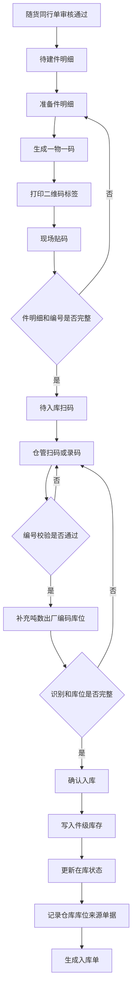
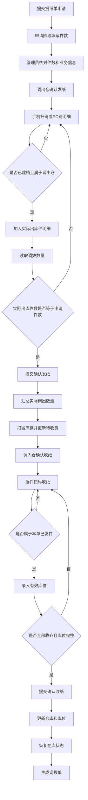

# ERP升级-生产管理V1.7.0（纸张管理扫码出入库）

## 1. 文档信息

| 项目     | 内容                                         |
| -------- | -------------------------------------------- |
| 文档版本 | v1.0                                         |
| 文档名称 | ERP升级-生产管理V1.7.0（纸张管理扫码出入库） |
| 作者     | ChatGPT / 产品经理草拟                       |
| 创建日期 | 2026-03-18                                   |
| 最后更新 | 2026-03-18                                   |
| 文档状态 | 草稿                                         |

### 修订记录

| 版本 | 日期       | 修订人  | 修订内容                                                 |
| ---- | ---------- | ------- | -------------------------------------------------------- |
| v1.0 | 2026-03-18 | ChatGPT | 初稿，基于需求访谈整理扫码出入库、一物一码、库位管理方案 |

---

## 2. 背景与目标

### 2.1 项目背景

当前 ERP 已支持随货同行单、提纸单、退纸单三类纸张业务流程，但仍主要管理到纸张品类/规格层级，未实现单件管理、一物一码和逐件扫码核对。系统已有仓库库位管理模块，但纸张业务尚未在件级库存和实物作业环节有效使用库位。历史库存目前主要依赖线下贴码和 Excel 管理，尚未统一纳入系统件级追踪。

因此，本次迭代目标是在不改变现有三类单据主流程的前提下，补齐件级管理、一物一码、扫码出入库，并接入现有库位管理能力。

### 2.2 本期目标

- 实现纸张件级管理，一件纸对应一个系统唯一编号。
- 实现扫码出入库，提升实物流转核对准确性。
- 接入现有仓库库位管理能力，支持在库纸张快速定位。
- 支持按一物一码查询纸张当前状态与历史轨迹。
- 将历史库存补码数据初始化进系统，纳入后续统一扫码流转。

### 2.3 本期范围

- 随货同行单增加件明细管理，不调整现有单据主流程与审批流程。
- 提纸单增加件明细管理，不调整现有单据主流程与审批流程。
- 退纸单增加件明细管理，不调整现有单据主流程与审批流程。
- 新增纸张一物一码编码、二维码标签打印能力，本期标签内容仅包含二维码和唯一编号。
- 新增纸张扫码入库、扫码出库、扫码收货能力，兼容现有 PC 端与手机端单据流程。
- 使用现有仓库库位管理模块，并在件级库存中记录仓库与库位。
- 新增一物一码查询能力。
- 明确历史库存线下贴码、Excel 登记及后端初始化导入方案，本期不建设历史库存初始化前端页面。

### 2.4 产品原则

1. 不改变现有业务主流程，仅在实物流转节点增加扫码与件级数据。
2. 系统中所有纸张件级流转必须以唯一编号为核心，不允许同一编号对应多件纸。
3. 所有入库完成后的在库纸张，必须具备明确仓库和库位。
4. 所有出入库核对环节以逐件扫码为主，手工输入二维码编号为扫码失败时的补充方式。
5. 提纸单、退纸单不允许部分发货、部分收货、部分退货。

### 2.5 需求优先级策略

- P0：历史库存导入及提纸单相关能力，优先支撑当前线下搬仓场景。
- P1：退纸单相关能力。
- P2：随货同行单相关能力。

---

## 3. 用户分析

### 3.1 目标用户

本期主要用户包括公司仓管、调拨相关仓管、印厂退纸人员、公司纸张管理员及历史库存初始化人员。

### 3.2 核心痛点

- 当前仅管理到纸张规格层级，无法追踪到单件纸张，容易出现“数量对了但件不对”的问题。
- 当前库存只管理到仓库层级，未记录具体库位，导致找货、交接和盘点效率较低。
- 提纸、退纸、收货等环节缺少统一的扫码核对方式，现场核对依赖人工经验。
- 历史库存主要依赖线下 Excel 管理，系统内外数据未打通。

---

## 4. 功能概述

### 4.1 功能架构

ERP纸张管理扫码出入库迭代
├── 单据场景能力
│   ├── 随货同行单件级入库
│   │   ├── 件明细准备
│   │   ├── 入库扫码/录码
│   │   └── 入库库位落位
│   ├── 提纸单件级调拨
│   │   ├── 调出扫码发纸
│   │   ├── 调入扫码收纸
│   │   └── 收货库位落位
│   └── 退纸单件级退纸
│       ├── 退纸扫码出库
│       ├── 公司扫码收纸
│       └── 收货库位落位
├── 纸张件级基础能力
│   ├── 一物一码编码生成
│   ├── 二维码生成与标签打印
│   ├── 手工录码补充
│   ├── 件级库存状态管理
│   └── 对接现有仓库库位能力
├── 查询追溯
│   └── 一物一码查询
└── 上线实施准备
    ├── 历史库存线下贴码
    ├── Excel台账整理
    └── 后端初始化导入

### 4.2 核心方案说明

#### 4.2.1 最小管理单元

- 卷筒纸：按“一卷”作为一件管理。
- 平板纸：按“一件”作为一件管理。
- 系统内统一抽象为“纸张件明细”。

#### 4.2.2 一物一码规则

- 编码格式：`年份 + 6位流水号`。
- 示例：`2026000001`。
- 流水号按年份递增。
- 每个自然年从 `000001` 重新开始。
- 唯一编号在系统内全局唯一，同一年内不得重复。
- 纸张一物一码为 ERP 纸张业务独立建设，不复用产成品二维码业务模型。

#### 4.2.3 二维码标签规则

- 标签内容仅包含：二维码、唯一编号。
- 标签打印为本期范围内能力。
- 二维码识别结果与手工输入的唯一编号口径一致。
- 标签贴附时机：在入库前完成生成和打印，并贴于对应纸张实物。

#### 4.2.4 库位规则

- 库位模型为“仓库 + 库位”两级。
- 纸张库位为 ERP 内部维护的业务库位。
- 一件纸张在入库完成后必须落到明确库位。
- 调入收货、退纸收货等再次入库场景，均需重新确认库位。

#### 4.2.5 扫码规则

- 随货同行单在“仓管确认入库”节点必须逐件扫码或手工录码完成入库核对。
- 提纸单在“调出仓库确认发纸”节点必须逐件扫码或手工录码完成发纸核对。
- 提纸单在“调入仓库确认收纸”节点必须逐件扫码或手工录码完成收货核对。
- 退纸单在“印厂人员确认退纸”节点必须逐件扫码或手工录码完成退纸核对。
- 退纸单在“公司仓管确认收纸”节点必须逐件扫码或手工录码完成收货核对。
- 扫码失败时支持手工输入唯一编号。
- 手工输入后，系统校验该编号是否存在、是否属于当前业务范围、是否满足当前节点操作条件。
- 不允许使用未建码纸张完成正式件级流转。

#### 4.2.6 件明细展示原则

- 纳入本次件级管理范围的单据详情页，均应增加件明细展示区。
- 非操作节点的详情页，件明细默认只读展示。
- 操作节点根据业务需要，允许对件明细执行扫码、录码、选择、确认、库位录入等操作。
- PC端以件明细表为主，手机端以件明细列表或件明细卡片区为主。

#### 4.2.7 历史库存处理方案

- 历史库存由纸张管理人员先在线下打印二维码并贴码。
- 通过 Excel 维护一物一码及初始化基础信息。
- 历史库存不提供前端初始化功能页面，由后端按约定模板执行导入。
- 历史库存初始化完成后，纳入统一扫码出入库管理。

### 4.3 功能清单

#### 4.3.1 PC端功能清单

| 序号 | 编号   | 模块       | 功能名称       | 功能描述                                                                 | 优先级 | 状态   |
| ---- | ------ | ---------- | -------------- | ------------------------------------------------------------------------ | ------ | ------ |
| 1    | F001-1 | 随货同行单 | 编辑单据       | 在已整理单据（纸张）详情中准备件明细，维护单件基础信息                   | P2     | 待开发 |
| 2    | F001-2 | 随货同行单 | 打印二维码     | 主要放在随货同行单编辑单据的件明细区，支持首次打印二维码标签             | P2     | 待开发 |
| 4    | F002-6 | 提纸单     | 确认发纸       | 手机端扫码不可用时，PC端支持手工录入唯一编号；页面默认展示并维护实际出库件明细，自动汇总调拨数量 | P0     | 待开发 |
| 7    | F003-6 | 退纸单     | 确认退纸       | 手机端扫码不可用时，PC端支持手工录入唯一编号；页面默认展示并维护实际退纸件明细，自动汇总调拨数量 | P1     | 待开发 |
| 9    | F004-2 | 基础能力   | 打印二维码     | 支持首次打印和再次打印，重复打印仍使用原唯一编号，不生成新编号           | P0     | 待开发 |
| 11   | F006-1 | 查询追溯   | 一物一码查询   | PC端提供独立查询页面，按唯一编号查询当前库存、库位、来源单据和历史轨迹   | P0     | 待开发 |

#### 4.3.2 手机端功能清单

| 序号 | 编号   | 模块       | 功能名称     | 功能描述                                                   | 优先级 | 状态   |
| ---- | ------ | ---------- | ------------ | ---------------------------------------------------------- | ------ | ------ |
| 1    | F001-3 | 随货同行单 | 确认入库     | 仓管确认入库节点逐件扫码或手工录码完成入库核对             | P2     | 待开发 |
| 2    | F001-4 | 随货同行单 | 选择库位     | 入库时为每件纸选择当前仓库下的有效库位                     | P2     | 待开发 |
| 3    | F002-2 | 提纸单     | 确认发纸     | 调出仓确认发纸节点逐件扫码或手工录码完成发纸核对           | P0     | 待开发 |
| 4    | F002-3 | 提纸单     | 确认收纸     | 调入仓确认收纸节点逐件扫码或手工录码完成收货核对           | P0     | 待开发 |
| 5    | F002-4 | 提纸单     | 选择库位     | 收纸时为每件纸选择调入仓下的有效库位                       | P0     | 待开发 |
| 6    | F003-2 | 退纸单     | 确认退纸     | 印厂人员确认退纸节点逐件扫码或手工录码完成退纸核对         | P1     | 待开发 |
| 7    | F003-3 | 退纸单     | 确认收纸     | 公司仓管确认收纸节点逐件扫码或手工录码完成收货核对         | P1     | 待开发 |
| 8    | F003-4 | 退纸单     | 选择库位     | 收纸时为每件纸选择公司收货仓下的有效库位                   | P1     | 待开发 |

#### 4.3.3 系统处理清单

| 序号 | 编号   | 模块       | 功能名称       | 功能描述                                             | 优先级 | 状态   |
| ---- | ------ | ---------- | -------------- | ---------------------------------------------------- | ------ | ------ |
| 1    | F001-5 | 随货同行单 | 自动生成入库单 | 入库后写入件级库存、仓库、库位、来源单据并生成入库单 | P2     | 待开发 |
| 2    | F002-5 | 提纸单     | 自动生成调拨单 | 调拨完成后更新件级库存状态、仓库、库位并生成调拨单   | P0     | 待开发 |
| 3    | F003-5 | 退纸单     | 自动生成调拨单 | 退纸完成后更新件级库存状态、仓库、库位并生成调拨单   | P1     | 待开发 |
| 4    | F004-1 | 基础能力   | 编码生成       | 按年度流水生成纸张一物一码                           | P0     | 待开发 |
| 5    | F005-2 | 基础能力   | 库位校验       | 仅允许选择当前仓库下有效状态的库位                   | P0     | 待开发 |
| 6    | F005-3 | 基础能力   | 记录库位       | 在件级库存中记录当前仓库和当前库位                   | P0     | 待开发 |
| 7    | F007-3 | 初始化     | 初始化导入     | 后端按模板导入历史库存，纳入统一件级管理             | P0     | 待开发 |

#### 4.3.4 线下实施清单

| 序号 | 编号   | 模块     | 功能名称   | 功能描述                         | 优先级 | 状态   |
| ---- | ------ | -------- | ---------- | -------------------------------- | ------ | ------ |
| 1    | F005-1 | 基础能力 | 库位接入   | 单据节点调用现有仓库库位管理模块 | P0     | 待开发 |
| 2    | F007-1 | 初始化   | 线下贴码   | 对历史库存执行线下贴码和编号整理 | P0     | 待开发 |
| 3    | F007-2 | 初始化   | Excel台账  | 按约定模板整理历史库存初始化数据 | P0     | 待开发 |

---

## 5. 功能详情

本章按 PC端、手机端、系统处理、线下实施四类展开，章节顺序与 4.3 功能清单保持一致；每个小节均标注对应功能清单编号，便于开发、测试和产品对照阅读。

### 5.1 PC端功能详情

#### 5.1.1 编辑单据

**对应功能清单**：F001-1

- 在已整理单据（纸张）详情中增加件明细入口。
- 单据详情页默认展示件明细区。
- 支持按件数准备件明细，维护单件基础信息。
- 件明细字段包括：唯一编号、吨数、入库数量、出厂编码、库位、照片。
- 吨数在卷筒纸场景下用于业务识别和核对。
- 入库数量用于记录单件纸张入库时确认的数量。

#### 5.1.2 打印二维码

**对应功能清单**：F001-2、F004-2

- 主要放在随货同行单编辑单据的件明细区。
- 支持在随货同行单场景下首次生成唯一编号并打印二维码标签。
- 支持按单据或按纸张明细批量打印二维码标签。
- 对已存在唯一编号的纸张，支持再次打印，仍使用原唯一编号。
- 再次打印不生成新编号。
- 标签内容仅包含二维码图形和唯一编号文本。
- 二维码内容为唯一编号本身。

#### 5.1.3 确认发纸

**对应功能清单**：F002-6

- 单据详情页默认展示件明细区。
- 手机端扫码为确认发纸主路径。
- 手机端扫码不可用时，PC端支持手工录入唯一编号。
- 所选纸张必须已完成贴码和件级建档，且当前在库、属于调出仓、未被其他单据占用。
- 实际出库件数必须与提纸单件数一致，才允许提交发纸。
- 页面应展示并维护本次确认发纸的实际出库件明细，自动汇总调拨数量。

#### 5.1.4 确认退纸

**对应功能清单**：F003-6

- 单据详情页默认展示件明细区。
- 手机端扫码为确认退纸主路径。
- 手机端扫码不可用时，PC端支持手工录入唯一编号。
- 所选纸张必须已完成贴码和件级建档，且当前允许退纸、未被其他单据占用。
- 实际退纸件数必须与退纸单件数一致，才允许提交退纸。
- 页面应展示并维护本次确认退纸的实际退纸件明细，自动汇总调拨数量。

#### 5.1.5 一物一码查询

**对应功能清单**：F006-1

- PC端提供独立的一物一码查询页面。
- 支持按唯一编号精确查询。
- 查询结果需展示当前库存定位信息。
- 查询结果需展示完整流转轨迹，至少包括单据类型、单据编号、操作节点、操作时间。
- 查询结果页支持按原唯一编号打印二维码。
- 重新打印不生成新编号。
- 若唯一编号不存在，返回空并提示。

### 5.2 手机端功能详情

#### 5.2.1 确认入库

**对应功能清单**：F001-3

- 仓管确认入库时，必须对实际入库的每件纸张进行扫码。
- 单据详情页默认展示件明细区。
- 扫码后应展示当前识别件的基础信息、状态、仓库、库位等必要信息，供现场核对。
- 扫码失败时支持手工录码。
- 当件明细数量与单据件数一致，且全部件明细已生成唯一编号后，单据进入待入库扫码状态。
- 编号必须存在、属于当前单据、未重复录入、未被占用。

**仓管确认入库流程图**

#### 5.2.2 选择库位（入库）

**对应功能清单**：F001-4

- 每件纸张入库时必须录入库位。
- 未录入库位不得完成入库。
- 库位必须从当前入库仓库下的有效库位中选择。

#### 5.2.3 确认发纸

**对应功能清单**：F002-2

- 调出仓确认发纸时，手机端逐件扫码完成发纸核对。
- 扫码后应展示当前识别件的基础信息、状态、仓库、库位、调拨数量等必要信息，供现场核对。
- 扫码失败时支持手工录码。
- 仅允许扫描当前处于在库状态、且所在仓库为调出仓库的纸张。
- 若扫码纸张不在当前调出仓，不允许发纸。
- 若扫码纸张未完成贴码、缺少调拨数量或缺少必要件级数据，不允许纳入本次出库件明细。
- 发纸提交后，实际出库件明细即作为本单最终调出件依据。

**提纸单扫码出入库流程图**

#### 5.2.4 确认收纸

**对应功能清单**：F002-3

- 调入仓确认收纸时，仅允许扫描当前提纸单已发出的件明细。
- 单据详情页默认展示件明细区。
- 扫码后应展示当前识别件的基础信息、状态、仓库、库位、调拨数量等必要信息，供现场核对。
- 扫码失败时支持手工录码。
- 调入扫码件数必须与调出已发件数完全一致，才允许提交收纸。
- 收纸完成后，件级状态更新为在库。
- 调入数量以本单已发件明细为准，不在收纸节点重新计算新的调拨数量口径。

#### 5.2.5 选择库位（提纸单收纸）

**对应功能清单**：F002-4

- 收纸时必须填写调入仓下的库位。
- 全部收齐且库位完整后，允许提交确认收纸。

#### 5.2.6 确认退纸

**对应功能清单**：F003-2

- 印厂人员确认退纸时，手机端逐件扫码完成退纸核对。
- 单据详情页默认展示件明细区。
- 扫码后应展示当前识别件的基础信息、状态、仓库、库位、调拨数量等必要信息，供现场核对。
- 扫码失败时支持手工录码。
- 仅允许处理当前可退回、且已完成件级建档的纸张件。
- 若扫码纸张未完成贴码、缺少调拨数量或缺少必要件级数据，不允许纳入本次退纸件明细。
- 提交确认退纸后，系统按实际退纸件明细调拨数量汇总值完成出库。

#### 5.2.7 确认收纸（退纸单）

**对应功能清单**：F003-3

- 公司确认收纸时，只允许扫描本退纸单已退回的纸张件。
- 单据详情页默认展示件明细区。
- 扫码后应展示当前识别件的基础信息、状态、仓库、库位、调拨数量等必要信息，供现场核对。
- 扫码失败时支持手工录码。
- 收纸件数必须与已退纸件数完全一致，才允许提交收纸。
- 收纸完成后，件级库存更新至公司仓及对应库位。

#### 5.2.8 选择库位（退纸单收纸）

**对应功能清单**：F003-4

- 每件收货纸张必须录入公司收货仓下有效库位。
- 全部收齐且库位完整后，允许提交确认收纸。

### 5.3 系统处理详情

#### 5.3.1 自动生成入库单

**对应功能清单**：F001-5

- 系统确认入库后，将件级库存写入在库状态。
- 记录当前仓库、当前库位、来源单据为随货同行单。
- 自动生成入库单。

#### 5.3.2 自动生成调拨单（提纸单）

**对应功能清单**：F002-5

- 调拨完成后，系统更新件级库存状态、仓库、库位。
- 自动生成调拨单。
- 调拨完成后，系统记录本次调拨单号，形成轨迹记录。

#### 5.3.3 自动生成调拨单（退纸单）

**对应功能清单**：F003-5

- 退纸完成后，系统更新件级库存状态、仓库、库位。
- 自动生成调拨单。
- 件级流转数据需可追溯。

#### 5.3.4 编码生成

**对应功能清单**：F004-1

- 系统按自然年维护年度流水。
- 每年从 `000001` 开始递增。
- 编码格式固定为 `YYYYNNNNNN`。
- 同一年度内编码不可重复。
- 编码一旦生成并用于件明细，不允许随意修改。

#### 5.3.5 库位校验

**对应功能清单**：F005-2

- 仅允许选择当前仓库下有效状态的库位。
- 非当前仓库或无效状态的库位不允许被选择。

#### 5.3.6 记录库位

**对应功能清单**：F005-3

- 在件级库存中记录当前仓库和当前库位。
- 件级库存中可查询每件纸当前所在仓库和库位。

#### 5.3.7 初始化导入

**对应功能清单**：F007-3

- 后端按模板导入历史库存。
- 导入成功后，历史库存纳入统一件级管理。
- 导入成功后，历史库存可参与后续扫码流转。

### 5.4 线下实施详情

#### 5.4.1 库位接入

**对应功能清单**：F005-1

- 单据节点调用现有仓库库位管理模块。
- 纸张业务直接使用现有仓库库位主数据，不在本期新增独立库位管理模块。

#### 5.4.2 线下贴码

**对应功能清单**：F007-1

- 历史库存由纸张管理人员先在线下打印二维码并贴码。
- 标签内容仅包含二维码图形和唯一编号文本。
- 标签打印能力覆盖随货同行单新入库场景，也支持历史库存补码场景。

#### 5.4.3 Excel台账

**对应功能清单**：F007-2

- 已通过 Excel 维护唯一编号及基础件级信息。
- 历史库存初始化数据需补齐后续扫码流转所需的业务数量字段，确保导入后可直接参与提纸、退纸等扫码流转。
- 初始化字段建议包括：唯一编号、纸张ID/纸张名称、仓库、库位、吨数、调拨数量、出厂编码、照片、初始化日期、备注。
- 初始化校验包括：唯一编号不能为空且不能重复，仓库和库位必须有效，调拨数量不能为空，卷筒纸场景下吨数应满足业务要求。

---

## 6. 数据与状态设计

### 6.1 纸张件级库存核心字段

| 字段             | 说明                                       |
| ---------------- | ------------------------------------------ |
| 唯一编号         | 一物一码主键标识                           |
| 纸张ID           | 对应上层纸张资料                           |
| 纸张名称/规格    | 用于展示和查询                             |
| 单件吨数         | 卷筒纸场景用于业务识别和核对               |
| 入库数量         | 随货同行单入库场景下记录的业务数量字段     |
| 调拨数量         | 提纸单、退纸单等流转场景使用的业务数量字段 |
| 出厂编码         | 供应商单件编码                             |
| 当前状态         | 纸张件当前业务状态                         |
| 当前仓库         | 当前所在仓库                               |
| 当前库位         | 当前所在库位                               |
| 来源单据类型     | 首次入账来源，如随货同行单/初始化          |
| 来源单据编号     | 首次入账单号                               |
| 最近操作单据类型 | 最近一次业务单据类型                       |
| 最近操作单据编号 | 最近一次业务单号                           |
| 照片             | 件级图片信息                               |

### 6.2 建议状态定义

| 状态         | 说明                             | 典型场景                     |
| ------------ | -------------------------------- | ---------------------------- |
| 待入库       | 已完成建码但尚未正式入库         | 随货同行单入库前             |
| 在库         | 已完成入库或收货，可继续参与流转 | 入库完成、收货完成           |
| 已发出待收货 | 已从调出方发出，待调入方确认收货 | 提纸单发纸后、退纸单退纸后   |

---

## 7. 端能力要求

### 7.1 端能力定位

- 手机端定位为纸张件级实物流转的现场作业端，主要承担扫码识别、手工录码、件级核对、库位选择和作业提交。
- PC端定位为管理操作端，主要承担单据录入、件明细准备、一物一码生成、标签打印、查询追溯等管理类操作。
- 本期手机端不建设独立一物一码查询页面，仅在扫码作业节点展示当前识别件的必要信息。

### 7.2 手机端

- 覆盖随货同行单仓管确认入库、提纸单调出仓确认发纸、提纸单调入仓确认收纸、退纸单印厂人员确认退纸、退纸单公司仓管确认收纸等现场作业节点。
- 每个现场作业节点必须支持逐件扫码识别二维码。
- 扫码失败时，必须支持手工录入唯一编号作为补充方式。
- 每次识别后，必须展示当前识别件的唯一编号、纸张名称/规格、当前状态、当前仓库、当前库位等必要信息，供现场核对。
- 必须展示当前单据的应处理件数、已处理件数、未处理件数等作业进度信息。
- 在入库和收货类节点，必须支持选择当前仓库下的有效库位，且未录入库位不得提交。
- 必须支持在作业完成后提交确认入库、确认发纸、确认收纸、确认退纸等结果。

### 7.3 PC端

- 必须支持单据录入与详情查看。
- 必须支持件明细准备和件级信息维护。
- 必须支持一物一码生成。
- 必须支持二维码标签打印和按原编号补打。
- 必须支持在单据详情中查看件明细和汇总信息。
- 必须支持PC端一物一码查询。
- 必须支持历史库存初始化数据准备。

---

## 8. 非功能需求

### 8.1 性能要求

| 指标           | 要求       | 说明                           |
| -------------- | ---------- | ------------------------------ |
| 扫码识别反馈   | 1秒内      | 识别后需快速返回结果           |
| 单据件明细加载 | 3秒内      | 常规单据件明细列表加载         |
| 一物一码查询   | 2秒内      | 精确查询当前状态与轨迹         |
| 初始化导入校验 | 可批量执行 | 支持后端执行常规历史库存批量导入 |

### 8.2 安全与审计要求

- 所有件级流转操作需记录操作人、操作时间、操作节点。
- 一物一码查询需受云平台权限控制。
- 初始化导入需保留导入人和导入结果日志。

### 8.3 可用性要求

- 扫码失败时必须可切换到手工录码，不因设备摄像头或识别问题阻塞业务。
- 异常提示文案需明确，可指导用户纠正数据问题。

---

## 9. 测试重点

### 9.1 测试用例编写口径

1. 测试用例按“前置条件、操作步骤、预期结果、异常场景”四部分设计。
2. 每个主流程除页面操作外，需同时校验件明细、库存状态、仓库、库位、来源单据是否正确落账。
3. 所有扫码节点均需覆盖扫码成功、扫码失败转手工录码、录入非法编号三类场景。

### 9.2 主流程测试

1. 随货同行单从审核通过、件明细准备、二维码打印、逐件扫码、库位录入到确认入库全流程。
2. 提纸单从申请到扫码发纸、扫码收纸、库位录入、生成调拨单全流程。
3. 退纸单从申请到扫码退纸、扫码收纸、库位录入、生成调拨单全流程。
4. 历史库存经后端初始化导入后参与提纸、退纸、查询流程。

### 9.3 关键校验测试

1. 同一码重复录入校验。
2. 不存在编号录入校验。
3. 非本仓、非本单、状态不匹配的扫码校验。
4. 未录库位拦截校验。
5. 仅允许选择当前仓库下有效库位的校验。
6. 不允许部分发货、部分收货、部分退货校验。
7. 年度编码重置规则校验。

### 9.4 异常场景测试

1. 扫码失败后手工录码。
2. 历史库存初始化数据重复、缺字段、仓库或库位无效。
3. 标签补打场景。
4. 查询不存在的一物一码。
5. 入库成功后库存状态、仓库、库位、来源单据写入不一致时的结果核对。

---

## 10. 待确认与默认约定

### 10.1 默认约定

1. 本期默认三类单据现有审批流程和节点名称保持不变。
2. 本期默认权限由云平台统一配置，不在业务功能中写死。
3. 本期默认二维码打印模板为最简模板，仅包含二维码和唯一编号。
4. 本期默认件级照片仅作为辅助信息，不参与核心业务校验。

### 10.2 待技术评审细化项

1. 二维码标签打印调用方式和打印设备适配方案。
2. 历史库存初始化模板最终格式及图片导入方式。
3. 手机端与 PC 端件明细交互展示形式。
4. 件级轨迹表与库存表的数据落库设计。

---

## 11. 结论

本次迭代的核心，是在现有随货同行单、提纸单、退纸单流程不变的前提下，将纸张管理从“纸张规格级”提升到“单件级”，形成一物一码、扫码出入库、仓库库位管理、历史库存纳管和轨迹追溯的完整闭环。完成后，系统将具备以下能力：

1. 每件纸张有唯一身份，可查可追。
2. 所有关键实物流转节点均可扫码核对。
3. 入库和收货均需明确到库位，提升找货效率。
4. 历史库存可逐步纳入统一件级管理。
5. 开发、测试可基于本 PRD 直接拆分页面改造、接口改造、状态流转、校验规则和后端初始化方案。
