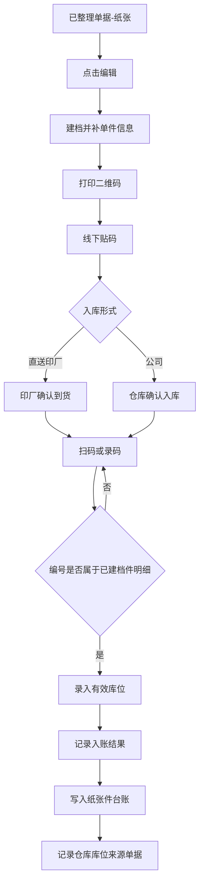
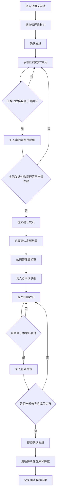

# ERP升级-生产管理V1.7.0（纸张管理扫码出入库）

## 1. 文档信息

| 项目     | 内容                                         |
| -------- | -------------------------------------------- |
| 文档名称 | ERP升级-生产管理V1.7.0（纸张管理扫码出入库） |
| 版本     | v1.1                                         |
| 作者     | ChatGPT                                      |
| 创建日期 | 2026-03-18                                   |
| 最后更新 | 2026-03-31                                   |
| 文档状态 | 修订中                                       |

---

## 2. 背景与目标

### 2.1 项目背景

当前 ERP 已支持随货同行单、提纸单、退纸单三类纸张业务流程，但仍主要管理到纸张品类/规格层级，缺少纸张件级管理、一物一码、扫码核对、库位记录和统一追踪能力。历史库存仍主要依赖线下贴码和 Excel 管理。

本次迭代在现有业务流程基础上，新增纸张件级管理、扫码出入库、库位记录、二维码生成打印和历史库存初始化能力。

本期主要用户包括公司仓管、调拨相关仓管、印厂退纸人员、公司纸张管理员及历史库存初始化人员。

### 2.2 本期目标

- 实现纸张件级管理，一件纸对应一个系统唯一编号。
- 在入库、发纸、退纸、收纸节点实现扫码核对和库位记录。
- 提供一物一码查询与轨迹追溯能力。
- 将历史库存初始化进系统，纳入后续统一管理。

### 2.3 本期范围

- 新增纸张件级档案能力，支持单据明细行与纸张件建立一对多关系。
- 随货同行单接入件级建档、扫码入库和库位落位能力。
- 提纸单接入件级发纸、件级收纸和库位落位能力。
- 退纸单接入件级退纸、件级收纸和库位落位能力。
- 提供纸张一物一码编码、二维码生成和打印能力。
- 复用现有仓库库位管理模块，在纸张件台账（即一物一码当前仓库、库位和来源等信息）中记录仓库与库位。
- 提供一物一码查询能力，查询对象为纸张件。
- 支持历史库存线下贴码、Excel 整理和后端初始化导入，本期不建设历史库存初始化前端页面。

### 2.4 产品原则

1. 不新增审批主线，按现有业务节点挂接实现。
2. 系统中所有纸张件级流转必须以唯一编号为核心，不允许同一编号对应多件纸。
3. 入库和收货结果必须记录明确仓库和库位。
4. 所有出入库核对环节以逐件扫码为主，手工输入二维码编号为扫码失败时的补充方式。
5. 提纸单、退纸单整单处理，不支持部分发货、部分收货、部分退货。
6. 纸张件侧以结果记录为主，用于查询与追溯。

### 2.5 需求优先级策略

- P0：件级基础模型、二维码独立能力、历史库存导入及提纸单相关能力。
- P1：退纸单相关能力。
- P2：随货同行单相关能力。
- 依赖关系：P1/P2 均依赖 P0 先完成件级编号、纸张件台账、结果记录字段、库位落账和二维码生成打印能力。

---

## 3. 功能概述

### 3.1 功能架构

ERP纸张管理扫码出入库迭代
├── 随货同行单
│   ├── 件级建档
│   ├── 二维码打印
│   ├── 扫码入库
│   └── 库位记录
├── 提纸单
│   ├── 扫码发纸
│   ├── 扫码收纸
│   └── 库位记录
├── 退纸单
│   ├── 扫码退纸
│   ├── 扫码收纸
│   └── 库位记录
├── 一物一码查询
│   ├── 编号查询
│   ├── 结果查看
│   └── 二维码打印
├── 历史库存初始化
│   ├── 线下贴码
│   ├── Excel整理
│   └── 后端导入
└── 通用规则
    ├── 一物一码编码
    └── 仓库库位

### 3.2 核心方案说明

#### 3.2.1 最小管理单元

- 卷筒纸：按“一卷”作为一件管理。
- 平板纸：按“一件”作为一件管理。
- 系统内统一抽象为“纸张件”。

#### 3.2.2 一物一码规则

- 编码格式：`年份 + 6位流水号`。
- 流水号按年份递增。
- 每个自然年从 `000001` 重新开始。
- 唯一编号在系统内全局唯一，同一年内不得重复。

#### 3.2.3 二维码标签规则

- 标签内容仅包含：二维码、唯一编号。
- 二维码识别结果与手工输入的唯一编号口径一致。
- 标签贴附时机：在入库前完成生成和打印，并贴于对应纸张实物。
- 同一件纸在不同入口打印时，均沿用原唯一编号。

#### 3.2.4 库位规则

- 库位模型为“仓库 + 库位”两级。
- 一件纸张在入库完成后必须落到明确库位。
- 调入收货、退纸收货等再次入库场景，均需重新确认库位。

#### 3.2.5 扫码规则

- 随货同行单在“编辑”环节完成件级建档和二维码打印；入库形式为“直送印厂”时，在“印厂确认到货”环节执行扫码或手工录码，入库形式为“公司”时，在“仓库确认入库”环节执行扫码或手工录码。扫码或录码的编号必须属于当前单据在“编辑”环节已建档的件明细编号。
- 提纸单在“确认发纸”节点执行扫码或手工录码，扫码或录码形成本次实际发纸件明细。
- 提纸单在“确认收纸”节点执行扫码或手工录码，扫码或录码的编号必须属于本单已发纸件明细。
- 退纸单在“确认退纸”节点执行扫码或手工录码，扫码或录码形成本次实际退纸件明细。
- 退纸单在“确认收纸”节点执行扫码或手工录码，扫码或录码的编号必须属于本单已退纸件明细。
- 扫码失败时支持手工输入唯一编号。
- 扫码或手工输入的唯一编号均需校验编号有效性。
- 不允许使用未建码纸张完成正式件级流转。

#### 3.2.6 异常处理规则

| 场景             | 处理规则                           | 预期结果                         |
| ---------------- | ---------------------------------- | -------------------------------- |
| 重复扫码同一码   | 同一作业单内再次扫描同一码必须拦截 | 提示重复扫码，不重复计数         |
| 扫到非本单据件   | 必须按当前单据件明细或业务范围校验 | 提示“非本单据件”，不得加入明细 |
| 手工录码不存在   | 校验唯一编号存在性                 | 提示编号不存在                   |
| 库位未填写即提交 | 入库/收纸类节点强校验              | 拦截提交                         |
| 作业提交失败     | 失败前写入不得视为最终结果         | 不得写入错误的正式结果记录       |

### 3.3 功能清单

#### 3.3.1 PC端功能清单

| 序号 | 编号   | 模块       | 功能名称       | 功能描述                                                                                                                                                                                                                                               | 优先级 | 状态   |
| ---- | ------ | ---------- | -------------- | ------------------------------------------------------------------------------------------------------------------------------------------------------------------------------------------------------------------------------------------------------ | ------ | ------ |
| 1    | F001-0 | 随货同行单 | 件明细         | 随货同行单在PC端“详情”“编辑”“审核”“印厂确认到货”“仓库确认入库”页面按物料分组展示件明细区；“编辑”页支持新增、删除和维护件明细，其他页面仅查看或执行复核操作。                                                                                         | P2     | 待开发 |
| 2    | F001-1 | 随货同行单 | 编辑单据       | 在“已整理单据(纸张)”列表点击“编辑”进入详情页，完成件级建档、库位带入及单件信息维护。                                                                                                                                                                  | P2     | 待开发 |
| 3    | F001-2 | 随货同行单 | 调起二维码打印 | 在“已整理单据(纸张)”列表对审核通过且已生成唯一编号的随货同行单调用打印能力，完成当前单据下全部件明细二维码打印。                                                                                                                                      | P2     | 待开发 |
| 4    | F001-3 | 随货同行单 | 印厂确认到货   | 在PC端“印厂确认到货”页面按当前单据已生成件明细逐件执行“复核/取消复核”；全部件明细复核完成后方可提交确认到货。                                                                                                                                      | P2     | 待开发 |
| 5    | F001-4 | 随货同行单 | 仓库确认入库   | 在PC端“仓库确认入库”页面按当前单据已生成件明细逐件执行“复核/取消复核”；全部件明细复核完成后方可提交确认入库，件明细库位仅展示不编辑。                                                                                                                | P2     | 待开发 |
| 6    | F002-0 | 提纸单     | 件明细         | 提纸单件明细在“确认发纸”环节形成；PC端“详情”“确认发纸”“确认收纸”页面统一采用“单据信息 + 提纸明细”结构，提纸明细按“物料汇总表 + 件明细手风琴分组”展示。件明细统一展示唯一编号、调拨数量、吨数、调入仓库、图片、调入库位；“确认发纸”支持新增、删除、录唯一编号、上传图片和调整调入库位，“确认收纸”仅执行收纸确认，“详情”页仅查看。 | P0     | 待开发 |
| 7    | F002-1 | 提纸单     | 确认发纸       | 手机端扫码不可用时，PC端在“确认发纸”页面按物料分组新增和维护实际发纸件明细；用户录入唯一编号后，系统自动回填调拨数量、吨数、调入仓库，支持上传图片并维护调入库位。                                                                                      | P0     | 待开发 |
| 8    | F002-2 | 提纸单     | 确认收纸       | 手机端扫码不可用时，PC端在“确认收纸”页面按已生成件明细逐件执行收纸确认；页面展示只读件明细和单据级调入库位，不再新增、删除或编辑件明细字段。                                                                                                            | P0     | 待开发 |
| 9    | F003-0 | 退纸单     | 件明细         | 退纸单件明细在“确认退纸”环节形成；PC端“详情”“确认退纸”“确认收纸”三页统一采用“单据信息 + 明细 + 件明细”的页面结构，件明细统一字段为“唯一编号 / 调拨数量 / 吨数 / 调入仓库 / 图片 / 调入库位”；“详情”页只读，“确认退纸”页可维护件明细，“确认收纸”页件明细只读但支持逐件确认收纸。 | P1     | 待开发 |
| 10   | F003-1 | 退纸单     | 确认退纸       | 手机端扫码不可用时，PC端在现有确认退纸页面中补充件明细维护能力；用户按物料分组新增件明细、手工录入唯一编号、上传图片并维护调入库位，形成本次实际退纸件明细。                                                                                           | P1     | 待开发 |
| 11   | F003-2 | 退纸单     | 确认收纸       | 手机端扫码不可用时，PC端在现有确认收纸页面中展示已生成的退纸件明细；件明细内容只读，用户逐件执行“确认收纸 / 取消收纸”，并在页面底部维护纸张到库时间、纸张到库图片后完成整单确认。                                                                   | P1     | 待开发 |
| 12   | F006-1 | 查询追溯   | 一物一码查询   | PC端提供独立查询页面，按唯一编号查询当前库存、库位、来源单据和轨迹。                                                                                                                                                                                    | P0     | 待开发 |

#### 3.3.2 手机端功能清单

| 序号 | 编号   | 模块       | 功能名称 | 功能描述                                                                                                                                                                                                       | 优先级 | 状态   |
| ---- | ------ | ---------- | -------- | -------------------------------------------------------------------------------------------------------------------------------------------------------------------------------------------------------------- | ------ | ------ |
| 1    | F001-5 | 随货同行单 | 件明细   | 随货同行单手机端在“详情”“印厂确认到货”“仓库确认入库”页面按物料分组展示件明细；“印厂确认到货”“仓库确认入库”环节按已生成件明细逐件扫码或手工录码核对，扫一个确认一个，其他环节仅查看件明细。                | P2     | 待开发 |
| 2    | F001-6 | 随货同行单 | 确认入库 | 入库形式为“直送印厂”时，在“印厂确认到货”节点逐件扫码或手工录码确认入库；入库形式为“公司”时，在“仓库确认入库”节点逐件扫码或手工录码确认入库，扫一个确认一个。                                                  | P2     | 待开发 |
| 3    | F001-7 | 随货同行单 | 选择库位 | 入库确认时界面支持按单据级选择当前入库仓下默认库位，并自动填充至当前未手动调整的件明细；件明细支持单独调整库位。印厂视为仓库，直送印厂场景同样适用。                                                            | P2     | 待开发 |
| 4    | F002-3 | 提纸单     | 件明细   | 提纸单手机端在“确认发纸”“初审”“确认收纸”页面按物料分组展示件明细；“确认发纸”环节扫一个新增一件明细，“初审”环节仅查看件明细，“确认收纸”环节按已生成件明细逐件扫码或手工录码确认收纸，扫一个确认一个。      | P0     | 待开发 |
| 5    | F002-4 | 提纸单     | 确认发纸 | 确认发纸节点按物料分组逐件扫码或手工录码，扫一个新增一件明细，并回填调拨数量、吨数、调入仓库，支持上传图片和维护调入库位，完成发纸确认。                                                                        | P0     | 待开发 |
| 6    | F002-5 | 提纸单     | 确认收纸 | 确认收纸节点按已生成件明细逐件扫码或手工录码完成收货核对，扫一个确认一个；件明细内容只读，不再新增、删除或编辑件明细字段。                                                                                      | P0     | 待开发 |
| 7    | F002-6 | 提纸单     | 选择库位 | 确认发纸时界面支持按单据级选择调入仓下默认库位，并自动填充至当前未手动调整的件明细；件明细支持单独调整调入库位。                                                                                                | P0     | 待开发 |
| 8    | F003-3 | 退纸单     | 件明细   | 退纸单手机端在“确认退纸”“确认收纸”页面按物料分组展示件明细；“确认退纸”环节扫一个新增一件明细，“确认收纸”环节按已生成件明细逐件扫码或手工录码确认收纸，扫一个确认一个。                                        | P1     | 待开发 |
| 9    | F003-4 | 退纸单     | 确认退纸 | 印厂人员确认退纸节点按物料分组逐件扫码或手工录码，扫一个新增一件明细，并回填调拨数量、吨数、调入仓库，支持上传图片和维护调入库位，完成退纸确认。                                                                | P1     | 待开发 |
| 10   | F003-5 | 退纸单     | 确认收纸 | 公司仓管确认收纸节点按已生成件明细逐件扫码或手工录码完成收货核对，扫一个确认一个；件明细内容只读，并在确认区维护纸张到库时间、纸张到库图片后提交。                                                              | P1     | 待开发 |
| 11   | F003-6 | 退纸单     | 选择库位 | 确认退纸时界面支持按单据级选择调入仓下默认库位，并自动填充至当前未手动调整的件明细；件明细支持单独调整调入库位。                                                                                                | P1     | 待开发 |

#### 3.3.3 通用系统能力

| 序号 | 编号   | 模块     | 功能名称   | 功能描述                                                     | 优先级 | 状态   |
| ---- | ------ | -------- | ---------- | ------------------------------------------------------------ | ------ | ------ |
| 1    | F005-1 | 基础能力 | 库位接入   | 单据节点调用现有仓库库位管理模块并返回当前仓库下可选有效库位 | P0     | 待开发 |
| 2    | F005-2 | 基础能力 | 库位校验   | 仅允许选择当前仓库下有效状态的库位                           | P0     | 待开发 |
| 3    | F007-3 | 初始化   | 初始化导入 | 后端按模板导入历史库存，纳入统一件级管理                     | P0     | 待开发 |

### 3.4 关键业务流程图

#### 3.4.1 随货同行单流程图



#### 3.4.2 提纸单流程图



---

## 4. 功能详情

本章按 PC端、手机端、通用系统能力和线下实施展开；前 3 类章节顺序与 3.3 功能清单保持一致。线下实施用于说明上线配套动作，不纳入 3.3 功能清单。

手机端定位为现场作业端，PC端定位为管理操作端；具体节点能力、页面行为和字段要求以本章为准。

### 4.1 PC端功能详情

#### 4.1.1 件明细（随货同行单-PC）

**对应功能清单**：F001-0

**业务规则**

1. 随货同行单件明细按物料分组展示，不允许将不同物料的件明细混在同一列表中查看或维护。
2. “详情”“编辑”“审核”“印厂确认到货”“仓库确认入库”页面均展示件明细区。
3. “纸张信息”区域先展示“物料汇总表”，再展示“件明细”；件明细位于物料汇总表下方。
4. PC端不同物料的件明细采用同页按物料分组折叠展示。
5. 单物料场景默认展开该物料件明细；多物料场景默认展开首个物料分组，其余分组收起，用户点击分组标题切换查看。
6. “详情”“审核”“印厂确认到货”“仓库确认入库”页面的件明细均为只读展示。

**界面要素**

| 元素             | 类型         | 说明                                                                                                                                                                 |
| ---------------- | ------------ | -------------------------------------------------------------------------------------------------------------------------------------------------------------------- |
| 件明细小标题     | Text         | 位于“纸张信息”区域内，紧跟“物料汇总表”之后展示，用于标识下方为按物料分组的件明细区。                                                                                 |
| 物料件明细折叠组 | CollapseItem | 位于“件明细”小标题下方；每条物料明细对应一个折叠组，标题展示物料名称和件数，点击后展开或收起当前物料件明细。                                                         |
| 件明细表格       | Table        | 位于对应物料件明细折叠组内；用于展示该物料下的全部件明细。统一展示唯一编号、入库数量、吨数、出厂编码、照片、当前库位等字段。                                         |

**异常处理**

| 异常场景                 | 处理方式  | 提示文案                     |
| ------------------------ | --------- | ---------------------------- |
| 物料明细下无件明细       | 页面提示  | 当前物料下暂无件明细         |

#### 4.1.2 编辑单据

**对应功能清单**：F001-1

**功能说明**

PC端“编辑单据”用于为随货同行单预先建立件级档案，为审核通过后的唯一编号生成、二维码打印、移动端入库扫码和追溯查询提供基础数据。

**业务规则**

1. 用户从“已整理单据(纸张)”列表点击“编辑”进入当前随货同行单详情编辑页。
2. 编辑页“纸张信息”区域先展示“物料汇总表”，再展示“件明细”；件明细按物料分组折叠展示。单物料默认展开，多物料默认展开首个物料分组，且同一时刻仅展开一个分组。
3. “新增件明细”仅支持在当前展开物料分组下逐行新增，不支持按件数批量生成空白行。
4. 件明细支持删除；删除后当前物料分组内件序号自动重排。
5. 件明细至少包含唯一编号、入库数量、吨数、出厂编码、照片、库位等字段；其中吨数、入库数量、出厂编码、照片、库位由用户维护。唯一编号在编辑阶段不生成，由审核通过后系统批量生成。
6. 用户录入吨数后，系统读取当前物料档案中的转换率，按“入库数量=吨数×转换率”自动回算入库数量；如用户手动修改入库数量，系统不反算吨数。
7. 单据头“库位”可编辑；用户修改单据头库位后，系统自动带入全部未手动修改过的件明细库位。件明细库位也支持逐行编辑；用户手动修改某行库位后，后续再次变更单据头库位时不再覆盖该行。
8. 编辑页中吨数、入库数量、出厂编码、照片、库位可编辑；唯一编号在当前页面不编辑，审核通过前为空，审核通过后回填显示。照片字段支持多图上传，已上传图片以缩略图列表展示，并支持继续上传和删除。
9. 页面顶部操作区提供“暂存”和“提交审核”两个按钮；“暂存”仅保存当前编辑结果，不推进流程，“提交审核”在校验通过后保存并提交审核。当前单据下各物料均需补齐件明细。
10. 提交审核后，单据进入待审核状态；审核通过前允许按现有流程撤回审核，且系统不生成唯一编号。审核通过时，系统按单据一次性为全部件明细生成唯一编号；仅审核通过且已生成唯一编号的单据，才可在列表页打印二维码、执行移动端确认入库和进行后续一物一码查询。

**界面要素**

| 元素             | 类型         | 说明                                                                                                                                                                                                                                         |
| ---------------- | ------------ | -------------------------------------------------------------------------------------------------------------------------------------------------------------------------------------------------------------------------------------------- |
| 物料件明细折叠组 | CollapseItem | 位于“件明细”区域内；每条物料明细对应一个折叠组，默认首组展开，用户点击分组标题切换查看。                                                                                                                                                         |
| 件明细表格       | Table        | 位于对应物料件明细折叠组内；展示件序号、唯一编号、入库数量、吨数、出厂编码、照片、库位、操作等字段。吨数、入库数量、出厂编码、照片、库位在当前页面可编辑；唯一编号在当前页面不编辑，审核通过前为空，审核通过后回填显示。                     |
| 新增件明细按钮   | Button       | 位于物料件明细折叠组标题右侧；每点击一次仅在当前物料分组下新增一条空白件明细，不支持批量新增、不支持跨物料新增。                                                                                                                                   |
| 删除按钮         | Button       | 位于件明细表格“操作”列；点击后删除当前件明细行，并自动重排当前物料分组内件序号。                                                                                                                                                                   |
| 照片上传入口     | Upload       | 位于件明细表格“照片”列；支持多图上传，已上传图片以缩略图列表展示，并支持继续上传和删除。                                                                                                                                                           |

**异常处理**

| 异常场景                                   | 处理方式               | 提示文案                                                 |
| ------------------------------------------ | ---------------------- | -------------------------------------------------------- |
| 必填件级字段为空                           | 输入框标红+Toast提示   | 请完善件明细必填信息后再提交                             |
| 吨数无法换算入库数量                       | 吨数字段标红+Toast提示 | 当前吨数无法按物料档案转换率换算入库数量，请检查物料档案 |
| 件明细数量与单据件数不一致                 | Toast提示              | 件明细数量与单据件数不一致                               |
| 保存失败                                   | Toast提示              | 保存失败，请稍后重试                                     |

#### 4.1.3 打印二维码

**对应功能清单**：F001-2

**功能说明**

PC端在“已整理单据(纸张)”列表提供二维码打印能力。用户对审核通过且已生成唯一编号的随货同行单点击“打印二维码”后，进入当前单据下全部件明细二维码的打印页。

**业务规则**

1. 列表页仅对审核通过且已生成唯一编号的随货同行单开放“打印二维码”入口；未审核通过的单据不允许打印。
2. 打印页仅打印当前单据下的全部件明细二维码，不支持在打印页切换单据范围、物料范围或勾选范围。
3. 标签采用左图右文布局：左侧展示二维码图形，二维码下方展示唯一编号；右侧展示物料名称/规格、吨数、出厂编码，其中二维码内容为唯一编号本身。
4. 默认排版为一页 6 个二维码、每行 3 个；勾选“每页显示一个二维码”后切换为一页 1 个。
5. 重复打印沿用原唯一编号，不生成新编号。

**界面要素**

| 元素               | 类型     | 说明                                                                                                                                     |
| ------------------ | -------- | ---------------------------------------------------------------------------------------------------------------------------------------- |
| 打印二维码按钮     | Button   | 位于“已整理单据(纸张)”列表行操作区；仅审核通过且已生成唯一编号的单据进入可操作态。                                                       |
| 打印按钮           | Button   | 位于页面顶部；点击后直接调起浏览器打印。                                                                                                 |
| 当前单据展示       | Text     | 位于页面顶部区域；只读展示当前打印单据号。                                                                                               |
| 每页显示一个二维码 | Checkbox | 位于页面顶部区域；默认不勾选。勾选时按一页 1 个展示，取消勾选时按一页 6 个、每行 3 个展示。                                             |
| 二维码预览区       | Preview  | 位于页面主体区域；展示当前单据下全部可打印件明细的二维码预览。每个标签左侧为二维码图形，二维码下方展示唯一编号，右侧展示物料名称/规格、吨数、出厂编码。 |

**异常处理**

| 异常场景 | 处理方式 | 提示文案 |
| -------- | -------- | -------- |
| 当前单据未审核通过或未生成唯一编号 | Toast提示 | 当前单据暂不可打印二维码 |
| 当前单据下无已生成唯一编号的件明细 | Toast提示 | 当前单据下无可打印的二维码数据 |
| 打印服务异常 | Toast提示 | 打印失败，请检查打印设备后重试 |

#### 4.1.4 印厂确认到货（随货同行单-PC）

**对应功能清单**：F001-3

**功能说明**

PC端“印厂确认到货”仅适用于随货同行单入库形式为“直送印厂”的场景，用于对当前单据下已生成件明细的纸张进行逐件复核确认，确认该批纸张已到达对应印厂。

**业务规则**

1. 页面“纸张信息”区域先展示“物料汇总表”，再展示“件明细”；件明细按物料分组折叠展示。
2. 单物料默认展开该物料件明细；多物料场景默认展开首个物料分组，其余分组收起，用户点击分组标题切换查看。
3. 件明细按当前单据下已生成的件明细逐行展示，不允许在当前页面新增、删除或编辑件明细字段。
4. 用户通过行级“复核”按钮逐件确认到货；已复核的件支持点击“取消复核”恢复为待复核状态。
5. 仅当当前单据下全部件明细均已复核时，才允许提交确认到货。
6. 当前页面不支持部分确认；若仍存在待复核件，则提交按钮保持禁用或点击后提示。

**界面要素**

| 元素             | 类型         | 说明                                                                                                                                                  |
| ---------------- | ------------ | ----------------------------------------------------------------------------------------------------------------------------------------------------- |
| 物料件明细折叠组 | CollapseItem | 位于“件明细”区域内；每条物料明细对应一个折叠组，标题展示物料名称和件数，点击后展开或收起当前物料件明细。                                           |
| 件明细表格       | Table        | 位于对应物料件明细折叠组内；展示件序号、唯一编号、物料名称/规格、入库数量、吨数、出厂编码、照片、库位、复核状态、复核操作等字段，全部字段只读。 |
| 复核按钮         | Button       | 位于件明细表格“复核操作”列；未复核时显示“复核”，已复核时显示“取消复核”。                                                                             |
| 提交按钮         | Button       | 位于页面顶部操作区；仅当当前单据下全部件明细均已复核时可提交。                                                                                        |

**异常处理**

| 异常场景             | 处理方式  | 提示文案                 |
| -------------------- | --------- | ------------------------ |
| 存在待复核件明细     | Toast提示 | 请完成全部件明细复核后再提交 |
| 提交失败             | Toast提示 | 提交失败，请稍后重试     |

#### 4.1.5 仓库确认入库（随货同行单-PC）

**对应功能清单**：F001-4

**功能说明**

PC端“仓库确认入库”仅适用于随货同行单入库形式为“公司”的场景，用于对当前单据下已生成件明细的纸张进行逐件复核确认后完成入库提交，确认该批纸张已进入公司仓库。

**业务规则**

1. 页面“纸张信息”区域先展示“物料汇总表”，再展示“件明细”；件明细按物料分组折叠展示。
2. 单物料默认展开该物料件明细；多物料场景默认展开首个物料分组，其余分组收起，用户点击分组标题切换查看。
3. 件明细按当前单据下已生成的件明细逐行展示，不允许在当前页面新增、删除或编辑件明细字段。
4. 用户通过行级“复核”按钮逐件确认入库；已复核的件支持点击“取消复核”恢复为待复核状态。
5. 当前页面件明细中的库位仅展示，不允许编辑。
6. 仅当当前单据下全部件明细均已复核时，才允许提交确认入库。
7. 当前页面不支持部分入库；若仍存在待复核件，则提交按钮保持禁用或点击后提示。

**界面要素**

| 元素             | 类型         | 说明                                                                                                                                                  |
| ---------------- | ------------ | ----------------------------------------------------------------------------------------------------------------------------------------------------- |
| 物料件明细折叠组 | CollapseItem | 位于“件明细”区域内；每条物料明细对应一个折叠组，标题展示物料名称和件数，点击后展开或收起当前物料件明细。                                           |
| 件明细表格       | Table        | 位于对应物料件明细折叠组内；展示件序号、唯一编号、物料名称/规格、入库数量、吨数、出厂编码、照片、库位、复核状态、复核操作等字段，全部字段只读。 |
| 复核按钮         | Button       | 位于件明细表格“复核操作”列；未复核时显示“复核”，已复核时显示“取消复核”。                                                                             |
| 提交按钮         | Button       | 位于页面顶部操作区；仅当当前单据下全部件明细均已复核时可提交。                                                                                        |

**异常处理**

| 异常场景             | 处理方式  | 提示文案                 |
| -------------------- | --------- | ------------------------ |
| 存在待复核件明细     | Toast提示 | 请完成全部件明细复核后再提交 |
| 提交失败             | Toast提示 | 提交失败，请稍后重试     |

#### 4.1.6 件明细（提纸单-PC）

**对应功能清单**：F002-0

**业务规则**

1. 提纸单件明细在“确认发纸”环节形成。
2. PC端“详情”“确认发纸”“确认收纸”页面统一采用“单据信息”在上、“提纸明细”在下的页面结构；其中“单据信息”区域至少展示单据编号、状态、提交时间、调出地点、调入地点、调入库位、物料分类等字段，节点允许展示的补充字段按页面状态扩展。
3. “提纸明细”区域先展示“物料汇总表”，再展示“件明细”；件明细位于物料汇总表下方。
4. 件明细按物料分组折叠展示。单物料场景默认展开该物料分组；多物料场景默认展开首个物料分组，其余分组收起，用户点击分组标题切换查看。
5. 提纸单件明细统一字段为：件序号、唯一编号、调拨数量、吨数、调入仓库、图片、调入库位。
6. “详情”页面件明细全部字段只读，不允许新增、删除或编辑。
7. “确认发纸”页面可按物料分组新增和删除件明细行；件序号、调拨数量、吨数、调入仓库只读，唯一编号、图片、调入库位可维护。
8. “确认收纸”页面件明细全部字段只读，并在件明细表格中追加“收纸状态”“收纸操作”两列；当前页面不允许新增、删除或编辑件明细字段，仅允许执行收纸确认或取消确认。

**界面要素**

| 元素             | 类型         | 说明                                                                                                                                                                                                                              |
| ---------------- | ------------ | --------------------------------------------------------------------------------------------------------------------------------------------------------------------------------------------------------------------------------- |
| 单据信息区       | Card         | 位于页面主体上方；用于展示当前提纸单单据头信息。“详情”“确认收纸”页以只读方式展示调入库位；“确认发纸”页展示可编辑的单据级调入库位选择器。                                                                                      |
| 物料汇总表       | Table        | 位于“提纸明细”区域顶部；按物料展示库存数量、件数、每件数量、零数、调拨数量、吨数、转换率等汇总字段。                                                                                                                           |
| 件明细小标题     | Text         | 位于物料汇总表下方，用于标识下方为按物料分组展示的件明细区。                                                                                                                                                                      |
| 物料件明细折叠组 | CollapseItem | 位于“件明细”区域内；每条物料明细对应一个折叠组。标题展示物料名称及件数；“确认发纸”页额外展示“应发/已录”统计信息，“详情”“确认收纸”页展示只读件数。                                                                              |
| 新增件明细按钮   | Button       | 仅在“确认发纸”页显示，位于物料件明细折叠组标题右侧；每点击一次仅在当前物料分组下新增一条空白件明细，不支持跨物料新增。                                                                                                          |
| 件明细表格       | Table        | 位于对应物料件明细折叠组内；统一展示件序号、唯一编号、调拨数量、吨数、调入仓库、图片、调入库位。“确认发纸”页额外展示“操作”列，“确认收纸”页额外展示“收纸状态”“收纸操作”列，“详情”页不展示任何操作列。                           |
| 图片列           | Upload/Preview | 位于件明细表格“图片”列；“确认发纸”页支持上传、继续上传和删除，已上传图片以缩略图展示；“详情”“确认收纸”页仅展示只读缩略图。                                                                                                      |
| 汇总提示区       | Text         | 位于物料件明细折叠组标题右侧；用于展示当前物料分组件数相关汇总信息。“确认发纸”页展示“应发/已录”，“详情”“确认收纸”页展示件数。                                                                                                  |

**异常处理**

| 异常场景                 | 处理方式  | 提示文案                           |
| ------------------------ | --------- | ---------------------------------- |
| 当前页面不允许编辑件明细 | Toast提示 | 当前页面仅支持查看件明细           |
| 物料明细下无件明细       | 页面提示  | 当前物料下暂无件明细               |
| 尝试在收纸环节新增件明细 | Toast提示 | 确认收纸环节仅支持核对已生成件明细 |

#### 4.1.7 确认发纸

**对应功能清单**：F002-1

**功能说明**

当手机端扫码不可用时，PC端提供提纸单确认发纸的兜底处理能力。用户在当前页面按物料分组新增件明细、录入唯一编号，系统回填只读件级字段，并完成发纸确认。

**业务规则**

1. 页面结构为“单据信息”在上、“提纸明细”在下；“单据信息”区域展示单据编号、状态、提交时间、调出地点、调入地点、调入库位、物料分类等字段，其中单据级“调入库位”可编辑。
2. “提纸明细”区域按物料分组展示“物料汇总表 + 件明细手风琴分组”。每个物料分组标题展示“应发件数 / 已录件数”。
3. 用户点击“新增件明细”后，仅在当前物料分组下新增一条空白件明细；当前物料分组已达到应发件数时，不允许继续新增。
4. 件明细行统一展示件序号、唯一编号、调拨数量、吨数、调入仓库、图片、调入库位、操作。其中件序号、调拨数量、吨数、调入仓库只读；唯一编号、图片、调入库位可维护。
5. 用户录入唯一编号后，系统立即校验编号是否存在、是否属于当前单据允许发纸范围、是否已被本单重复录入。校验通过后自动回填该件的调拨数量、吨数、调入仓库；校验失败时清空当前行派生字段并提示原因。
6. 图片列支持上传、继续上传和删除；已上传图片以缩略图展示。
7. 用户修改单据级“调入库位”后，系统自动回填当前未手动调整过的件明细“调入库位”；已手动调整过的件后续不再被单据级调入库位覆盖。
8. 用户可删除当前物料分组下的件明细；删除后当前物料分组内件序号自动重排。
9. 仅当全部物料分组“已录件数=应发件数”且所有件明细校验通过后，才允许点击“提交”；“暂存”仅保存当前页面已录入内容，不推进流程。
10. 提交成功后写入发纸结果、结果单据编号和操作日志；失败、取消或仅暂存不得形成正式发纸结果。

**界面要素**

| 元素             | 类型           | 说明                                                                                                                                                                                                                     |
| ---------------- | -------------- | ------------------------------------------------------------------------------------------------------------------------------------------------------------------------------------------------------------------------ |
| 单据级调入库位   | Select         | 位于“单据信息”区域；仅加载当前调入仓下有效库位。选择后立即回填全部未手动调整过的件明细调入库位。                                                                                                                        |
| 物料件明细折叠组 | CollapseItem   | 位于件明细区；标题展示物料名称、应发件数、已录件数。                                                                                                                                                                     |
| 新增件明细按钮   | Button         | 位于当前物料折叠组标题右侧；仅在“确认发纸”页显示。当前物料已达到应发件数时禁用或点击后提示。                                                                                                                            |
| 唯一编号输入框   | Input          | 位于件明细表格“唯一编号”列；录入后立即执行编号校验。校验成功回填调拨数量、吨数、调入仓库；校验失败保留输入或清空派生字段并提示。                                                                                      |
| 件明细表格       | Table          | 位于对应物料折叠组内；展示件序号、唯一编号、调拨数量、吨数、调入仓库、图片、调入库位、操作等字段。                                                                                                                      |
| 图片上传入口     | Upload/Preview | 位于件明细表格“图片”列；支持上传、继续上传和删除，已上传图片以缩略图展示。                                                                                                                                               |
| 件级调入库位     | Select         | 位于件明细表格“调入库位”列；默认跟随单据级调入库位，可逐件单独调整。                                                                                                                                                     |
| 暂存按钮         | Button         | 位于页面顶部操作区；点击后仅保存当前页面录入内容，不推进流程。                                                                                                                                                           |
| 提交按钮         | Button         | 位于页面顶部操作区；默认禁用。仅当全部物料分组已录件数满足应发件数且所有件明细校验通过时可点击。                                                                                                                        |

**异常处理**

| 异常场景                 | 处理方式  | 提示文案                           |
| ------------------------ | --------- | ---------------------------------- |
| 唯一编号不存在           | Toast提示 | 未找到对应件信息                   |
| 唯一编号不在当前发纸范围 | Toast提示 | 当前纸张不属于本次调出范围         |
| 重复录入同一唯一编号     | Toast提示 | 该唯一编号已录入，请勿重复填写     |
| 当前物料已达到应发件数   | Toast提示 | 当前物料已达到应发件数             |
| 已录件数不足或超出       | Toast提示 | 实际发纸件数与单据件数不一致       |
| 存在未通过校验的件明细   | Toast提示 | 请完善并校验通过全部件明细后再提交 |

#### 4.1.8 确认收纸

**对应功能清单**：F002-2

**功能说明**

当手机端扫码不可用时，PC端提供提纸单确认收纸的兜底处理能力。页面直接展示已生成的发纸件明细，用户逐件执行“确认收纸/取消收纸”，完成整单收纸确认。

**业务规则**

1. 页面结构为“单据信息”在上、“提纸明细”在下、“确认调拨”在页面底部；“单据信息”区域展示单据编号、状态、提交时间、调出地点、调入地点、调入库位、物料分类等字段，全部只读。
2. “提纸明细”区域先展示物料汇总表，再按物料分组展示件明细。件明细字段统一为件序号、唯一编号、调拨数量、吨数、调入仓库、图片、调入库位、收纸状态、收纸操作。
3. 当前页面件明细全部字段只读，不允许新增、删除或编辑唯一编号、调拨数量、吨数、调入仓库、图片、调入库位。
4. 用户点击某件“确认收纸”后，该件收纸状态更新为“已收纸”，按钮切换为“取消收纸”；点击“取消收纸”后恢复为“待收纸”。
5. 仅当当前单据下全部件明细均已完成收纸确认时，才允许点击“提交”。
6. “确认调拨”区域展示“是否通过”选择结果，用于记录本次确认结论；不影响件明细只读展示规则。
7. 提交成功后记录确认收纸结果、结果单据编号和操作日志，并按单据头调入信息更新件当前位置；失败或取消不得形成正式收纸结果。

**界面要素**

| 元素         | 类型         | 说明                                                                                                                                                                             |
| ------------ | ------------ | -------------------------------------------------------------------------------------------------------------------------------------------------------------------------------- |
| 单据信息区   | Card         | 位于页面主体上方；展示当前单据头信息，包含只读的调入库位。                                                                                                                       |
| 物料汇总表   | Table        | 位于“提纸明细”区域顶部；按物料展示件数、调拨数量、吨数等汇总字段。                                                                                                               |
| 物料件明细折叠组 | CollapseItem | 位于件明细区；标题展示物料名称和件数，点击后展开或收起当前物料分组。                                                                                                             |
| 件明细表格   | Table        | 位于对应物料折叠组内；展示件序号、唯一编号、调拨数量、吨数、调入仓库、图片、调入库位、收纸状态、收纸操作。除“收纸操作”外，其余字段全部只读。                                     |
| 收纸操作按钮 | Button       | 位于件明细表格“收纸操作”列；未确认时显示“确认收纸”，已确认时显示“取消收纸”。                                                                                                     |
| 是否通过选择器 | Select       | 位于“确认调拨”区域；用于记录整单确认结果。                                                                                                                                       |
| 提交按钮     | Button       | 位于页面顶部操作区；默认禁用。仅当全部件明细收纸状态均为“已收纸”时可点击。                                                                                                       |

**异常处理**

| 异常场景             | 处理方式  | 提示文案                 |
| -------------------- | --------- | ------------------------ |
| 存在待收纸件明细     | Toast提示 | 请完成全部件明细收纸确认后再提交 |
| 提交失败             | Toast提示 | 提交失败，请稍后重试     |

#### 4.1.9 件明细（退纸单-PC）

**对应功能清单**：F003-0

**业务规则**

1. 退纸单件明细在“确认退纸”环节形成。
2. PC端“详情”“确认退纸”“确认收纸”页面统一采用“单据信息”在上、“明细”在中、“件明细”在下的页面结构；其中“确认收纸”页在件明细下方继续保留“确认（当前操作：仓管确认收纸）”区块。
3. “单据信息”区域至少展示单据编号、状态、提交时间、印厂、调出地点、调入地点、调入库位、物料分类等字段；节点允许展示的补充字段按页面状态扩展。
4. “明细”区域保留退纸单现有汇总表，按物料展示件数、调拨吨数、调拨数量、存储单位等汇总字段。
5. 件明细按物料分组折叠展示。单物料场景默认展开该物料分组；多物料场景默认展开首个物料分组，其余分组收起，用户点击分组标题切换查看。
6. 退纸单件明细统一字段为：件序号、唯一编号、调拨数量、吨数、调入仓库、图片、调入库位。
7. “详情”页面件明细全部字段只读，不允许新增、删除或编辑。
8. “确认退纸”页面可按物料分组新增和删除件明细行；件序号、调拨数量、吨数、调入仓库只读，唯一编号、图片、调入库位可维护。
9. “确认收纸”页面件明细字段全部只读，并在件明细表格中追加“收纸状态”“收纸操作”两列；当前页面不允许新增、删除或编辑件明细字段，仅允许逐件执行收纸确认或取消确认。

**界面要素**

| 元素             | 类型           | 说明                                                                                                                                                                                                                      |
| ---------------- | -------------- | ------------------------------------------------------------------------------------------------------------------------------------------------------------------------------------------------------------------------- |
| 单据信息区       | Card           | 位于页面主体上方；用于展示当前退纸单单据头信息。“详情”“确认收纸”页以只读方式展示调入库位；“确认退纸”页展示可编辑的单据级调入库位选择器。                                                                             |
| 明细汇总表       | Table          | 位于页面中部；保留退纸单现有“明细”表，用于按物料展示件数、调拨吨数、调拨数量、存储单位等汇总信息。                                                                                                                      |
| 件明细小标题     | Text           | 位于明细汇总表下方，用于标识下方为按物料分组展示的件明细区。                                                                                                                                                               |
| 物料件明细折叠组 | CollapseItem   | 位于“件明细”区域内；每条物料明细对应一个折叠组。标题展示物料名称及件数；“确认退纸”页额外展示“应退/已录”统计信息，“详情”“确认收纸”页展示只读件数。                                                                      |
| 新增件明细按钮   | Button         | 仅在“确认退纸”页显示，位于物料件明细折叠组标题右侧；每点击一次仅在当前物料分组下新增一条空白件明细，不支持跨物料新增。                                                                                                  |
| 件明细表格       | Table          | 位于对应物料件明细折叠组内；统一展示件序号、唯一编号、调拨数量、吨数、调入仓库、图片、调入库位。“确认退纸”页额外展示“操作”列，“确认收纸”页额外展示“收纸状态”“收纸操作”列，“详情”页不展示任何操作列。               |
| 图片列           | Upload/Preview | 位于件明细表格“图片”列；“确认退纸”页支持上传、继续上传和删除，已上传图片以缩略图展示；“详情”“确认收纸”页仅展示只读缩略图。                                                                                              |
| 汇总提示区       | Text           | 位于物料件明细折叠组标题右侧；用于展示当前物料分组件数相关汇总信息。“确认退纸”页展示“应退/已录”，“详情”“确认收纸”页展示件数。                                                                                          |

**异常处理**

| 异常场景                 | 处理方式  | 提示文案                           |
| ------------------------ | --------- | ---------------------------------- |
| 当前页面不允许编辑件明细 | Toast提示 | 当前页面仅支持查看件明细           |
| 物料明细下无件明细       | 页面提示  | 当前物料下暂无件明细               |
| 尝试在收纸环节新增件明细 | Toast提示 | 确认收纸环节仅支持核对已生成件明细 |

#### 4.1.10 确认退纸

**对应功能清单**：F003-1

**功能说明**

当手机端扫码不可用时，PC端提供退纸单确认退纸的兜底处理能力。用户在当前页面按物料分组新增件明细、录入唯一编号，系统回填只读件级字段，并完成退纸确认。

**业务规则**

1. 页面结构为“单据信息”在上、“明细”在中、“件明细”在下；“单据信息”区域展示单据编号、状态、提交时间、印厂、调出地点、调入地点、调入库位、物料分类、备注、附件等字段，其中单据级“调入库位”可编辑。
2. “明细”区域保留退纸单现有汇总表；“件明细”区域按物料分组展示件明细手风琴分组，每个物料分组标题展示“应退件数 / 已录件数”。
3. 用户点击“新增件明细”后，仅在当前物料分组下新增一条空白件明细；当前物料分组已达到应退件数时，不允许继续新增。
4. 件明细行统一展示件序号、唯一编号、调拨数量、吨数、调入仓库、图片、调入库位、操作。其中件序号、调拨数量、吨数、调入仓库只读；唯一编号、图片、调入库位可维护。
5. 录入的纸张件必须已完成贴码和件级建档，且当前允许退纸。用户录入唯一编号后，系统立即校验编号是否存在、是否属于当前单据允许退纸范围、是否已被本单重复录入。校验通过后自动回填该件的调拨数量、吨数、调入仓库；校验失败时清空当前行派生字段并提示原因。
6. 图片列支持上传、继续上传和删除；已上传图片以缩略图展示。
7. 用户修改单据级“调入库位”后，系统自动回填当前未手动调整过的件明细“调入库位”；已手动调整过的件后续不再被单据级调入库位覆盖。
8. 用户可删除当前物料分组下的件明细；删除后当前物料分组内件序号自动重排。
9. 仅当全部物料分组“已录件数=应退件数”且所有件明细校验通过后，才允许点击“提交”。
10. 提交成功后写入退纸结果、结果单据编号和操作日志；失败或取消不得形成正式结果。

**界面要素**

| 元素             | 类型           | 说明                                                                                                                                                                                                                     |
| ---------------- | -------------- | ------------------------------------------------------------------------------------------------------------------------------------------------------------------------------------------------------------------------ |
| 单据级调入库位   | Select         | 位于“单据信息”区域；仅加载当前调入仓下有效库位。选择后立即回填全部未手动调整过的件明细调入库位。                                                                                                                        |
| 物料件明细折叠组 | CollapseItem   | 位于件明细区；标题展示物料名称、应退件数、已录件数。                                                                                                                                                                     |
| 新增件明细按钮   | Button         | 位于当前物料折叠组标题右侧；仅在“确认退纸”页显示。当前物料已达到应退件数时禁用或点击后提示。                                                                                                                            |
| 唯一编号输入框   | Input          | 位于件明细表格“唯一编号”列；录入后立即执行编号校验。校验成功回填调拨数量、吨数、调入仓库；校验失败保留输入或清空派生字段并提示。                                                                                      |
| 件明细表格       | Table          | 位于对应物料折叠组内；展示件序号、唯一编号、调拨数量、吨数、调入仓库、图片、调入库位、操作等字段。                                                                                                                      |
| 图片上传入口     | Upload/Preview | 位于件明细表格“图片”列；支持上传、继续上传和删除，已上传图片以缩略图展示。                                                                                                                                               |
| 件级调入库位     | Select         | 位于件明细表格“调入库位”列；默认跟随单据级调入库位，可逐件单独调整。                                                                                                                                                     |
| 提交按钮         | Button         | 位于页面顶部操作区；默认禁用。仅当全部物料分组已录件数满足应退件数且所有件明细校验通过时可点击。                                                                                                                        |
| 返单按钮         | Button         | 位于页面顶部操作区；点击后按退纸单既有返单规则执行，不影响当前件明细必填和校验规则定义。                                                                                                                                |

**异常处理**

| 异常场景                 | 处理方式  | 提示文案                           |
| ------------------------ | --------- | ---------------------------------- |
| 唯一编号不存在           | Toast提示 | 未找到对应件信息                   |
| 唯一编号不在当前退纸范围 | Toast提示 | 当前纸张不属于本次退纸范围         |
| 重复录入同一唯一编号     | Toast提示 | 该唯一编号已录入，请勿重复填写     |
| 当前物料已达到应退件数   | Toast提示 | 当前物料已达到应退件数             |
| 已录件数不足或超出       | Toast提示 | 实际退纸件数与单据件数不一致       |
| 存在未通过校验的件明细   | Toast提示 | 请完善并校验通过全部件明细后再提交 |

#### 4.1.11 确认收纸（退纸单）

**对应功能清单**：F003-2

**功能说明**

当手机端扫码不可用时，PC端提供退纸单确认收纸的兜底处理能力。页面直接展示已生成的退纸件明细，用户逐件执行“确认收纸/取消收纸”，并在页面底部完成收纸确认信息维护。

**业务规则**

1. 页面结构为“单据信息”在上、“明细”在中、“件明细”在下、“确认（当前操作：仓管确认收纸）”在页面底部；“单据信息”区域展示单据编号、状态、提交时间、印厂、调出地点、调入地点、调入库位、物料分类、备注、附件等字段，全部只读。
2. “明细”区域保留退纸单现有汇总表；“件明细”区域先按物料分组展示已生成的退纸件明细。件明细字段统一为件序号、唯一编号、调拨数量、吨数、调入仓库、图片、调入库位、收纸状态、收纸操作。
3. 当前页面件明细内容全部只读，不允许新增、删除或编辑唯一编号、调拨数量、吨数、调入仓库、图片、调入库位。
4. 用户点击某件“确认收纸”后，该件收纸状态更新为“已收纸”，按钮切换为“取消收纸”；点击“取消收纸”后恢复为“待收纸”。
5. “确认（当前操作：仓管确认收纸）”区域用于维护纸张到库时间、纸张到库图片；该区域与件明细确认动作并存，不改变件明细只读规则。
6. 仅当当前单据下全部件明细均已完成收纸确认时，才允许点击“提交”。
7. 提交成功后记录确认收纸结果、结果单据编号和操作日志，并按单据头调入信息更新件当前位置；失败、取消或返单不得形成正式收纸结果。

**界面要素**

| 元素             | 类型           | 说明                                                                                                                                                                                                 |
| ---------------- | -------------- | ---------------------------------------------------------------------------------------------------------------------------------------------------------------------------------------------------- |
| 单据信息区       | Card           | 位于页面主体上方；展示当前退纸单单据头信息，包含只读的调入库位。                                                                                                                                     |
| 明细汇总表       | Table          | 位于页面中部；按物料展示库存、件数、调拨吨数、调拨数量、存储单位等汇总字段。                                                                                                                         |
| 物料件明细折叠组 | CollapseItem   | 位于件明细区；标题展示物料名称和件数，点击后展开或收起当前物料分组。                                                                                                                                 |
| 件明细表格       | Table          | 位于对应物料折叠组内；展示件序号、唯一编号、调拨数量、吨数、调入仓库、图片、调入库位、收纸状态、收纸操作。除“收纸操作”外，其余字段全部只读。                                                         |
| 收纸操作按钮     | Button         | 位于件明细表格“收纸操作”列；未确认时显示“确认收纸”，已确认时显示“取消收纸”。                                                                                                                         |
| 到库时间输入框   | DatePicker     | 位于页面底部“确认（当前操作：仓管确认收纸）”区域；用于填写本次纸张到库时间。                                                                                                                          |
| 到库图片上传入口 | Upload/Preview | 位于页面底部“确认（当前操作：仓管确认收纸）”区域；用于上传本次纸张到库图片。                                                                                                                          |
| 提交按钮         | Button         | 位于页面顶部操作区；默认禁用。仅当全部件明细收纸状态均为“已收纸”时可点击。                                                                                                                            |
| 返单按钮         | Button         | 位于页面顶部操作区；点击后按退纸单既有返单规则执行，不改变件明细收纸确认口径。                                                                                                                        |

**异常处理**

| 异常场景         | 处理方式  | 提示文案                           |
| ---------------- | --------- | ---------------------------------- |
| 存在待收纸件明细 | Toast提示 | 请完成全部件明细收纸确认后再提交   |
| 提交失败         | Toast提示 | 提交失败，请稍后重试               |

#### 4.1.12 一物一码查询

**对应功能清单**：F006-1

**线框图**

```text
┌──────────────────────────────────────────────────────────────┐
│ 一物一码查询                                                 │
├──────────────────────────────────────────────────────────────┤
│ 唯一编号： [请输入唯一编号] [查询]                           │
│ 当前结果： 当前仓库 / 当前库位 / 最近结果节点 / 最近时间      │
│ 来源信息： 来源单据类型 / 来源单据编号                        │
│ 流转轨迹： 节点 / 时间 / 操作人 / 结果                        │
│                                      [打印二维码]            │
└──────────────────────────────────────────────────────────────┘
```

**功能说明**

PC端提供纸张件维度的一物一码查询页面，用于按唯一编号定位当前结果、来源单据和件级流转轨迹。

**业务规则**

1. 查询对象为纸张件，不是单据。
2. 支持按唯一编号精确查询。
3. 查询结果需展示当前仓库、当前库位、来源单据、最近一次结果信息。
4. 首期轨迹能力以实际完成写入的件级流转记录为准，不默认补齐所有历史环节。
5. 查询结果页支持按原唯一编号打印二维码，重新打印不生成新编号。

**界面要素**

| 元素           | 类型      | 说明                                                 |
| -------------- | --------- | ---------------------------------------------------- |
| 唯一编号查询框 | SearchBar | 支持按唯一编号精确查询。                             |
| 当前结果卡片   | Card      | 展示当前仓库、当前库位、最近结果节点、最近结果时间。 |
| 来源信息卡片   | Card      | 展示来源单据类型和来源单据编号。                     |
| 流转轨迹列表   | Table     | 展示节点、时间、操作人、结果等轨迹信息。             |
| 打印二维码按钮 | Button    | 对查询到的纸张件按原唯一编号重新打印二维码。         |

**异常处理**

| 异常场景       | 处理方式  | 提示文案             |
| -------------- | --------- | -------------------- |
| 唯一编号不存在 | 页面提示  | 未查询到对应纸张件   |
| 查询服务异常   | Toast提示 | 查询失败，请稍后重试 |

### 4.2 手机端功能详情

#### 4.2.1 件明细（随货同行单-手机）

**对应功能清单**：F001-5

**功能说明**

**业务规则**

1. 随货同行单手机端在“详情”“印厂确认到货”“仓库确认入库”页面按物料分组展示件明细。
2. “印厂确认到货”“仓库确认入库”环节仅允许对已生成件明细逐件扫码或手工录码核对，扫一个确认一个，不新增新的件明细。
3. “详情”页面仅查看件明细，不展示扫码按钮、手工录码按钮或其他作业入口。

**界面要素**

| 元素         | 类型     | 说明                                                                                                                                                                                 |
| ------------ | -------- | ------------------------------------------------------------------------------------------------------------------------------------------------------------------------------------ |
| 物料分组区   | Collapse | 位于现有随货同行单详情页各物料明细行下方；按物料明细逐组展示件明细，不跨物料合并。                                                                                                   |
| 件明细列表   | List     | 位于对应物料分组内，展示唯一编号、入库数量、当前仓库、当前库位、入库结果、入库库位等字段；“详情”页全部字段只读且不展示作业入口，“印厂确认到货”“仓库确认入库”页仅入库结果和入库库位可变更，其他字段只读。 |

**异常处理**

| 异常场景           | 处理方式  | 提示文案                 |
| ------------------ | --------- | ------------------------ |
| 当前页面不允许作业 | Toast提示 | 当前页面仅支持查看件明细 |
| 物料下暂无件明细   | 页面提示  | 当前物料下暂无件明细     |

#### 4.2.2 确认入库

**对应功能清单**：F001-6

**功能说明**

手机端用于在随货同行单的“印厂确认到货”或“仓库确认入库”节点，对实际入库的纸张件逐件扫码或录码完成正式入账。

**业务规则**

1. 入库形式为“直送印厂”时，在“印厂确认到货”节点执行确认入库；入库形式为“公司”时，在“仓库确认入库”节点执行确认入库。
2. 当前节点仅允许对本单已生成件明细逐件扫码或手工录码确认，扫一个确认一个。
3. 扫码失败时支持手工录码；录码成功后同样立即确认对应件。
4. 仅允许确认属于当前单据、且当前处于待入库状态的件明细；同一件不得重复确认。
5. 扫码或录码成功后，页面立即更新该件的入库结果、入库库位和已确认状态。
6. 仅当应入件全部确认完成且件明细库位完整时，才允许提交。
7. 提交成功后记录入库结果、操作日志，并写入当前仓库、当前库位和来源单据。

**界面要素**

| 元素         | 类型   | 说明                                                                                                                                                                     |
| ------------ | ------ | ------------------------------------------------------------------------------------------------------------------------------------------------------------------------ |
| 扫码按钮     | Button | 仅在“印厂确认到货”或“仓库确认入库”节点展示；其他节点隐藏。点击后调起摄像头扫描二维码，识别成功后立即确认对应件；当全部应入件确认完成或单据已提交时禁用。                |
| 手工录码按钮 | Button | 与扫码按钮同区域展示，仅在“印厂确认到货”或“仓库确认入库”节点显示；扫码失败时切换为手工录码模式，录入成功后同样立即确认对应件；当全部应入件确认完成或单据已提交时禁用。  |
| 已识别件列表 | List   | 位于扫码区下方，实时展示当前已确认和待确认的件明细、所属物料、入库数量、入库库位和确认结果。                                                                             |
| 提交按钮     | Button | 仅在“印厂确认到货”或“仓库确认入库”节点显示，其他节点隐藏；当件数校验通过且件明细库位完整时可提交，否则禁用或点击后提示。                                             |

**异常处理**

| 异常场景           | 处理方式  | 提示文案                     |
| ------------------ | --------- | ---------------------------- |
| 编号不属于当前单据 | Toast提示 | 当前纸张不属于本单据         |
| 编号重复录入       | Toast提示 | 当前纸张已录入，请勿重复操作 |
| 入库提交失败       | Toast提示 | 入库失败，请稍后重试         |

#### 4.2.3 选择库位（入库）

**对应功能清单**：F001-7

**功能说明**

手机端在随货同行单入库节点支持先按单据级选择默认库位，再逐件调整最终库位，实现整单操作效率与件级落账精度兼顾。

**业务规则**

1. 用户可按单据级选择当前入库仓下默认库位。
2. 所选默认库位在选择后立即自动填充至当前未手动调整的件明细。
3. 件明细保留入库库位字段，允许对个别件单独调整；已手动调整的件不再被后续默认库位切换覆盖。
4. 件级库位选择器仅在件明细进入待确认或已确认列表后显示，无件数据时不展示。
5. 默认库位及调整后的库位必须均来自当前入库仓下的有效库位。
6. 存在空库位件明细时不得提交入库。

**界面要素**

| 元素           | 类型   | 说明                                                                                                                         |
| -------------- | ------ | ---------------------------------------------------------------------------------------------------------------------------- |
| 默认库位选择器 | Select | 位于确认入库页面件明细区上方；仅加载当前入库仓下有效库位，选择后立即回填至全部未手动调整件明细。                             |
| 件级库位选择器 | Select | 位于各件明细行内；仅在该件已进入待提交列表时显示。默认库位回填后可对特殊件单独调整最终库位，已调整件后续不再被默认库位覆盖。 |
| 提交按钮       | Button | 位于确认入库页面底部；仅在当前节点显示。存在空库位件明细、未完成件数校验时禁用或点击后提示。                                 |

**异常处理**

| 异常场景         | 处理方式  | 提示文案                     |
| ---------------- | --------- | ---------------------------- |
| 未选择有效库位   | Toast提示 | 请选择有效库位               |
| 存在空库位件明细 | Toast提示 | 请完善全部件明细库位后再提交 |

#### 4.2.4 件明细（提纸单-手机）

**对应功能清单**：F002-3

**业务规则**

1. 提纸单手机端在“确认发纸”“初审”“确认收纸”页面按物料分组展示件明细。
2. “确认发纸”环节按物料分组逐件扫码或手工录码，扫一个新增一件明细。
3. “初审”环节仅查看件明细，不展示扫码按钮、手工录码按钮或其他作业入口。
4. “确认收纸”环节按已生成件明细逐件扫码或手工录码确认收纸，扫一个确认一个，不新增新的件明细。
5. 提纸单手机端件明细统一字段为：唯一编号、调拨数量、吨数、调入仓库、图片、调入库位；“确认收纸”页额外展示收纸状态。

**界面要素**

| 元素         | 类型     | 说明                                                                                                                                                                                                                              |
| ------------ | -------- | --------------------------------------------------------------------------------------------------------------------------------------------------------------------------------------------------------------------------------- |
| 物料分组区   | Collapse | 位于提纸单详情页各物料明细行下方；按物料明细逐组展示件明细，不跨物料合并。                                                                                                                                                        |
| 件明细列表   | List     | 位于对应物料分组内，展示唯一编号、调拨数量、吨数、调入仓库、图片、调入库位等字段；“确认发纸”页可补图和改调入库位；“初审”页全部只读且不展示作业入口；“确认收纸”页字段只读并展示收纸状态。 |

**异常处理**

| 异常场景                 | 处理方式  | 提示文案                           |
| ------------------------ | --------- | ---------------------------------- |
| 当前页面不允许编辑件明细 | Toast提示 | 当前页面仅支持查看件明细           |
| 物料下暂无件明细         | 页面提示  | 当前物料下暂无件明细               |
| 尝试在收纸环节新增件明细 | Toast提示 | 确认收纸环节仅支持核对已生成件明细 |

#### 4.2.5 确认发纸

**对应功能清单**：F002-4

**功能说明**

手机端在提纸单“确认发纸”节点按物料明细行逐件扫码或录码，生成并维护本单件明细，完成发纸确认。

**业务规则**

1. 用户按物料分组逐件扫码或手工录码生成件明细，扫一个新增一件明细。
2. 扫码或录码成功后，系统立即校验唯一编号是否存在、是否属于当前提纸单允许发纸范围、是否已被本单重复录入；校验通过后自动回填调拨数量、吨数、调入仓库。
3. 仅允许扫描当前处于在库状态、且所在仓库为调出仓的纸张件。
4. 未完成贴码、缺少调拨数量或缺少必要件级数据的纸张件不得纳入本次发纸件明细。
5. 当前物料分组已达到应发件数后，该分组内扫码按钮和手工录码按钮禁用。
6. 用户可在新生成的件明细上上传图片并维护调入库位；调入库位默认跟随单据级默认值，特殊件可单独调整。
7. 提交按钮仅在当前节点显示；当全部物料分组“已录件数=应发件数”且件明细校验通过时可点击，否则禁用。
8. 提交后，实际出库件明细即作为本单最终调出件依据。

**界面要素**

| 元素         | 类型     | 说明                                                                                                                                                         |
| ------------ | -------- | ------------------------------------------------------------------------------------------------------------------------------------------------------------ |
| 物料分组区   | Collapse | 位于确认发纸页面主体区域；按物料明细行分别录入和查看发纸件明细。                                                                                             |
| 扫码按钮     | Button   | 仅在“确认发纸”节点显示，位于当前物料分组内；点击后调起扫码能力录入当前物料对应纸张件，识别成功后立即新增一条件明细。当前物料分组已达应发件数时禁用。       |
| 手工录码按钮 | Button   | 仅在“确认发纸”节点显示，与扫码按钮同区域展示；扫码失败时补充录入，录入成功后同样立即新增一条件明细。当前物料分组已达应发件数时禁用。                       |
| 件明细列表   | List     | 位于当前物料分组内；展示唯一编号、调拨数量、吨数、调入仓库、图片、调入库位等字段。                                                                         |
| 汇总区       | Text     | 位于物料分组顶部或底部，实时展示应发件数、已录件数、调拨数量汇总。                                                                                           |
| 提交按钮     | Button   | 仅在“确认发纸”节点显示，位于页面底部；当全部物料分组件数校验通过且必填件级字段完整时可提交，否则禁用或点击后提示。                                         |

**异常处理**

| 异常场景                 | 处理方式  | 提示文案                       |
| ------------------------ | --------- | ------------------------------ |
| 当前纸张不在调出仓       | Toast提示 | 当前纸张不属于调出仓           |
| 当前纸张缺少必要件级数据 | Toast提示 | 当前纸张件信息不完整，无法发纸 |
| 发纸提交失败             | Toast提示 | 发纸失败，请稍后重试           |

#### 4.2.6 确认收纸

**对应功能清单**：F002-5

**功能说明**

手机端在提纸单“确认收纸”节点按已生成的件明细逐件扫码或录码确认收纸，扫一个确认一个。

**业务规则**

1. 仅允许按已生成的提纸单件明细逐件扫码或手工录码完成收纸核对，扫一个确认一个。
2. 扫码或录码成功后，系统校验该件是否属于当前提纸单已发纸件；校验通过后立即将对应件收纸状态更新为“已收纸”。
3. 当前页面件明细内容全部只读，不允许新增、删除或编辑唯一编号、调拨数量、吨数、调入仓库、图片、调入库位。
4. 已确认收纸的件再次扫码或录码时，提示该件已完成收纸确认。
5. 调入确认件数必须与调出已发件数完全一致，才允许提交收纸。
6. 提交成功后，更新件所在仓库和库位，并记录确认收纸结果和件级轨迹。

**界面要素**

| 元素           | 类型   | 说明                                                                                                                               |
| -------------- | ------ | ---------------------------------------------------------------------------------------------------------------------------------- |
| 扫码按钮       | Button | 仅在“确认收纸”节点显示，位于页面顶部；点击后调起扫码能力核对已发纸件，识别成功后立即确认对应件。全部应收件核对完成后禁用。       |
| 手工录码按钮   | Button | 仅在“确认收纸”节点显示，与扫码按钮同区域展示；扫码失败时补充录入，录入成功后同样立即确认对应件。全部应收件核对完成后禁用。       |
| 件明细列表     | List   | 位于扫码区下方，展示唯一编号、调拨数量、吨数、调入仓库、图片、调入库位、收纸状态等字段；除收纸状态外，其余字段全部只读。           |
| 提交按钮       | Button | 仅在“确认收纸”节点显示，位于页面底部；仅在应收件全部确认完成时可提交，否则禁用或点击后提示。                                       |

**异常处理**

| 异常场景           | 处理方式  | 提示文案                   |
| ------------------ | --------- | -------------------------- |
| 扫到非本单已发纸件 | Toast提示 | 当前纸张不在本单待收范围内 |
| 当前纸张已确认收纸 | Toast提示 | 当前纸张已完成收纸确认     |
| 收纸件数未收齐     | Toast提示 | 当前仍有待收件未完成核对   |

#### 4.2.7 选择库位（提纸单件明细）

**对应功能清单**：F002-6

**功能说明**

手机端在提纸单确认发纸场景支持整单设置默认调入库位，并允许对个别新生成件单独调整调入库位。

**业务规则**

1. 用户可按单据级选择调入仓下默认调入库位。
2. 默认调入库位选择后立即填充至当前未手动调整的件明细。
3. 件明细支持单独调整调入库位；已调整件不再被后续默认调入库位覆盖。
4. 件级调入库位选择器仅在件明细已生成后显示。
5. 默认调入库位及调整后的件级调入库位必须均来自当前调入仓下有效库位。

**界面要素**

| 元素           | 类型   | 说明                                                                                                                       |
| -------------- | ------ | -------------------------------------------------------------------------------------------------------------------------- |
| 默认调入库位选择器 | Select | 位于确认发纸页面件明细区上方；仅加载调入仓下有效库位，选择后立即回填至全部未手动调整件明细。                                   |
| 件级调入库位选择器 | Select | 位于各件明细行内；仅在该件已生成后显示。在默认调入库位回填后可对个别件调整调入库位，已调整件不再被后续默认调入库位覆盖。     |
| 件明细列表         | List   | 位于默认调入库位选择器下方；展示当前已生成件的调入库位结果，并支持逐件调整。                                                     |

**异常处理**

| 异常场景         | 处理方式  | 提示文案                         |
| ---------------- | --------- | -------------------------------- |
| 未选择有效库位   | Toast提示 | 请选择有效调入库位               |
| 存在空库位件明细 | Toast提示 | 请完善全部件明细调入库位后再提交 |

#### 4.2.8 件明细（退纸单-手机）

**对应功能清单**：F003-3

**业务规则**

1. 退纸单手机端在“确认退纸”“确认收纸”页面按物料分组展示件明细。
2. “确认退纸”环节按物料分组逐件扫码或手工录码，扫一个新增一件明细。
3. “确认收纸”环节按已生成件明细逐件扫码或手工录码确认收纸，扫一个确认一个，不新增新的件明细。
4. 扫码按钮、手工录码按钮仅在“确认退纸”“确认收纸”页面展示，其他只读页面不展示作业入口。
5. 退纸单手机端件明细统一字段为：唯一编号、调拨数量、吨数、调入仓库、图片、调入库位；“确认收纸”页额外展示收纸状态。

**界面要素**

| 元素         | 类型     | 说明                                                                                                                                                                                                          |
| ------------ | -------- | ------------------------------------------------------------------------------------------------------------------------------------------------------------------------------------------------------------- |
| 物料分组区   | Collapse | 位于退纸单详情页各物料明细行下方；按物料明细逐组展示件明细，不跨物料合并。                                                                                                                                    |
| 件明细列表   | List     | 位于对应物料分组内，展示唯一编号、调拨数量、吨数、调入仓库、图片、调入库位等字段；“确认退纸”页可补图和改调入库位；“确认收纸”页字段只读并展示收纸状态；只读页面不展示作业入口。 |

**异常处理**

| 异常场景                 | 处理方式  | 提示文案                           |
| ------------------------ | --------- | ---------------------------------- |
| 当前页面不允许编辑件明细 | Toast提示 | 当前页面仅支持查看件明细           |
| 物料下暂无件明细         | 页面提示  | 当前物料下暂无件明细               |
| 尝试在收纸环节新增件明细 | Toast提示 | 确认收纸环节仅支持核对已生成件明细 |

#### 4.2.9 确认退纸

**对应功能清单**：F003-4

**功能说明**

手机端在退纸单“确认退纸”节点按物料明细行逐件扫码或录码，生成并维护本单件明细，完成退纸确认。

**业务规则**

1. 用户按物料分组逐件扫码或手工录码生成件明细，扫一个新增一件明细。
2. 扫码或录码成功后，系统立即校验唯一编号是否存在、是否属于当前退纸单允许退纸范围、是否已被本单重复录入；校验通过后自动回填调拨数量、吨数、调入仓库。
3. 仅允许处理当前可退回、且已完成件级建档的纸张件。
4. 未完成贴码、缺少调拨数量或缺少必要件级数据的纸张件不得纳入本次退纸件明细。
5. 当前物料分组已达到应退件数后，该分组内扫码按钮和手工录码按钮禁用。
6. 用户可在新生成的件明细上上传图片并维护调入库位；调入库位默认跟随单据级默认值，特殊件可单独调整。
7. 提交按钮仅在当前节点显示；当全部物料分组“已录件数=应退件数”且件明细校验通过时可点击，否则禁用。
8. 提交后，系统按实际退纸件明细完成退纸确认。

**界面要素**

| 元素         | 类型     | 说明                                                                                                                                                         |
| ------------ | -------- | ------------------------------------------------------------------------------------------------------------------------------------------------------------ |
| 物料分组区   | Collapse | 位于确认退纸页面主体区域；按物料明细行分别录入和查看退纸件明细。                                                                                             |
| 扫码按钮     | Button   | 仅在“确认退纸”节点显示，位于当前物料分组内；点击后调起扫码能力录入当前物料对应纸张件，识别成功后立即新增一条件明细。当前物料分组已达应退件数时禁用。       |
| 手工录码按钮 | Button   | 仅在“确认退纸”节点显示，与扫码按钮同区域展示；扫码失败时补充录入，录入成功后同样立即新增一条件明细。当前物料分组已达应退件数时禁用。                       |
| 件明细列表   | List     | 位于当前物料分组内；展示唯一编号、调拨数量、吨数、调入仓库、图片、调入库位等字段。                                                                         |
| 汇总区       | Text     | 位于物料分组顶部或底部，实时展示应退件数、已录件数、调拨数量汇总。                                                                                           |
| 提交按钮     | Button   | 仅在“确认退纸”节点显示，位于页面底部；当全部物料分组件数校验通过且必填件级字段完整时可提交，否则禁用或点击后提示。                                         |

**异常处理**

| 异常场景             | 处理方式  | 提示文案                       |
| -------------------- | --------- | ------------------------------ |
| 当前纸张不允许退纸   | Toast提示 | 当前纸张不满足退纸条件         |
| 当前纸张件信息不完整 | Toast提示 | 当前纸张件信息不完整，无法退纸 |
| 退纸提交失败         | Toast提示 | 退纸失败，请稍后重试           |

#### 4.2.10 确认收纸（退纸单）

**对应功能清单**：F003-5

**功能说明**

手机端在退纸单“确认收纸”节点按已生成的件明细逐件扫码或录码确认收纸，扫一个确认一个，并在确认区维护纸张到库信息。

**业务规则**

1. 只允许按本退纸单已生成的件明细逐件扫码或手工录码完成收纸核对，扫一个确认一个。
2. 扫码或录码成功后，系统校验该件是否属于当前退纸单已退纸件；校验通过后立即将对应件收纸状态更新为“已收纸”。
3. 当前页面件明细内容全部只读，不允许新增、删除或编辑唯一编号、调拨数量、吨数、调入仓库、图片、调入库位。
4. 已确认收纸的件再次扫码或录码时，提示该件已完成收纸确认。
5. 页面底部确认区用于维护纸张到库时间、纸张到库图片。
6. 收纸件数必须与已退纸件数完全一致，才允许提交收纸。
7. 提交成功后更新件所在仓库和库位，并记录确认收纸结果和件级轨迹。

**界面要素**

| 元素           | 类型   | 说明                                                                                                                               |
| -------------- | ------ | ---------------------------------------------------------------------------------------------------------------------------------- |
| 扫码按钮       | Button | 仅在“确认收纸”节点显示，位于页面顶部；点击后调起扫码能力核对已退纸件，识别成功后立即确认对应件。全部应收件核对完成后禁用。       |
| 手工录码按钮   | Button | 仅在“确认收纸”节点显示，与扫码按钮同区域展示；扫码失败时补充录入，录入成功后同样立即确认对应件。全部应收件核对完成后禁用。       |
| 件明细列表     | List   | 位于扫码区下方，展示唯一编号、调拨数量、吨数、调入仓库、图片、调入库位、收纸状态等字段；除收纸状态外，其余字段全部只读。           |
| 到库时间输入框 | Date   | 位于页面底部确认区；用于填写本次纸张到库时间。                                                                                       |
| 到库图片上传入口 | Upload | 位于页面底部确认区；用于上传本次纸张到库图片。                                                                                     |
| 提交按钮       | Button | 仅在“确认收纸”节点显示，位于页面底部；仅在应收件全部确认完成时可提交，否则禁用或点击后提示。                                       |

**异常处理**

| 异常场景           | 处理方式  | 提示文案                   |
| ------------------ | --------- | -------------------------- |
| 扫到非本单已退纸件 | Toast提示 | 当前纸张不在本单待收范围内 |
| 当前纸张已确认收纸 | Toast提示 | 当前纸张已完成收纸确认     |
| 收纸件数未收齐     | Toast提示 | 当前仍有待收件未完成核对   |

#### 4.2.11 选择库位（退纸单件明细）

**对应功能清单**：F003-6

**功能说明**

手机端在退纸单确认退纸场景支持整单设置默认调入库位，并允许对个别新生成件单独调整调入库位。

**业务规则**

1. 用户可按单据级选择调入仓下默认调入库位。
2. 默认调入库位选择后立即填充至当前未手动调整的件明细。
3. 件明细支持单独调整调入库位；已调整件不再被后续默认调入库位覆盖。
4. 件级调入库位选择器仅在件明细已生成后显示。
5. 默认调入库位及调整后的件级调入库位必须均来自当前调入仓下有效库位。

**界面要素**

| 元素           | 类型   | 说明                                                                                                                       |
| -------------- | ------ | -------------------------------------------------------------------------------------------------------------------------- |
| 默认调入库位选择器 | Select | 位于确认退纸页面件明细区上方；仅加载调入仓下有效库位，选择后立即回填至全部未手动调整件明细。                                   |
| 件级调入库位选择器 | Select | 位于各件明细行内；仅在该件已生成后显示。在默认调入库位回填后可对个别件调整调入库位，已调整件不再被后续默认调入库位覆盖。     |
| 件明细列表         | List   | 位于默认调入库位选择器下方；展示当前已生成件的调入库位结果，并支持逐件调整。                                                     |

**异常处理**

| 异常场景         | 处理方式  | 提示文案                         |
| ---------------- | --------- | -------------------------------- |
| 未选择有效库位   | Toast提示 | 请选择有效调入库位               |
| 存在空库位件明细 | Toast提示 | 请完善全部件明细调入库位后再提交 |

### 4.3 通用系统能力详情

#### 4.3.1 库位校验

**对应功能清单**：F005-2

**功能说明**

系统统一校验仓库与库位的匹配关系，保证业务页面只能选择当前仓库下的有效库位。

**业务规则**

1. 仅允许选择当前仓库下有效状态的库位。
2. 非当前仓库或无效状态的库位不允许被选择。
3. 前端加载可选库位时按当前业务仓库过滤。
4. 提交时后端仍需执行仓库与库位的二次校验。

**界面要素**

| 元素             | 类型   | 说明                                                                                          |
| ---------------- | ------ | --------------------------------------------------------------------------------------------- |
| 业务页库位下拉框 | Select | 出现在各入库页及件明细形成页的默认库位选择器和件级库位选择器中；根据当前仓库动态加载可选有效库位。 |
| 字段校验提示     | Toast  | 当用户选择无效库位、仓库与库位不匹配或提交时存在非法组合时给出拦截提示。                      |

**异常处理**

| 异常场景         | 处理方式  | 提示文案                 |
| ---------------- | --------- | ------------------------ |
| 选择了无效库位   | Toast提示 | 当前库位无效，请重新选择 |
| 仓库与库位不匹配 | Toast提示 | 当前库位不属于所选仓库   |

#### 4.3.2 初始化导入

**对应功能清单**：F007-3

**功能说明**

系统提供历史库存初始化导入能力，将线下已维护的纸张件数据一次性纳入统一件级管理体系。

**业务规则**

1. 后端按统一模板导入历史库存。
2. 导入模板至少包含唯一编号、纸张ID或名称、仓库、库位、吨数、调拨数量、出厂编码、初始化日期、备注。
3. 导入时需校验唯一编号不可重复、仓库与库位有效、业务数量字段完整。
4. 导入成功后，历史库存纳入统一件级管理，并可参与后续扫码流转。
5. 初始化导入后，需写入当前仓库、当前库位和来源类型为“初始化”的结果记录。

**界面要素**

| 元素           | 类型   | 说明                                                                 |
| -------------- | ------ | -------------------------------------------------------------------- |
| 模板下载按钮   | Button | 位于初始化导入页面顶部；点击后下载固定列头的导入模板。               |
| 导入文件上传框 | Upload | 位于初始化导入页面主体区域；用户选择待导入文件后触发格式与字段校验。 |
| 导入结果反馈表 | Table  | 位于上传框下方，展示成功条数、失败条数、失败行及失败原因。           |

**异常处理**

| 异常场景       | 处理方式 | 提示文案                     |
| -------------- | -------- | ---------------------------- |
| 模板字段缺失   | 页面提示 | 导入模板字段不完整           |
| 唯一编号重复   | 页面提示 | 存在重复唯一编号，导入失败   |
| 仓库或库位无效 | 页面提示 | 存在无效仓库或库位，导入失败 |

#### 4.3.3 库位接入

**对应功能清单**：F005-1

**功能说明**

纸张业务直接复用现有仓库库位主数据和管理模块，不在本期新增独立库位管理模块。

**业务规则**

1. 单据节点调用现有仓库库位管理模块。
2. 纸张业务直接使用现有仓库库位主数据。
3. 本期不新增独立库位管理模块。
4. 前端按当前业务仓库加载可选有效库位，提交时后端仍需二次校验。

**界面要素**

| 元素             | 类型   | 说明                                                                             |
| ---------------- | ------ | -------------------------------------------------------------------------------- |
| 业务页库位选择器 | Select | 出现在纸张业务各作业页面；使用现有仓库库位主数据渲染可选项，不新增独立维护入口。 |
| 库位加载失败提示 | Toast  | 当现有库位主数据加载失败时，在当前业务页提示并阻止继续选择库位。                 |

**异常处理**

| 异常场景           | 处理方式  | 提示文案                     |
| ------------------ | --------- | ---------------------------- |
| 库位主数据获取失败 | Toast提示 | 库位数据加载失败，请稍后重试 |

### 4.4 线下实施详情

#### 4.4.1 线下贴码

**功能说明**

线下贴码用于在系统正式扫码前完成纸张件二维码实体标签准备，覆盖新入库件和历史库存补码场景。

**业务规则**

1. 历史库存由纸张管理人员先在线下打印二维码并贴码。
2. 标签内容仅包含二维码图形和唯一编号文本。
3. 标签打印能力覆盖随货同行单新入库场景，也支持历史库存补码场景。

**界面要素**

| 元素         | 类型  | 说明                                 |
| ------------ | ----- | ------------------------------------ |
| 二维码标签   | Label | 线下粘贴到纸张件上的实体标签。       |
| 唯一编号文本 | Text  | 与二维码图形同时打印，便于人工核对。 |

**异常处理**

| 异常场景       | 处理方式 | 提示文案                     |
| -------------- | -------- | ---------------------------- |
| 标签损坏或丢失 | 重新打印 | 请按原唯一编号重新打印二维码 |

#### 4.4.2 Excel台账

**功能说明**

Excel台账用于承接存量纸张件基础数据，并作为初始化导入前的数据整理载体。

**业务规则**

1. 当前已通过 Excel 维护唯一编号及基础件级信息。
2. 历史库存初始化数据需补齐后续扫码流转所需的业务数量字段，确保导入后可直接参与提纸、退纸等扫码流转。
3. 初始化字段建议包括唯一编号、纸张ID或名称、仓库、库位、吨数、调拨数量、出厂编码、照片、初始化日期、备注。
4. 初始化校验包括唯一编号不能为空且不能重复，仓库和库位必须有效，调拨数量不能为空，卷筒纸场景下吨数应满足业务要求。

**界面要素**

| 元素          | 类型 | 说明                                 |
| ------------- | ---- | ------------------------------------ |
| Excel台账模板 | File | 用于维护历史库存件级基础数据。       |
| 校验结果说明  | Text | 用于反馈导入前需要清洗和补齐的问题。 |

**异常处理**

| 异常场景           | 处理方式 | 提示文案                        |
| ------------------ | -------- | ------------------------------- |
| 唯一编号为空或重复 | 校验拦截 | Excel台账存在空值或重复唯一编号 |
| 仓库或库位无效     | 校验拦截 | Excel台账存在无效仓库或库位     |

---

## 5. 数据与结果设计

### 5.1 逻辑实体设计

| 实体             | 说明                                                               | 与现有代码关系                 |
| ---------------- | ------------------------------------------------------------------ | ------------------------------ |
| 纸张件档案       | 以唯一编号为主键的件级对象，承载吨数、出厂编码、图片等单件属性     | 现有单据明细行之上新增逻辑对象 |
| 纸张件台账       | 记录纸张件当前仓库、当前库位、来源单据、最近一次结果节点等结果数据 | 为纸张业务侧结果台账           |
| 件级流转记录     | 记录每次扫码、发纸、收纸、入库、退纸等节点操作轨迹                 | 作为一物一码查询数据来源       |
| 单据行与件的关联 | 记录单据明细行与纸张件的一对多关系，支撑汇总与件级下钻             | 保留现有单据汇总口径           |

### 5.2 纸张件核心字段

| 字段             | 说明                                       |
| ---------------- | ------------------------------------------ |
| 唯一编号         | 一物一码主键标识                           |
| 纸张ID           | 对应上层纸张资料                           |
| 纸张名称/规格    | 用于展示和查询                             |
| 单件吨数         | 卷筒纸场景用于业务识别和核对               |
| 入库数量         | 随货同行单入库场景下记录的业务数量字段     |
| 调拨数量         | 提纸单、退纸单等流转场景使用的业务数量字段 |
| 出厂编码         | 供应商单件编码                             |
| 当前仓库         | 当前所在仓库                               |
| 当前库位         | 当前所在库位                               |
| 来源单据类型     | 首次入账来源，如随货同行单/初始化          |
| 来源单据编号     | 首次入账单号                               |
| 最近结果单据类型 | 最近一次形成结果的业务单据类型             |
| 最近结果单据编号 | 最近一次形成结果的业务单号                 |
| 最近一次结果节点 | 最近一次形成结果的业务节点名称             |
| 最近结果时间     | 最近一次结果写入时间                       |
| 照片             | 件级图片信息                               |

### 5.3 结果记录原则

- 单据审批状态沿用现有系统状态机，单据当前节点表达业务处理阶段。
- 纸张件侧只记录查询与追溯所需的结果信息，不单独扩展复杂过程状态。
- 整单处理场景下，件台账重点记录当前仓库、当前库位、来源单据和最近一次结果节点。

### 5.4 建议结果记录口径

| 结果项   | 说明                                   | 典型场景                           |
| -------- | -------------------------------------- | ---------------------------------- |
| 入账结果 | 记录纸张件已完成首次入账               | 随货同行单入库完成、初始化导入完成 |
| 发纸结果 | 记录纸张件已完成确认发纸               | 提纸单确认发纸                     |
| 退纸结果 | 记录纸张件已完成确认退纸               | 退纸单确认退纸                     |
| 收纸结果 | 记录纸张件已完成确认收纸并更新当前位置 | 提纸单确认收纸、退纸单确认收纸     |

### 5.5 数据落库边界与实现约束

- 本期必须具备以下逻辑对象：纸张件档案、纸张件台账、件级流转记录、单据行与件关联关系。
- 开发可结合现有架构选择拆表或合表实现，但不得缺失上述业务语义。
- 形成正式业务结果时，必须至少写入最近一次结果节点、最近结果时间和操作日志；需要追溯业务来源的场景，还应写入来源单据或结果单据。
- 首次入账、确认收纸等会改变纸张件当前位置的节点，必须同步更新当前仓库和当前库位。
- 一物一码查询至少依赖纸张件台账与件级流转记录，不允许只查单据表临时拼装为唯一查询来源。
- 任何失败、取消、返单、驳回场景，如未形成正式业务结果，不得保留错误的正式结果记录。
- 本期“仓库/库位”仅表示纸张业务侧记录当前位置，暂不表示与仓储/WMS模块形成件级库存联动。

---

## 6. 非功能需求

### 6.1 性能要求

| 指标           | 要求       | 说明                             |
| -------------- | ---------- | -------------------------------- |
| 扫码识别反馈   | 1秒内      | 识别后需快速返回结果             |
| 单据件明细加载 | 3秒内      | 常规单据件明细列表加载           |
| 一物一码查询   | 2秒内      | 精确查询当前结果与轨迹           |
| 初始化导入校验 | 可批量执行 | 支持后端执行常规历史库存批量导入 |

### 6.2 安全与审计要求

- 所有件级流转操作需记录操作人、操作时间、操作节点。
- 一物一码查询需受云平台权限控制。
- 初始化导入需保留导入人和导入结果日志。

### 6.3 可用性要求

- 扫码失败时必须可切换到手工录码，不因设备摄像头或识别问题阻塞业务。
- 异常提示文案需明确，可指导用户纠正数据问题。

