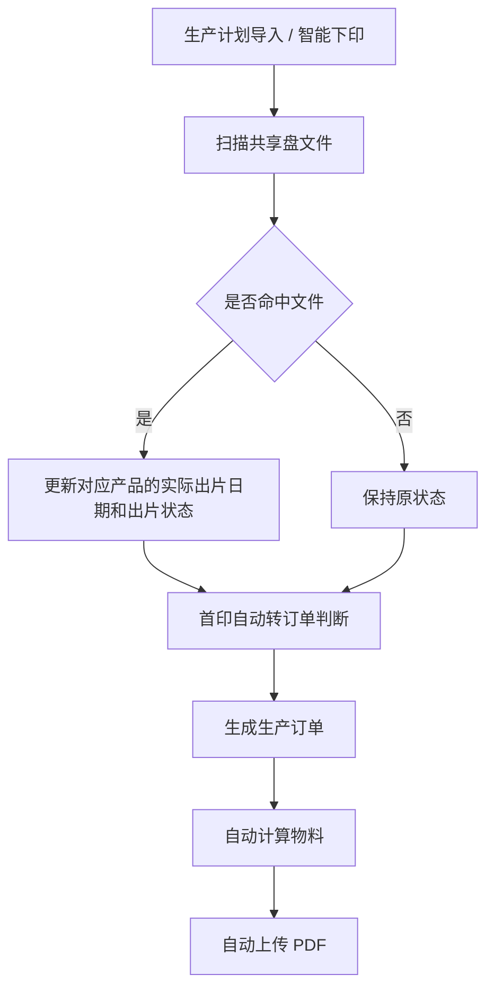

# 智能下印转订单需求说明

## 修订记录

| 版本 | 日期       | 修订人 | 修订内容                                             |
| ---- | ---------- | ------ | ---------------------------------------------------- |
| v1.0 | 2026-05-12 |        | 创建文档                                             |
| v1.1 | 2026-05-12 |        | 明确现状与本期扩展范围，现有能力已覆盖单独命卷和杂志 |
| v1.2 | 2026-05-12 |        | 补充本期新增能力：自动计算物料、自动上传 PDF         |

## 1. 背景与目标

### 1.1 项目背景

当前自动转生产订单能力已经覆盖单独命卷和杂志，但图书、报纸、试卷（非单命）、封扉尚未纳入统一自动转单范围，仍存在部分计划需要人工导入和维护后无法继续自动转单的问题。现需在既有能力基础上继续扩展，降低人工操作成本，提升转单效率与一致性。

### 1.2 产品目标

本次迭代目标是在现有单独命卷、杂志自动转订单能力基础上，继续扩展图书、报纸、试卷（非单命）、封扉的自动转订单范围，并补充自动计算物料、自动上传 PDF 能力，减少人工导入和后续维护成本，提升自动转单覆盖率与稳定性。

### 1.3 项目范围

- 在现有单独命卷、杂志能力基础上，扩展图书、报纸、试卷（非单命）、封扉的自动转单范围，覆盖导入生产计划、新增生产计划、生产计划自动转订单定时任务等触发场景
- 支持在定时任务间隔内手动补触发自动转订单
- 支持自动转订单完成后自动计算物料
- 支持自动转订单完成后自动上传 PDF
- 支持自动扫描共享盘文件，命中后更新对应产品的实际出片日期和出片状态
- 支持快印配置增加事业群、站点匹配条件，且均支持不限
- 支持重量维护页面按产品编码批量导入印厂
- 支持按产品编码、站点维护站点专属印厂，供自动转生产订单优先取用

## 2. 用户分析

### 2.1 目标用户与场景

| 用户角色      | 特征描述                 | 核心诉求                   | 使用场景                     |
| ------------- | ------------------------ | -------------------------- | ---------------------------- |
| 生产/运营人员 | 负责计划维护与转单处理   | 减少人工操作，快速完成转单 | 日常计划维护、补单、异常补转 |
| 生产管理人员  | 关注订单生成效率与准确性 | 按规则自动生成生产订单     | 定时转单、批量处理计划       |

## 3. 功能概述

### 3.1 功能架构图

```text
生产计划
  ├─ 定时自动转单
  ├─ 手动触发转单
  ├─ 共享盘文件读取
  ├─ 文件命中后更新对应产品的实际出片日期和出片状态
  ├─ 物料自动计算
  └─ PDF 自动上传
```

### 3.2 流程图



### 3.3 功能清单

| 序号 | 编号 | 模块             | 功能名称               | 功能描述                                                                           | 优先级 | 状态   | 涉及页面         |
| ---- | ---- | ---------------- | ---------------------- | ---------------------------------------------------------------------------------- | ------ | ------ | ---------------- |
| 1    | F001 | 生产计划         | 生产计划自动转生产订单 | 根据计划与文件条件自动生成生产订单，自动转单匹配快印配置时增加事业群、站点判断     | P0     | 待开发 | 生产计划         |
| 2    | F002 | 订单生成         | 物料计算               | 自动计算生产订单所需物料                                                           | P1     | 待开发 | 订单生成流程     |
| 3    | F003 | 订单生成         | PDF 上传               | 自动上传对应 PDF                                                                   | P1     | 待开发 | 订单生成流程     |
| 4    | F004 | 生产计划         | 手动补触发自动转单     | 在定时任务间隔内，支持用户在生产计划页面手动补触发自动转订单，用于紧急计划提前处理 | P0     | 待开发 | 生产计划         |
| 5    | F005 | 生产计划         | 生产计划自动读取文件   | 自动读取共享盘中的出片文件，命中后更新对应产品的实际出片日期和出片状态             | P0     | 待开发 | 后台任务         |
| 6    | F006 | 快印配置         | 快印配置查询扩展       | 查询条件增加事业群、站点；列表展示事业群、站点                                     | P0     | 待开发 | 快印配置         |
| 7    | F007 | 快印配置         | 快印配置维护扩展       | 新增/编辑快印配置时增加事业群、站点，支持多选和“不限”，编辑正常回显              | P0     | 待开发 | 快印配置         |
| 8    | F008 | 快印配置         | 存量配置兼容           | 历史快印配置未维护事业群、站点时，按“不限”处理                                   | P0     | 待开发 | 快印配置         |
| 9    | F009 | 重量维护         | 导入印厂               | 支持在重量维护页面按产品编码批量导入印厂                                           | P0     | 待开发 | 重量维护         |
| 10   | F010 | 产品站点印厂配置 | 产品站点印厂维护       | 支持按产品编码、站点维护站点专属印厂，供自动转生产订单优先取用                     | P0     | 待开发 | 产品站点印厂配置 |

## 4. 功能详情

### F001 生产计划自动转生产订单

**功能说明**

系统在现有单独命卷、杂志自动转单能力基础上，继续覆盖图书、报纸、试卷（非单命）、封扉等生产属性。支持按定时任务或手动触发方式，对符合条件的生产计划执行自动转单，生成生产订单并记录处理结果。

**业务规则**

1. 自动转单支持定时执行，默认建议每 2 小时执行一次。
2. 自动读取到共享盘文件后，将对应产品的实际出片日期更新为扫描到文件的日期。
3. 手动触发转单时，不依赖文件是否存在，允许直接执行转单任务。
4. 本期重点扩展对象为图书、报纸、试卷（非单命）、封扉，单独命卷和杂志沿用已有能力。
5. 本期规则按产品类型分别编写，未明确的内容统一写“（待定）”，不合并为一套通用规则。
6. 自动转生产订单时，先按 `产品编码 + 站点`查询产品站点印厂配置。
7. 查询到产品站点印厂配置时，使用配置的 `站点印厂`。
8. 未查询到产品站点印厂配置时，使用产品表维护的 `原印厂`。

**分产品规则**

| 产品类型       | 自动转单规则                               |
| -------------- | ------------------------------------------ |
| 图书           | （待定）                                   |
| 报纸           | （待定）                                   |
| 试卷（非单命） | 默认印厂为“金太阳印务”；其余规则（待定） |
| 封扉           | （待定）                                   |

**界面要素**

| 元素         | 类型          | 说明                                       |
| ------------ | ------------- | ------------------------------------------ |
| 自动转单按钮 | Button        | 位于生产计划页面；点击后立即执行转单任务。 |
| 定时任务配置 | Switch/Config | 用于控制自动转单是否启用及执行周期。       |
| 文件读取状态 | Text/Tag      | 展示当前文件识别结果与转单处理结果。       |

**验收标准**

1. 可在生产计划页面手动触发转单。
2. 可按定时任务自动执行转单。
3. 读取到共享盘文件后，可更新对应产品的实际出片日期并触发后续转单处理。
4. 规则配置生效后，不同站点/印厂可按配置完成转单。
5. 图书、报纸、试卷（非单命）、封扉能够按本期规则完成自动转单。

**异常处理**

| 异常场景         | 处理方式               | 提示文案                   |
| ---------------- | ---------------------- | -------------------------- |
| 共享盘文件未找到 | 提示并记录日志         | 未找到可用于转单的文件     |
| 转单失败         | 提示失败原因并记录日志 | 自动转单失败，请查看日志   |
| 权限不足         | 提示用户授权或重新登录 | 当前账号无权限执行转单     |
| 物料不足         | 提示缺货并按规则处理   | 物料库存不足，无法完成转单 |

### F002 物料计算

**功能说明**

自动转订单完成后，系统自动计算生产订单所需物料，减少人工补录和手工核对成本。

**业务规则**

1. 自动转订单完成后自动计算物料。
2. 库存不足时按既定换纸规则处理；规则未明确前按待确认状态处理。

**界面要素**

| 元素         | 类型       | 说明                                 |
| ------------ | ---------- | ------------------------------------ |
| 物料计算结果 | Text/Panel | 展示当前订单物料计算与库存匹配结果。 |

**验收标准**

1. 订单生成后可自动计算物料。
2. 库存不足时可明确提示处理结果。

**异常处理**

| 异常场景       | 处理方式           | 提示文案                 |
| -------------- | ------------------ | ------------------------ |
| 物料规则未配置 | 暂停自动处理并提示 | 物料规则未配置，请先补充 |

### F003 PDF 上传

**功能说明**

自动转订单完成后，系统自动上传对应 PDF，减少人工补传与文件管理成本。

**业务规则**

1. 自动转订单完成后可自动上传 PDF。
2. PDF 上传失败时需要保留失败信息并支持重试。

**界面要素**

| 元素         | 类型     | 说明                          |
| ------------ | -------- | ----------------------------- |
| PDF 上传状态 | Text/Tag | 展示 PDF 是否已自动上传完成。 |

**验收标准**

1. 可按配置完成 PDF 自动上传。
2. 上传成功后能记录状态。

**异常处理**

| 异常场景     | 处理方式       | 提示文案             |
| ------------ | -------------- | -------------------- |
| PDF 上传失败 | 记录日志并提示 | PDF 上传失败，请重试 |

### F004 手动补触发自动转单

### F005 生产计划自动读取文件

**功能说明**

生产计划导入或智能下印后，系统触发共享盘文件首次扫描；同时支持按固定周期补扫和对选中的生产计划手动补扫，仅判断对应产品的出片文件是否存在。命中后更新对应产品的实际出片日期和出片状态，不搬运文件、不上传文件。

**业务规则**

1. 触发时机为生产计划导入或智能下印后，先执行首次扫描。
2. 定时补扫默认每 2 小时执行一次，执行周期支持配置，用于补充首次扫描未命中的文件。
3. 定时任务仅扫描生产计划单据状态为“待接收”或“等待处理”，且生产计划生产标志为“首批”、产品明细出片状态为“未出片”的记录。
4. 手动触发时，仅补扫当前选中的生产计划下，单据状态为“待接收”或“等待处理”、生产标志为“首批”，且产品明细出片状态为“未出片”的产品明细，逐条判断是否存在对应共享盘文件，不默认全盘扫描。
5. 未选择生产计划时，不允许手动触发补扫，并提示先选择生产计划。
6. 仅执行文件扫描与匹配，不执行文件搬运、加密、上传。
7. 命中后更新对应产品的实际出片日期，并同步将对应产品的出片状态更新为“已出片”。
8. 首批自动转订单仅判断对应产品的实际出片日期是否已存在。
9. 未命中时不修改实际出片日期和出片状态，记录扫描结果。
10. 对已存在实际出片日期的产品明细，不重复执行扫描，也不重复更新实际出片日期。

**界面要素**

| 元素         | 类型     | 说明                                                                                                                                                                                                                                                                                |
| ------------ | -------- | ----------------------------------------------------------------------------------------------------------------------------------------------------------------------------------------------------------------------------------------------------------------------------------- |
| 扫描文件按钮 | Button   | 位于生产计划页面列表上方操作区；用户勾选一个或多个生产计划后点击执行扫描，未选择生产计划时提示“请先选择生产计划”；扫描过程中按钮置为加载中且不允许重复点击。                                                                                                                      |
| 扫描结果弹窗 | Dialog   | 扫描完成后展示本次扫描结果汇总；选中计划数取本次勾选并提交扫描的生产计划数量；扫描产品数取符合扫描条件并实际执行文件匹配的产品明细数量；命中数取本次扫描找到对应共享盘文件并更新实际出片日期/出片状态的产品明细数量；未命中数取已执行文件匹配但未找到对应共享盘文件的产品明细数量。 |
| 出片状态     | Text/Tag | 展示更新后的出片状态。                                                                                                                                                                                                                                                              |

**验收标准**

1. 生产计划导入或智能下印后可触发首次共享盘扫描。
2. 系统可按配置周期自动补扫共享盘文件，默认执行周期为 2 小时。
3. 可对选中的生产计划手动触发补扫。
4. 未选择生产计划时，手动补扫不可执行并有明确提示。
5. 命中对应文件后可更新对应产品的实际出片日期和出片状态。
6. 未命中时不影响后续转单流程。
7. 不执行文件搬运、加密、上传等额外动作。

**异常处理**

| 异常场景       | 处理方式       | 提示文案                       |
| -------------- | -------------- | ------------------------------ |
| 共享盘不可访问 | 记录日志并提示 | 共享盘文件读取失败，请查看日志 |

### F006 快印配置查询扩展

**功能说明**

在现有快印配置列表基础上，增加事业群、站点查询条件和列表展示字段，便于按事业群和站点筛选快印配置。

**业务规则**

1. 查询条件增加事业群、站点。
2. 事业群、站点均支持多选。
3. 查询时选择事业群或站点后，仅展示配置范围命中的快印配置。
4. 配置为“不限”的记录应在对应查询条件下可被命中。

**界面要素**

| 元素           | 类型   | 说明                                                                                                             |
| -------------- | ------ | ---------------------------------------------------------------------------------------------------------------- |
| 事业群查询条件 | Select | 位于快印配置列表查询区；支持多选；选项来源为事业群基础数据；用于筛选适用事业群包含所选值或配置为“不限”的记录。 |
| 站点查询条件   | Select | 位于快印配置列表查询区；支持多选；选项来源为站点基础数据；用于筛选适用站点包含所选值或配置为“不限”的记录。     |
| 事业群列       | Text   | 位于快印配置列表；展示当前配置适用事业群，配置为空时展示“不限”。                                               |
| 站点列         | Text   | 位于快印配置列表；展示当前配置适用站点，配置为空时展示“不限”。                                                 |

**验收标准**

1. 快印配置列表可按事业群筛选。
2. 快印配置列表可按站点筛选。
3. 列表可展示每条配置的事业群和站点。
4. 事业群、站点为空的历史或新配置在列表中展示为“不限”。

**异常处理**

| 异常场景                     | 处理方式           | 提示文案                               |
| ---------------------------- | ------------------ | -------------------------------------- |
| 事业群或站点基础数据加载失败 | 查询条件置空并提示 | 事业群或站点数据加载失败，请刷新后重试 |

### F007 快印配置维护扩展

**功能说明**

在现有新增快印配置弹窗、编辑快印配置弹窗及配置内容展示中增加事业群、站点字段。用户可维护配置适用的事业群和站点；选择“不限”时表示覆盖全部事业群或全部站点，编辑时按已保存内容回显。

**业务规则**

1. 新增快印配置时，事业群和站点均为必填项，支持多选，也支持选择“不限”。
2. 编辑快印配置时，事业群和站点均为必填项，支持多选，也支持选择“不限”，且需要按已保存内容正常回显。
3. 事业群选择“不限”时，保存为空值，表示覆盖全部事业群。
4. 站点选择“不限”时，保存为空值，表示覆盖全部站点。
5. 本次仅新增事业群、站点维护项，现有快印配置字段逻辑保持不变。

**界面要素**

| 元素         | 类型        | 说明                                                                                                                                                                   |
| ------------ | ----------- | ---------------------------------------------------------------------------------------------------------------------------------------------------------------------- |
| 新增快印配置 | Dialog/Form | 在现有新增快印配置弹窗中增加事业群、站点字段；字段形态与产品一类、产品二类等保持一致；两个字段均为必填项，支持多选和“不限”；选择“不限”后清空已选值并禁用具体选择。 |
| 编辑快印配置 | Dialog/Form | 编辑快印配置时，事业群、站点按已保存内容回显；两个字段均为必填项，支持多选修改和“不限”；选择“不限”后清空已选值并禁用具体选择。                                     |

**验收标准**

1. 新增快印配置时可维护事业群和站点。
2. 编辑快印配置时可正常回显并修改事业群和站点。
3. 事业群和站点选择“不限”后，自动转单匹配时按全部范围处理。
4. 未选择“不限”时，必须按用户选择的事业群、站点范围保存并生效。

**异常处理**

| 异常场景                       | 处理方式           | 提示文案                    |
| ------------------------------ | ------------------ | --------------------------- |
| 事业群或站点未维护且未选择不限 | 阻止保存并提示     | 请选择事业群/站点或勾选不限 |
| 保存配置失败                   | 保留弹窗数据并提示 | 快印配置保存失败，请重试    |

### F008 存量配置兼容

历史快印配置未维护事业群、站点时，系统统一按“不限”处理，列表展示为“不限”，自动转单匹配时按全范围生效；本期不要求对历史数据做强制迁移，确保新增字段后不影响既有快印配置命中和原有自动转单逻辑。

### F009 导入印厂

**功能说明**

重量维护页面支持按产品编码批量导入印厂，用于批量维护产品表原印厂字段，减少逐条选择产品维护印厂的操作成本。

**业务规则**

1. 导入入口位于重量维护页面。
2. 导入维度为产品编码和印厂。
3. 导入时按产品编码匹配产品表产品数据。
4. 仅当导入文件全部数据校验通过时，才更新产品表原印厂字段。
5. 产品编码不存在，或印厂不存在/不可用时，判定本次整份 Excel 导入失败，全部数据不生效；导入完成后系统生成失败文件，支持下载查看失败行及失败原因。

**界面要素**

| 元素         | 类型     | 说明                                                                                           |
| ------------ | -------- | ---------------------------------------------------------------------------------------------- |
| 导入印厂按钮 | Button   | 位于重量维护页面操作区；点击后上传导入文件。                                                   |
| 导入模板     | Download | 提供导入模板，至少包含产品编码、印厂字段。                                                     |
| 导入结果弹窗 | Dialog   | 导入完成后展示导入结果；导入失败时提示本次为整份文件失败，全部数据未生效，并支持下载失败文件。 |
| 失败文件下载 | Download | 导入存在失败数据时提供下载入口；失败文件需展示失败行原始数据及对应失败原因。                   |

**验收标准**

1. 可在重量维护页面上传导入文件。
2. 仅当导入文件全部数据校验通过时，才可更新产品表原印厂字段。
3. 导入文件存在任一失败数据时，本次导入全部不生效，且可下载失败文件查看失败行及失败原因。
4. 导入印厂不影响产品站点印厂配置表。

**异常处理**

| 异常场景                          | 处理方式                                                           | 提示文案                                       |
| --------------------------------- | ------------------------------------------------------------------ | ---------------------------------------------- |
| 导入文件格式错误                  | 阻止导入并提示                                                     | 导入文件格式不正确                             |
| 产品编码不存在或印厂不存在/不可用 | 判定本次整份导入失败，全部数据不生效，导入完成后生成失败文件供下载 | 导入失败，存在异常数据，请下载失败文件查看原因 |

### F010 产品站点印厂维护

**功能说明**

新增产品站点印厂配置页面，菜单入口位于 `印务 > 基础配置 > 产品站点印厂配置`，用于维护产品与站点对应的印厂关系。

**业务规则**

1. 新增产品站点印厂配置表，用于保存产品编码、站点、印厂关系。
2. 同一产品编码和同一站点只允许维护一条有效印厂配置。
3. 新增或编辑时，产品通过复用产品模块现有“选择单个产品”弹窗进行单选；选中产品名称后，产品编码自动回显。
4. 新增或编辑时，站点必须为有效站点。
5. 新增或编辑时，印厂必须为有效印厂。
6. 列表中需展示产品二类。
7. 导入功能在导入弹窗内完成，支持下载模板、选择/删除文件并提交导入；如存在任一失败行，则判定本次整份 Excel 导入失败，全部数据不生效，并生成失败文件供下载查看失败原因。

**界面要素**

| 元素             | 类型          | 说明                                                                                                        |
| ---------------- | ------------- | ----------------------------------------------------------------------------------------------------------- |
| 产品编码查询     | Input         | 支持按产品编码模糊查询，匹配包含输入内容的数据。                                                            |
| 产品一类查询     | Select        | 下拉单选，选项来源于产品基础资料中的有效产品一类。                                                          |
| 产品二类查询     | Select        | 下拉单选，选项来源于产品基础资料中的有效产品二类；已选择产品一类时，仅展示该产品一类下的产品二类。          |
| 产品名称查询     | Input         | 支持按产品名称模糊查询，匹配包含输入内容的数据。                                                            |
| 站点查询         | Select        | 下拉单选，选项来源于站点基础表`sys_orcktb00`中的有效站点数据。                                              |
| 印厂查询         | Select        | 下拉单选，选项来源于印厂基础表`sys_orcgtb02`中的有效印厂类型数据。                                          |
| 配置列表         | Table         | 展示产品编码、产品二类、产品名称、站点、站点印厂、创建人、创建时间、修改人、修改时间。                      |
| 新增按钮         | Button        | 点击后打开新增弹窗。                                                                                        |
| 新增弹窗         | Dialog        | 字段包括产品、产品编码、站点、站点印厂；产品为必填，点击`+选择`打开“选择单个产品”弹窗单选产品，选中后产品编码自动回显且不可编辑；站点、站点印厂均为必填下拉单选；保存时校验产品、站点、站点印厂必填，且产品编码+站点不能重复，校验通过后保存并关闭弹窗。 |
| 编辑按钮         | Button/Dialog | 打开编辑弹窗；回显当前产品、产品编码、站点、站点印厂；产品支持重新通过`+选择`打开“选择单个产品”弹窗单选，选中后产品编码自动回显且不可编辑；站点、站点印厂均为必填下拉单选；保存时校验产品、站点、站点印厂必填，且产品编码+站点不能重复，校验通过后保存并关闭弹窗。 |
| 删除按钮         | Button        | 支持单条删除；点击后弹出二次确认框，确认后删除当前产品站点印厂配置，删除成功后刷新列表。                    |
| 导入按钮         | Button/Dialog | 打开导入弹窗；弹窗内提供下载模板、选择文件、删除已选文件、失败文件下载。                                    |
| 选择单个产品弹窗 | Dialog        | 新增/编辑时点击产品字段，复用产品模块现有“选择单个产品”弹窗；弹窗为单选，选中产品名称后产品编码自动回显。 |

**验收标准**

1. 可按产品编码、产品一类、产品二类、产品名称、站点、印厂查询配置。
2. 可新增、编辑、删除产品站点印厂配置。
3. 新增/编辑时可通过 `+选择`单选产品，选择产品名称后产品编码自动回显。
4. 列表可展示产品二类。
5. 同一产品编码和同一站点重复配置时不允许保存。
6. 导入弹窗可下载模板、选择文件、删除已选文件。
7. 导入存在失败行时，整份导入失败，且可下载失败文件。

**异常处理**

| 异常场景           | 处理方式                                         | 提示文案                         |
| ------------------ | ------------------------------------------------ | -------------------------------- |
| 未选择产品         | 阻止保存                                         | 请选择产品                       |
| 产品编码不存在     | 阻止保存或当前导入行失败                         | 产品编码不存在                   |
| 未选择站点         | 阻止保存                                         | 请选择站点                       |
| 站点无效           | 阻止保存或当前导入行失败                         | 站点不存在或不可用               |
| 未选择站点印厂     | 阻止保存                                         | 请选择站点印厂                   |
| 印厂无效           | 阻止保存或当前导入行失败                         | 印厂不存在或不可用               |
| 产品编码和站点重复 | 阻止保存并提示                                   | 当前产品在该站点已维护印厂       |
| 导入存在异常数据   | 判定整份导入失败，全部数据不生效，并生成失败文件 | 导入失败，请下载失败文件查看原因 |

## 5. 非功能需求

本期无新增特殊非功能约束。

## 6. 未决问题与默认假设

- 未决问题：自动换纸的具体规则尚未明确。
- 默认假设：规则未明确前，相关异常按待确认处理，不自动扩展额外逻辑。
